# Write structured logs for gRPC APIs

[Original video](https://www.youtube.com/watch?v=tTAxLGrDmPo)

Hello everyone! Welcome back to the backend master class! So far we have
implemented several gRPC API, such as `CreateUser`, `LoginUser` and 
`UpdateUser`. And in the previous lecture, we also added an authorization
layer to secure the API. However, one thing you might notice is that when 
we send a gRPC request to the server, there are no logs written, even 
though the request was successful.


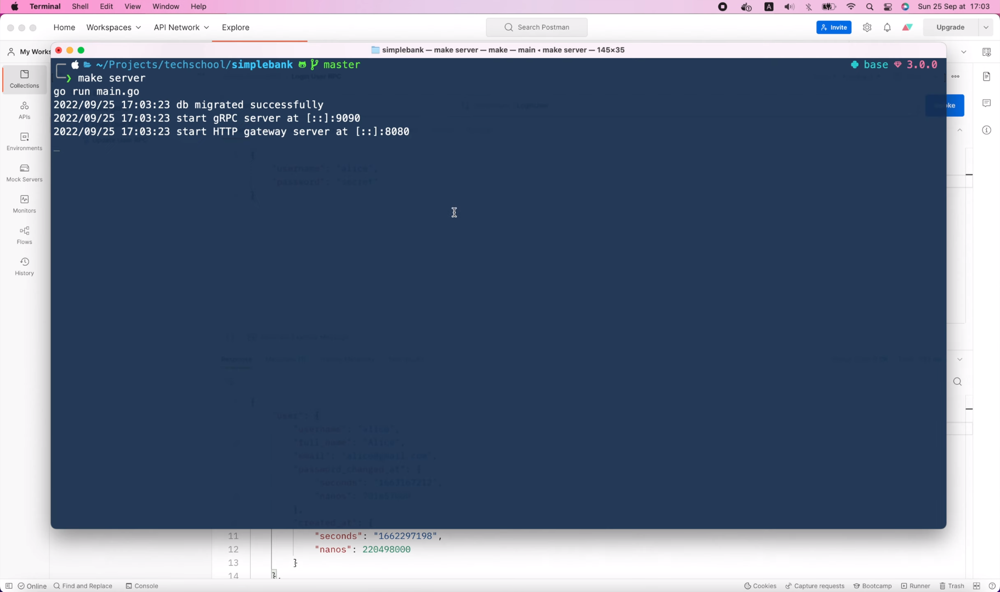

## Log gRPC requests using gRPC interceptor

So today, let's learn how to log gRPC requests using gRPC interceptor. 
gRPC interceptor is simply a function that gets called for every request,
before it is sent to the RPC handler to be processed. And since all our
RPCs are unary, we're gonna implement a gRPC unary interceptor to write
the logs.

As you can see here,

```go
// UnaryInterceptor returns a ServerOption that sets the UnaryServerInterceptor for the
// server. Only one unary interceptor can be installed. The construction of multiple
// interceptors (e.g., chaining) can be implemented at the caller.
func UnaryInterceptor(i UnaryServerInterceptor) ServerOption {
	return newFuncServerOption(func(o *serverOptions) {
		if o.unaryInt != nil {
			panic("The unary server interceptor was already set and may not be reset.")
		}
		o.unaryInt = i
	})
}
```

this function will create a `ServerOption` that sets the unary interceptor
for our gRPC server. And what we have to do is implement this 
`UnaryServerInterceptor` interface.

```go
// UnaryServerInterceptor provides a hook to intercept the execution of a unary RPC on the server. info
// contains all the information of this RPC the interceptor can operate on. And handler is the wrapper
// of the service method implementation. It is the responsibility of the interceptor to invoke handler
// to complete the RPC.
type UnaryServerInterceptor func(ctx context.Context, req interface{}, info *UnaryServerInfo, handler UnaryHandler) (resp interface{}, err error)
```

It's actually just a function, so let's copy its definition. Then, in the 
`gapi` package, I'm gonna create a new file called `logger.go`. We will
implement the logger interceptor in this file, so let's paste in the
function signature we've just copied.

I'm gonna set its name to `GrpcLogger`. This function takes several input
parameters: a context object, a request of type `interface{}`, a unary 
server info, and a unary handler function. And it will return a response
of type `interface{}` and an error. We have to add the `grpc` package 
to the `UnaryServerInfo` and the `UnaryHandler`, because that's the 
package where those 2 types are defined.

```go
func GrpcLogger(
	ctx context.Context,
	req interface{},
	info *grpc.UnaryServerInfo,
	handler grpc.UnaryHandler,
) (resp interface{}, err error) {

}
```

Alright, let's leave this function empty for now, we will go back here to 
implement it in a moment. Now, let's open the `main.go` file and try to
add the logger interceptor to the gRPC server. Here, I will pass the 
`gapi.GrpcLogger` function into this `grpc.UnaryInterceptor`. It will 
return a `ServerOption` object, so let's name it `grpcLogger`. Then, we will
pass this `grpcLogger` into the `grpc.NewServer()` function.

```go
func runGrpcServer(config util.Config, store db.Store) {
	server, err := gapi.NewServer(config, store)
	if err != nil {
		log.Fatal("cannot create server:", err)
	}

	grpcLogger := grpc.UnaryInterceptor(gapi.GrpcLogger)
    grpcServer := grpc.NewServer(grpcLogger)
    ...
}
```

And that's how we add an interceptor to the gRPC server. Note that this
function can take multiple `ServerOptions`, so you can easily add more
interceptors or whatever options you need to the server.

OK, now it's time to implement the gRPC logger interceptor.

Let's start with a simple log message: "received a gRPC request". We will
add more info to this message later.

```go
func GrpcLogger(
	ctx context.Context,
	req interface{},
	info *grpc.UnaryServerInfo,
	handler grpc.UnaryHandler,
) (resp interface{}, err error) {
	log.Println("received a gRPC request")
}
```

After writing the logs, we must call the handler function with the
input context and the request object. This will basically forward the 
request to the handler to be processed. After processing the request, 
the handler function will return a result and an error. And we can simply
return them as the output of this interceptor function.

```go
func GrpcLogger(
	ctx context.Context,
	req interface{},
	info *grpc.UnaryServerInfo,
	handler grpc.UnaryHandler,
) (resp interface{}, err error) {
	log.Println("received a gRPC request")
	result, err := handler(ctx, req)
	return result, err
}
```

That's basically it! Super simple right?

Let's start the server and try it out!

```shell
make server
```

Alright, the server is ready. Now I'm gonna invoke this `LoginUser` RPC
again.

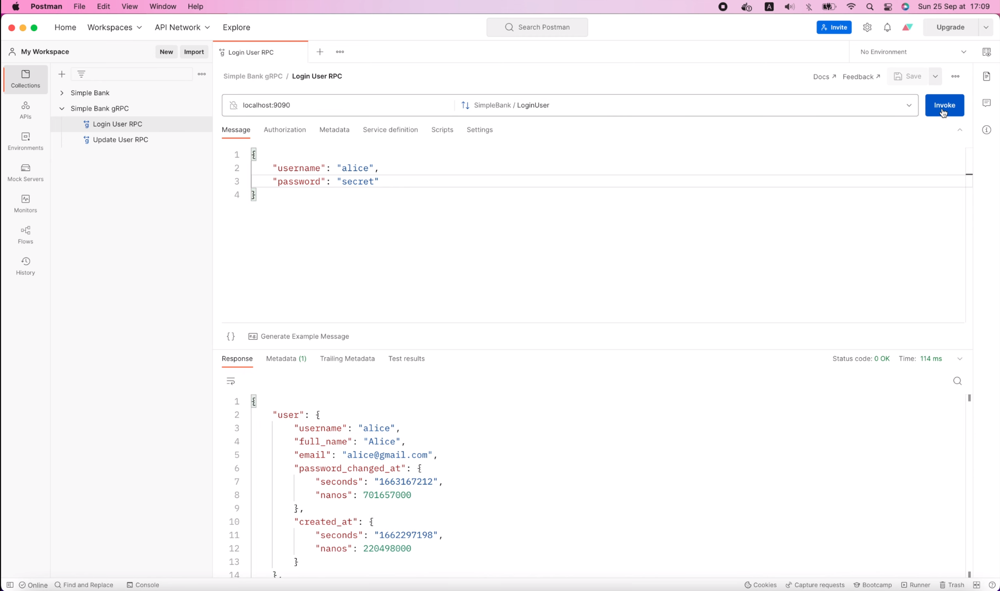

The request is successful, just like before, but this time, a log is 
written to the console: "received a gRPC request".


So our gRPC logger interceptor is working as expected. However, this log
doesn't contain any useful information.

We usually want to know some specific information about the request,
like what RPC method has been called, how long it took to process the 
request, and what the response status code was. Moreover, when running on
production, we also want the logs to be structured so that they can be 
easily parsed and indexed by log-management tools like `Logstash`, `Fluentd`
and `Grafana Loki`.


In order to write structured logs, I'm gonna use a package called [`zerolog`](https://github.com/rs/zerolog).
This package helps us easily write logs in JSON format with zero allocation.
It claims to provide a great developer experience and stunning performance
by using the same approach as Uber's `zap` package, but with a simpler API
and better performance.

Alright, let's copy this command

```shell
go get -u github.com/rs/zerolog/log
```

and run it in the terminal to install the package. Writing logs with 
`zerolog` is as simple as the standard `log` package of Go. It even uses
the same subpackage named "log", so we just have to copy this import,

```
github.com/rs/zerolog/log
```

and replace this import standard `log` package with `zerolog`.

```go
import (
    "context"
    "github.com/rs/zerolog/log"
    "google.golang.org/grpc"
)
```

`Zerolog` doesn't have the `Println` function because it always writes log
on separate lines. So just `log.Print()` would be enough.

```go
func GrpcLogger(
	ctx context.Context,
	req interface{},
	info *grpc.UnaryServerInfo,
	handler grpc.UnaryHandler,
) (resp interface{}, err error) {
	log.Print("received a gRPC request")
	result, err := handler(ctx, req)
	return result, err
}
```

Now as we're using this new package, we should add it to the list
of dependencies in `go.mod` file. To do that, we can simply run

```shell
go mod tidy
```

in the terminal.

```
require (
    ...
	github.com/rakyll/statik v0.1.7
	github.com/rs/zerolog v1.28.0
	github.com/spf13/viper v1.10.1
	...
)
```

And voilà, `zerolog` version `1.28` has been added to the required 
dependencies. Before adding more info to the logs, let's try running
the server to see how it goes. This time, when I send the login 
request,


we will see a JSON log on the server.


It has several fields to tell us about the level, the time, and the
message of the log. `Zerolog` allows us to add some contextual data to 
the message in the form of key-value pair. As you can see in this 
example,

```go
package main

import (
    "github.com/rs/zerolog"
    "github.com/rs/zerolog/log"
)

func main() {
    zerolog.TimeFieldFormat = zerolog.TimeFormatUnix

    log.Debug().
        Str("Scale", "833 cents").
        Float64("Interval", 833.09).
        Msg("Fibonacci is everywhere")
    
    log.Debug().
        Str("Name", "Tom").
        Send()
}
```

we can write a debug log and attach some string or float values to it.

We can also control the level of the log, depending on the severity of 
the message. Here's the list of log levels we can use, from highest to 
lowest.

* panic (zerolog.PanicLevel, 5)
* fatal (zerolog.FatalLevel, 4)
* error (zerolog.ErrorLevel, 3)
* warn (zerolog.WarnLevel, 2)
* info (zerolog.InfoLevel, 1)
* debug (zerolog.DebugLevel, 0)
* trace (zerolog.TraceLevel, -1)

So, in our code, we can replace this `log.Print()` function with
`log.Info().Msg()` to write an info-level log instead of debug.

```go
func GrpcLogger(
	ctx context.Context,
	req interface{},
	info *grpc.UnaryServerInfo,
	handler grpc.UnaryHandler,
) (resp interface{}, err error) {
	log.Info().Msg("received a gRPC request")
	result, err := handler(ctx, req)
	return result, err
}
```

And since our server supports both gRPC and HTTP requests, I'm gonna
add a string field to the log to tell us about its protocol, which is
gRPC in this case.

```go
func GrpcLogger(
	ctx context.Context,
	req interface{},
	info *grpc.UnaryServerInfo,
	handler grpc.UnaryHandler,
) (resp interface{}, err error) {
	log.Info().Str("protocol", "grpc").
		Msg("received a gRPC request")
	result, err := handler(ctx, req)
	return result, err
}
```

We will learn about writing HTTP logs for the gRPC gateway in the next
lecture. Now, let's also print out which RPC method is being invoked.
We can get it from the `info` object's `FullMethod` field.

```go
func GrpcLogger(
	ctx context.Context,
	req interface{},
	info *grpc.UnaryServerInfo,
	handler grpc.UnaryHandler,
) (resp interface{}, err error) {
	log.Info().Str("protocol", "grpc").
		Str("method", info.FullMethod).
		Msg("received a gRPC request")
	result, err := handler(ctx, req)
	return result, err
}
```

OK, next I want to measure the time it takes to process the request.
So let's move this log statement to the end of the function. Then, at 
the top, I'm gonna store the current timestamp in the `startTime` 
variable. And after getting the result from the handler, we can compute
the duration of the request with `time.Since(startTime)`. Let's add 
this duration to the log using the `Dur()` function provided by `zerolog`.

```go
func GrpcLogger(
	ctx context.Context,
	req interface{},
	info *grpc.UnaryServerInfo,
	handler grpc.UnaryHandler,
) (resp interface{}, err error) {
	startTime := time.Now()
	result, err := handler(ctx, req)
	duration := time.Since(startTime)

	log.Info().Str("protocol", "grpc").
		Str("method", info.FullMethod).
		Dur("duration", duration).
		Msg("received a gRPC request")
	return result, err
}
```

Finally, I'm also interested in the status of the request, to know 
whether it's successful or not. We can get this information from the 
error. First, let's declare a status code variable with a default value:
`codes.Unknown`. Then, we can call `status.FromError()` to extract the
status from the error and store it inside the `st` object. This function 
also returns a boolean `ok` to tell us if the extraction is successful or
not. If it is OK, we can get the status code by calling the `st.Code()`
function. Now, since the status code is in fact an alias type of an
integer, I'm gonna use the `Int()` function of `zerolog` to attach it
to the log. It's pretty nice that Visual Studio Code automatically does
the type conversion for us. An integer status code might not be easily 
understood, so how about we print out the status text to the log as well?
It's pretty simple to get, just by calling the `String()` function of the
`statusCode` object.

```go
func GrpcLogger(
	ctx context.Context,
	req interface{},
	info *grpc.UnaryServerInfo,
	handler grpc.UnaryHandler,
) (resp interface{}, err error) {
	startTime := time.Now()
	result, err := handler(ctx, req)
	duration := time.Since(startTime)

	statusCode := codes.Unknown
	if st, ok := status.FromError(err); ok {
		statusCode = st.Code()
	}

	log.Info().Str("protocol", "grpc").
		Str("method", info.FullMethod).
		Int("status_code", int(statusCode)).
		Str("status_text", statusCode.String()).
		Dur("duration", duration).
		Msg("received a gRPC request")
	return result, err
}
```

As you can see here,

```go
func (c Code) String() string {
	switch c {
	case OK:
		return "OK"
	case Canceled:
		return "Canceled"
	case Unknown:
		return "Unknown"
	case InvalidArgument:
		return "InvalidArgument"
	case DeadlineExceeded:
		return "DeadlineExceeded"
	case NotFound:
		return "NotFound"
	case AlreadyExists:
		return "AlreadyExists"
	case PermissionDenied:
		return "PermissionDenied"
	case ResourceExhausted:
		return "ResourceExhausted"
	case FailedPrecondition:
		return "FailedPrecondition"
	case Aborted:
		return "Aborted"
	case OutOfRange:
		return "OutOfRange"
	case Unimplemented:
		return "Unimplemented"
	case Internal:
		return "Internal"
	case Unavailable:
		return "Unavailable"
	case DataLoss:
		return "DataLoss"
	case Unauthenticated:
		return "Unauthenticated"
	default:
		return "Code(" + strconv.FormatInt(int64(c), 10) + ")"
	}
}
```

this function will convert the code number to a more human-friendly text.
Alright, I think we have added enough information to the log.

Let's restart the server to see it in action.

```shell
make server
go run main.go
2022/09/25 17:18:16 db migrated successfully
2022/09/25 17:18:16 start gRPC server at [::]:9090
2022/09/25 17:18:16 start HTTP gateway server at [::]:8080
```

The server is started.

Let's go back to Postman and invoke the `LoginUser` RPC.


This time, we have a lot more useful info in the log.

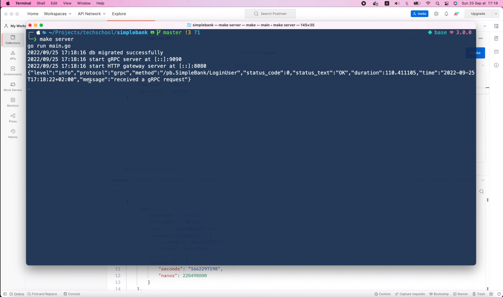

For example, the protocol `grpc`, the method `SimpleBank/LoginUser`, the
status code `0`, or status text `OK`, and the duration of the request in 
milliseconds. So the logger interceptor is working pretty well.

Now, let's try another request with a different status code.

I'm gonna log in with a user that doesn't exist: `bob`.

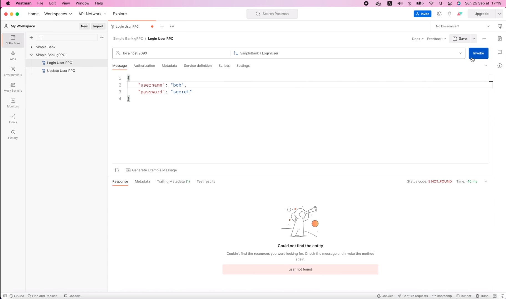

As you can see, we've got status code `5`: `NOT FOUND`. Let's see what we
have in the server log.

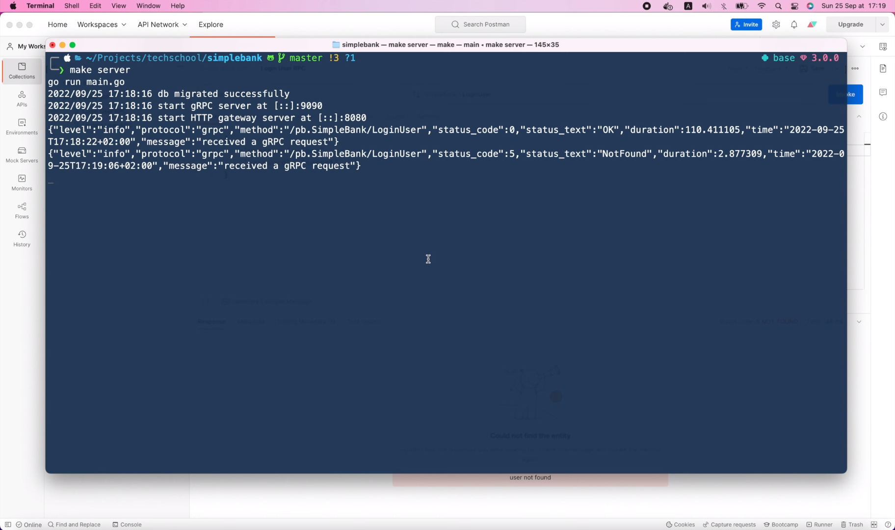

Indeed, we can see the status code `5`, and status text `NotFound`.
However, the log level is still "info". It would be better to set 
this to "error", so that we can easily search for failed requests
in the log management tool. And it would be even better if we can 
print out detail of the error as well.

Can we do that? Yes, we can definitely do that. If you look at this
`log.Info()` function,

```go
func GrpcLogger(
    ctx context.Context,
    req interface{},
    info *grpc.UnaryServerInfo,
    handler grpc.UnaryHandler,
) (resp interface{}, err error) {
	...
	log.Info().Str("protocol", "grpc").
        Str("method", info.FullMethod).
        Int("status_code", int(statusCode)).
        Str("status_text", statusCode.String()).
        Dur("duration", duration).
        Msg("received a gRPC request")
	...
}
```

you can see that it returns a `zerolog.Event` object,


which enables us to chain other methods to add more data to the log.

So we can take advantage of this by splitting the `log.Info()` call and
store its result in a `logger` object.

```go
logger := log.Info()
```

Then, if the error is not `nil`, we wil change `logger` to `log.Error()` 
instead.

```go
if err != nil {
    logger := log.Error()
}
```

And in this case, we can even add the error object to the log message 
as well.

```go
if err != nil {
    logger := log.Error().Err(err)
}
```

Now, all we have to do is to replace this `log.Info()` with the 
created `logger`.

```go
func GrpcLogger(
    ctx context.Context,
    req interface{},
    info *grpc.UnaryServerInfo,
    handler grpc.UnaryHandler,
) (resp interface{}, err error) {
	...
    logger := log.Info()
    if err != nil {
        logger = log.Error().Err(err)
    }
    logger.Str("protocol", "grpc").
        Str("method", info.FullMethod).
        Int("status_code", int(statusCode)).
        Str("status_text", statusCode.String()).
        Dur("duration", duration).
        Msg("received a gRPC request")
	...
}
```

And that's it!

Let's save the file and go back to the terminal to restart the server.

```shell
make server
```

Now, if we resend the Login request with a nonexistent user,

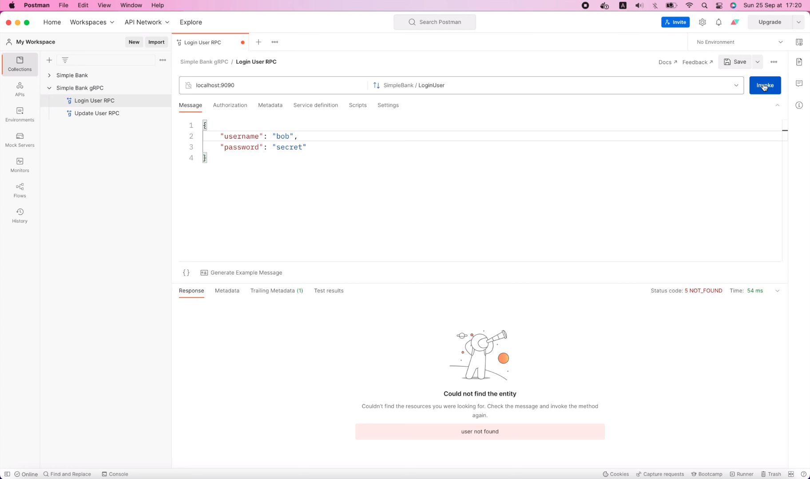

we will see that the log level has changed to `error`, and we have 1 more 
`error` field to tell us about its detailed reason.

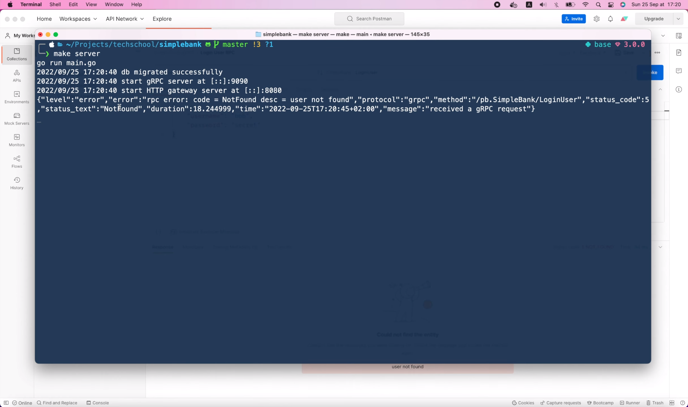

Pretty cool, isn't it?

Let's see if it still works well if we try to log in with a valid user.

I'm gonna change back the username to "alice" and invoke the RPC.


The request is successful,

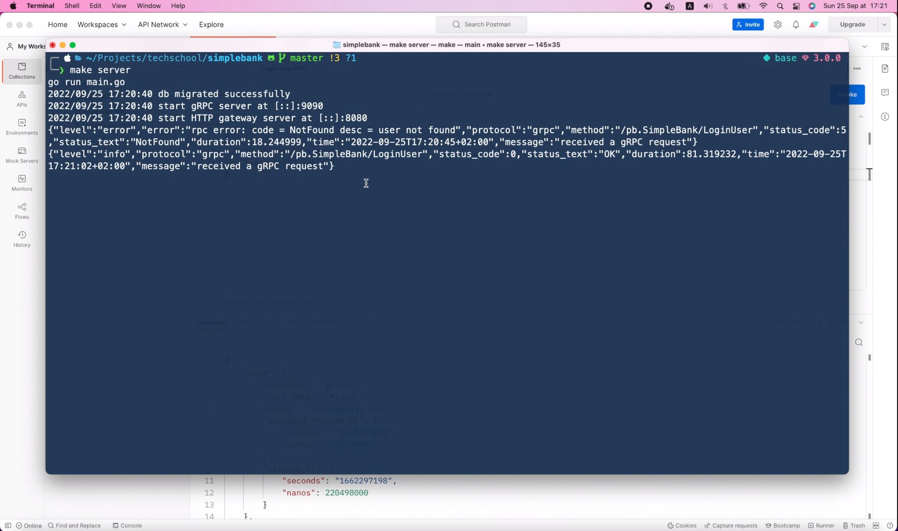

and in the log, we can see that the log level is `info`, and there's no
`error` field in the log this time.

So everything is working perfectly! Well, almost everything, because there
are still some unstructured logs at the top,


which is not in JSON format.

So let's go back to the code and fix them.

All those logs come from the `main.go` file, where we still use the 
standard `log` package. So first, I'm gonna delete this import `log`,

```go
import (
	"context"
	"database/sql"
	"google.golang.org/grpc/reflection"
	"google.golang.org/protobuf/encoding/protojson"
	"log"
	"net"
	"net/http"
	
	...
)
```

and replace it with the `zerolog` package.

```go
import (
	...
	"github.com/rs/zerolog/log"
	"google.golang.org/grpc"
)
```

Then, let's change all occurrences of `log.Fatal()` with 
`log.Fatal().Msg()`. I'm gonna remove the error at the end of the 
message as well. When recording the video I forgot to add it back using
the `Err()` function of `zerolog`, but I'm sure you know how to do it
on your own.

```go
func main() {
	config, err := util.LoadConfig(".")
	if err != nil {
		log.Fatal().Err(err).Msg("cannot load config")
	}

	conn, err := sql.Open(config.DBDriver, config.DBSource)
	if err != nil {
		log.Fatal().Err(err).Msg("cannot connect to db")
	}
	
	...
}
```

Or you can take a look at my code in the `simple-bank` GitHub repository.

OK, next let's change this `log.Println()` statement to `log.Info().Msg()`.

```go
func runDBMigration(migrationURL string, dbSource string) {
	...

	log.Info().Msg("db migrated successfully")
}
```

We can keep this `log.Printf()` because it's still working.

```go
func runGrpcServer(config util.Config, store db.Store) {
	...

	log.Printf("start gRPC server at %s", listener.Addr().String())
	err = grpcServer.Serve(listener)
	if err != nil {
		log.Fatal().Err(err).Msg("cannot start gRPC server")
	}
}
```

Now I'm gonna restart the server to see how it goes.

```shell
make server
go run main.go
{"level":"info","time":"2022-09-25T17:23:02+02:00","message":"db migrated successfully"}
{"level":"debug","time":"2022-09-25T17:23:02+02:00","message":"start gRPC server at [::]:9090"}
{"level":"debug","time":"2022-09-25T17:23:02+02:00","message":"start HTTP gateway server at [::]:8080"}
```

Voilà, we've got some JSON logs as expected.

But some of the logs still have "debug" level, so let's go back to the
code and change all occurrences of this `log.Printf()` statement to 
`log.Info().Msgf()`.

```go
func runGrpcServer(config util.Config, store db.Store) {
	...

    log.Info().Msgf("start gRPC server at %s", listener.Addr().String())
	...
}

func runGatewayServer(config util.Config, store db.Store) {
    ...
	
    log.Info().Msgf("start HTTP gateway server at %s", listener.Addr().String())
    ...
}
```

That should do the trick. We're using message formatting to print out
the address of the server. Alright, let's restart the server one more 
time.

```shell
make server
go run main.go
{"level":"info","time":"2022-09-25T17:23:47+02:00","message":"db migrated successfully"}
{"level":"info","time":"2022-09-25T17:23:47+02:00","message":"start gRPC server at [::]:9090"}
{"level":"info","time":"2022-09-25T17:23:47+02:00","message":"start HTTP gateway server at [::]:8080"}
```

This time, the log level has changed to "info", exactly as we wanted.

Before we finish, I'm gonna show you one more thing.

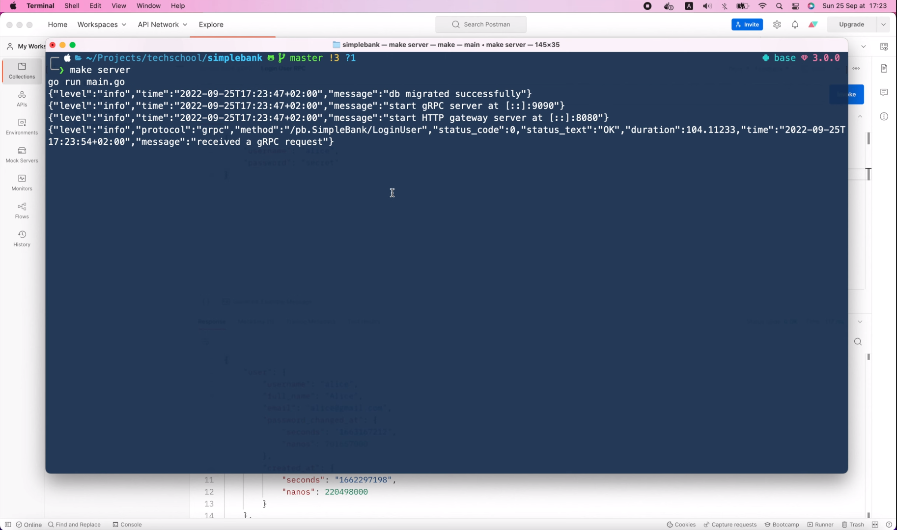

JSON logs are good for production, but it's kind of hard to read. So in 
development, we might want to have human-friendly logs instead.

`Zerolog` also provides us a `ConsoleWriter` option to enable this 
pretty-logging mode. All we have to do is copy this 1 line statement,

```go
log.Logger = log.Output(zerolog.ConsoleWriter{Out: os.Stderr})
```

And paste it to the top of the `main()` function.

```go
func main() {
	log.Logger = log.Output(zerolog.ConsoleWriter{Out: os.Stderr})
	
	config, err := util.LoadConfig(".")
	...
}
```

Now, when we restart the server, we will see that the logs are no longer
JSON, and are very easy to read.

```shell
make server
go run main.go
5:25PM INF db migrated successfully
5:25PM INF start gRPC server at [::]:9090
5:25PM INF start HTTP gateway server at [::]:8080
```

I'm gonna send several RPC requests to the server, so you can see what
the logs will look like.

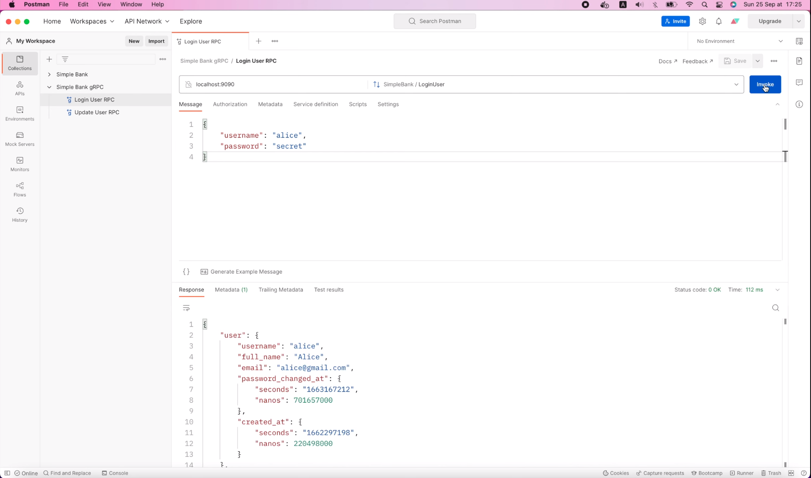


Here you are, the logs are pretty well formatted,


with green text for the info, and red for the error. It looks pretty cool,
right?

But if we keep the code like this, the logs will be the same for every 
environment. So how can we enable this for just development, while keeping
the JSON format for staging or production?

Well, we can add a new variable called `ENVIRONMENT` to the `app.env` file
and for the local file, we will set it to "development"

```
ENVIRONMENT=development
```

Then, we have to update the `Config` struct in the `util` package to 
include this new `ENVIRONMENT` variable. You must make sure that its tag 
name matches exactly the one we declared in the `app.env` file.

```go
type Config struct {
	Environment          string        `mapstructure:"ENVIRONMENT"`
	DBDriver             string        `mapstructure:"DB_DRIVER"`
	...
}
```

OK, now in the `main()` function, I'm gonna move this setting statement
to the line after the config is loaded. And we only run that log output 
setting statement if `config.Environment` variable is "development".

```go
func main() {
	config, err := util.LoadConfig(".")
	if err != nil {
		log.Fatal().Err(err).Msg("cannot load config")
	}

	if config.Environment == "development" {
		log.Logger = log.Output(zerolog.ConsoleWriter{Out: os.Stderr})
	}
	
	...
}
```

Alright, let's test it out!

I'm gonna restart the server.

```shell
make server
go run main.go
5:27PM INF db migrated successfully
5:27PM INF start gRPC server at [::]:9090
5:27PM INF start HTTP gateway server at [::]:8080
```

The logs are printed in the pretty format as expected, because we're setting
`ENVIRONMENT` to "development".

If I change its value to "production", and restart the server, we will 
get some JSON-format logs instead.

```
ENVIRONMENT=production
```

```shell
make server
go run main.go
{"level":"info","time":"2022-09-25T17:27:32+02:00","message":"db migrated successfully"}
{"level":"info","time":"2022-09-25T17:27:32+02:00","message":"start gRPC server at [::]:9090"}
{"level":"info","time":"2022-09-25T17:27:32+02:00","message":"start HTTP gateway server at [::]:8080"}
```

So everything is working exactly as we wanted. I'm gonna revert the 
`ENVIRONMENT` variable to "development". 

```
ENVIRONMENT=development
```

Today we've learned a lot about writing structured logs for our gRPC 
server. However, for now, it's only working for gRPC requests. If we
try to send an HTTP request to the gateway server, we won't see any
logs written.

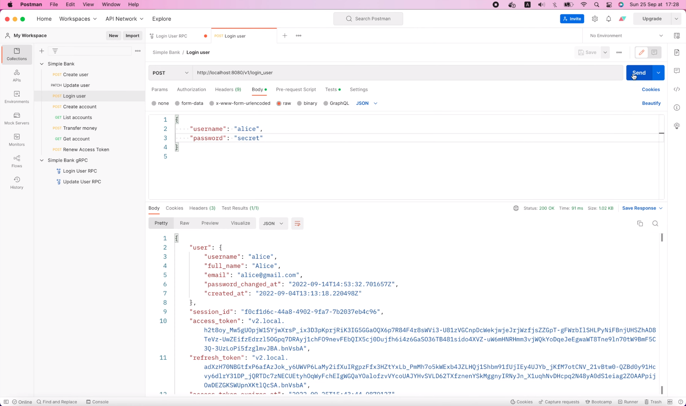

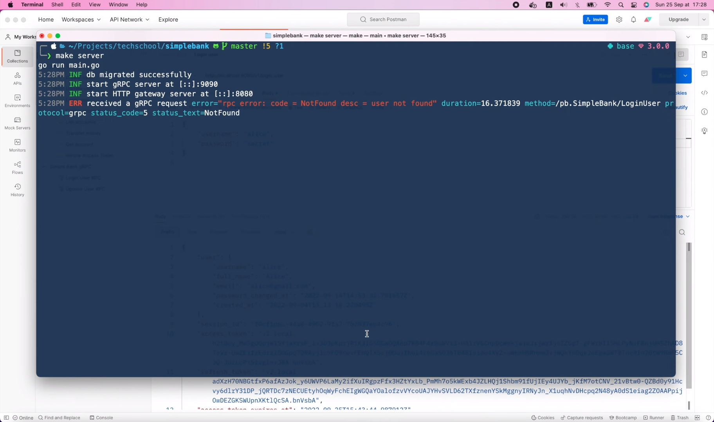

That's because we're using in-process translation on our gRPC gateway 
server, so the gateway will call the RPC handler function directly without
going through any interceptors.

If we run the gateway as a separate server, and use cross-process 
translation to call the gRPC server via a network call, then the logs will
show up in the gRPC server as normal.

But that's another network hop that can increase the duration of the 
request. So, if we still want to keep using in-process translation, 
we will have to write a separate HTTP middleware to log the HTTP
requests.

And that's exactly what we're gonna do in the next video. Until then, 
thanks a lot for watching, happy learning and see you in the next 
lecture!