# Создание структурированных логов для gRPC API

[Оригинал](https://www.youtube.com/watch?v=tTAxLGrDmPo)

Всем привет! Рад вас снова видеть на мастер-классе по бэкенду! На данный 
момент мы реализовали несколько gRPC API, такие как `CreateUser`, 
`LoginUser` и `UpdateUser`. А на предыдущей лекции мы также добавили слой 
авторизации для защиты API. Однако возможно вы заметили, что когда мы 
отправляем gRPC запрос на сервер, записи в лог не происходит, даже если 
запрос был успешно выполнен.

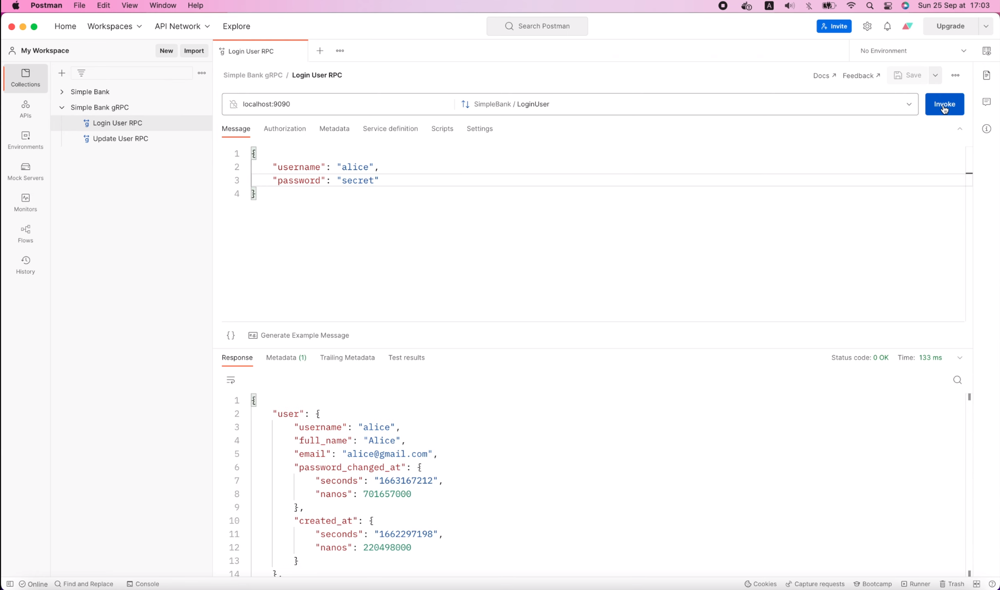

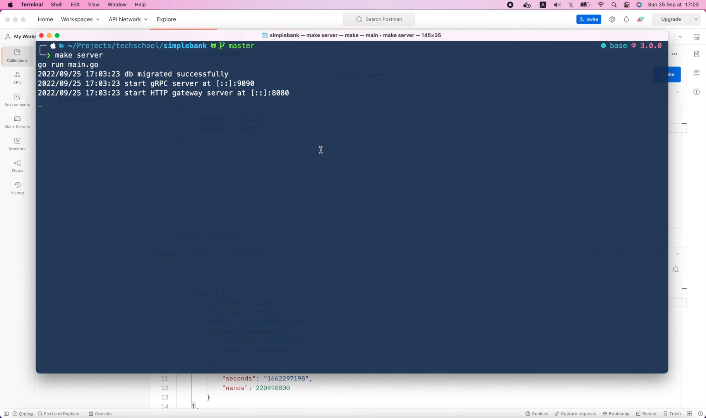

## Пишем в лог gRPC запросы с помощью gRPC перехватчика

Итак, сегодня давайте узнаем, как писать в лог gRPC запросы с помощью 
gRPC перехватчика. gRPC перехватчик — это просто функция, которая вызывается 
для каждого запроса, прежде чем он будет отправлен RPC обработчику для 
обработки. И поскольку все наши RPC унарные, мы собираемся реализовать 
унарный gRPC перехватчик для записи логов.

Как видно здесь,

```go
// UnaryInterceptor returns a ServerOption that sets the UnaryServerInterceptor for the
// server. Only one unary interceptor can be installed. The construction of multiple
// interceptors (e.g., chaining) can be implemented at the caller.
func UnaryInterceptor(i UnaryServerInterceptor) ServerOption {
	return newFuncServerOption(func(o *serverOptions) {
		if o.unaryInt != nil {
			panic("The unary server interceptor was already set and may not be reset.")
		}
		o.unaryInt = i
	})
}
```

эта функция создаст `ServerOption`, которая задаст унарный перехватчик для 
нашего gRPC сервера. И нам нужно только реализовать этот интерфейс 
`UnaryServerInterceptor`.

```go
// UnaryServerInterceptor provides a hook to intercept the execution of a unary RPC on the server. info
// contains all the information of this RPC the interceptor can operate on. And handler is the wrapper
// of the service method implementation. It is the responsibility of the interceptor to invoke handler
// to complete the RPC.
type UnaryServerInterceptor func(ctx context.Context, req interface{}, info *UnaryServerInfo, handler UnaryHandler) (resp interface{}, err error)
```

На самом деле это просто функция, поэтому давайте скопируем ее определение.
Затем в пакете `gapi` я создам новый файл с названием `logger.go`. В этом 
файле мы реализуем перехватчик для записи в лог, поэтому давайте вставим 
только что скопированную сигнатуру функции.

Я навозу её `GrpcLogger`. Эта функция принимает несколько входных параметров:
объект контекста, запрос типа `interface{}`, унарную информацию о сервере и 
унарную функцию-обработчик. И она вернет ответ типа `interface{}` и ошибку.
Мы должны добавить название пакета `grpc` к `UnaryServerInfo` и `UnaryHandler`, 
потому что в нём определены эти два типа.

```go
func GrpcLogger(
	ctx context.Context,
	req interface{},
	info *grpc.UnaryServerInfo,
	handler grpc.UnaryHandler,
) (resp interface{}, err error) {

}
```

Хорошо, давайте пока оставил тело функции пустым, мы вернёмся к ней и
реализуем её совсем скоро. А пока, давайте откроем файл `main.go` и 
попробуем добавить перехватчик для записи в лог в gRPC сервер. Здесь я 
передам функцию `gapi.GrpcLogger` в этот `grpc.UnaryInterceptor`.
Она вернет объект `ServerOption`, поэтому давайте назовем его `grpcLogger`.
Затем мы передадим этот `grpcLogger` в функцию `grpc.NewServer()`.

```go
func runGrpcServer(config util.Config, store db.Store) {
	server, err := gapi.NewServer(config, store)
	if err != nil {
		log.Fatal("cannot create server:", err)
	}

	grpcLogger := grpc.UnaryInterceptor(gapi.GrpcLogger)
    grpcServer := grpc.NewServer(grpcLogger)
    ...
}
```

Вот так можно добавить перехватчик в gRPC сервер. Обратите внимание, что эта 
функция (`grpc.NewServer`) может принимать несколько `ServerOptions`, 
таким образом вы можете легко добавить дополнительные перехватчики или любые 
другие параметры, которые вам нужны на сервере.

OK, теперь пришло время реализовать gRPC перехватчик для записи в лог.

Давайте начнём с записи простого сообщения в лог: "received a gRPC request"
(«принят gRPC запрос»). Мы добавим больше информации в это сообщение 
позднее.

```go
func GrpcLogger(
	ctx context.Context,
	req interface{},
	info *grpc.UnaryServerInfo,
	handler grpc.UnaryHandler,
) (resp interface{}, err error) {
	log.Println("received a gRPC request")
}
```

После записи в лог мы должны вызвать функцию-обработчик, передав в неё 
контекст и объект запроса. Это по сути перенаправит запрос обработчику.
После обработки запроса функция-обработчик вернет результат и ошибку.
И мы можем просто вернуть их в качестве результата работы этой 
функции-перехватчика.

```go
func GrpcLogger(
	ctx context.Context,
	req interface{},
	info *grpc.UnaryServerInfo,
	handler grpc.UnaryHandler,
) (resp interface{}, err error) {
	log.Println("received a gRPC request")
	result, err := handler(ctx, req)
	return result, err
}
```

И на этом по сути всё! Очень просто, не так ли?

Давайте запустим сервер и протестируем что у нас получилось!

```shell
make server
```

Итак, сервер готов к работе. Теперь я снова вызову этот RPC `LoginUser`.

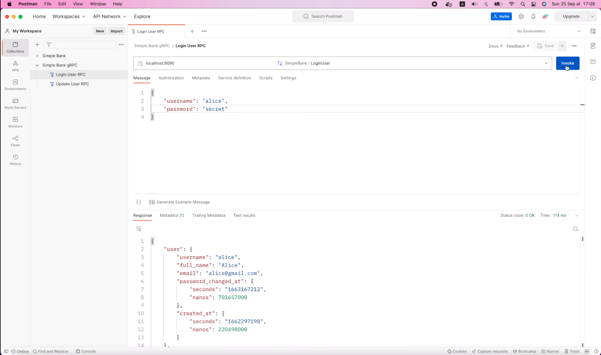

Запрос успешно выполнен, как и раньше, но на этот раз в консоли появилась 
запись: "received a gRPC request" («принят gRPC запрос»).

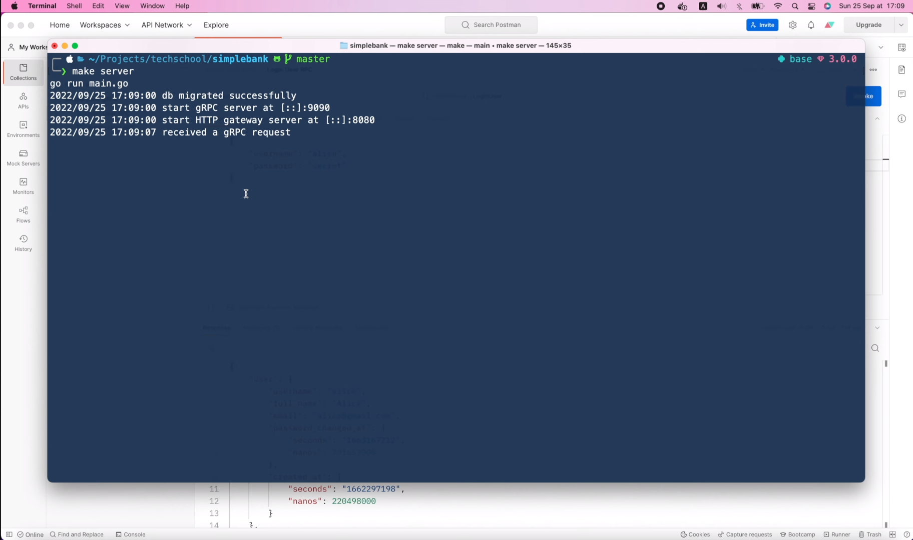

Итак, наш gRPC перехватчик для записи в лог работает, как и ожидалось. 
Однако это сообщение в логе не содержит никакой полезной информации.

Обычно мы хотим знать некоторую конкретную информацию о запросе, например, 
какой метод RPC был вызван, сколько времени потребовалось для обработки 
запроса и чему был равен код состояния ответа. Более того, при запуске в 
продакшене мы также хотим, чтобы сообщения в логах были структурированы 
так, чтобы их можно было легко анализировать и индексировать с помощью 
инструментов управления логами, таких как `Logstash`, `Fluentd` и 
`Grafana Loki`.


Чтобы писать структурированные сообщения в лог, я буду использовать пакет
под названием [`zerolog`](https://github.com/rs/zerolog). Этот пакет
помогает нам легко писать сообщения в лог в формате JSON без дополнительного
выделения памяти. Утверждается, что он предоставляет отличные возможности
для разработчиков и обеспечивает потрясающую производительность, используя 
тот же подход, что и пакет от Uber `zap`, но с более простым API и 
лучшей производительностью.

Хорошо, давайте скопируем эту команду

```shell
go get -u github.com/rs/zerolog/log
```

и запустите её в терминале, чтобы установить пакет. Записать сообщение в 
лог с помощью `zerolog` так же просто, как и используя стандартный пакет
`log` в Go. Он даже использует подпакет с таким же названием "log", поэтому 
нам просто нужно скопировать этот импорт,

```
github.com/rs/zerolog/log
```

и заменить этот импорт стандартного пакета `log` на `zerolog`.

```go
import (
    "context"
    "github.com/rs/zerolog/log"
    "google.golang.org/grpc"
)
```

У `zerolog` нет функции `Println`, потому что он всегда выводит сообщение в 
лог в отдельной строке. Так что просто `log.Print()` будет достаточно.

```go
func GrpcLogger(
	ctx context.Context,
	req interface{},
	info *grpc.UnaryServerInfo,
	handler grpc.UnaryHandler,
) (resp interface{}, err error) {
	log.Print("received a gRPC request")
	result, err := handler(ctx, req)
	return result, err
}
```

Теперь, поскольку мы используем этот новый пакет, мы должны добавить его в 
список зависимостей в файле `go.mod`. Для этого мы можем просто запустить

```shell
go mod tidy
```

в терминале.

```
require (
    ...
	github.com/rakyll/statik v0.1.7
	github.com/rs/zerolog v1.28.0
	github.com/spf13/viper v1.10.1
	...
)
```

И вуаля, к необходимым зависимостям добавлен `zerolog` версии `1.28`. Прежде
чем добавить дополнительную информацию в логи, давайте попробуем запустить
сервер, чтобы посмотреть, что он по-прежнему работает без ошибок. На этот 
раз, когда я отправляю запрос на вход пользователя в систему, 

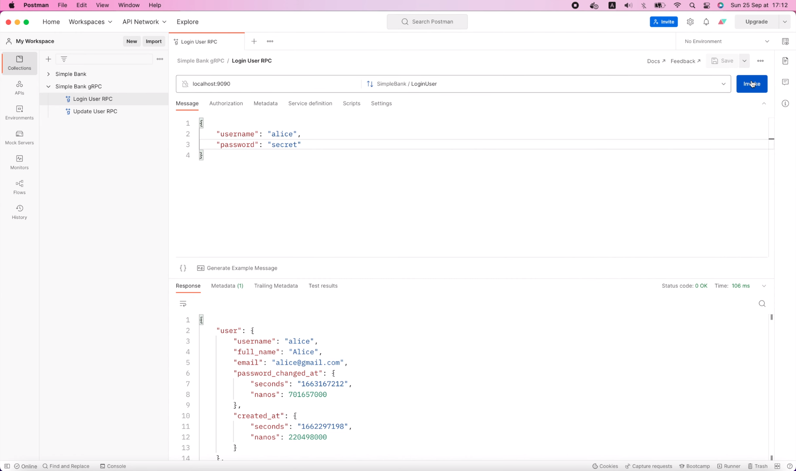

мы увидим JSON сообщение в логе на сервере.

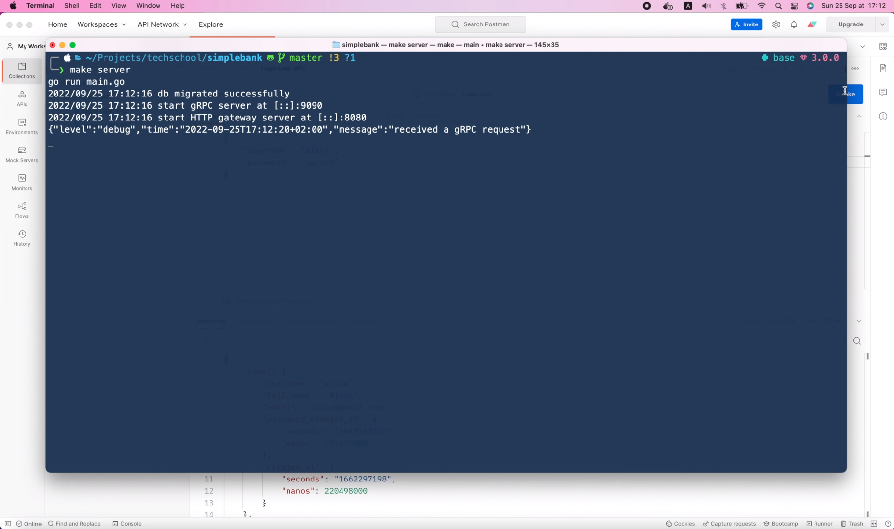

В нём несколько полей, сообщающих нам об уровне важности, моменте времени 
регистрации и записанном сообщении. `Zerolog` позволяет нам добавлять 
некоторые контекстные данные к сообщению в виде пары «ключ-значение». Как
видно в этом примере,

```go
package main

import (
    "github.com/rs/zerolog"
    "github.com/rs/zerolog/log"
)

func main() {
    zerolog.TimeFieldFormat = zerolog.TimeFormatUnix

    log.Debug().
        Str("Scale", "833 cents").
        Float64("Interval", 833.09).
        Msg("Fibonacci is everywhere")
    
    log.Debug().
        Str("Name", "Tom").
        Send()
}
```

мы можем записать в лог сообщения для отладки и прикрепить к ним
какие-то строки и числа с плавающей запятой.

Мы также можем контролировать уровень, в зависимости от важности сообщения.
Ниже приведён список с различными уровнями важности лога, которые мы можем 
использовать, в порядке убывания.

* panic (zerolog.PanicLevel, 5)
* fatal (zerolog.FatalLevel, 4)
* error (zerolog.ErrorLevel, 3)
* warn (zerolog.WarnLevel, 2)
* info (zerolog.InfoLevel, 1)
* debug (zerolog.DebugLevel, 0)
* trace (zerolog.TraceLevel, -1)

Итак, в нашем коде мы можем заменить эту функцию `log.Print()` на 
`log.Info().Msg()`, чтобы писать сообщения в лог информационного уровня 
важности вместо отладочного. 

```go
func GrpcLogger(
	ctx context.Context,
	req interface{},
	info *grpc.UnaryServerInfo,
	handler grpc.UnaryHandler,
) (resp interface{}, err error) {
	log.Info().Msg("received a gRPC request")
	result, err := handler(ctx, req)
	return result, err
}
```

А так как наш сервер поддерживает как gRPC, так и HTTP-запросы, я добавлю 
в лог строковое поле, сообщающее нам о протоколе, с помощью которого
был послан запрос, в данном случае gRPC.

```go
func GrpcLogger(
	ctx context.Context,
	req interface{},
	info *grpc.UnaryServerInfo,
	handler grpc.UnaryHandler,
) (resp interface{}, err error) {
	log.Info().Str("protocol", "grpc").
		Msg("received a gRPC request")
	result, err := handler(ctx, req)
	return result, err
}
```

Мы узнаем как записать в лог HTTP запросы, поступающие в gRPC шлюз, на 
следующей лекции. Теперь давайте также выведем вызываемый RPC метод.
Мы можем получить его из поля `FullMethod` объекта `info`.

```go
func GrpcLogger(
	ctx context.Context,
	req interface{},
	info *grpc.UnaryServerInfo,
	handler grpc.UnaryHandler,
) (resp interface{}, err error) {
	log.Info().Str("protocol", "grpc").
		Str("method", info.FullMethod).
		Msg("received a gRPC request")
	result, err := handler(ctx, req)
	return result, err
}
```

Хорошо, теперь я хочу измерить время, необходимое для обработки запроса.
Итак, давайте переместим этот оператор вызова лога в конец функции.
Затем вверху я сохраню текущую метку времени в переменной `startTime`.
И после получения результата от обработчика мы можем вычислить 
продолжительность запроса с помощью `time.Since(startTime)`.
Давайте добавим эту длительность в лог, используя функцию `Dur()`, 
предоставляемую `zerolog`.

```go
func GrpcLogger(
	ctx context.Context,
	req interface{},
	info *grpc.UnaryServerInfo,
	handler grpc.UnaryHandler,
) (resp interface{}, err error) {
	startTime := time.Now()
	result, err := handler(ctx, req)
	duration := time.Since(startTime)

	log.Info().Str("protocol", "grpc").
		Str("method", info.FullMethod).
		Dur("duration", duration).
		Msg("received a gRPC request")
	return result, err
}
```

Наконец, меня также интересует статус запроса, чтобы знать успешно он 
был обработан или нет. Мы можем получить эту информацию из ошибки. 
Во-первых, давайте объявим переменную кода состояния со значением по 
умолчанию: `codes.Unknown`. Затем мы вызваем `status.FromError()`, чтобы 
извлечь статус из ошибки и сохранить его внутри объекта `st`. Эта функция 
также возвращает логическое значение «ok», сообщающее нам, успешно ли 
извлечено содержимое. Если все в порядке, мы можем получить код состояния,
вызвав функцию `st.Code()`. Теперь, поскольку код состояния на самом деле 
является целым числом, я воспользуюсь функцией `Int()` `zerolog`, чтобы 
добавить его к логу. Приятно, что Visual Studio Code автоматически дописал код
для выполнения преобразования типов за нас. Может быть нелегко понять что 
означает конкретный целочисленный код состояния, поэтому почему бы нам не 
вывести текст, расшифровывающий его, в лог? Для этого достаточно вызвать
функцию `String()` объекта `statusCode`.

```go
func GrpcLogger(
	ctx context.Context,
	req interface{},
	info *grpc.UnaryServerInfo,
	handler grpc.UnaryHandler,
) (resp interface{}, err error) {
	startTime := time.Now()
	result, err := handler(ctx, req)
	duration := time.Since(startTime)

	statusCode := codes.Unknown
	if st, ok := status.FromError(err); ok {
		statusCode = st.Code()
	}

	log.Info().Str("protocol", "grpc").
		Str("method", info.FullMethod).
		Int("status_code", int(statusCode)).
		Str("status_text", statusCode.String()).
		Dur("duration", duration).
		Msg("received a gRPC request")
	return result, err
}
```

Как видно из этого фрагмента,

```go
func (c Code) String() string {
	switch c {
	case OK:
		return "OK"
	case Canceled:
		return "Canceled"
	case Unknown:
		return "Unknown"
	case InvalidArgument:
		return "InvalidArgument"
	case DeadlineExceeded:
		return "DeadlineExceeded"
	case NotFound:
		return "NotFound"
	case AlreadyExists:
		return "AlreadyExists"
	case PermissionDenied:
		return "PermissionDenied"
	case ResourceExhausted:
		return "ResourceExhausted"
	case FailedPrecondition:
		return "FailedPrecondition"
	case Aborted:
		return "Aborted"
	case OutOfRange:
		return "OutOfRange"
	case Unimplemented:
		return "Unimplemented"
	case Internal:
		return "Internal"
	case Unavailable:
		return "Unavailable"
	case DataLoss:
		return "DataLoss"
	case Unauthenticated:
		return "Unauthenticated"
	default:
		return "Code(" + strconv.FormatInt(int64(c), 10) + ")"
	}
}
```

эта функция преобразует код в текст, понятный человеку. Итак, думаю мы 
добавили достаточно информации в лог.

Давайте перезапустим сервер и посмотрим какие сообщения в результате 
будут выводиться в лог.

```shell
make server
go run main.go
2022/09/25 17:18:16 db migrated successfully
2022/09/25 17:18:16 start gRPC server at [::]:9090
2022/09/25 17:18:16 start HTTP gateway server at [::]:8080
```

Сервер успешно запущен.

Вернемся в Postman и вызовем RPC `LoginUser`.


На этот раз в логе гораздо больше полезной информации.

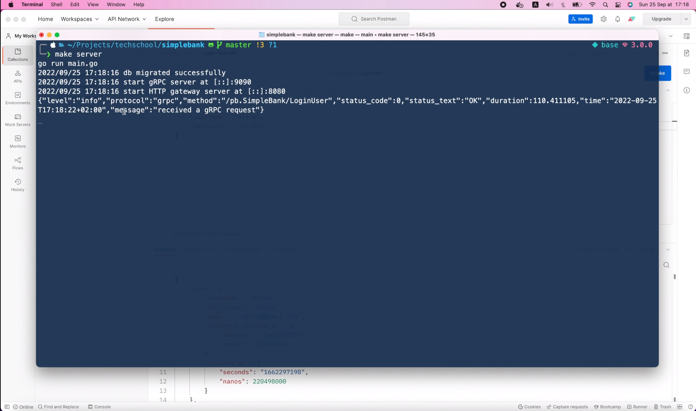

А именно, протокол `grpc`, метод `SimpleBank/LoginUser`, код 
состояния `0` или текст состояния `OK` и продолжительность запроса в 
миллисекундах. Так что пока перехватчик для записи в лог работает без
упрёков.

Теперь давайте попробуем отправить другой запрос, чтобы получить 
отличающийся от предыдущего код состояния.

Я попытаюсь войти в систему под несуществующим пользователем: `bob`.

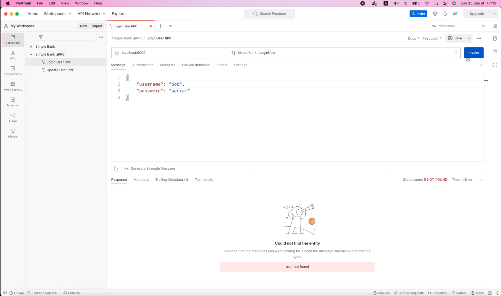

Как видите мы получили код состояния `5`: `NOT FOUND` («не найден»). 
Посмотрим, что у нас в логах сервера.

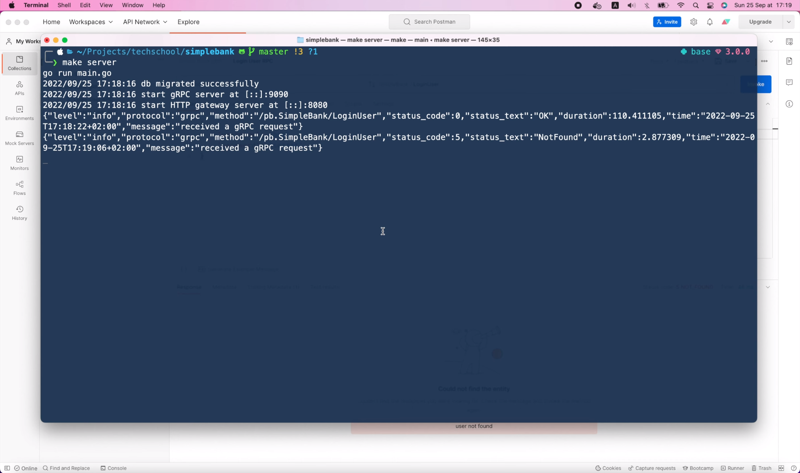

Так и есть, мы видим код состояния `5` и текст состояния `NotFound`.
Однако уровень важности лога по-прежнему "info". Хорошо бы было 
изменить его на "error", чтобы нам было легче искать запросы, во время 
выполнения которых возникла ошибка, в инструменте управления логами. И было
бы ещё лучше, если бы мы могли также вывести более подробную информацию 
об ошибке.

Можем ли мы это сделать? Да, конечно можем. Если вы взгляните на эту 
функцию `log.Info()`,

```go
func GrpcLogger(
    ctx context.Context,
    req interface{},
    info *grpc.UnaryServerInfo,
    handler grpc.UnaryHandler,
) (resp interface{}, err error) {
	...
	log.Info().Str("protocol", "grpc").
        Str("method", info.FullMethod).
        Int("status_code", int(statusCode)).
        Str("status_text", statusCode.String()).
        Dur("duration", duration).
        Msg("received a gRPC request")
	...
}
```

то увидите, что она возвращает объект `zerolog.Event`

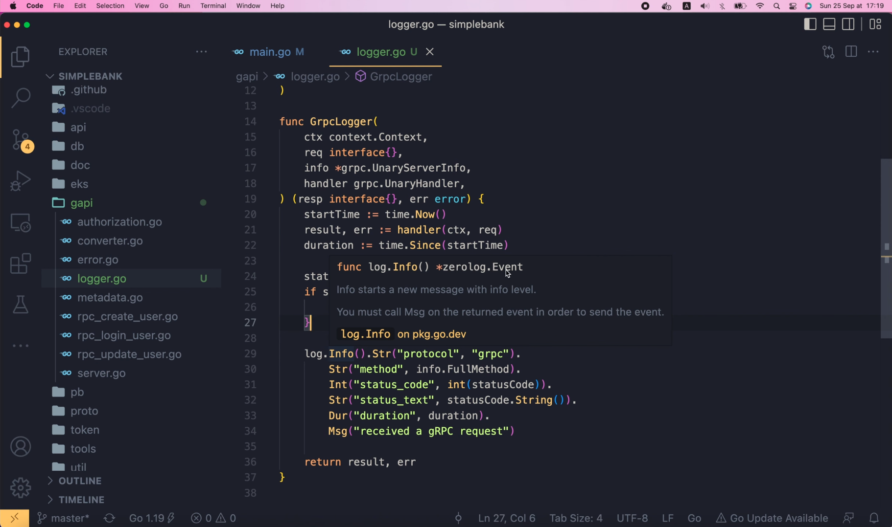

что позволяет нам по цепочке вызывать другие методы для добавления 
дополнительных данных в лог.

Таким образом, мы можем воспользоваться этим, отделив вызов `log.Info()` и 
сохранив его результат в объекте `logger`.

```go
logger := log.Info()
```

Затем, если ошибка не `nil`, мы заменим `logger` на `log.Error()`.

```go
if err != nil {
    logger := log.Error()
}
```

И в этом случае мы можем даже добавить объект ошибки к сообщению в логе.

```go
if err != nil {
    logger := log.Error().Err(err)
}
```

Теперь все, что нам нужно сделать, это заменить тут ниже `log.Info()` 
созданным `logger`.

```go
func GrpcLogger(
    ctx context.Context,
    req interface{},
    info *grpc.UnaryServerInfo,
    handler grpc.UnaryHandler,
) (resp interface{}, err error) {
	...
    logger := log.Info()
    if err != nil {
        logger = log.Error().Err(err)
    }
    logger.Str("protocol", "grpc").
        Str("method", info.FullMethod).
        Int("status_code", int(statusCode)).
        Str("status_text", statusCode.String()).
        Dur("duration", duration).
        Msg("received a gRPC request")
	...
}
```

Вот и все!

Сохраним файл и вернемся в терминал, чтобы перезапустить сервер.

```shell
make server
```

Теперь, если мы повторно отправим запрос на вход, передав в нём данные 
несуществующего пользователя,

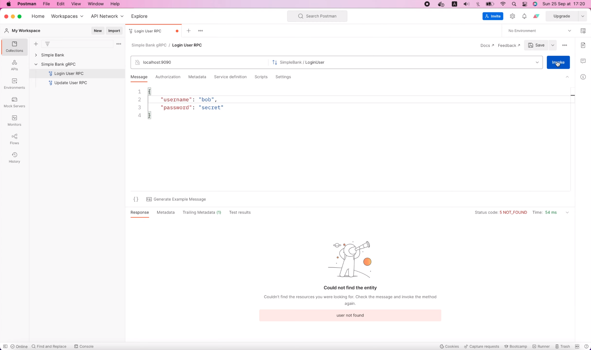

то увидим, что уровень важности изменился на `error` и у нас появилось 
ещё одно поле `error` подробно поясняющее причину возникшей ошибки.

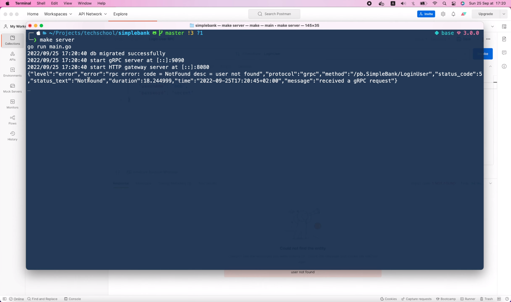

Здорово, не так ли?

Давайте проверим, что всё по-прежнему работает без ошибок, если мы 
попытаемся войти в систему, используя данные зарегистрированного в ней 
пользователя.

Я опять изменю имя пользователя на "alice" и вызову RPC.

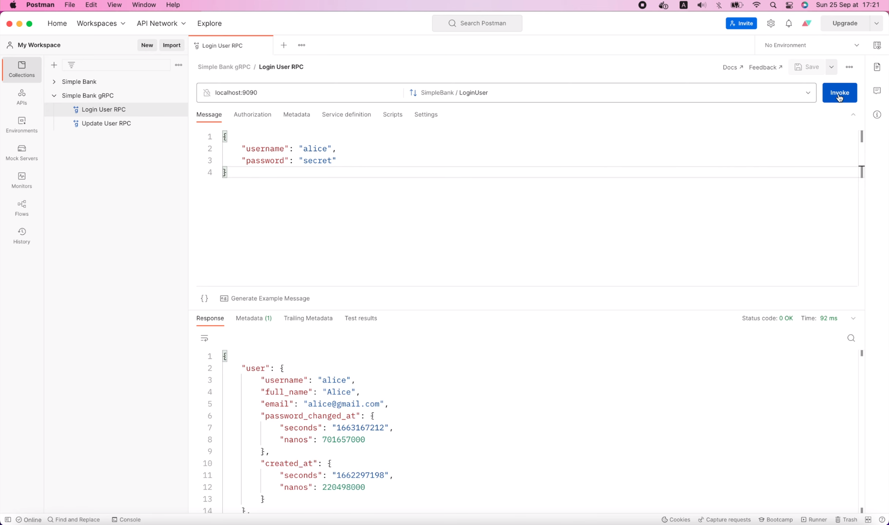

Запрос выполнен успешно,

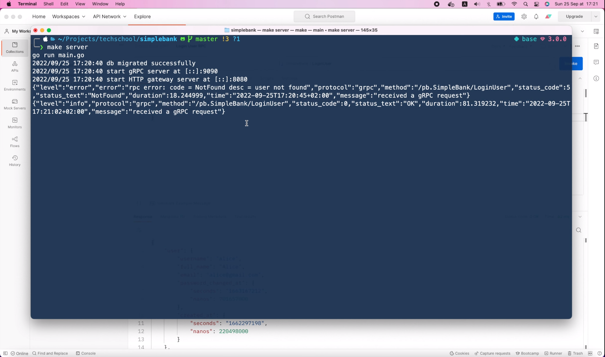

а в логе мы видим, что уровень важности равен `info` и в этот раз в нём
нет поля `error`.

Так что всё работает превосходно! Ну почти всё, потому что вверху всё 
еще выводятся какие-то неструктурированные логи

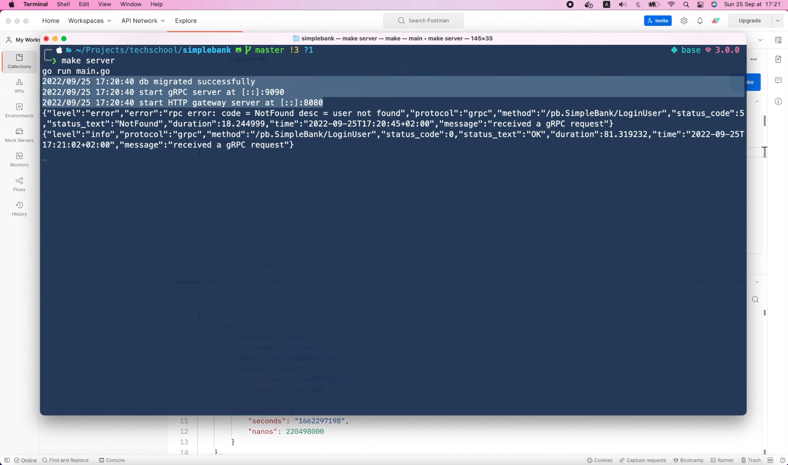

не в формате JSON.

Вернёмся к коду и исправим это. 

Команды, которые пишут эти сообщения в лог, находятся в файле `main.go`,
где мы по-прежнему используем стандартный пакет `log`. Итак, сначала я 
удалю этот импорт `log`,

```go
import (
	"context"
	"database/sql"
	"google.golang.org/grpc/reflection"
	"google.golang.org/protobuf/encoding/protojson"
	"log"
	"net"
	"net/http"
	
	...
)
```

и заменим его пакетом `zerolog`.

```go
import (
	...
	"github.com/rs/zerolog/log"
	"google.golang.org/grpc"
)
```

Затем давайте заменим все вхождения `log.Fatal()` на `log.Fatal().Msg()`.
Я также удалю объект ошибки `err` в конце сообщения. При написании лекции я 
забыл добавить его обратно, используя функцию `Err()` `zerolog`, но я уверен,
что вы знаете, как это сделать самостоятельно (я добавил эту функцию в код - 
примечания переводчика).

```go
func main() {
	config, err := util.LoadConfig(".")
	if err != nil {
		log.Fatal().Err(err).Msg("cannot load config")
	}

	conn, err := sql.Open(config.DBDriver, config.DBSource)
	if err != nil {
		log.Fatal().Err(err).Msg("cannot connect to db")
	}
	
	...
}
```

Или вы можете взглянуть на мой код в репозитории `simple-bank` на GitHub.

Хорошо, теперь давайте изменим этот оператор `log.Println()` на 
`log.Info().Msg()`.

```go
func runDBMigration(migrationURL string, dbSource string) {
	...

	log.Info().Msg("db migrated successfully")
}
```

Мы можем оставить как есть эту команду `log.Printf()`, поскольку она 
по-прежнему работает.

```go
func runGrpcServer(config util.Config, store db.Store) {
	...

	log.Printf("start gRPC server at %s", listener.Addr().String())
	err = grpcServer.Serve(listener)
	if err != nil {
		log.Fatal().Err(err).Msg("cannot start gRPC server")
	}
}
```

Теперь я перезапущу сервер, чтобы посмотреть, как всё отработает после замены.

```shell
make server
go run main.go
{"level":"info","time":"2022-09-25T17:23:02+02:00","message":"db migrated successfully"}
{"level":"debug","time":"2022-09-25T17:23:02+02:00","message":"start gRPC server at [::]:9090"}
{"level":"debug","time":"2022-09-25T17:23:02+02:00","message":"start HTTP gateway server at [::]:8080"}
```

Вуаля, в логах появились сообщения в формате JSON, как и ожидалось.

Но некоторые сообщения в логах всё ещё имеют уровень важности "debug",
поэтому давайте вернемся к коду и заменим все вхождения этого оператора 
`log.Printf()` на `log.Info().Msgf()`.

```go
func runGrpcServer(config util.Config, store db.Store) {
	...

    log.Info().Msgf("start gRPC server at %s", listener.Addr().String())
	...
}

func runGatewayServer(config util.Config, store db.Store) {
    ...
	
    log.Info().Msgf("start HTTP gateway server at %s", listener.Addr().String())
    ...
}
```

Этого должно быть достаточно. Мы используем форматирование сообщений, чтобы 
вывести адрес сервера. Хорошо, давайте перезапустим сервер еще раз.

```shell
make server
go run main.go
{"level":"info","time":"2022-09-25T17:23:47+02:00","message":"db migrated successfully"}
{"level":"info","time":"2022-09-25T17:23:47+02:00","message":"start gRPC server at [::]:9090"}
{"level":"info","time":"2022-09-25T17:23:47+02:00","message":"start HTTP gateway server at [::]:8080"}
```

На этот раз уровень важности изменился на "info", как мы и хотели.

Прежде чем мы закончим, я хочу показать вам ещё кое-что.

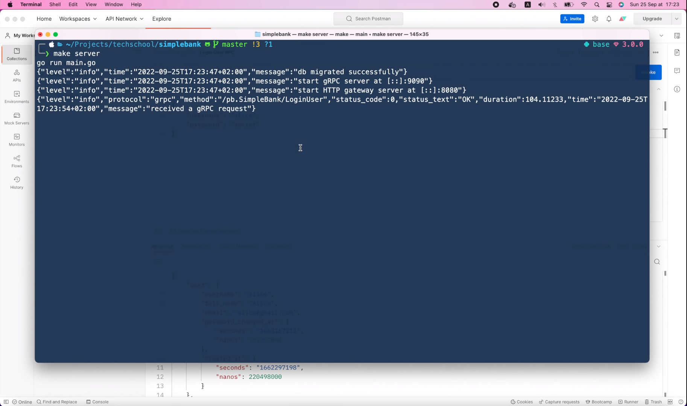

JSON логи хороши для продакшена, но их трудно читать. Таким образом, в 
процессе разработки мы хотели бы вместо них иметь логи, понятные человеку.

`Zerolog` позволяет переключится на такой красивый формат логирования, 
используя параметр `ConsoleWriter`. Все, что нам нужно сделать, это 
скопировать этот однострочный оператор,

```go
log.Logger = log.Output(zerolog.ConsoleWriter{Out: os.Stderr})
```

И вставить его в начало функции `main()`.

```go
func main() {
	log.Logger = log.Output(zerolog.ConsoleWriter{Out: os.Stderr})
	
	config, err := util.LoadConfig(".")
	...
}
```

Теперь, когда мы перезапустим сервер, то увидим, что логи перестали 
отображаться в формате JSON и их очень легко читать.

```shell
make server
go run main.go
5:25PM INF db migrated successfully
5:25PM INF start gRPC server at [::]:9090
5:25PM INF start HTTP gateway server at [::]:8080
```

Я отправлю на сервер несколько RPC-запросов, чтобы вы увидели, как будут
выглядеть логи.

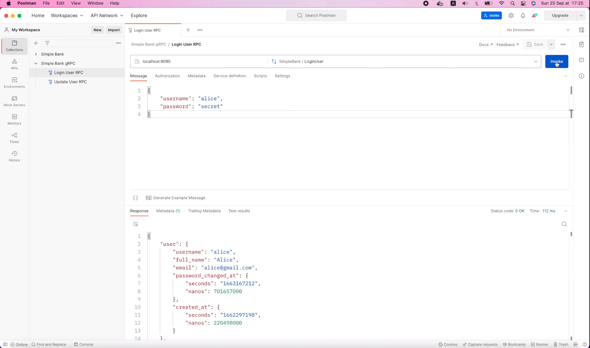

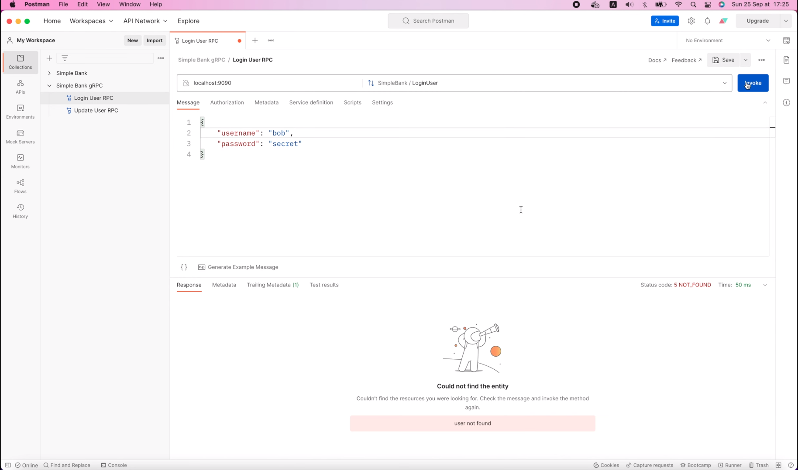

Вот, как видно на рисунке ниже, логи довольно хорошо отформатированы,

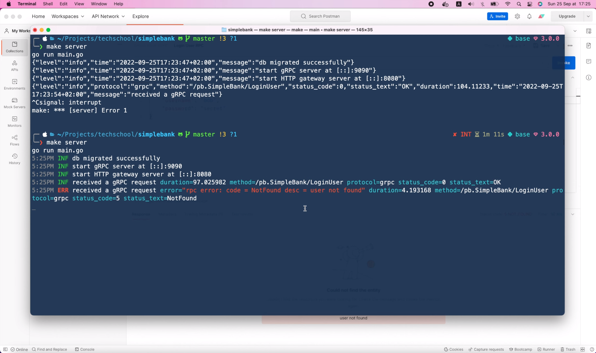

где зелёным текстом выделены информационные сообщения, а красным - сообщения,
сигнализирующие об ошибке. Выглядит здорово, не так ли?

Но если мы оставим код как есть, логи будут одинаковыми для каждого 
окружения. Итак, как мы можем включить такой режим только для разработки,
сохранив при этом JSON формат для стейджа или продакшена?

Что ж, мы можем добавить новую переменную, назвав её `ENVIRONMENT` в файл
`app.env`, и для локального файла зададим для неё значение "development"

```
ENVIRONMENT=development
```

Затем мы должны обновить структуру `Config` в пакете `util`, чтобы добавить 
эту новую переменную `ENVIRONMENT`. Вы должны убедиться, что название его 
дескриптора точно соответствует тому, которое мы объявили в файле `app.env`.

```go
type Config struct {
	Environment          string        `mapstructure:"ENVIRONMENT"`
	DBDriver             string        `mapstructure:"DB_DRIVER"`
	...
}
```

Хорошо, теперь в функции `main()` я передвину эту команду настройки 
лога так, чтобы она выполнялась после загрузки конфигурации. И мы запускаем
эту команду для настройки формата сообщений в логах только в том случае, если 
переменная `config.Environment` равна "development".

```go
func main() {
	config, err := util.LoadConfig(".")
	if err != nil {
		log.Fatal().Err(err).Msg("cannot load config")
	}

	if config.Environment == "development" {
		log.Logger = log.Output(zerolog.ConsoleWriter{Out: os.Stderr})
	}
	
	...
}
```

Хорошо, давайте протестируем что у нас получилось!

Я перезапущу сервер.

```shell
make server
go run main.go
5:27PM INF db migrated successfully
5:27PM INF start gRPC server at [::]:9090
5:27PM INF start HTTP gateway server at [::]:8080
```

Логи выводятся, как и ожидалось, в форме понятной человеку, потому что 
мы задали для `ENVIRONMENT` значение "development".

Если я изменю ёё значение на "production" и перезапущу сервер, вместо этого 
мы получим логи в формате JSON.

```
ENVIRONMENT=production
```

```shell
make server
go run main.go
{"level":"info","time":"2022-09-25T17:27:32+02:00","message":"db migrated successfully"}
{"level":"info","time":"2022-09-25T17:27:32+02:00","message":"start gRPC server at [::]:9090"}
{"level":"info","time":"2022-09-25T17:27:32+02:00","message":"start HTTP gateway server at [::]:8080"}
```

Так что все работает именно так, как мы и хотели. Я верну для переменной
`ENVIRONMENT` значение "development".

```
ENVIRONMENT=development
```

Сегодня мы многое узнали о том как создать структурированные логи для 
нашего gRPC сервера. Однако на данный момент они работают только для
gRPC запросов. Если мы попытаемся отправить HTTP-запрос на сервер шлюза, 
то не увидим никаких сообщений, записанных в лог.

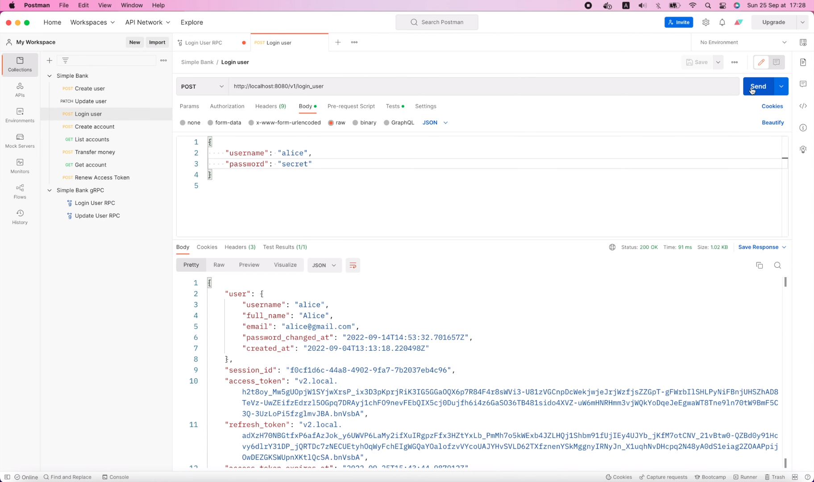

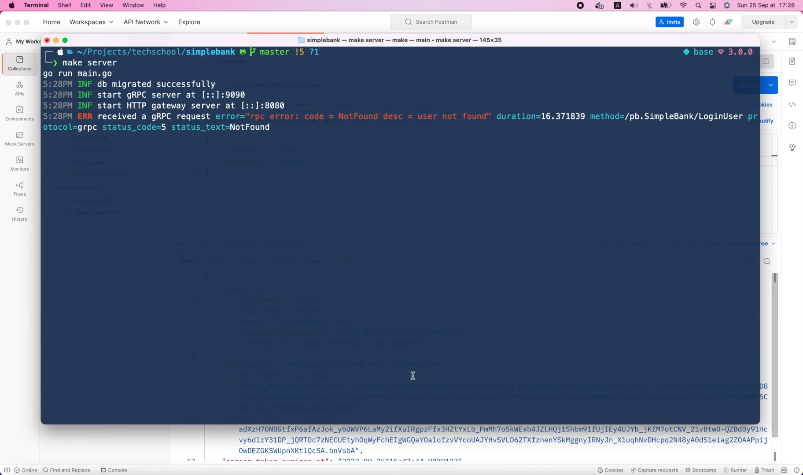

Это связано с тем, что мы используем преобразование «по ходу» на нашем 
сервере gRPC шлюза, поэтому шлюз будет вызывать RPC функцию-обработчик  
напрямую, минуя какие-либо перехватчики.

Если мы запустим шлюз как отдельный сервер и используем межпроцессное
преобразование, посылая запросы gRPC серверу через сетевой вызов, то логи
будут отображаться на gRPC сервере без каких-либо проблем.

Но эта дополнительная надстройка может увеличить продолжительность запроса.
Итак, если мы по-прежнему хотим использовать преобразование «по ходу», нам 
придется написать отдельный HTTP middleware для логирования HTTP-запросов.

И именно этим мы займёмся на следующей лекции. А пока, большое спасибо за
время, потраченное на чтение, желаю Вам получать удовольствие от обучения
и до встречи на следующей лекции!
