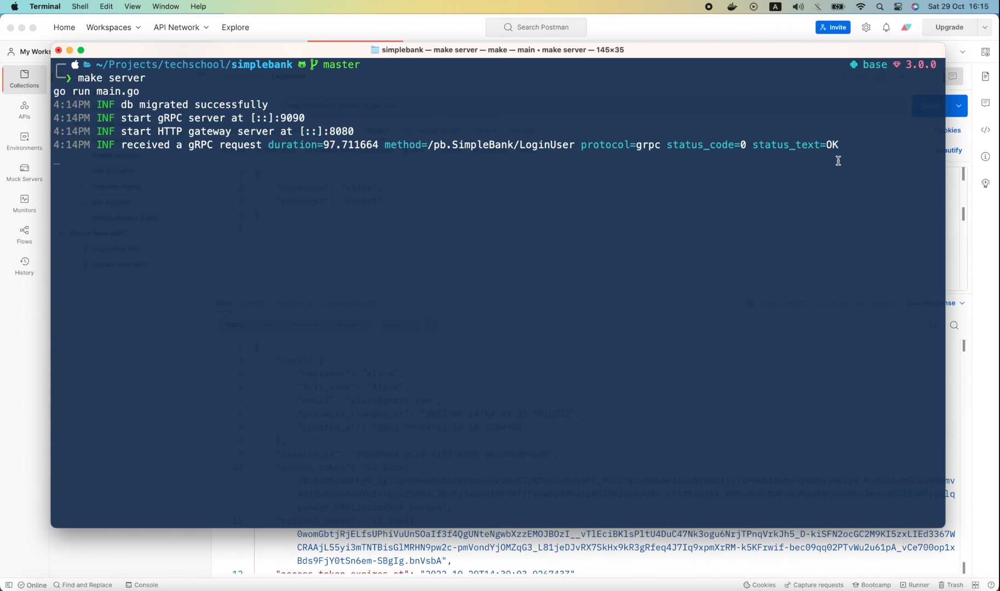
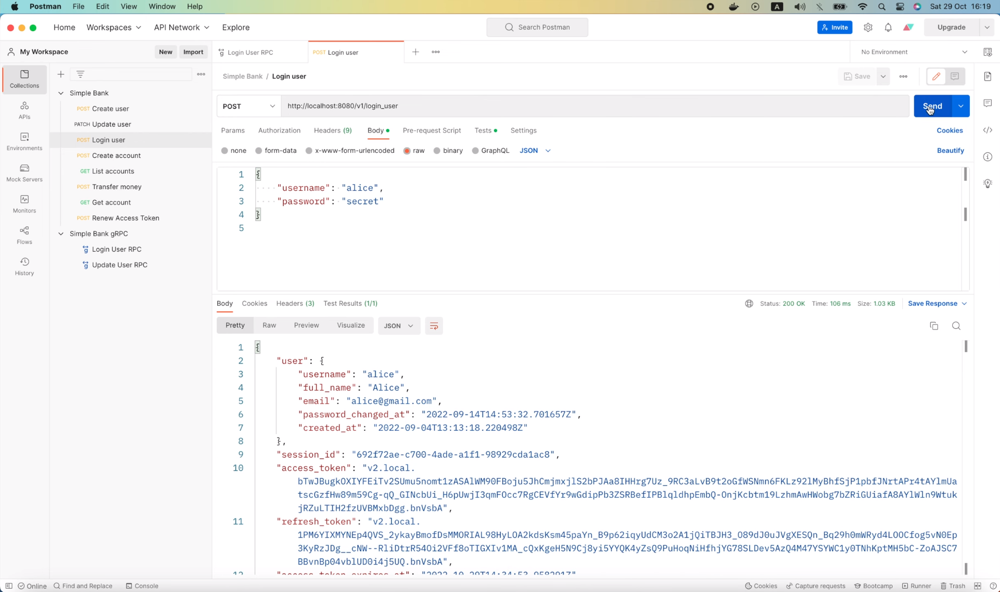
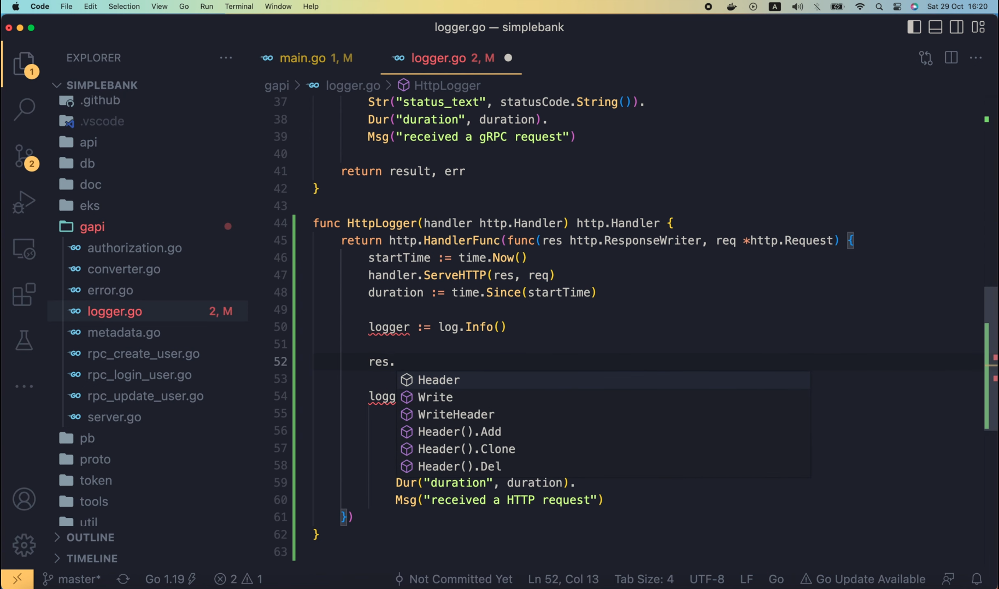
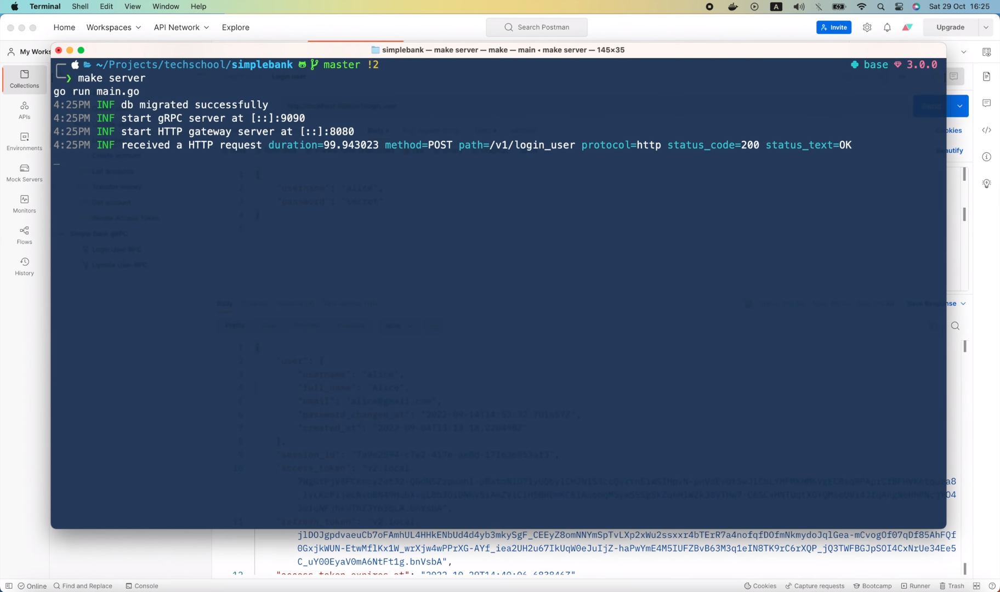
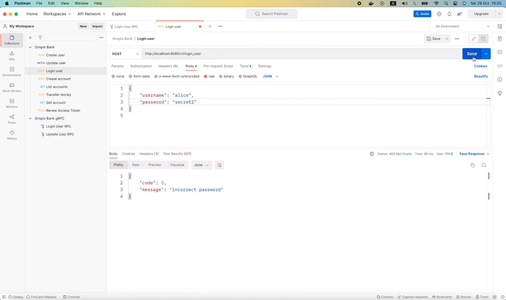
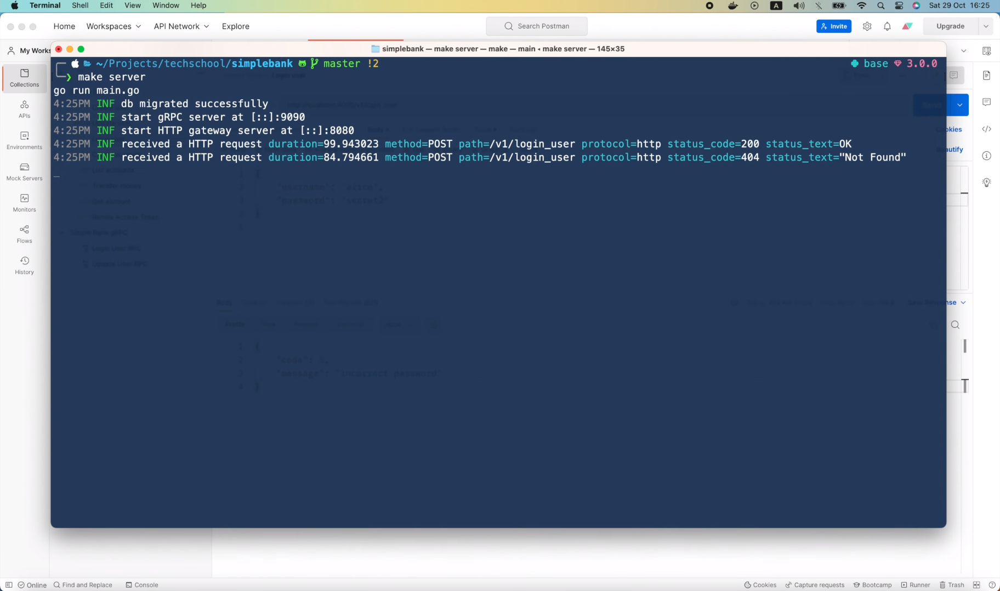
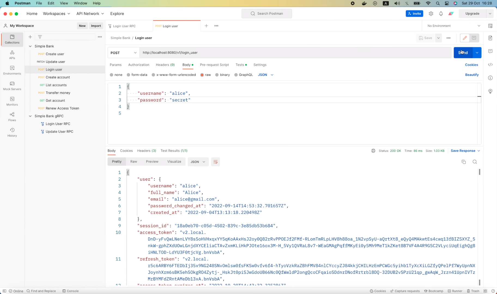
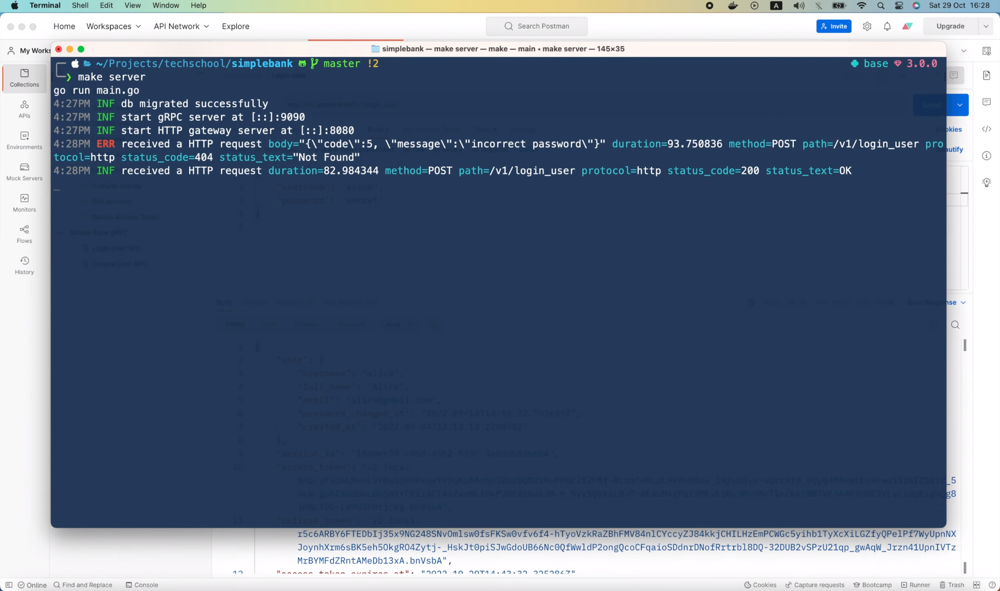

# How to write HTTP logger middleware in Go

[Original video](https://www.youtube.com/watch?v=Lbiz-PZNiU0)

Hello everyone, welcome to the backend master class! In the previous
lecture, we've learned how to write a gRPC interceptor to print out logs
for our gRPC API. So if I start the server, 

```shell
make server
go run main.go
4:14PM INF db migrated successfully
4:14PM INF start gRPC server at [::]:9090
4:14PM INF start HTTP gateway server at [::]:8080
```

and open Postman to send this `LoginUser` RPC,


we will see a new line of logs in the console.

```shell
make server
go run main.go
4:14PM INF db migrated successfully
4:14PM INF start gRPC server at [::]:9090
4:14PM INF start HTTP gateway server at [::]:8080
4:14PM INF INF received a gRPC request duration=97.711664 method=/pb.SimpleBank/LoginUser protocol=grpc status_code=0 status_text=OK
```

However, if I go back to Postman and try to send this HTTP request, 


you will see that it doesn't print out any new logs to the console.



The reason for this is, in the code that runs gRPC gateway server, we're
calling the `RegisterSimpleBankHandlerServer()` function, which performs
in-process translation between HTTP and gRPC. It will call the handler 
function of the gRPC server directly, without going through any gRPC 
interceptor. That's why the gRPC logger function didn't get executed. So,
in order to have logs for HTTP requests, we have to write a separate HTTP
logger middleware function and add it to the gRPC gateway server.

## Writing a separate HTTP logger middleware

```go
func HttpLogger() {
}
```

This middleware function should take an HTTP handler as input and also 
return another HTTP handler as output.

```go
func HttpLogger(handler http.Handler) http.Handler {
}
```

If we look into its implementation, we will see that `Handler` is just an
interface with only 1 function: `ServeHTTP`, that takes a `ResponseWriter`
and `Request` as input.

```go
type Handler interface {
	ServeHTTP(ResponseWriter, *Request)
}
```

So, in our code, we have to return a struct or function that satisfies 
the interface. Lucky for us, the `http` package already provides a 
`HandlerFunc` type,

```go
type HandlerFunc func(ResponseWriter, *Request)

func (f HandlerFunc) ServeHTTP(w ResponseWriter, r *Request) {
	f(w, r)
}
```

which implements the `ServeHTTP` function required by the interface. In 
fact, it's just an alias for this `func(ResponseWriter, *Request)` function
signature, so all we have to do is, copy this signature, and paste it into
our code like this.

```go
func HttpLogger(handler http.Handler) http.Handler {
    return http.HandlerFunc(func(res http.ResponseWriter, req *http.Request) {
    
    })
}
```

As you can see, it takes an HTTP `ResponseWriter` and an HTTP `Request`
object as input.

Here, we're just doing a type conversion from an anonymous function to 
the `HandlerFunc`.

Now the HTTP logger middleware has been declared. Next, we're gonna add
some code to print out the logs. Just like what we did for gRPC. Let's 
create a new logger with `log.Info()`.

```go
func HttpLogger(handler http.Handler) http.Handler {
	return http.HandlerFunc(func(res http.ResponseWriter, req *http.Request) {
		logger := log.Info()
	})
}
```

Then, I'm gonna copy this command 

```go
logger.Str("protocol", "grpc").
    Str("method", info.FullMethod).
    Int("status_code", int(statusCode)).
    Str("status_text", statusCode.String()).
    Dur("duration", duration).
    Msg("received a gRPC request")
```

to print out the log.

There are several info we want to display, for example, the protocol being 
used, in this case, it should be HTTP. Then the method of the request, we 
can get it from `req.Method`. Note that for HTTP, this method will only 
be `POST`, `GET`, `DELETE` or something like that. It doesn't contain the
request path like the `FullMethod` in gRPC. So we have to add 1 more 
string field to the log to show the path. We can easily get this info
from the `RequestURI`.

```go
logger.Str("protocol", "http").
    Str("method", req.Method).
    Str("path", req.RequestURI)
```

OK, the next 2 fields, status code and status text, is something we don't
have at the moment. So I'm gonna comment them out for now.

```go
logger.Str("protocol", "http").
    Str("method", req.Method).
    Str("path", req.RequestURI).
    // Int("status_code", int(statusCode)).
    // Str("status_text", statusCode.String()).
```

We'll come back here to add them back later.

Next, the duration of the request. Let's copy the chunk of code that 
measure the processing time from the gRPC logger.

```go
startTime := time.Now()
result, err := handler(ctx, req)
duration := time.Since(startTime)
```

Here, after storing the start time of the request, we have to call 
`handler.ServeHTTP()` function to forward the request to its handler
function to be processed. After that, we simply use `time.Since()` 
function to calculate the running duration.

```go
startTime := time.Now()
handler.ServeHTTP(res, req)
duration := time.Since(startTime)
```

Alright, so now we have the duration in the log.

Let's update this log message to "received an HTTP request".

```go
func HttpLogger(handler http.Handler) http.Handler {
	return http.HandlerFunc(func(res http.ResponseWriter, req *http.Request) {
		startTime := time.Now()
		handler.ServeHTTP(res, req)
		duration := time.Since(startTime)

		logger := log.Info()

		logger.Str("protocol", "http").
			Str("method", req.Method).
			Str("path", req.RequestURI).
			// Int("status_code", int(statusCode)).
			// Str("status_text", statusCode.String()).
			Dur("duration", duration).
			Msg("received an HTTP request")
	})
}
```

And we already have the first version of the HTTP logger middleware.

Now let's open the `main.go` file and add it to the gRPC gateway server.

Here, right before we call `http.Serve`, I'm gonna wrap this HTTP `mux` 
object with the `gapi.HttpLogger()` function that we've just written 
before. This will return a new HTTP handler with logger middleware. 

```go
func runGatewayServer(config util.Config, store db.Store) {
	...
	handler := gapi.HttpLogger(mux)
    err = http.Serve(listener, mux)
	...
}
```

Then all we have to do is replacing this `mux` with the new `handler`.

```go
func runGatewayServer(config util.Config, store db.Store) {
	...
    handler := gapi.HttpLogger(mux)
    err = http.Serve(listener, handler)
	...
}
```

And that's basically it!

We've added the HTTP logger middleware to the gateway server.

Now let's open terminal and restart the server.

```shell
make server
go run main.go
4:19PM INF db migrated successfully
4:19PM INF start gRPC server at [::]:9090
4:19PM INF start HTTP gateway server at [::]:8080
```

Then go back to Postman, and resend this HTTP request.



OK, this time, a new HTTP log has shown up in the console.

```shell
make server
go run main.go
4:19PM INF db migrated successfully
4:19PM INF start gRPC server at [::]:9090
4:19PM INF start HTTP gateway server at [::]:8080
4:19PM INF received an HTTP request duration=100.365697 method=POST path=/v1/login_user protocol=http
```

You can see all the info of the request here, such as the duration, the
method, the path, and the protocol. So it works!

Now let's go back to the HTTP logger, and I'm gonna show you how to add
the status code and status text to the log as well.

Unlike in the gRPC interceptor, we don't have the result and error object
returned here

```go
handler.ServeHTTP(res, req)
```

after the request is processed.

We only have the `ResponseWriter`, which is, in fact, just an interface.

So how can we track the status of the request? Well, the fact that
`ResponseWriter` is an interface can actually help us.

As you can see,



it has methods to write the response body and response header, which will
be called by the `handler` function.

So if we provide a custom implementation of the interface, we can easily 
track what response body, header, or status code has been set. And that's
exactly what we're gonna do!

## Add the status code and status text to the log

Let's define a new type called `ResponseRecorder` struct. First, we will
embed the original `ResponseWriter` inside this struct.

Then we will add a field to store the response status code.

```go
type ResponseRecorder struct {
	http.ResponseWriter
	StatusCode int
}
```

Next, we have to override some functions of the `ResponseWriter`.

Since we want to keep track of the status code, we must override the
`WriteHeader` function.

```go
WriteHeader(statusCode int)
```

As you can see, status code is its input argument. So let's copy the 
function signature and in our `logger.go` file, I'm gonna add that
function as a method of the `ResponseRecorder`. Just like that.

```go
func (rec *ResponseRecorder) WriteHeader(statusCode int) {
	
}
```

So now, we can easily save the input status code to the `ResponseRecorder`
with this statement. Then, one important thing we must do is, we have
to call the original response writer's `WriteHeader` function so that
it can write the header of the response for us.

```go
func (rec *ResponseRecorder) WriteHeader(statusCode int) {
	rec.StatusCode = statusCode
	rec.ResponseWriter.WriteHeader(statusCode)
}
```

OK, now we should use this new `ResponseRecorder` when serving the request.

Here, I'm gonna create a new `ResponseRecorder` object, with the 
original `ResponseWriter` set to the input `res` parameter. And we can
also set the default status code to `http.StatusOK`.

```go
func HttpLogger(handler http.Handler) http.Handler {
	return http.HandlerFunc(func(res http.ResponseWriter, req *http.Request) {
		startTime := time.Now()
		rec := &ResponseRecorder{
			ResponseWriter: res,
			StatusCode:     http.StatusOK,
		}
		...
    })
}
```

This status code field will be updated to the correct value when the
`WriteHeader()` method is called by the handler.

Alright, the only thing left is replacing this `ResponseWriter` `res`
with the new `ResponseRecorder` in the `ServeHTTP` function call.

```go
handler.ServeHTTP(rec, req)
```

So now, we have the status code stored inside the recorder. We can
uncomment this line,

```go
// Int("status_code", int(statusCode)).
```

and change the value to `rec.StatusCode`.

```go
logger.Str("protocol", "http").
    Str("method", req.Method).
    Str("path", req.RequestURI).
    Int("status_code", rec.StatusCode)
```

For the status text, we can call the built-in `http.StatusText()` function
to convert `rec.StatusCode` to a human-friendly text.

```go
logger.Str("protocol", "http").
    Str("method", req.Method).
    Str("path", req.RequestURI).
    Int("status_code", rec.StatusCode).
    Str("status_text", http.StatusText(rec.StatusCode))
```

And that should be it!

Let's open the terminal and restart the server.

Now I'm gonna resend this login user request.


Voilà! In the console, we can see the status code `200` and status text 
`OK`.



Next, I'm gonna try login with an incorrect password.



This time, the status code is `404`, and status text is "not found". 



Exactly as we wanted.

So it's working pretty well so far.

However, the log level is still `INFO`. In this case, I want the level
to be `ERROR` instead, because the request is not successful. And besides,
I also want to print out the detail about why it failed.

Can we do that? Yes, we can!

It's pretty similar to what we've done in the gRPC logger. However, since
we don't have the error returned in the HTTP logger, we have to base on
the response status code. So if the recorded status code is not 
`http.StatusOK`, we will change the logger to `log.Error()`.

```go
func HttpLogger(handler http.Handler) http.Handler {
return http.HandlerFunc(func(res http.ResponseWriter, req *http.Request) {
        ...
        logger := log.Info()
        if rec.StatusCode != http.StatusOK {
            logger = log.Error()
        }
        ...
	})
}
```

For the detailed reason, it would be written inside the response body,
so we can record the body and print it out in the log in case of failure.

Let's add a `Body` field of type `[]byte` slice to the 
`ResponseRecorder`.  

```go
type ResponseRecorder struct {
	http.ResponseWriter
	StatusCode int
	Body       []byte
}
```

Then, similar as before, we're gonna override the `Write()` method,

```go
type ResponseWriter interface {
	...
    Write([]byte) (int, error)
	...
}
```

since this method will be called by the handler whenever it wants
to set the response body.

This time, we will save the input `body` argument to the `ResponseRecorder`
`Body` field. And finally call the original `ResponseWriter.Write(body)`
method, and return its output result.

```go
func (rec *ResponseRecorder) Write(body []byte) (int, error) {
	rec.Body = body
	return rec.ResponseWriter.Write(body)
}
```

Now, back to the `HttpLogger`. In case the request is not successful, 
we will chain this logger with the `Bytes()` method to print out
the recorded response body.

```go
func HttpLogger(handler http.Handler) http.Handler {
return http.HandlerFunc(func(res http.ResponseWriter, req *http.Request) {
        ...
        logger := log.Info()
        if rec.StatusCode != http.StatusOK {
            logger = log.Error().Bytes("body", rec.Body)
        }
        ...
	})
}
```

And that's all.

Let's restart the server and test it out!

```shell
make server
```

I'm gonna resend this login user request with incorrect password.


Then voila!


This time, the log level has been changed to `ERROR`, the status code
is `404 Not Found` as expected. And it also prints out the response
body with a detailed message: "incorrect password". Perfect!

If we resend the request with correct password,



the log level will be as normal, and the response body is not written 
to the log.



OK, so now we have successfully enabled logging for both HTTP and gRPC
APIs.


I hope it was interesting and useful for you.

In the next lecture, we'll move to a more complicated, but also very 
important topics: running background jobs with asynchronous workers.

Until then, happy learning, and I'll see you guys again very soon!
