# Как написать HTTP middleware для логирования в Go

[Оригинал](https://www.youtube.com/watch?v=Lbiz-PZNiU0)

Всем привет, рад вас снова видеть на мастер-классе по бэкенду! На предыдущей 
лекции мы узнали, как написать gRPC перехватчик, чтобы выводить сообщения в 
лог для нашего gRPC API. Итак, если я запущу сервер,

```shell
make server
go run main.go
4:14PM INF db migrated successfully
4:14PM INF start gRPC server at [::]:9090
4:14PM INF start HTTP gateway server at [::]:8080
```

и открою Postman, чтобы отправить этот `LoginUser` RPC,

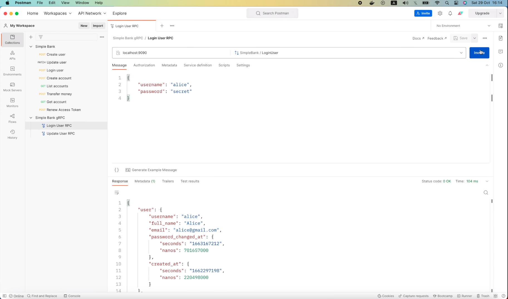

то мы увидим новую строку в логах в консоли.

```shell
make server
go run main.go
4:14PM INF db migrated successfully
4:14PM INF start gRPC server at [::]:9090
4:14PM INF start HTTP gateway server at [::]:8080
4:14PM INF INF received a gRPC request duration=97.711664 method=/pb.SimpleBank/LoginUser protocol=grpc status_code=0 status_text=OK
```

Однако, если я вернусь к Postman и попытаюсь отправить этот HTTP-запрос,


то вы увидите, что он не выводит новые сообщения в логах в консоли.

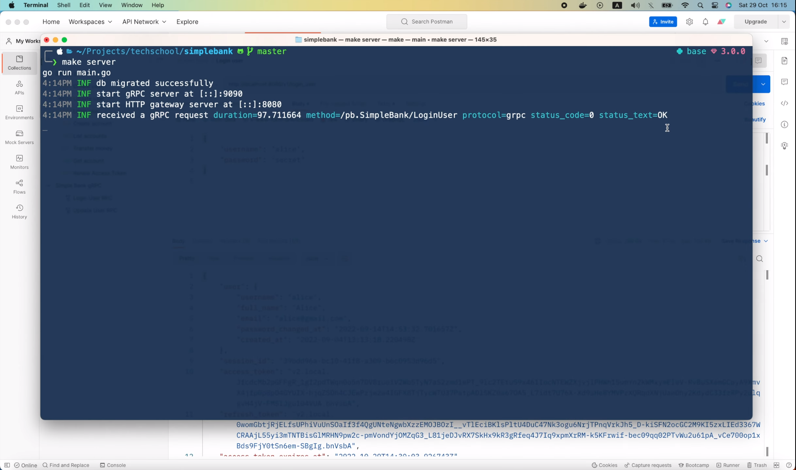

Причина заключается в том, что в коде, запускающем сервер gRPC шлюза, мы 
вызываем функцию `RegisterSimpleBankHandlerServer()`, которая выполняет
преобразование «по ходу» между HTTP и gRPC. Оно вызовет функцию-обработчик
gRPC сервера напрямую, минуя какой-либо gRPC перехватчик. Вот почему функция
для gRPC логирования не была выполнена. Поэтому для логирования 
HTTP-запросов, мы должны написать отдельное HTTP middleware и добавить его
в сервер gRPC шлюза.

## Пишем отдельное HTTP middleware для логирования

```go
func HttpLogger() {
}
```

Эта middleware функция должна принимать HTTP обработчик в качестве 
входных данных, а также возвращать другой HTTP обработчик в качестве 
выходных данных.

```go
func HttpLogger(handler http.Handler) http.Handler {
}
```

Если мы посмотрим на его реализацию, мы увидим, что `Handler` — это просто
интерфейс с одной функцией: `ServeHTTP`, которая принимает 
`ResponseWriter` и `Request` в качестве входных данных.

```go
type Handler interface {
	ServeHTTP(ResponseWriter, *Request)
}
```

Итак, в нашем коде мы должны вернуть структуру или функцию, удовлетворяющую 
интерфейсу. Весьма кстати, в пакете `http` уже существует 
тип `HandlerFunc`,

```go
type HandlerFunc func(ResponseWriter, *Request)

func (f HandlerFunc) ServeHTTP(w ResponseWriter, r *Request) {
	f(w, r)
}
```

который реализует функцию `ServeHTTP`, требуемую интерфейсом. На самом 
деле, это просто псевдоним сигнатуры функции 
`func(ResponseWriter, *Request)`, так что всё, что нам нужно сделать, 
это скопировать эту сигнатуру и вставить её в наш код вот так.

```go
func HttpLogger(handler http.Handler) http.Handler {
    return http.HandlerFunc(func(res http.ResponseWriter, req *http.Request) {
    
    })
}
```

Как видите, в качестве входных данных она принимает объекты HTTP 
`ResponseWriter` и HTTP `Request`.

Здесь мы просто осуществляем преобразование типов из анонимной функции 
в `HandlerFunc`.

Итак, HTTP middleware для логирования создан. Затем мы добавим код для 
вывода логов. Так же как мы делали для gRPC. Давайте создадим новый 
объект `logger` с помощью `log.Info()`.

```go
func HttpLogger(handler http.Handler) http.Handler {
	return http.HandlerFunc(func(res http.ResponseWriter, req *http.Request) {
		logger := log.Info()
	})
}
```

После этого я скопирую эту команду

```go
logger.Str("protocol", "grpc").
    Str("method", info.FullMethod).
    Int("status_code", int(statusCode)).
    Str("status_text", statusCode.String()).
    Dur("duration", duration).
    Msg("received a gRPC request")
```

чтобы вывести лог.

Мы хотим отобразить следующую информацию: используемый протокол, в данном 
случае он его значение равно HTTP. Затем метод запроса, мы можем получить 
его из `req.Method`. Обратите внимание, что для HTTP этот метод будет равен 
`POST`, `GET`, `DELETE` или что-то в этом роде. Он не будет содержать путь
запроса, как `FullMethod` в gRPC. Таким образом, мы должны добавить ещё одно
строковое поле в журнал, чтобы отобразить путь. Мы можем легко получить 
эту информацию из `RequestURI`.

```go
logger.Str("protocol", "http").
    Str("method", req.Method).
    Str("path", req.RequestURI)
```

Хорошо, значений следующих двух полей, кода состояния и текста, который 
расшифровывает его, у нас пока нет. Так что пока я их закомментирую.

```go
logger.Str("protocol", "http").
    Str("method", req.Method).
    Str("path", req.RequestURI).
    // Int("status_code", int(statusCode)).
    // Str("status_text", statusCode.String()).
```

Мы вернёмся к ним и добавим их позже.

Далее следует продолжительность запроса. Давайте скопируем фрагмент кода, 
который измеряет время обработки, из gRPC логгера.

```go
startTime := time.Now()
result, err := handler(ctx, req)
duration := time.Since(startTime)
```

Здесь после сохранения времени начала запроса, мы должны вызвать функцию
`handler.ServeHTTP()`, чтобы перенаправить запрос в его 
функцию-обработчик. После этого мы просто используем функцию `time.Since()`
для расчета продолжительности работы.

```go
startTime := time.Now()
handler.ServeHTTP(res, req)
duration := time.Since(startTime)
```

Итак, теперь мы добавили продолжительность работы в лог.

Давайте обновим это сообщение в логе на "received an HTTP request".

```go
func HttpLogger(handler http.Handler) http.Handler {
	return http.HandlerFunc(func(res http.ResponseWriter, req *http.Request) {
		startTime := time.Now()
		handler.ServeHTTP(res, req)
		duration := time.Since(startTime)

		logger := log.Info()

		logger.Str("protocol", "http").
			Str("method", req.Method).
			Str("path", req.RequestURI).
			// Int("status_code", int(statusCode)).
			// Str("status_text", statusCode.String()).
			Dur("duration", duration).
			Msg("received an HTTP request")
	})
}
```

И у нас готова первая версия HTTP middleware для логирования.

Теперь давайте откроем файл main.go и добавим его в gRPC сервер шлюза.

Здесь, непосредственно перед тем, как мы вызовем `http.Serve`, я передам 
этот HTTP `mux` объект в функцию `gapi.HttpLogger()`, которую мы только 
что написали. Она вернёт новый HTTP обработчик с middleware для логирования.

```go
func runGatewayServer(config util.Config, store db.Store) {
	...
	handler := gapi.HttpLogger(mux)
    err = http.Serve(listener, mux)
	...
}
```

Затем всё, что нам нужно сделать, это заменить этот `mux` новым `handler`.

```go
func runGatewayServer(config util.Config, store db.Store) {
	...
    handler := gapi.HttpLogger(mux)
    err = http.Serve(listener, handler)
	...
}
```

И на этом по сути всё!

Мы добавили HTTP middleware для логирования в сервер шлюза.

Теперь давайте откроем терминал и перезапустим сервер.

```shell
make server
go run main.go
4:19PM INF db migrated successfully
4:19PM INF start gRPC server at [::]:9090
4:19PM INF start HTTP gateway server at [::]:8080
```

Затем вернитесь в Postman и повторно отправьте этот HTTP-запрос.

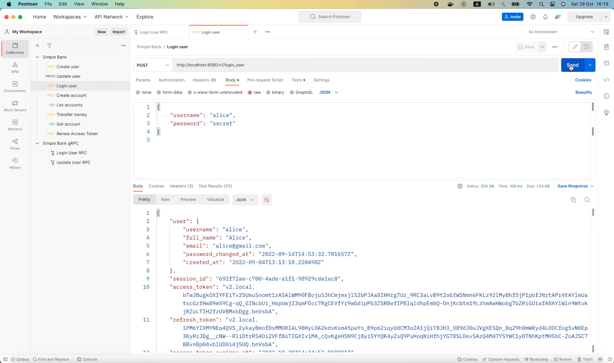

Хорошо, на этот раз в консоли появился новый HTTP лог.

```shell
make server
go run main.go
4:19PM INF db migrated successfully
4:19PM INF start gRPC server at [::]:9090
4:19PM INF start HTTP gateway server at [::]:8080
4:19PM INF received an HTTP request duration=100.365697 method=POST path=/v1/login_user protocol=http
```

В нём вы можете увидеть всю информацию о запросе, такую как 
продолжительность, метод, путь и протокол. Так что всё работает как надо!

Теперь давайте вернемся к HTTP логгеру, и я покажу вам, как добавить 
код состояния и текст, расшифровывающий его, в лог.

В отличие от gRPC перехватчика, результат и объект ошибки не возвращаются

```go
handler.ServeHTTP(res, req)
```

после обработки запроса.

У нас есть только `ResponseWriter`, который, по сути, является просто 
интерфейсом.

Итак, как мы можем отслеживать статус запроса? Что ж, нам может помочь 
тот факт, `ResponseWriter` — это интерфейс.

Как видите,


он содержит методы для записи заголовка и тела ответа, которые будут
вызываться функцией `handler`.

Поэтому если мы напишем пользовательскую реализацию интерфейса, то сможем
легко отследить, какое значение было записано в тело ответа, заголовок или 
код состояния. И именно так мы и поступим!

## Добавляем код состояния и текст, расшифровывающий его, в лог

Давайте определим новый тип - структуру с названием `ResponseRecorder`. 
Во-первых, мы встроим оригинальный `ResponseWriter` в неё.

Затем мы добавим поле для хранения кода состояния ответа.

```go
type ResponseRecorder struct {
	http.ResponseWriter
	StatusCode int
}
```

После этого нам нужно переопределить некоторые функции `ResponseWriter`.

Поскольку мы хотим отслеживать код состояния, мы должны переопределить 
функцию `WriteHeader`.

```go
WriteHeader(statusCode int)
```

Как видите, код состояния является его входным аргументом. Итак, давайте 
скопируем сигнатуру функции и в нашем файле `logger.go` я добавлю эту
функцию как метод `ResponseRecorder`. Вот так вот просто.

```go
func (rec *ResponseRecorder) WriteHeader(statusCode int) {
	
}
```

Итак, теперь мы можем легко сохранить код состояния в `ResponseRecorder`
с помощью следующей команды. Затем мы должны сделать кое-что важное: вызвать
функцию `WriteHeader` исходного `ResponseWriter`, чтобы она могла дописать
заголовок ответа за нас.

```go
func (rec *ResponseRecorder) WriteHeader(statusCode int) {
	rec.StatusCode = statusCode
	rec.ResponseWriter.WriteHeader(statusCode)
}
```

Хорошо, теперь мы должны использовать этот новый `ResponseRecorder`
при обслуживании запроса.

Здесь я создам новый объект `ResponseRecorder`, где `ResponseWriter` равен
входному параметру `res`. И мы можем также задать код состояния по 
умолчанию равным `http.StatusOK`.

```go
func HttpLogger(handler http.Handler) http.Handler {
	return http.HandlerFunc(func(res http.ResponseWriter, req *http.Request) {
		startTime := time.Now()
		rec := &ResponseRecorder{
			ResponseWriter: res,
			StatusCode:     http.StatusOK,
		}
		...
    })
}
```

Это поле с кодом состояния будет обновлено и в него будет записано 
правильное значение, когда обработчик вызовет метод `WriteHeader()`.

Хорошо, осталось только заменить этот `ResponseWriter` `res` на новый
`ResponseRecorder` в вызове функции `ServeHTTP`.

```go
handler.ServeHTTP(rec, req)
```

Итак, теперь у нас есть код состояния, хранящийся внутри `ResponseRecorder`.
Мы можем раскомментировать эту строку,

```go
// Int("status_code", int(statusCode)).
```

и изменить значение на `rec.StatusCode`.

```go
logger.Str("protocol", "http").
    Str("method", req.Method).
    Str("path", req.RequestURI).
    Int("status_code", rec.StatusCode)
```

А чтобы `status_text`, мы можем вызвать встроенную функцию 
`http.StatusText()`, преобразующую `rec.StatusCode` в понятный человеку 
текст.

```go
logger.Str("protocol", "http").
    Str("method", req.Method).
    Str("path", req.RequestURI).
    Int("status_code", rec.StatusCode).
    Str("status_text", http.StatusText(rec.StatusCode))
```

И этого должно быть достаточно!

Давайте откроем терминал и перезапустим сервер.

Теперь я повторно отправлю этот запрос для входа пользователя в систему.


Вуаля! В консоли мы видим код состояния `200` и текст, расшифровывающий его,
`OK`.

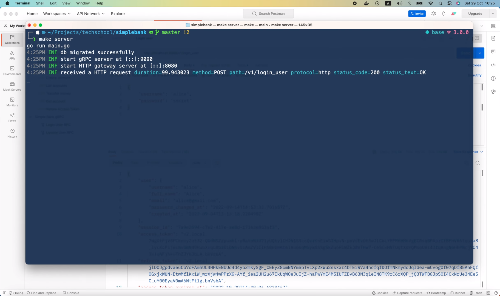

Затем я попробую войти в систему, используя неправильный пароль.

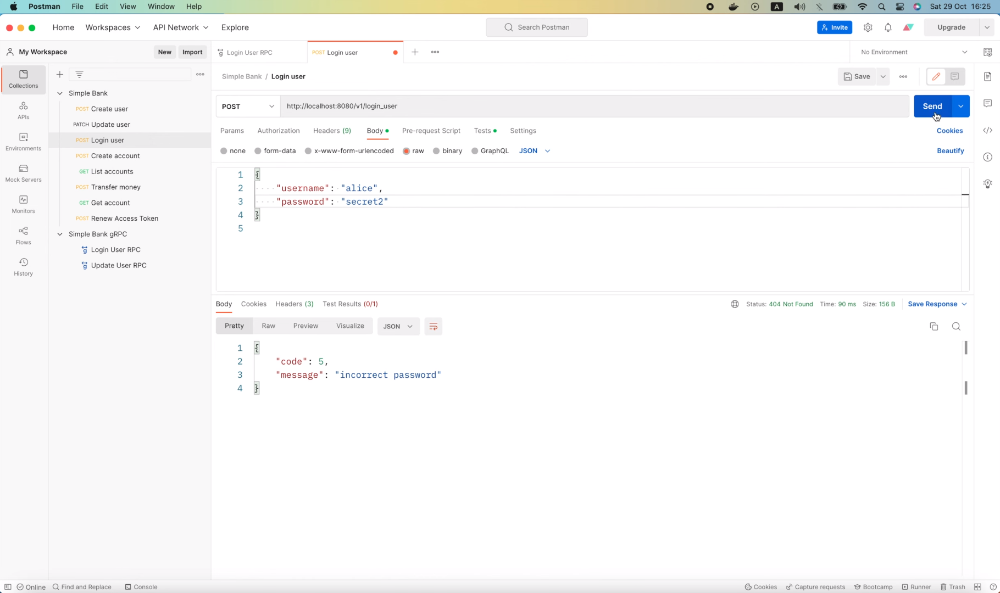

В этот раз код состояния равен `404` и текст, расшифровывающий его, "not 
found".

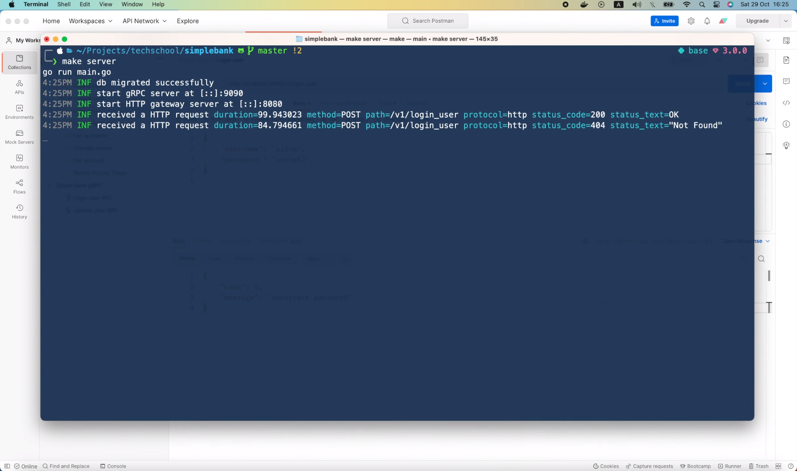

Именно так, как мы хотели.

Так что пока всё работает так как надо.

Однако, уровень важности лога по-прежнему равен `INFO`. В случае ошибки
я хотел бы, чтобы вместо этого уровень важности был равен `ERROR`, потому
что запрос не был успешно выполнен. Кроме того я бы хотел вывести более 
подробную информацию о том, почему не удалось его выполнить.

Можем ли мы это сделать? Конечно, да!

Подход очень похож на тот, который мы применяли для gRPC логгера. 
Однако, поскольку ошибка не возвращается в HTTP логгере, мы должны
судить об успешности выполнения запроса, основываясь на коде состояния 
ответа. Поэтому, если записанный код состояния не равен `http.StatusOK`,
мы меняем логгер на `log.Error()`.

```go
func HttpLogger(handler http.Handler) http.Handler {
return http.HandlerFunc(func(res http.ResponseWriter, req *http.Request) {
        ...
        logger := log.Info()
        if rec.StatusCode != http.StatusOK {
            logger = log.Error()
        }
        ...
	})
}
```

Подробная информация о том, почему не удалось выполнить запрос, находится
внутри тела ответа, поэтому мы можем записать его и вывести в логе в 
случае сбоя.

Давайте добавим поле `Body` типа `[]byte` в `ResponseRecorder`.

```go
type ResponseRecorder struct {
	http.ResponseWriter
	StatusCode int
	Body       []byte
}
```

Затем, как и раньше, мы переопределим метод `Write()`,

```go
type ResponseWriter interface {
	...
    Write([]byte) (int, error)
	...
}
```

поскольку этот метод будет вызываться обработчиком всякий раз, когда он 
хочет задать тело ответа.

На этот раз мы сохраним входной аргумент `body` в поле `Body` 
`ResponseRecorder`. И, наконец, вызовем исходный метод 
`ResponseWriter.Write(body)` и вернём его результат.

```go
func (rec *ResponseRecorder) Write(body []byte) (int, error) {
	rec.Body = body
	return rec.ResponseWriter.Write(body)
}
```

Теперь вернемся к `HttpLogger`. В случае, если запрос не будет успешно 
выполнен, мы вызовем по цепочке метод `Bytes()` логгера, чтобы вывести 
записанное тело ответа.

```go
func HttpLogger(handler http.Handler) http.Handler {
return http.HandlerFunc(func(res http.ResponseWriter, req *http.Request) {
        ...
        logger := log.Info()
        if rec.StatusCode != http.StatusOK {
            logger = log.Error().Bytes("body", rec.Body)
        }
        ...
	})
}
```

И на этом всё.

Давайте перезапустим сервер и протестируем его!

```shell
make server
```

Я повторно отправлю этот запрос на вход в систему с неправильным паролем.

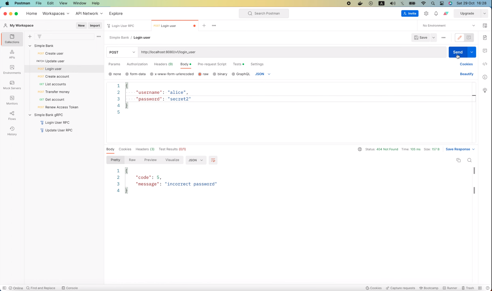

И вуаля!

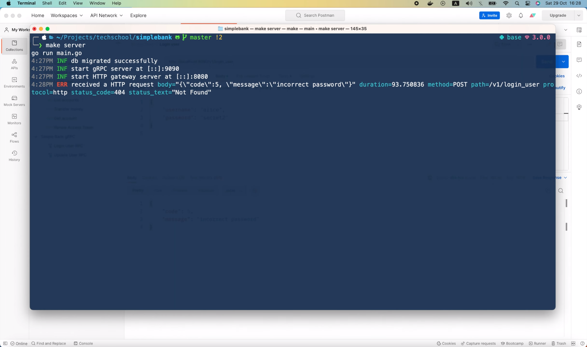

На этот раз уровень важности лога был изменён на `ERROR`, код состояния 
равен `404 Not Found`, как и ожидалось. А также было выведено тело ответа с
более детально описывающее ошибку: "incorrect password" («неправильный 
пароль»). Превосходно!

Если мы повторно отправим запрос с правильным паролем,

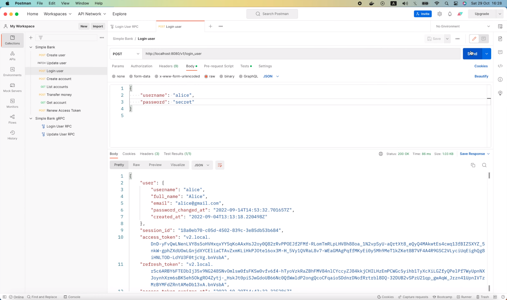

то уровень важности лога будет как обычно `INFO` и тело ответа не 
запишется в лог.

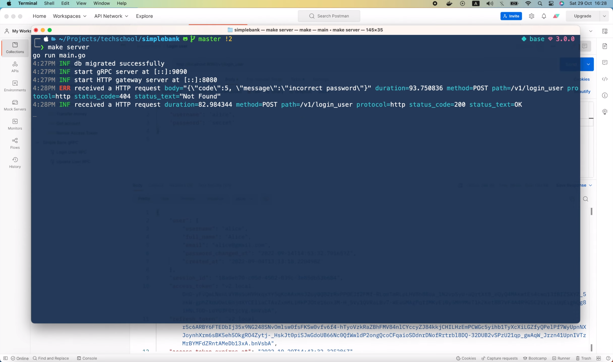

Итак, теперь мы успешно добавили логирование для HTTP и gRPC API.

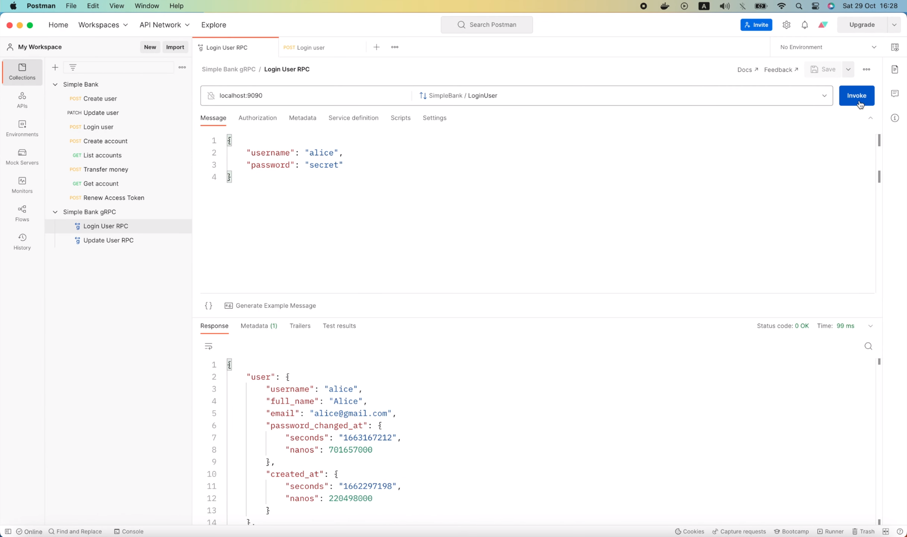

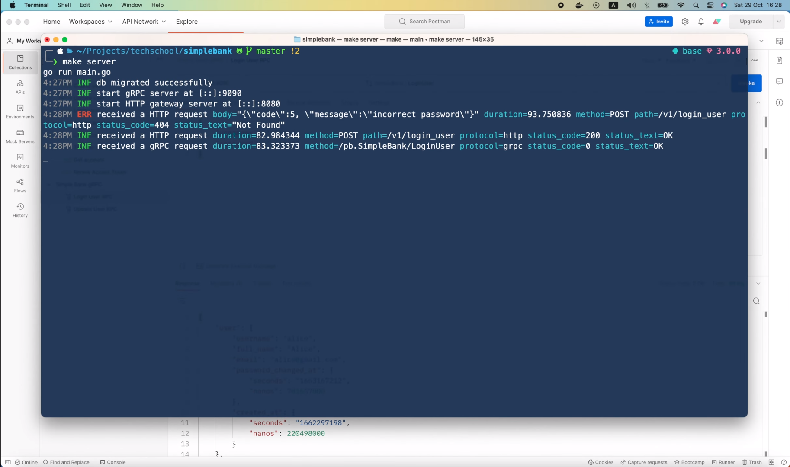

Надеюсь было интересно и приобретенные знания будут вам полезны.

В следующей лекции мы перейдем к более сложной, но тоже очень важной 
теме: запуску фоновых заданий, используя асинхронные воркеры.

А пока, желаю Вам получать удовольствие от обучения и до скорой встречи!
