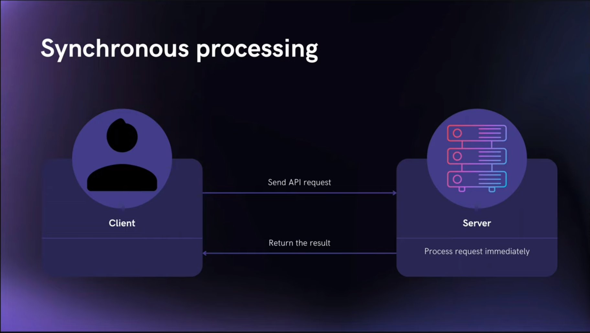
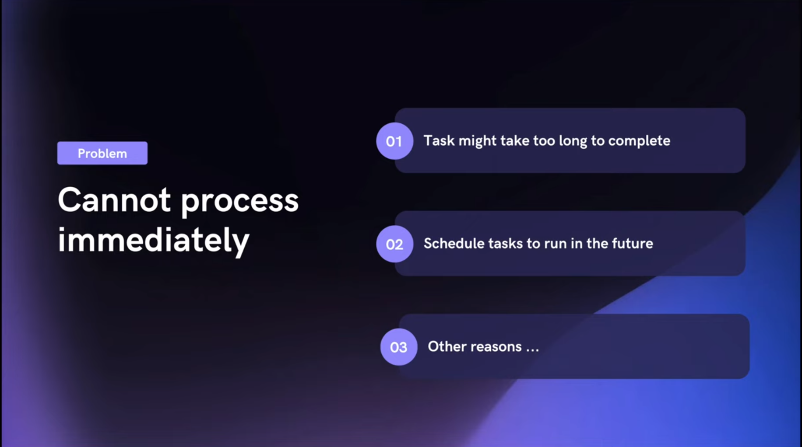
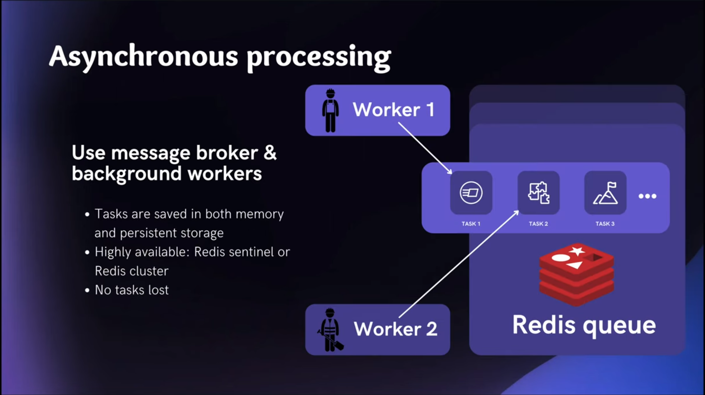
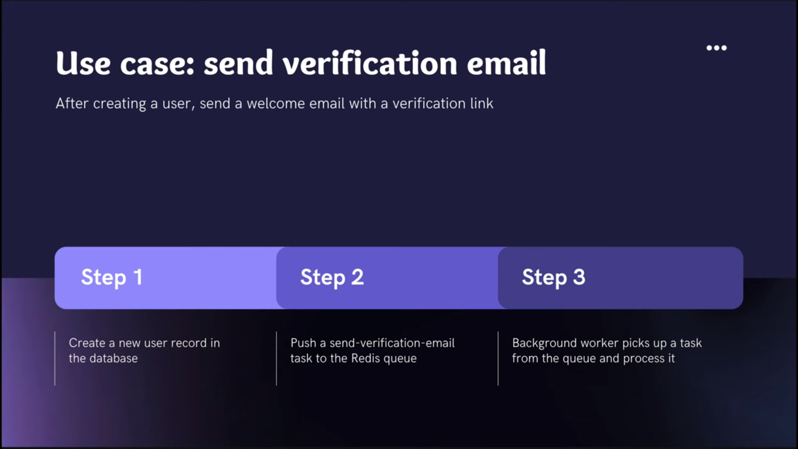
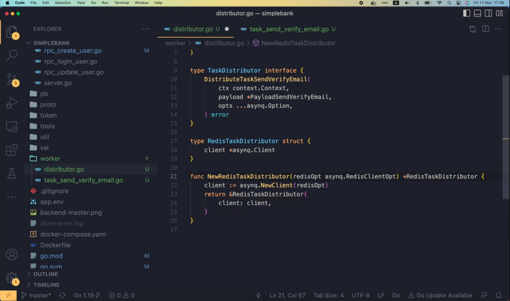
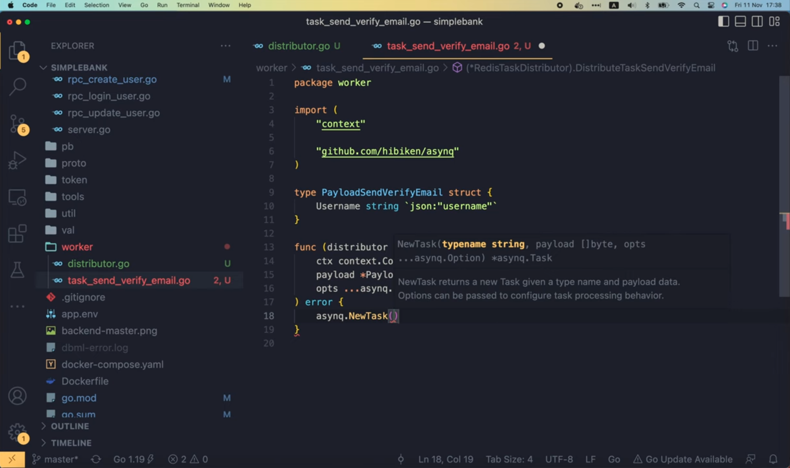
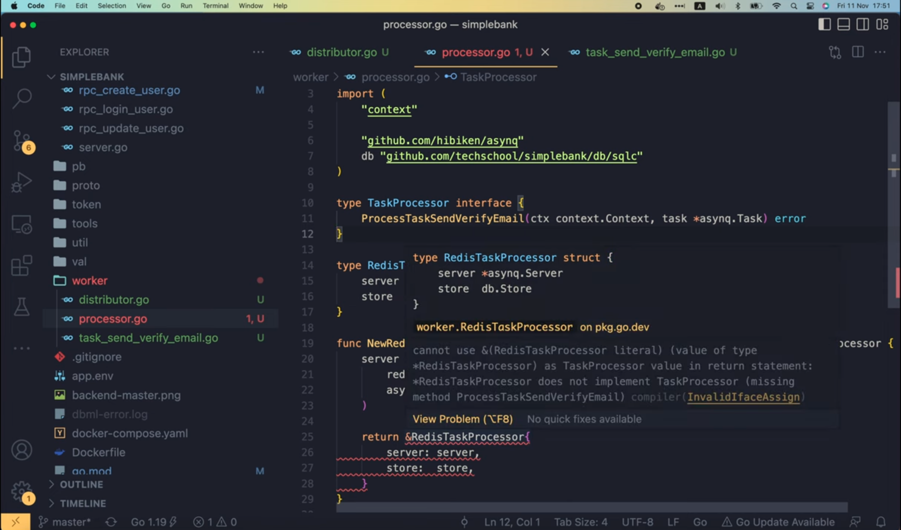

# Implement background worker in Go with Redis and asynq

[Original video](https://www.youtube.com/watch?v=XOXdYs8mKkI)

Hello everyone, welcome to the backend master class. So far we've 
implemented a lot of APIs for our simple bank project. However, they're 
all synchronous APIs, this means when the client sends a request to the
server, that request will be processed immediately by the server, and the
result will be returned to the client synchronously.



Although it works for most cases, in real-world project, sometimes we cannot
process the request immediately, maybe because it might take a long time
to complete, and we don't want to force the client to wait. Or maybe it's 
something we just want to schedule to be executed in the future.



Whatever the reason is, one thing for sure is, we will need a mechanism to
process some kind of task asynchronously.

One possible solution is simply using Go routines to process the task in
the background. 


It's very easy to implement, but the drawback of this strategy is, the 
tasks basically live inside the process's memory, so if the server suddenly
goes down, then all of the unprocessed tasks will be lost.

A better design would be sending the tasks to a queue of a message broker,
then having a set of background workers keep polling thw queue to get the
tasks and process them. One very popular and efficient message broker is 
Redis. Redis stores its data both in memory and persistent storage, and
when running on production with Redis sentinel or Redis cluster, we can be
confident that our message broker is highly available, and the tasks we send
to the queue won't be lost.



OK, today we're gonna implement this asynchronous worker for 1 specific use
case: send validation email.



The idea is, after creating a user, we will send a welcome email to the 
user with a verification link. This will allow users to confirm that they
really own the provided email address.

There are 3 steps: first, create a user record in the database, second, push
a new send-email task to the Redis queue, and finally launch the background
workers to pick up the task from the queue and process it.

Alright, let's start!

In the `gapi` package, let's open the `rpc_create_user.go` file. Here we 
can find the implementation of the CreateUser API that we've written in 
lecture 42. And in the request, there's a field to allow user to specify 
their email address. So after calling the store to create a new user record
in the DB, we will send a verification email to the user here.

```go
	user, err := server.store.CreateUser(ctx, arg)
	if err != nil {
		if pqErr, ok := err.(*pq.Error); ok {
			switch pqErr.Code.Name() {
			case "unique_violation":
				return nil, status.Errorf(codes.AlreadyExists, "username already exists: %s", err)
			}
		}
		return nil, status.Errorf(codes.Internal, "failed to create user: %s", err)
	}

	// Send verify email to user
    rsp := &pb.CreateUserResponse{
        User: convertUser(user),
    }
```

And to do it asynchronously, we're gonna use an open source package called
[asynq](https://github.com/hibiken/asynq). It is a simple, reliable and 
efficient distributed task queue library, which enable us to enqueue and 
process task asynchronously using background workers. It is backed by Redis,
and is designed to be easily scalable. This is a high level overview of how
Asynq works:


First, the client put tasks on a Redis queue. We can define multiple queues
with different priorities. Then, the server will pull tasks from the
queues and start a worker go routine to process each task. Therefore, the 
tasks are process concurrently by multiple workers. This design allows us to
easily horizontal scale the number of worker servers whenever needed. Asynq
also provides a lot of features that we often need when developing an 
asynchronous task processing system, such as: guaranteed at least one 
execution of a task, scheduling a task, retries of failed task, weighted 
priority queues, deduplication of tasks, set timeout and deadline for each
task, support Redis cluster and Redis sentinels for high availability, and
many other useful features that you can explore on your own. Note that this
library is still under heavy development, and it hasn't reached version 1 
release yet, so you should be prepared for some breaking API changes. 
However, with almost 5K GitHub stars, you can be confident that this is a
very good library to use in your project.

OK, now I'm gonna install the package by running this `go get` command
in the terminal

```shell
go get -u github.com/hibiken/asynq
```

After it is installed, its name will show up in the indirect requirement 
list of the `go.mod` file 

```
github.com/hashicorp/hcl v1.0.0 // indirect
github.com/hibiken/asynq v0.23.0 // indirect
github.com/json-iterator/go v1.1.12 // indirect
```

It's indirect because we're not using it in our code yet.

So let's create a new package called `worker` at the root of our project.
And in this package, I'm gonna create a new file: `distributor.go`. This
file will contain the codes to create tasks and distribute them to the
workers via Redis queue.

To make the code more generic and easier to mock and test, I'm gonna define
a `TaskDistributor` interface.

```go
type TaskDistributor interface {
}
```

Then we will write a separate RedisTaskDistributor struct that implements 
the interface.

```go
type RedisTaskDistributor struct {
	
}
```

This is similar to what we've done in the database layer, where we have
a generic `Store` interface, and a `SQLStore` struct that implements the 
interface. Using interface allows us to mock its functionality for unit
testing.

```go
type Store interface {
	Querier
	TransferTx(ctx context.Context, arg TransferTxParams) (TransferTxResult, error)
}

type SQLStore struct {
	db *sql.DB
	*Queries
}
```

OK, back to the `RedisTaskDistributor`. First I'm gonna add an 
`asynq.Client` object as one of its inner field.

```go
type RedisTaskDistributor struct {
	client *asynq.Client
}
```

We will use this client later to send the task to Redis queue.

Now as the `asynq` package is imported, if we run "go mod tidy" in the
terminal, and check the `go.mod` file, we will see that `asynq` has been
moved to the list of direct dependencies.

```
github.com/grpc-ecosystem/grpc-gateway/v2 v2.10.0
github.com/hibiken/asynq v0.23.0
github.com/lib/pq v1.10.5
```

Next, let's add a function to create a new `RedisTaskDistributor`. It will
take a Redis client option object as input argument, and will return a
`TaskDistributor` interface as output.

```go
func NewRedisTaskDistributor(redisOpt asynq.RedisClientOpt) TaskDistributor {
}
```

I'll explain why we return an interface here in a moment. In this function,
first we will create a new client by calling `asynq.NewClient()`, and pass
in the Redis option. Then, we return a pointer to a `RedisTaskDistributor`
object, whose `client` field is the one we've just created above. Now, as 
you can see, we're returning a specific object, while in the function 
definition, the return data type is an interface. The reason we're doing
this is, we're forcing the `RedisTaskDistributor` to implement the
`TaskDistributor` interface. If it doesn't implement all required functions
of the interface, the compiler will complain.

```go
func NewRedisTaskDistributor(redisOpt asynq.RedisClientOpt) TaskDistributor {
	client := asynq.NewClient(redisOpt)
	return &RedisTaskDistributor{
		client: client,
	}
}
```

Alright, now I'm gonna create a new file for the task "Send Verify Email" 
(`task_send_verify_email.go`). In this file, let's define a 
`PayloadSendVerifyEmail` struct.

```go
type PayloadSendVerifyEmail struct {
}
```

This struct will contain all data of the task that we want to store in Redis,
and later, the worker will be able to retrieve it from the queue. In this 
case, we should store the `Username` of the user we want to send the email 
to. In fact, just the `Username` is enough for the worker to retrieve all 
information of the user from the database. But you can always add more 
fields to this struct if you want.

```go
type PayloadSendVerifyEmail struct {
	Username string `json:"username"`
}
```

Now let's go back to the `TaskDistributor` interface. I'm gonna add a new
method called `DistributeTaskSendVerifyEmail`. It will have 3 input 
arguments: a context object, a `PayloadSendVerifyEmail`, and some `asynq` 
options. And it will return an `error` object as output.

```go
type TaskDistributor interface {
	DistributeTaskSendVerifyEmail(
		ctx context.Context,
		payload *PayloadSendVerifyEmail,
		opts ...asynq.Option,
	) error
}
```

As soon as we define this new method of the interface, you can see some
red lines in the return `RedisTaskDistributor` statement.


If we change the return type of this function to `RedisTaskDistributor`, 
then the error will be gone.



But that also means we're not taking advantages of the automatic type 
checking feature of the Go compiler. So I'm gonna change it back to 
`TaskDistributor` interface. This way, we will know immediately that
we will have to add the missing method to the struct. And that's exactly
what I'm gonna do now. Let's copy this method's signature, and paste it to
the `task_send_verify_email.go` file. Then, let's add a receiver in front
of this function to make it a method of the `RedisTaskDistributor` struct.

```go
func (distributor *RedisTaskDistributor) DistributeTaskSendVerifyEmail(
	ctx context.Context,
	payload *PayloadSendVerifyEmail,
	opts ...asynq.Option,
) error {
	
}
```

OK, so now, if we go back to the `distributor.go` file, we will see that
the red lines are gone, which means, the `RedisTaskDistributor` has 
implemented all required methods of the interface.

Alright, next, let's see how we can create a new task and send it to a
Redis queue.

First, I'm gonna call `asynq.NewTask()` to create a new task. This method
requires some input argument, such as a `typename` `string`, a `payload` of 
type `[]byte` slice, and some `asynq` options.



So let's declare a constant for the `typename`. I'm gonna call it 
`TaskSendVerifyEmail`. This constant is very important because it's a way
for `asynq` to recognize what kind of task it is distributing or processing.

```go
const TaskSendVerifyEmail ="task:send_verify_email"
```

Now we can pass the `TaskSendVerifyEmail` constant into the `NewTask` 
function. The next argument is gonna be a `[]byte` slice payload. Since 
our payload is an object, we will have to serialize it into JSON. To do so,
let's use the `Marshal` function of the `json` package. This function 
will return 2 output values: 1 for the `jsonPayload` slice, and 1 for the 
error. If error is not `nil` we will wrap it with this message: "failed to
marshal task payload" and return the wrapped error to the caller of the
`DistributeTaskSendVerifyEmail` function. Otherwise, we can simply pass 
the `jsonPayload` into the `NewTask` function. Beside these 2 arguments, 
we can also pass in some `asynq` options, which will allow us to control 
how the task distributed, run or retried. But let's save it for later. For
now, we can simply pass in the input options that we receive from the 
caller. Then let's save the output of this `NewTask` function in an object
named `task`.

```go
func (distributor *RedisTaskDistributor) DistributeTaskSendVerifyEmail(
	ctx context.Context,
	payload *PayloadSendVerifyEmail,
	opts ...asynq.Option,
) error {
	jsonPayload, err := json.Marshal(payload)
	if err != nil {
		return fmt.Errorf("failed to marshal task payload: %w", err)
	}

    task := asynq.NewTask(TaskSendVerifyEmail, jsonPayload, opts...)
}
```

Now we can send this `task` to a Redis queue. It's pretty simple, just use
the `distributor.client.EnqueueContext()` function and pass in the input
context and the created task. There's also an optional parameter for the 
`asynq` options, but there's no need to add more here, because we've already
added them when creating the task before. The `Enqueue` function will 
return 2 outputs: a task info and an error. If error is not `nil`, we also 
wrap and return it with this message: "failed to enqueue task". Otherwise,
let's write a simple info log here saying "enqueued task". We can also add
more information about the task to the log, such as the type of the task,
its payload data, the name of the queue it was sent to, and the maximum 
number of retries in case of failure. Finally, we return `nil`, which means
no error, at the end of the function.

```go
func (distributor *RedisTaskDistributor) DistributeTaskSendVerifyEmail(
	ctx context.Context,
	payload *PayloadSendVerifyEmail,
	opts ...asynq.Option,
) error {
    ...

	task := asynq.NewTask(TaskSendVerifyEmail, jsonPayload, opts...)
	info, err := distributor.client.EnqueueContext(ctx, task)
	if err != nil {
		return fmt.Errorf("failed to enqueue task: %w", err)
	}
	
	log.Info().Str("type", task.Type()).Bytes("payload", task.Payload()).
		Str("queue", info.Queue).Int("max_retry", info.MaxRetry).Msg("enqueued task")
	return nil
}
```

And that's it!

We've done with the task creation and distribution. Next, let's learn how
to implement the task processor.

It will pick up the tasks from the Redis queue and process them.

In `processor.go` file, I'm gonna define a TaskProcessor interface. Then 
the `RedisTaskProcessor` struct will implement that interface, just like 
how we did for the task distributor. But this time, the `RedisTaskProcessor`
must contain an `asynq.Server` object as one of its field. And when 
processing the task, it will need to access the database, so I'm gonna add
one more field for the `db.Store` to this struct as well.

```go
type TaskProcessor interface {
}

type RedisTaskProcessor struct {
	server *asynq.Server
	store  db.Store
}
```

Now let's write a function to create a new `RedisTaskProcessor`, which 
takes 2 input arguments: the first one is a Redis client option to connect
to Redis, and the second one is a `db.Store` interface. This function will
return a TaskProcessor interface, so we will have free type checking from 
the Go's compiler.

```go
func NewRedisTaskProcessor(redisOpt asynq.RedisClientOpt, store db.Store) TaskProcessor {
	
}
```

Inside this function, let's create a new `asynq` server. We must provide 
the Redis client option and an `asynq.Config{}` object as input. This 
config object allow us to control many different parameters of the `asynq`
server, for example, the maximum number of concurrent processing of tasks,

```go
// Maximum number of concurrent processing of tasks.
//
// If set to a zero or negative value, NewServer will overwrite the value
// to the number of CPUs usable by the current process.
Concurrency int
```

the retry delay for a failed task,

```go
// Function to calculate retry delay for a failed task.
//
// By default, it uses exponential backoff algorithm to calculate the delay.
RetryDelayFunc RetryDelayFunc
```

a predicate function to determine whether the error returned from the 
handler is a failure,

```go
// Predicate function to determine whether the error returned from Handler is a failure.
// If the function returns false, Server will not increment the retried counter for the task,
// and Server won't record the queue stats (processed and failed stats) to avoid skewing the error
// rate of the queue.
//
// By default, if the given error is non-nil the function returns true.
IsFailure func(error) bool
```

a map of task queues together with their priority values

```go
// List of queues to process with given priority value. Keys are the names of the
// queues and values are associated priority value.
//
// If set to nil or not specified, the server will process only the "default" queue.
//
// Priority is treated as follows to avoid starving low priority queues.
//
// Example:
//
//     Queues: map[string]int{
//         "critical": 6,
//         "default":  3,
//         "low":      1,
//     }
//
// With the above config and given that all queues are not empty, the tasks
// in "critical", "default", "low" should be processed 60%, 30%, 10% of
// the time respectively.
//
// If a queue has a zero or negative priority value, the queue will be ignored.
Queues map[string]int
```

and many other parameters.

We will gradually learn how to use some of those. For now, just keep it 
simple by leaving this config empty, which means, we're gonna use asynq's
predefined default configurations.

OK, let's return a pointer to a new `RedisTaskProcessor` object here, 
whose server field is the server object we've just created, and store 
field is the input store parameter of this function.

```go
func NewRedisTaskProcessor(redisOpt asynq.RedisClientOpt, store db.Store) TaskProcessor {
	server := asynq.NewServer(
		redisOpt,
		asynq.Config{},
	)

	return &RedisTaskProcessor{
		server: server,
		store: store,
	}
}
```

Next, I'm gonna add a function to process the task send verify email to 
the interface.

It must follow asynq's task handler function signature, so it must take a
context, and an `asynq.Task` object as input, and it must return an error
object as output.

```go

```

Alright, now there's some red lines under the return `RedisTaskProcessor`
statement, 



that's because it does not implement the new method we've just added to the
interface yet.

So let's do that now!

I'm gonna copy this function signature,

```go
ProcessTaskSendVerifyEmail(ctx context.Context, task *asynq.Task) error
```

and paste it to the end of the `task_send_verify_email.go` file. I organize 
the code this way to make it easier to read, because both the function to 
distribute and process the task are in the same place.

OK, this time, the function receiver we must add should be of type
`RedisTaskProcessor`. `Asynq` has already taken care of the core part,
which is pulling the task from Redis, and feed it to the background worker
to process it via the task parameter of this handler function.

```go
func (processor RedisTaskProcessor) ProcessTaskSendVerifyEmail(ctx context.Context, task *asynq.Task) error {
	
}
```

So now, we need to parse the task to get its payload. I'm gonna define a 
variable to store this `PayloadSendVerifyEmail`. We will call the 
`json.Unmarshal()` function with input `task.Payload()`, and the address
of the payload variable we declared above. This function might return an
error, so if error is not `nil`, we simply return an error with this 
message: "failed to unmarshal payload". If task payload is not unmarshallable
there's no point of retrying it, and we can tell `asynq` about that by
wrapping the `asynq.SkipRetry` error here.

```go
func (processor RedisTaskProcessor) ProcessTaskSendVerifyEmail(ctx context.Context, task *asynq.Task) error {
	var payload PayloadSendVerifyEmail
	if err := json.Unmarshal(task.Payload(), &payload); err != nil {
		return fmt.Errorf("failed to unmarshal payload: %w", asynq.SkipRetry)
	}
}
```

If there's no error, and the payload is successfully parsed, we can go 
ahead and retrieve the `User` record from the database by calling 
`processor.store.GetUser()` with the input context and `payload.Username`.
It will return a user and an error. If error is not `nil`, there can be
2 different scenarios. If the error is `sql.ErrNoRows`, then it means 
the user doesn't exist. In this case, there's no need to retry, so we also
wrap the `SkipRetry` inside the return error like we did above. In other 
case, it might be some internal error with the db, so it's retryable. 
Therefore, we simply wrap the original error with a message "failed to 
get user" before returning it.

```go
func (processor RedisTaskProcessor) ProcessTaskSendVerifyEmail(ctx context.Context, task *asynq.Task) error {
	...
	user, err := processor.store.GetUser(ctx, payload.Username)
	if err != nil {
		if err == sql.ErrNoRows {
			return fmt.Errorf("user doen't exist: %w", asynq.SkipRetry)
		}
        return fmt.Errorf("failed to get user: %w", err)
	}
}
```

If no error occurs, then it's time to send the email to the user here.

```go
func (processor RedisTaskProcessor) ProcessTaskSendVerifyEmail(ctx context.Context, task *asynq.Task) error {
	...
	user, err := processor.store.GetUser(ctx, payload.Username)
	if err != nil {
		if err == sql.ErrNoRows {
			return fmt.Errorf("user doen't exist: %w", asynq.SkipRetry)
		}
        return fmt.Errorf("failed to get user: %w", err)
	}
	
	// TODO: send email to user
}
```

I'm not gonna really do it now, because it's not the main focus of this
video. We will learn about sending real emails in another lecture. For now,
let's just write a simple log here saying "processed task". And let's add
some more info about the task as well, for example, the type and payload
of the task, and also the email address of the user we're sending email 
to. Finally, we return `nil` at the end of the function to tell `asynq` 
that the task has been processed successfully.

```go
func (processor RedisTaskProcessor) ProcessTaskSendVerifyEmail(ctx context.Context, task *asynq.Task) error {
    ...
	// TODO: send email to user
	log.Info().Str("type", task.Type()).Bytes("payload", task.Payload()).
		Str("email", user.Email).Msg("processed task")
	return nil
}
```

OK, so that's how we implement the task handler function. Now, one very
important step we must do is, to register that task with the `asynq.Server`
inside the `RedisTaskProcessor`. That's how we tell `asynq` the task should
be run by which handler function. I'm gonna add a `Start()` function to the
`TaskProcessor` interface.

```go
type TaskProcessor interface {
	Start() error
	ProcessTaskSendVerifyEmail(ctx context.Context, task *asynq.Task) error
}
```

We will register the task in this function before starting the 
`asynq.Server`. The `RedisTaskProcessor` must implement this new function,
so let's copy it here, and add the processor receiver.

```go
func (processor *RedisTaskProcessor) Start() error {
	
}
```

Alright, inside this function, I'm gonna call `asynq.NewServerMux()`
function to create a new mux. You can see that, `asynq` design is pretty
similar to that of the HTTP server. We can use this mux to register each 
task with its handler function, just like how we use the HTTP mux to 
register each route with its corresponding HTTP handler function. In 
this case, we call `mux.HandleFunc()`, and pass in a pattern of the task,
which is the `TaskSendVerifyEmail` constant we defined before. Then, the
handler function of that task should be 
`processor.ProcessTaskSendVerifyEmail()`. It's the function we've just
written a moment ago. If you have more tasks in the future, make sure
to go back here and register them.

```go
func (processor *RedisTaskProcessor) Start() error {
	mux := asynq.NewServeMux()
	
	mux.HandleFunc(TaskSendVerifyEmail, processor.ProcessTaskSendVerifyEmail)
}
```

Sometimes I forgot to do this, and I just waited but the task never ran.
Alright, the final step is to call `processor.server.Start()`, then pass in
the mux object as its only input argument. And return the output error to 
the caller of this function.

```go
func (processor *RedisTaskProcessor) Start() error {
	mux := asynq.NewServeMux()

	mux.HandleFunc(TaskSendVerifyEmail, processor.ProcessTaskSendVerifyEmail)
	
	return processor.server.Start(mux)
}
```

So, now we've successfully implemented both the task distributor and 
task processor. We haven't integrated them into our `CreateUser` API yet, 
but since this video is already long, I'll save it for the next lecture.

In the meantime, you might try to do it by yourself to see how it goes.
We'll do it together in the next video.

I hope you have learned something useful and interesting in this lecture.
Thanks a lot for watching, happy learning, and see you in the next one.