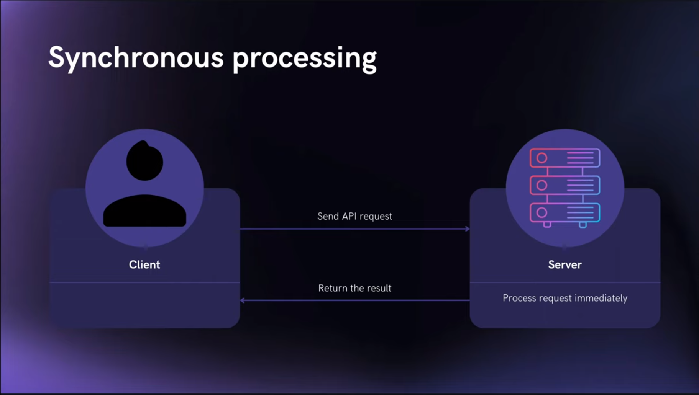
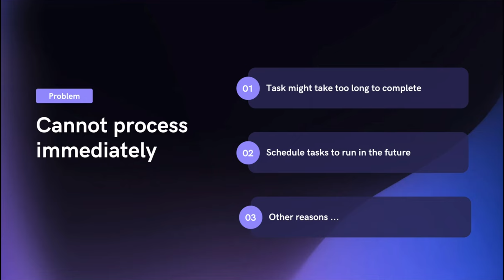
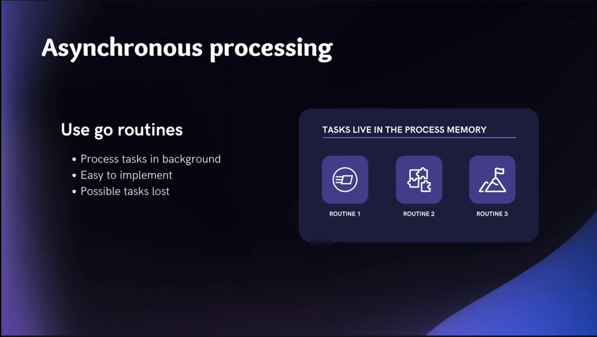
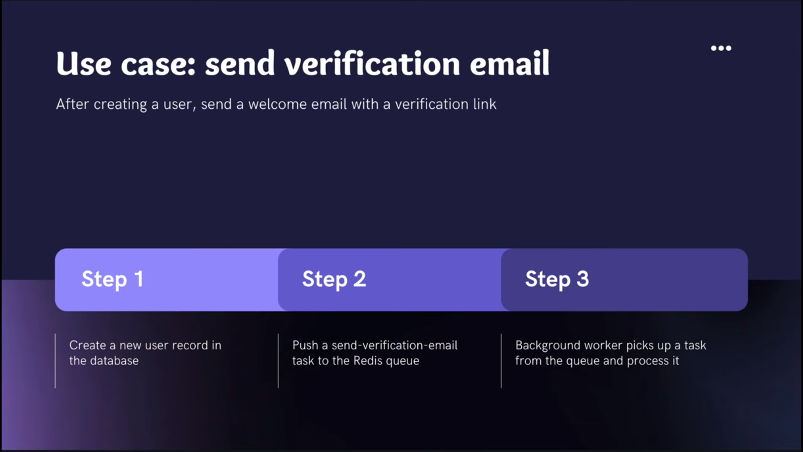
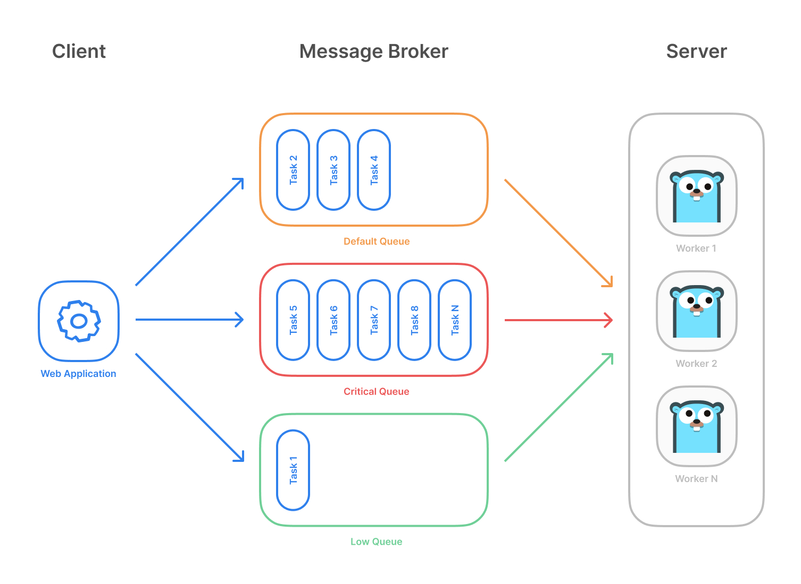
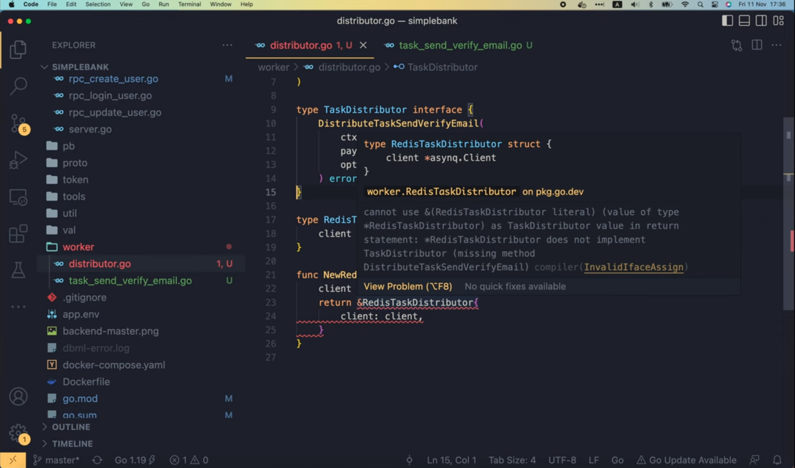
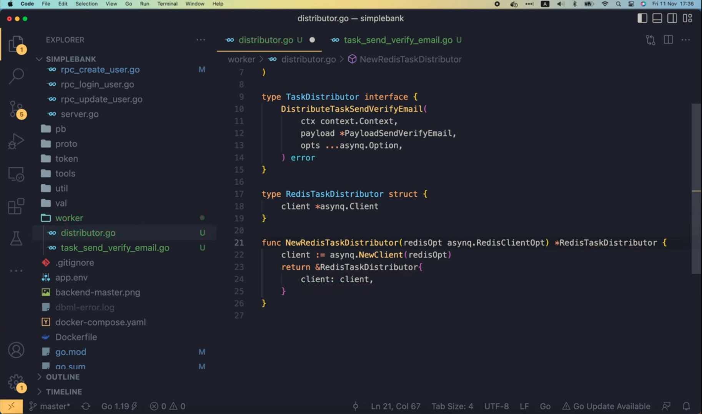
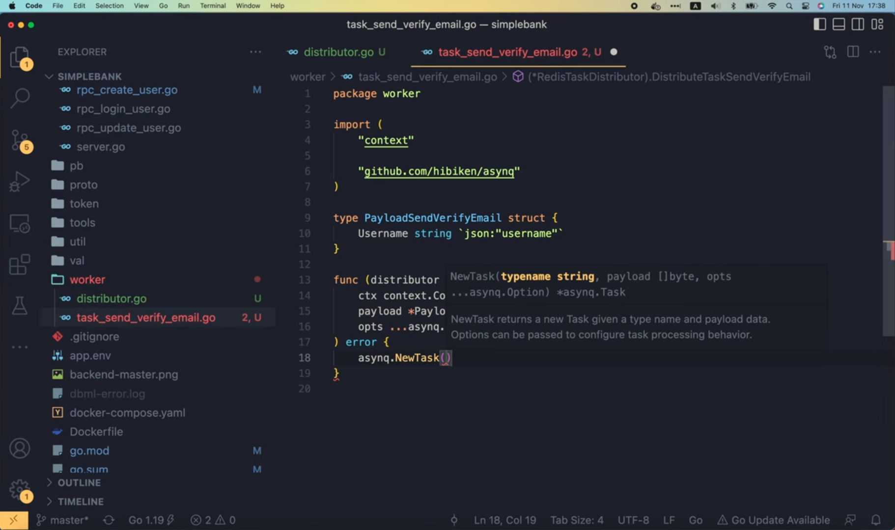
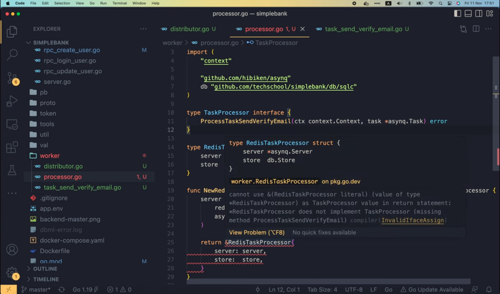

# Реализация фонового воркера в in Go с помощью Redis и asynq

[Оригинал](https://www.youtube.com/watch?v=XOXdYs8mKkI)

Всем привет, рад вас снова видеть на мастер-классе по бэкенду. На данный 
момент мы реализовали множество API для нашего простого банковского
проекта. Однако все они являются синхронными API, это означает, что когда 
клиент отправляет запрос на сервер, этот запрос будет немедленно обработан 
сервером, а результат будет возвращен клиенту синхронно.



Хотя в большинстве случаев этого должно быть достаточно, в реальном 
проекте иногда мы не можем обработать запрос немедленно, возможно, потому, 
что это может занять много времени, и мы не хотим заставлять клиента ждать.
Или, возможно, мы просто хотим запланировать обработку запроса в будущем.



Какой бы ни была причина, одно можно сказать наверняка: нам понадобится 
механизм для асинхронной обработки какой-либо задачи.

## Использование горутин

Одним из возможных решений является простое использование горутин 
для обработки задачи в фоновом режиме.



Его очень легко реализовать, но недостатком этого подхода является то, что 
задачи по сути живут в памяти процесса, таким образом, если сервер внезапно
выйдет из строя, все необработанные задачи будут потеряны.

## Использование брокера сообщений и фоновых воркеров

Лучшим решением будет отправка задач в очередь брокера сообщений, а также 
наличие набора фоновых воркеров, постоянно опрашивающих очередь для
извлечения задач и их обработки. Одним из очень популярных и эффективных 
брокеров сообщений является Redis. Redis хранит свои данные как в 
памяти, так и в постоянном хранилище, и при работе в продакшене с 
Redis Sentinel или Redis кластером мы можем быть уверены, что наш 
брокер сообщений высокодоступен, а задачи, которые мы отправляем в 
очередь, не будут потеряны.


Итак, сегодня мы реализуем такой асинхронный воркера для одного конкретного 
случая использования: отправки письма для подтверждения адреса электронной
почты.



Идея заключается в том, что после создания пользователя мы отправим ему
письмо с приветствием и ссылкой для подтверждения адреса электронной
почты. Это позволит пользователям подтвердить, что действительно им
принадлежит указанный адрес электронной почты.

Реализацию можно разбить на три этапа: во-первых, создать запись о 
пользователе в базе данных, во-вторых, добавить новую задачу отправки письма
в очередь Redis и, наконец, запустить фоновые воркеры, чтобы извлечь
задачу из очереди и обработать её.

Хорошо, давайте начнём!

В пакете `gapi` откроем файл `rpc_create_user.go`. Здесь находится
реализацию `CreateUser` API, которую мы написали в лекции 42. И в запросе 
есть поле, позволяющее пользователю указать свой адрес электронной почты.
Поэтому сразу после использования хранилища для создания новой записи 
пользователя в БД, мы отправим пользователю письмо для подтверждения адреса
электронной почты.

```go
	user, err := server.store.CreateUser(ctx, arg)
	if err != nil {
		if pqErr, ok := err.(*pq.Error); ok {
			switch pqErr.Code.Name() {
			case "unique_violation":
				return nil, status.Errorf(codes.AlreadyExists, "username already exists: %s", err)
			}
		}
		return nil, status.Errorf(codes.Internal, "failed to create user: %s", err)
	}

	// Отправляем пользователю письмо для подтверждения адреса электронной почты
    rsp := &pb.CreateUserResponse{
        User: convertUser(user),
    }
```

И чтобы сделать это асинхронно, мы будем использовать пакет с открытым 
исходным кодом под названием [asynq](https://github.com/hibiken/asynq).
Это простая, надежная и эффективная распределенная библиотека очередей 
задач, которая позволяет нам ставить в очередь и обрабатывать задачи 
асинхронно, используя фоновые воркеры. Она поддерживается Redis и легко 
масштабируется. На рисунке показан обобщённый обзор того как работает
Asynq:



Сначала клиент отправляет задачи в очередь Redis. Мы можем определить 
несколько очередей с разными приоритетами. Затем сервер будет извлекать 
задачи из очередей и запускать воркер в горутине для обработки каждой 
задачи. Таким образом задачи обрабатываются конкурентно несколькими 
воркерами. Такой подход позволяет нам легко горизонтально масштабировать 
количество серверов с воркерами, когда это необходимо. Asynq также 
предоставляет множество функций, часто нам необходимых при разработке 
системы асинхронной обработки задач, таких как: гарантированное выполнение 
задачи минимум один раз, планирование задач, повторная попытка выполнения
задач, завершившихся со сбоем, очереди с взвешенным приоритетом, устранение
дубликатов задач, задание таймаутов и дедлайнов для каждой задачи, поддержка
Redis кластера и Redis Sentinels для обеспечения высокой доступности, а 
также множество других полезных функций, которые вы можете изучить 
самостоятельно. Обратите внимание, что эта библиотека все еще находится в 
стадии интенсивной разработки и еще не достигла версии 1, поэтому вы должны 
быть готовы к некоторым критическим изменениям API. Однако, имея почти пять 
тысяч звезд на GitHub, вы можете быть уверены, что это очень хорошая 
библиотека, которую можно использовать в вашем проекте.

Хорошо, теперь я установлю пакет, выполнив эту `go get` команду в терминале

```shell
go get -u github.com/hibiken/asynq
```

После того как он будет установлен, его название появится в списке 
косвенных зависимостей файла `go.mod`

```
github.com/hashicorp/hcl v1.0.0 // indirect
github.com/hibiken/asynq v0.23.0 // indirect
github.com/json-iterator/go v1.1.12 // indirect
```

Зависимость косвенная, потому что мы пока не используем пакет в нашем коде.

Итак, давайте создадим новый пакет под названием `worker` в корне нашего 
проекта. И в этом пакете я создам новый файл: `distributor.go`. Этот файл 
будет содержать код для создания задач и распределения их между воркерами
с помощью очереди Redis.

Чтобы сделать код более универсальным и простым для моделирования и 
тестирования, я определю интерфейс `TaskDistributor`.

```go
type TaskDistributor interface {
}
```

Затем мы создадим отдельную структуру `RedisTaskDistributor`, которая 
реализует интерфейс.

```go
type RedisTaskDistributor struct {
	
}
```

Это похоже на то, что мы сделали на уровне базы данных, где у нас есть 
общий интерфейс `Store` и структура `SQLStore`, которая реализует 
интерфейс. Использование интерфейса позволяет нам имитировать его 
функционал для unit тестирования.

```go
type Store interface {
	Querier
	TransferTx(ctx context.Context, arg TransferTxParams) (TransferTxResult, error)
}

type SQLStore struct {
	db *sql.DB
	*Queries
}
```

Итак, вернёмся к `RedisTaskDistributor`. Во-первых, я добавлю в него 
объект `asynq.Client` как одно из его внутренних полей.

```go
type RedisTaskDistributor struct {
	client *asynq.Client
}
```

Мы позднее будем использовать этот клиент, чтобы отправить задачу 
в очередь Redis.

Теперь, когда пакет `asynq` импортирован, если мы запустим `go mod tidy` в
терминале и проверим содержимое файла `go.mod`, то мы увидим, что `asynq` 
перемещен в список непосредственных зависимостей.

```
github.com/grpc-ecosystem/grpc-gateway/v2 v2.10.0
github.com/hibiken/asynq v0.23.0
github.com/lib/pq v1.10.5
```

Затем давайте добавим функцию для создания нового `RedisTaskDistributor`.
Она примет объект с параметрами для настройки Redis клиента в качестве 
входного аргумента и вернет интерфейс `TaskDistributor` в качестве 
результата.

```go
func NewRedisTaskDistributor(redisOpt asynq.RedisClientOpt) TaskDistributor {
}
```

Чуть позже я объясню, почему мы возвращаем здесь интерфейс. В этой функции 
сначала мы создадим нового клиента, вызвав `asynq.NewClient()`, и передадим 
параметр для настройки Redis. Затем мы возвращаем указатель на объект 
`RedisTaskDistributor`, чье поле `client` мы только что создали выше.
Теперь, как видите, мы возвращаем конкретный объект, а в определении 
функции тип возвращаемых данных — это интерфейс. Причина, по которой мы так
делаем, заключается в том, что мы заставляем `RedisTaskDistributor` 
реализовать интерфейс `TaskDistributor`. Если он не реализует все 
необходимые функции интерфейса, компилятор выдаст ошибку.

```go
func NewRedisTaskDistributor(redisOpt asynq.RedisClientOpt) TaskDistributor {
	client := asynq.NewClient(redisOpt)
	return &RedisTaskDistributor{
		client: client,
	}
}
```

Хорошо, теперь я создам новый файл для задачи "Отправка письма для 
подтверждения адреса электронной почты" (`task_send_verify_email.go`).
В этом файле давайте определим структуру `PayloadSendVerifyEmail`.

```go
type PayloadSendVerifyEmail struct {
}
```

Эта структура будет содержать все данные задачи, которые мы хотим 
сохранить в Redis, чтобы позднее воркер смог получить их из очереди. В этом 
конкретном случае мы должны сохранить `Username` («имя») пользователя,
которому мы хотим отправить электронное письмо. Действительно достаточно
`Username` для того, чтобы воркер мог получить всю информацию 
о пользователе из базы данных. Но вы всегда можете добавить дополнительные
поля в эту структуру, если хотите.

```go
type PayloadSendVerifyEmail struct {
	Username string `json:"username"`
}
```

Теперь вернемся к интерфейсу `TaskDistributor`. Я добавлю новый метод
под названием `DistributeTaskSendVerifyEmail`. У него будет 3 входных 
аргумента: объект контекста, `PayloadSendVerifyEmail` и некоторые параметры
для настройки `asynq`. И он будет возвращать объект `error` в качестве 
результата.

```go
type TaskDistributor interface {
	DistributeTaskSendVerifyEmail(
		ctx context.Context,
		payload *PayloadSendVerifyEmail,
		opts ...asynq.Option,
	) error
}
```

Как только мы определим этот новый метод интерфейса, вы увидите несколько
волнистых красных линий под оператором `return RedisTaskDistributor`.



Если мы изменим возвращаемый тип этой функции на `RedisTaskDistributor`,
тогда ошибка исчезнет.



Но это также означает, что мы не пользуемся преимуществами автоматической 
проверки типов Go компилятором. Поэтому я изменю тип обратно на
интерфейс `TaskDistributor`. Таким образом, мы сразу узнаем, что нам нужно 
добавить отсутствующий метод в структуру. И именно этим я займусь
сейчас. Давайте скопируем сигнатуру этого метода и вставим ее в файл 
`task_send_verify_email.go`. Затем добавим получатель перед этой функцией, 
чтобы сделать её методом структуры `RedisTaskDistributor`.

```go
func (distributor *RedisTaskDistributor) DistributeTaskSendVerifyEmail(
	ctx context.Context,
	payload *PayloadSendVerifyEmail,
	opts ...asynq.Option,
) error {
	
}
```

Итак, теперь, если мы вернемся в файл `distributor.go`, то мы увидим, что 
волнистые красные линии исчезли, то есть в `RedisTaskDistributor` 
реализованы все необходимые методы интерфейса.

Хорошо, теперь давайте посмотрим, как мы можем создать новую задачу и 
отправить ее в очередь Redis.

Сначала я вызову `asynq.NewTask()`, чтобы создать новую задачу. Этому методу
нужно передать несколько входных аргументов, а именно `typename` типа 
`string`, срез `payload` типа `[]byte` и если нужно параметры для 
настройки `asynq`.



Поэтому давайте объявим константу для `typename`. Я назову её
`TaskSendVerifyEmail`. Эта константа очень важна, потому что позволяет
`asynq` узнать какую задачу он распределяет или обрабатывает.

```go
const TaskSendVerifyEmail ="task:send_verify_email"
```

Теперь мы можем передать константу `TaskSendVerifyEmail` в функцию 
`NewTask`. Следующим аргументом будет полезная нагрузка — срез `[]byte`.
Поскольку наша полезная нагрузка является объектом, нам придется 
сериализовать её в JSON. Для этого воспользуемся функцией `Marshal` 
пакета `json`. Эта функция вернет два выходных значения: первое — срез
`jsonPayload` и второе — ошибку. Если ошибка не `nil`, мы обернем её
следующим сообщением: "failed to marshal task payload" («не удалось 
маршалировать полезную нагрузку задачи») и вернем обернутую ошибку 
вызывающей стороне функции `DistributeTaskSendVerifyEmail`. В противном 
случае мы можем просто передать `jsonPayload` в функцию `NewTask`. Помимо 
этих двух аргументов, мы также можем передать некоторые параметры для
настройки `asynq`, которые позволят нам контролировать, как задача 
распределяется, запускается или повторно запускает при сбое. Но оставим 
это на потом. На данный момент мы можем просто передать сюда параметры 
для настройки, которые мы получаем от вызывающей стороны. Затем давайте 
сохраним результат этой функции `NewTask` в объекте под названием `task`.

```go
func (distributor *RedisTaskDistributor) DistributeTaskSendVerifyEmail(
	ctx context.Context,
	payload *PayloadSendVerifyEmail,
	opts ...asynq.Option,
) error {
	jsonPayload, err := json.Marshal(payload)
	if err != nil {
		return fmt.Errorf("failed to marshal task payload: %w", err)
	}

    task := asynq.NewTask(TaskSendVerifyEmail, jsonPayload, opts...)
}
```

Теперь мы можем отправить этот `task` в очередь Redis. Это довольно 
просто, достаточно использовать функцию `distributor.client.EnqueueContext()` 
и передать входной контекст и созданную задачу. Также доступен
необязательный параметр для настройки `asynq`, но сюда его добавлять не
нужно, потому что мы сделали это при создании задачи ранее. Функция
`Enqueue` вернет два значения: информацию о задаче и ошибку. Если ошибка 
не `nil`, мы также обёртываем её и возвращаем со следующим сообщением:
"failed to enqueue task" («не удалось поставить задачу в очередь»). Мы
также можем добавить в журнал дополнительную информацию о задаче, такую
как тип задачи, её полезную нагрузку, название очереди, в которую она была 
отправлена, и максимальное количество повторных попыток в случае сбоя.
Наконец, мы возвращаем `nil`, что означает отсутствие ошибки, в конце 
функции.

```go
func (distributor *RedisTaskDistributor) DistributeTaskSendVerifyEmail(
	ctx context.Context,
	payload *PayloadSendVerifyEmail,
	opts ...asynq.Option,
) error {
    ...

	task := asynq.NewTask(TaskSendVerifyEmail, jsonPayload, opts...)
	info, err := distributor.client.EnqueueContext(ctx, task)
	if err != nil {
		return fmt.Errorf("failed to enqueue task: %w", err)
	}
	
	log.Info().Str("type", task.Type()).Bytes("payload", task.Payload()).
		Str("queue", info.Queue).Int("max_retry", info.MaxRetry).Msg("enqueued task")
	return nil
}
```

И на этом всё!

Мы написали код для создания и распределения задач. Теперь давайте узнаем 
как реализовать обработчик задач.

Он извлечёт задачи из очереди Redis и обработает их.

В файле `processor.go` я определю интерфейс `TaskProcessor`. Затем структуру
`RedisTaskProcessor`, которая будет реализовывать этот интерфейс точно так же, 
как мы это сделали для распределителя задач. Но на этот раз
`RedisTaskProcessor` должна содержать объект `asynq.Server` в качестве 
одного из своих полей. И при обработке задачи ей потребуется доступ к 
базе данных, поэтому я также добавлю в эту структуру еще одно поле 
для `db.Store`.

```go
type TaskProcessor interface {
}

type RedisTaskProcessor struct {
	server *asynq.Server
	store  db.Store
}
```

Теперь давайте напишем функцию для создания нового `RedisTaskProcessor`, 
которая принимает на вход два аргумента: первый – это параметр для настройки
Redis клиента, используемый при подключении к Redis, а второй – интерфейс 
`db.Store`. Эта функция вернет интерфейс `TaskProcessor`, таким образом мы
получим автоматическую проверку типов от Go компилятора.

```go
func NewRedisTaskProcessor(redisOpt asynq.RedisClientOpt, store db.Store) TaskProcessor {
	
}
```

Внутри этой функции давайте создадим новый сервер `asynq`. Мы должны передать
ему параметр для настройки Redis клиента и объект `asynq.Config{}` в 
качестве входных данных. Этот объект с конфигурацией (`asynq.Config{}`)
позволяет нам контролировать множество различных параметров сервера `asynq`,
например, максимальное число конкурентно обрабатываемых задач,

```go
// Maximum number of concurrent processing of tasks.
//
// If set to a zero or negative value, NewServer will overwrite the value
// to the number of CPUs usable by the current process.
Concurrency int
```

задержка перед повторным выполнением задачи, завершившейся со сбоем,

```go
// Function to calculate retry delay for a failed task.
//
// By default, it uses exponential backoff algorithm to calculate the delay.
RetryDelayFunc RetryDelayFunc
```

предикатная функция для определения того, является ли ошибка, возвращенная 
обработчиком, сбоем,

```go
// Predicate function to determine whether the error returned from Handler is a failure.
// If the function returns false, Server will not increment the retried counter for the task,
// and Server won't record the queue stats (processed and failed stats) to avoid skewing the error
// rate of the queue.
//
// By default, if the given error is non-nil the function returns true.
IsFailure func(error) bool
```

карта очередей задач вместе с их значениями приоритета

```go
// List of queues to process with given priority value. Keys are the names of the
// queues and values are associated priority value.
//
// If set to nil or not specified, the server will process only the "default" queue.
//
// Priority is treated as follows to avoid starving low priority queues.
//
// Example:
//
//     Queues: map[string]int{
//         "critical": 6,
//         "default":  3,
//         "low":      1,
//     }
//
// With the above config and given that all queues are not empty, the tasks
// in "critical", "default", "low" should be processed 60%, 30%, 10% of
// the time respectively.
//
// If a queue has a zero or negative priority value, the queue will be ignored.
Queues map[string]int
```

и многие другие параметры.

Постепенно мы научимся использовать некоторые из них. А пока не будем 
усложнять и передадим пустую, не заполненную конфигурацию, что означает, что
мы будем использовать предопределенную по умолчанию конфигурацию для `asynq`.

Хорошо, давайте вернём здесь в конце указатель на новый объект 
`RedisTaskProcessor`, у которого поле `server` — это только что созданный
нами объект `server`, а в поле `store` подставим входной параметр этой
функции `store`.

```go
func NewRedisTaskProcessor(redisOpt asynq.RedisClientOpt, store db.Store) TaskProcessor {
	server := asynq.NewServer(
		redisOpt,
		asynq.Config{},
	)

	return &RedisTaskProcessor{
		server: server,
		store: store,
	}
}
```

Затем я добавлю функцию для обработки задачи отправки письма для 
подтверждения адреса электронной почты в интерфейс.

Она должна соответствовать сигнатуре функции обработчика задач `asynq`, 
поэтому она должна принимать контекст и объект `asynq.Task` в качестве 
входных данных и возвращать объект ошибки в качестве выходных данных.

```go
type TaskProcessor interface {
	ProcessTaskSendVerifyEmail(ctx context.Context, task *asynq.Task) error
}
```

Итак, теперь появились волнистые красные линии под оператором
`RedisTaskProcessor`



потому что он ещё не реализует новый метод, который мы только что добавили 
в интерфейс.

Поэтому давайте сейчас сделаем это!

Я скопирую эту сигнатуру функции,

```go
ProcessTaskSendVerifyEmail(ctx context.Context, task *asynq.Task) error
```

и вставлю его в конец файла `task_send_verify_email.go`. Я организую код
таким образом, чтобы его было легче читать, потому что и функция 
распределения, и функция обработки задачи находятся в одном месте.

Хорошо, на этот раз получатель функции, который мы должны добавить
обязан иметь тип `RedisTaskProcessor`. `Asynq` уже позаботился о ключевой
части, заключающейся в извлечении задачи из Redis, и передачи её фоновому
воркеру для обработки с помощью параметра `task` этой функции-обработчика.

```go
func (processor RedisTaskProcessor) ProcessTaskSendVerifyEmail(ctx context.Context, task *asynq.Task) error {
	
}
```

Итак, теперь нам нужно распарсить задачу, чтобы получить её 
полезную нагрузку. Я определю переменную, где мы будем хранить результат
парсинга `PayloadSendVerifyEmail`. Мы вызовем функцию `json.Unmarshal()`,
передав в неё `task.Payload()` и адрес переменной `payload`, которую мы 
объявили выше. Эта функция может выдавать ошибку, поэтому, если ошибка не 
`nil`, мы просто возвращаем ошибку со следующим сообщением: "failed to 
unmarshal payload" («не удалось демаршализовать полезную нагрузку»). Если
полезную нагрузку нельзя демаршализовать, то нет смысла повторно пробовать
выполнять задачу и мы можем сообщить об этом `asynq`, обернув здесь сообщение
ошибкой `asynq.SkipRetry`.

```go
func (processor RedisTaskProcessor) ProcessTaskSendVerifyEmail(ctx context.Context, task *asynq.Task) error {
	var payload PayloadSendVerifyEmail
	if err := json.Unmarshal(task.Payload(), &payload); err != nil {
		return fmt.Errorf("failed to unmarshal payload: %w", asynq.SkipRetry)
	}
}
```

Если ошибки не возникло и полезная нагрузка успешно распарсена, мы можем
перейти к следующему шагу и извлечь запись с информацией о пользователе
(объект `User`) из базы данных, вызвав `processor.store.GetUser()` и 
передав в функцию контекст вместе с `payload.Username`. Она вернёт
объект `User` и ошибку. Если ошибка не `nil`, то существуют два возможных 
сценария. В случае когда ошибка равна `sql.ErrNoRows`, это означает, что 
такого пользователя не существует в базе. Тогда нет нужно пытаться 
повторно пробовать выполнить задачу, поэтому мы также обёртываем `SkipRetry`
в возвращаемую ошибку, как делали выше. В противном случае это может быть 
какая-то внутренняя ошибка базы данных, поэтому задачу можно попытаться
выполнить повторно. Поэтому мы просто обёртываем исходную ошибку в 
сообщение "failed to get user" («не удалось извлечь пользователя») перед
тем как вернуть её.

```go
func (processor RedisTaskProcessor) ProcessTaskSendVerifyEmail(ctx context.Context, task *asynq.Task) error {
	...
	user, err := processor.store.GetUser(ctx, payload.Username)
	if err != nil {
		if err == sql.ErrNoRows {
			return fmt.Errorf("user doen't exist: %w", asynq.SkipRetry)
		}
        return fmt.Errorf("failed to get user: %w", err)
	}
}
```

Если ошибок не возникло, то после этого необходимо отправить электронное 
письмо пользователю.

```go
func (processor RedisTaskProcessor) ProcessTaskSendVerifyEmail(ctx context.Context, task *asynq.Task) error {
	...
	user, err := processor.store.GetUser(ctx, payload.Username)
	if err != nil {
		if err == sql.ErrNoRows {
			return fmt.Errorf("user doen't exist: %w", asynq.SkipRetry)
		}
        return fmt.Errorf("failed to get user: %w", err)
	}
	
	// TODO: send email to user
}
```

Я буду делать это сейчас, потому что это не основная тема этого видео.
Мы узнаем как отправлять электронные письма в другой лекции. А пока давайте 
просто выведем здесь простое сообщение "processed task" («задача
обработана») в лог. И давайте к нему добавим дополнительную информацию 
о задаче, например, тип и полезную нагрузку задачи, а также адрес 
электронной почты пользователя, которому мы отправляем письмо. Наконец, 
мы возвращаем `nil` в конце функции, чтобы сообщить `asynq`, что задача 
успешно обработана. 

```go
func (processor RedisTaskProcessor) ProcessTaskSendVerifyEmail(ctx context.Context, task *asynq.Task) error {
    ...
	// TODO: send email to user
	log.Info().Str("type", task.Type()).Bytes("payload", task.Payload()).
		Str("email", user.Email).Msg("processed task")
	return nil
}
```

OK, вот как мы реализуем функцию-обработчик задач. Теперь один очень 
важный шаг, о котором мы не должны забыть, — это зарегистрировать эту задачу 
с помощью `asynq.Server` внутри `RedisTaskProcessor`. Так мы сообщаем
`asynq` какая функция-обработчик должна обрабатывать задачу. Я добавлю
функцию `Start()` в интерфейс `TaskProcessor`.

```go
type TaskProcessor interface {
	Start() error
	ProcessTaskSendVerifyEmail(ctx context.Context, task *asynq.Task) error
}
```

Мы зарегистрируем задачу в этой функции перед запуском `asynq.Server`.
`RedisTaskProcessor` должен реализовать эту новую функцию, поэтому 
давайте скопируем её сюда и добавим перед ним получатель.

```go
func (processor *RedisTaskProcessor) Start() error {
	
}
```

Хорошо, внутри этой функции я вызову функцию `asynq.NewServerMux()`
для создания нового мультиплексора. Видно, что `asynq` спроектирован таким
образом, что очень похож на HTTP сервер. Мы можем использовать этот 
мультиплексор для регистрации каждой задачи с её функцией-обработчиком 
точно так же, как мы используем HTTP мультиплексор для регистрации 
каждого маршрута с соответствующей HTTP функцией-обработчиком. В этом 
случае мы вызываем `mux.HandleFunc()` и передаем название задачи
(константа `TaskSendVerifyEmail`, которую мы определили ранее). Затем
функцию-обработчик этой задачи — `processor.ProcessTaskSendVerifyEmail()`.
Это функция, которую мы только что написали. Если в будущем вы создадите
новые задачи, обязательно вернитесь сюда и зарегистрируйте их.

```go
func (processor *RedisTaskProcessor) Start() error {
	mux := asynq.NewServeMux()
	
	mux.HandleFunc(TaskSendVerifyEmail, processor.ProcessTaskSendVerifyEmail)
}
```

Иногда я забывал это сделать и ждал, но задача так и не запустилась. Итак, 
последний шаг — вызвать `processor.server.Start()`, а затем передать объект
`mux` в качестве единственного входного аргумента. И вернуть возвращённую
`processor.server.Start()` ошибку вызывающей стороне этой функции.

```go
func (processor *RedisTaskProcessor) Start() error {
	mux := asynq.NewServeMux()

	mux.HandleFunc(TaskSendVerifyEmail, processor.ProcessTaskSendVerifyEmail)
	
	return processor.server.Start(mux)
}
```

Итак, мы успешно реализовали и распределитель задач, и обработчик задач.
Мы еще не интегрировали их в наш API `CreateUser`, но поскольку эта лекция 
уже достаточно длинная, я займусь этим на следующей лекции.

А пока вы можете попробовать сделать это самостоятельно, чтобы посмотреть, 
как всё это работает. Мы проделаем эту работу вместе на следующей лекции.

Надеюсь, вы узнали что-то полезное и интересное из этой лекции. Большое
спасибо за время, потраченное на чтение, желаю Вам получать удовольствие 
от обучения и до встречи на следующей лекции.