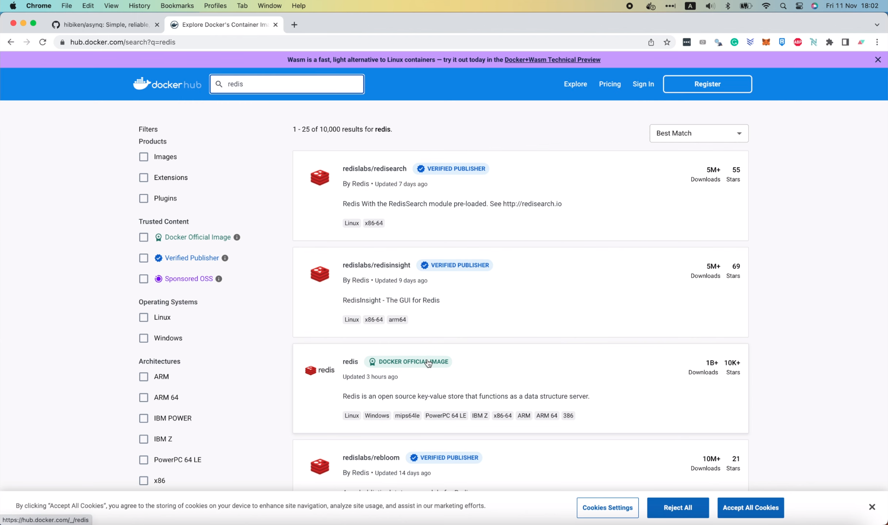
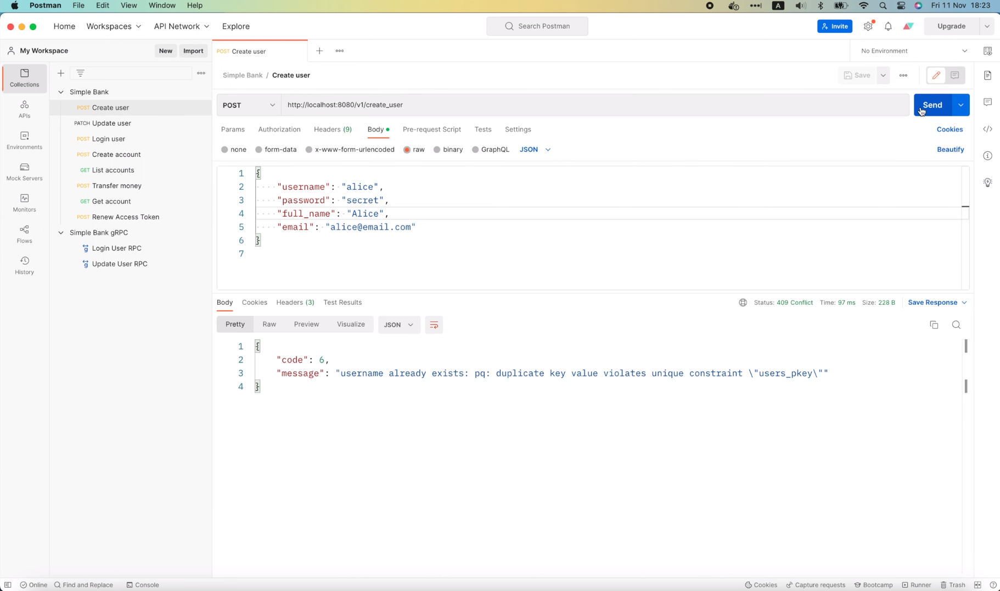
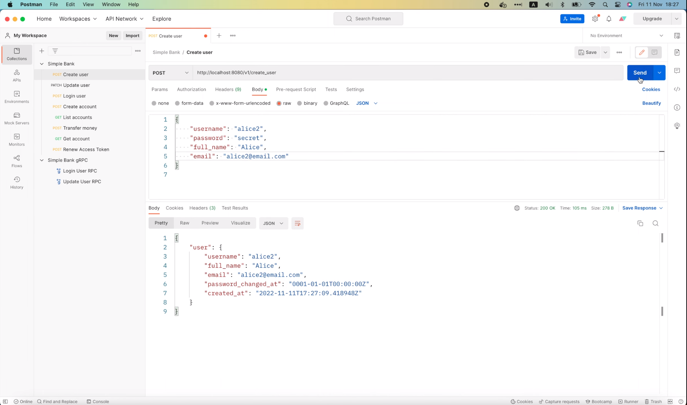
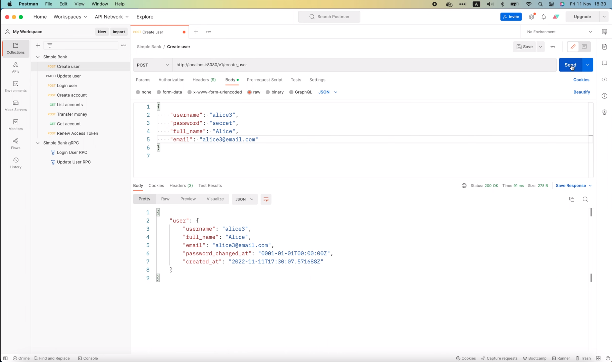

# Integrate async worker to Go web server

[Original video](https://www.youtube.com/watch?v=eXYKGPEXocM)

Hello everyone, welcome to the backend master class. In the previous 
lecture, we've learned how to implement worker-pattern to send and process
asynchronous tasks using Redis as its message queue. However, we haven't 
integrated it with our backend web server yet. So today, I'm gonna show
you how to do that.

## Integrate worker to our backend web server

If you haven't watched that [video](https://www.youtube.com/watch?v=XOXdYs8mKkI),
I highly recommend watching it first, before going forward with this one. OK, 
the first thing we need to do is to run a Redis server on our local 
machine.

This can be easily done with the help of Docker. Just search for "redis"
in the [DockerHub website](https://hub.docker.com/), and select this official
Redis image with more than 1 billion downloads.



At the time I record this video, its latest version is 7, so I'm gonna use
the `7-alpine` image. Let's open the `Makefile` of the `Simple Bank` 
project, and add a new "redis" command at the end. Then let's add this 
statement to run a new Redis container:

```makefile
redis:
	docker run --name redis
```

This basically means that we want the container to be named "redis". Then 
follow that with this port mapping:

```makefile
redis:
	docker run --name redis -p 6379:6379
```

This means, mapping port `6379` of the host machine to the internal port 
`6379` of the Redis container, which is in fact the default port of the
Redis server. Next, we use the `-d` option to run the container as a 
daemon,

```makefile
redis:
	docker run --name redis -p 6379:6379 -d
```

and finally, we put the name of the image at the end of the statement: 
`redis:7-alpine`.

```makefile
redis:
	docker run --name redis -p 6379:6379 -d redis:7-alpine
```

Now, I'm gonna add this new "redis" command to the PHONY list

```makefile
.PHONY: postgres createdb dropdb migrateup migratedown migrateup1 migratedown1 db_docs db_schema sqlc test server mock proto evans redis
```

Then open the terminal and run 

```shell
make redis
```

Docker will download the Redis image to our local machine and start a new 
Redis container for us.

```shell
make redis
docker run --name redis -p 6379:6379 -d redis:7-alpine
Unable to find image 'redis:7-alpine' locally
7-alpine: Pulling from library/redis
c158987b0551: Pull complete 
1a990ecc86f0: Pull complete 
f2520a938316: Pull complete 
f7ed7b580c2c: Pull complete 
d48b7a41c3f1: Pull complete 
b7e40f3e68f9: Pull complete 
Digest: sha256:9dc2499d6c21f869a6e22b170003483d3fca8c03992f4a11f6493c0b392da40f
Status: Downloaded newer image for redis:7-alpine
322f00ec2f8a3926ebca13e1c97c35d00fe3e7b483d3b5ba57a27b810bf0c79d
```

Now if I run 

```shell
docker ps -a
```

we will see that the Redis server is up and running.


Make sure the port mapping is correct, as we specified in the `docker run`
statement. Here I see that the `postgres` container is not running, so I
will have to start it with this command:

```shell
docker start postgres12
postgres12
```

OK, so now, we have both the Postgres database and Redis container up and
running. We can test the connection to the Redis server using this command:

```shell
docker exec -it redis redis-cli ping
PONG
```

If it returns a `PONG` message like this, then everything is good, we're
able to communicate with the Redis server. Alright, let's go back to our
code.

I'm gonna open the `app.env` file, and add a new environment variable
for the Redis server address. It's gonna be `localhost` port `6379`.

```
REDIS_ADDRESS=0.0.0.0:6379
```

Then, in the `config.go` file inside the `util` package, let's add a new
field called `RedisAddress` of type `string` to the `Config` struct. And
its tag should be the name of the environment variable we've just added.

```go
type Config struct {
	...
    MigrationURL         string        `mapstructure:"MIGRATION_URL"`
    RedisAddress         string        `mapstructure:"REDIS_ADDRESS"`
    HTTPServerAddress    string        `mapstructure:"HTTP_SERVER_ADDRESS"`
	...
}
```

OK, next, let's open the `main.go` file and add some code to connect to
Redis.

In the `main` function, right before running the server, I'm gonna define a 
new Redis option variable with the type `asynq.RedisClientOpt{}`. This 
object allows us to set up many different parameters to communicate with 
the Redis server.

```go
func main() {
	...
	store := db.NewStore(conn)

	redisOpt := asynq.RedisClientOpt{}
	...
}
```

For example, the address of the server, 

```go
type RedisClientOpt struct {
	...
	// Redis server address in "host:port" format.
	Addr string
	...
}
```

the username and password to authenticate the connection,

```go
type RedisClientOpt struct {
	...
	// Username to authenticate the current connection when Redis ACLs are used.
	// See: https://redis.io/commands/auth.
	Username string

	// Password to authenticate the current connection.
	// See: https://redis.io/commands/auth.
	Password string
	...
}
```

the Redis DB number,

```go
type RedisClientOpt struct {
	...
	// Redis DB to select after connecting to a server.
	// See: https://redis.io/commands/select.
	DB int
	...
}
```

the timeout duration,

```go
type RedisClientOpt struct {
	...
	// Dial timeout for establishing new connections.
	// Default is 5 seconds.
	DialTimeout time.Duration

	// Timeout for socket reads.
	// If timeout is reached, read commands will fail with a timeout error
	// instead of blocking.
	//
	// Use value -1 for no timeout and 0 for default.
	// Default is 3 seconds.
	ReadTimeout time.Duration

    // Timeout for socket writes.
    // If timeout is reached, write commands will fail with a timeout error
    // instead of blocking.
    //
    // Use value -1 for no timeout and 0 for default.
    // Default is ReadTimout.
    WriteTimeout time.Duration
	...
}
```

or the connection pool size.

```go
type RedisClientOpt struct {
	...
	// Maximum number of socket connections.
	// Default is 10 connections per every CPU as reported by runtime.NumCPU.
	PoolSize int
	...
}
```

And if you're connecting to a production Redis server that uses TLS to
secure the connections, you must set appropriate values for this 
`TLSConfig` field.

```go
type RedisClientOpt struct {
    ...
	// TLS Config used to connect to a server.
	// TLS will be negotiated only if this field is set.
	TLSConfig *tls.Config
    ...
}
```


For this demo, we're just connecting to a local Redis container, so I'm
just gonna set the most important field: the address of the Redis server,
which is `config.RedisAddress`. Other fields can take their default 
values.

```go
func main() {
    ...
    store := db.NewStore(conn)

	redisOpt := asynq.RedisClientOpt{
		Addr: config.RedisAddress,
	}
	...
}
```

OK, now with this Redis option, we can create a new task distributor by
calling `worker.NewRedisTaskDistributor()`, and pass in the `redisOpt` 
object. Then assign the returned value to a variable called 
`taskDistributor`. 

```go
func main() {
    ...
	redisOpt := asynq.RedisClientOpt{
        Addr: config.RedisAddress,
    }

    taskDistributor := worker.NewRedisTaskDistributor(redisOpt)
	...
}
```

Next step, we will add this task distributor to the gRPC server struct, 
so that it will be available to all of its RPC handler functions. Let's
open the `server.go` file inside the `gapi` package. I'm gonna add a new
field called `taskDistributor` to the `Server` struct.

```go
// Server serves gRPC requests for our banking service.
type Server struct {
	pb.UnimplementedSimpleBankServer
	config          util.Config
	store           db.Store
	tokenMaker      token.Maker
	taskDistributor worker.TaskDistributor
}
```

We also need to add `taskDistributor` as 1 of the input arguments of the
`NewServer()` function,

```go
func NewServer(config util.Config, store db.Store, taskDistributor worker.TaskDistributor) (*Server, error) {
	...
}
```

and add it here, when initializing the `Server` object.

```go
func NewServer(config util.Config, store db.Store, taskDistributor worker.TaskDistributor) (*Server, error) {
	...
	server := &Server{
        config:     config,
        store:      store,
        tokenMaker: tokenMaker,
        taskDistributor: taskDistributor,
    }
	...
}
```

OK, now, with this `taskDistributor` added to the server, we can open 
the `rpc_create_user.go` file and use it to issue a new send verification
email task here.

```go
func (server *Server) CreateUser(ctx context.Context, req *pb.CreateUserRequest) (*pb.CreateUserResponse, error) {
    ...
	
    // Send verify email to user
	rsp := &pb.CreateUserResponse{
		User: convertUser(user),
	}
	return rsp, nil
}
```

Let's call `server.taskDistributor.DistributeTaskSendVerifyEmail()`, then
pass in the context, and a `taskPayload` object. We can create a 
`taskPayload` up here with `worker.PayloadSendVerifyEmail()` and its only
field is `username` should be set to `user.Username`.

```go
func (server *Server) CreateUser(ctx context.Context, req *pb.CreateUserRequest) (*pb.CreateUserResponse, error) {
    ...

    taskPayload := &worker.PayloadSendVerifyEmail{
		Username: user.Username,
	}
	server.taskDistributor.DistributeTaskSendVerifyEmail(ctx, taskPayload)

	rsp := &pb.CreateUserResponse{
		User: convertUser(user),
	}
	return rsp, nil
}
```

We can also pass in some `anynq` options here,

```go
server.taskDistributor.DistributeTaskSendVerifyEmail(ctx, taskPayload/*, options*/)
```

but let's save it for later.

For now let's go with the default options. This call

```go
server.taskDistributor.DistributeTaskSendVerifyEmail(ctx, taskPayload)
```

might return an error, so I'm going to store it in the `err` variable
and check if error is `nil` or not. If it is not `nil` we'll return an 
internal error to the client with a message saying "failed to distribute
task to send verify email".

```go
func (server *Server) CreateUser(ctx context.Context, req *pb.CreateUserRequest) (*pb.CreateUserResponse, error) {
    ...
	err = server.taskDistributor.DistributeTaskSendVerifyEmail(ctx, taskPayload)
	if err != nil {
        return nil, status.Errorf(codes.Internal, "failed to distribute task to send verify email: %s", err)
	}
	...
}
```

Now I must emphasize that what we just did is not the best. What if the 
code to create a new user in the DB is successful, but the call to send 
tasks to Redis fails? In that case the clients will receive an internal 
error, but he cannot retry the call, because it will create a duplicate
record of the user with the same username. So the right way to do it is:
we have to create user and send tasks to Redis in one single DB 
transaction. That way if we fail to send tasks the transaction will be
rolled back and the client can retry later. But I'll leave this to implement in
the next video.

```go
func (server *Server) CreateUser(ctx context.Context, req *pb.CreateUserRequest) (*pb.CreateUserResponse, error) {
    ...
	// TODO: use db transaction
	taskPayload := &worker.PayloadSendVerifyEmail{
        Username: user.Username,
    }
    err = server.taskDistributor.DistributeTaskSendVerifyEmail(ctx, taskPayload)
    if err != nil {
        return nil, status.Errorf(codes.Internal, "failed to distribute task to send verify email: %s", err)
    }
	...
}
```

For now let's go with this simple implementation first, although it's not
perfect. Alright, it's time to go back to the `main.go` file and fix some
errors that just appeared because of the changes we made to the `Server`
struct.

Here, at the beginning of the `runGrpcServer()` function

```go
func runGrpcServer(config util.Config, store db.Store) {
	server, err := gapi.NewServer(config, store)
	...
}
```

we're calling `gapi.NewServer()`, but now it requires one more argument:
the `taskDistributor`. So I'm gonna copy this 
`taskDistributor worker.TaskDistributor` and add it to the function
signature. Then we can add the `taskDistributor` to this `NewServer()`
function call.

```go
func runGrpcServer(config util.Config, store db.Store, taskDistributor worker.TaskDistributor) {
    server, err := gapi.NewServer(config, store, taskDistributor)
	...
}
```

I'm gonna do the same for the `runGatewayServer()` function: add 
`taskDistributor` as a third argument of this function and use it in the 
code to create a new server.

```go
func runGatewayServer(config util.Config, store db.Store, taskDistributor worker.TaskDistributor) {
	server, err := gapi.NewServer(config, store, taskDistributor)
	...
}
```

OK, next, in the `main()` function we must add this `taskDistributor` object
to the two function calls that run gRPC server and gateway server. And 
that's all for the task distribution part.

```go
func main() {
	...
	
	go runGatewayServer(config, store, taskDistributor)
	runGrpcServer(config, store, taskDistributor)
    //runGinServer(config, store)
}
```

If we only do that, then the task will only be sent to a Redis queue, but
there's no one picking them up for processing yet.

Therefore, the last step we must do is to run the task processor. I'm going
write a separate function for this purpose.

This function will take two input arguments: a Redis option of type
`asynq.RedisClientOpt` to know how to connect to Redis and a store of
type `db.Store` to be able to talk to the database.

```go
func runTaskProcessor(redisOpt asynq.RedisClientOpt, store db.Store) {

}
```

In this function let's call `worker.NewRedisTaskProcessor()` with input
Redis option and DB store. It will return a `taskProcessor` object.

```go
func runTaskProcessor(redisOpt asynq.RedisClientOpt, store db.Store) {
	taskProcessor := worker.NewRedisTaskProcessor(redisOpt, store)
}
```

Now before starting the processor I'm gonna write an info log here saying
"start task processor".

```go
func runTaskProcessor(redisOpt asynq.RedisClientOpt, store db.Store) {
	taskProcessor := worker.NewRedisTaskProcessor(redisOpt, store)
	log.Info().Msg("start task processor")
}
```

Then, let's call `taskProcessor.start()` and save its output error to this
variable.

```go
func runTaskProcessor(redisOpt asynq.RedisClientOpt, store db.Store) {
	taskProcessor := worker.NewRedisTaskProcessor(redisOpt, store)
	log.Info().Msg("start task processor")
	err := taskProcessor.Start()
}
```

If error is not `nil`, we'll write a fatal log with the original
error attached and a message saying "failed to start task processor".

```go
func runTaskProcessor(redisOpt asynq.RedisClientOpt, store db.Store) {
	...
	err := taskProcessor.Start()
	if err != nil {
        log.Fatal().Err(err).Msg("failed to start task processor")
    }
}
```

OK, the function to run task processor is now completed.

Let's go back to the `main` function and use it. We will have to call 
`runTaskProcessor` in a separate go routine because when the processor 
starts, the `asynq` server will block and keep pulling Redis for new tasks. 
As I said in the previous lecture its design is pretty similar to that of 
an HTTP webserver. So it blocks, just like the HTTP server blocks, while 
waiting for requests from the client.

```go
func main() {
	...
	
	taskDistributor := worker.NewRedisTaskDistributor(redisOpt)
    go runTaskProcessor(redisOpt, store)
	go runGatewayServer(config, store, taskDistributor)
	runGrpcServer(config, store, taskDistributor)
    //runGinServer(config, store)
}
```

Alright, now both the task distributor and task processor are integrated
into our web server.

It's time to start the server and test them out.

I'm gonna run

```shell
make server
go run main.go
6:23PM INF db migrated successfully
6:23PM INF start gRPC server at [::]:9090
6:23PM INF start task processor
asynq: pid=21501 2022/11/11 17:23:20.966246 INFO: Starting processing
6:23PM INF start HTTP gateway server at [::]:8080
```

in the terminal.

As you can see the server is up and running, and there's a log to tell us
that the task processor has started.

I'm gonna open Postman and send this `CreateUser` request.



Oops, we've got an error "username already exists". OK, so let's try 
another username "alice1" and let's change the email to "alice1@email.com"
as well. Then I'm gonna send the request.


This time the request is successful and in the logs we can see that a
task to send verify email was enqueued.

```shell
6:23PM INF enqueued task max_retry=25 payload="{\"username\":\"alice1\"}" queue=default type=task:send_verify_email
6:23PM INF received an HTTP request duration=83.568098 method=POST path=/v1/create_user protocol=http status_code=200 status_text=OK
```

All information of the tasks are listed here. For example, the maximum 
number of retries, the payload, the queue and the type of task. We also
see another log saying that the task was successfully processed here.

```shell
6:23PM INF processed task email=alice1@email.com payload="{\"username\":\"alice1\"}" type=task:send_verify_email
```

It's showing the email address here, exactly as we specified in the request.
The task is processed immediately because we didn't set any delay option.
But if you want, we can easily do that with an `asynq` option. We can also 
change the `max_retry` parameter or send a task to a specific queue instead
of the default one as well.

I'm gonna show you how to do it now.

Here before distributing the task, I'm gonna create a new slice of 
`asynq.Option`.

```go
func (server *Server) CreateUser(ctx context.Context, req *pb.CreateUserRequest) (*pb.CreateUserResponse, error) {
	...
	
	// TODO: use db transaction
	taskPayload := &worker.PayloadSendVerifyEmail{
		Username: user.Username,
	}
	opts := []asynq.Option{
		
	}
	...
}
```

First, let's add an `asynq.MaxRetry()` option and set it to 10. This means 
we only allow the task to be retried at most 10 times if it fails. Then, 
let's add `asynq.ProcessIn()` option and set it to 10 seconds. This will 
add some kind of delay to the task, so that it will only be picked up by 
the processor after 10 seconds. And if you have multiple tasks with 
different priority levels, you can use `asynq.Queue` option to send them to 
different queues. For example, here, I'm sending this task to a `critical`
queue.

```go
func (server *Server) CreateUser(ctx context.Context, req *pb.CreateUserRequest) (*pb.CreateUserResponse, error) {
	...
	
	// TODO: use db transaction
	taskPayload := &worker.PayloadSendVerifyEmail{
		Username: user.Username,
	}
	opts := []asynq.Option{
        asynq.MaxRetry(10),
        asynq.ProcessIn(10 * time.Second),
        asynq.Queue("critical"),
	}
	...
}
```

OK, so now, we can add the option slice to the end of the 
`DistributeTaskSendVerifyEmail` call.

```go
func (server *Server) CreateUser(ctx context.Context, req *pb.CreateUserRequest) (*pb.CreateUserResponse, error) {
	...

	// TODO: use db transaction
	taskPayload := &worker.PayloadSendVerifyEmail{
        Username: user.Username,
    }
	opts := []asynq.Option{
        asynq.MaxRetry(10),
        asynq.ProcessIn(10 * time.Second),
        asynq.Queue("critical"),
	}
    err = server.taskDistributor.DistributeTaskSendVerifyEmail(ctx, taskPayload, opts...)
	...
}
```

Then, let's go back to the terminal and restart the server.

```shell
make server
go run main.go
6:26PM INF db migrated successfully
6:26PM INF start gRPC server at [::]:9090
6:26PM INF start task processor
asynq: pid=22034 2022/11/11 17:26:59.475563 INFO: Starting processing
6:26PM INF start HTTP gateway server at [::]:8080
```

And in Postman, I'm gonna change the username and email to "alice2" and 
resend the request.



It's successful. But this time, in the log, there's something different.

```shell
4:42PM INF enqueued task max_retry=10 payload="{\"username\":\"alice2\"}" queue=critical type=task:send_verify_email
4:42PM INF received an HTTP request duration=98.824783 method=POST path=/v1/create_user protocol=http status_code=200 status_text=OK
```

The `max_retry` value has been changed to 10 instead of 25 and the queue 
name is now `critical` instead of `default` as before. There's a log
when the task is enqueued, but there's no log when it is processed. 
That's because we have a 10-second delay. However, even if we wait for
more than 10 seconds, it's still not running. The reason is we haven't
told the task processor to pick up the task from the `critical` queue yet.
So it only looks for tasks in the `default` queue.

So let's go back to the `processor.go` file and fix this. Here, when 
creating a new `asynq` server,

```go
func NewRedisTaskProcessor(redisOpt asynq.RedisClientOpt, store db.Store) TaskProcessor {
	server := asynq.NewServer(
		redisOpt,
		asynq.Config{},
	)

	return &RedisTaskProcessor{
		server: server,
		store:  store,
	}
}
```

we can pass in some configurations. In this case, we would want to specify 
the `Queues` map to tell `asynq` about the queue names and their 
corresponding priority values. You can see an example of it in this 
documentation comment.

```go
// List of queues to process with given priority value. Keys are the names of the
// queues and values are associated priority value.
//
// If set to nil or not specified, the server will process only the "default" queue.
//
// Priority is treated as follows to avoid starving low priority queues.
//
// Example:
//
//     Queues: map[string]int{
//         "critical": 6,
//         "default":  3,
//         "low":      1,
//     }
//
// With the above config and given that all queues are not empty, the tasks
// in "critical", "default", "low" should be processed 60%, 30%, 10% of
// the time respectively.
//
// If a queue has a zero or negative priority value, the queue will be ignored.
Queues map[string]int
```

Alright, I'm gonna copy this,

```go
Queues map[string]int
```

paste it into our code, add a colon here, and a pair of curly brackets
to make it an empty map. Then, at the top of the file, I'm gonna add two
constants for the queue names. First, the `critical` queue, and second, the
`default` queue.

```go
const (
	QueueCritical = "critical"
	QueueDefault = "default"
)

type TaskProcessor interface {
	Start() error
	ProcessTaskSendVerifyEmail(ctx context.Context, task *asynq.Task) error
}
```

Then, in the map object, I'm gonna set the priority of the `critical` queue
to 10, and that of the `default` queue to 5.

```go
func NewRedisTaskProcessor(redisOpt asynq.RedisClientOpt, store db.Store) TaskProcessor {
	server := asynq.NewServer(
		redisOpt,
	    asynq.Config{
            Queues: map[string]int{
                QueueCritical: 10,
                QueueDefault:  5,
            },
        },
	)

	return &RedisTaskProcessor{
		server: server,
		store:  store,
	}
}
```

Then, in the handler function of the `CreateUser` RPC, I'm gonna replace this 
string `critical` with `worker.QueueCritical` and that's it.

```go
func (server *Server) CreateUser(ctx context.Context, req *pb.CreateUserRequest) (*pb.CreateUserResponse, error) {
	...
	
	// TODO: use db transaction
	taskPayload := &worker.PayloadSendVerifyEmail{
		Username: user.Username,
	}
	opts := []asynq.Option{
        asynq.MaxRetry(10),
        asynq.ProcessIn(10 * time.Second),
        asynq.Queue(worker.QueueCritical),
	}
	...
}
```

Let's save the code, and go back to the terminal to restart the server.

```shell
make server
go run main.go
6:29PM INF db migrated successfully
6:29PM INF start task processor
6:29PM INF start gRPC server at [::]:9090
asynq: pid=22360 2022/11/21 17:29:40.952616 INFO: Starting processing
6:29PM INF start HTTP gateway server at [::]:8080
```

As soon as the server is started, we will see that the task send email to 
"alice2" has been processed.

```shell
6:29PM INF processed task email=alice2@email.com payload="{\"username\":\"alice2\"}" type=task:send_verify_email
```

So that's the power of using Redis as a task queue. Even when the server is
restarted, all the existing tasks are still safely stored in the queue. Now,
before we finish, let's open Postman and send another request to create a
new user "alice3".



Then look at the logs.

```shell
6:30PM INF enqueued task max_retry=10 payload="{\"username\":\"alice3\"}" queue=critical type=task:send_verify_email
6:30PM INF received an HTTP request duration=83.956013 method=POST path=/v1/create_user protocol=http status_code=200 status_text=OK
```

We can see that a new task is already pushed to the `critical` queue and
after about 10 seconds it will be processed by the worker.

```shell
6:30PM INF processed task email=alice3@email.com payload="{\"username\":\"alice3\"}" type=task:send_verify_email
```

And that wraps up today's lecture about integrating async workers with 
the web server.

I hope it has interesting and useful for you. In the next video we will
learn how to make it even more robust by using a DB transaction when
pushing the task to Redis.

Thanks a lot for watching! Happy learning, and see you in the next lecture.