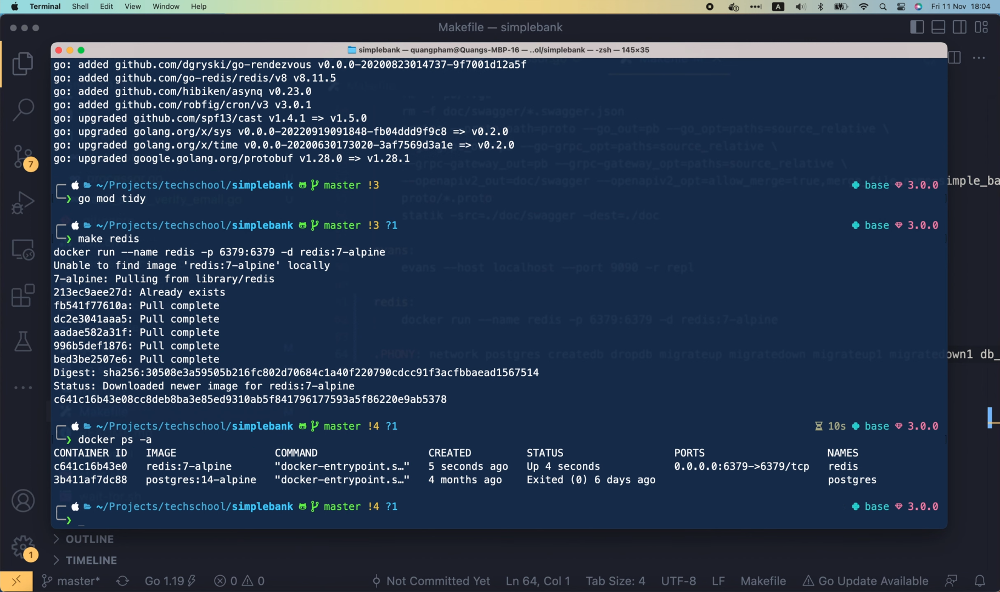
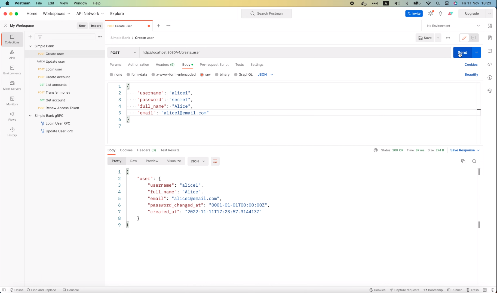
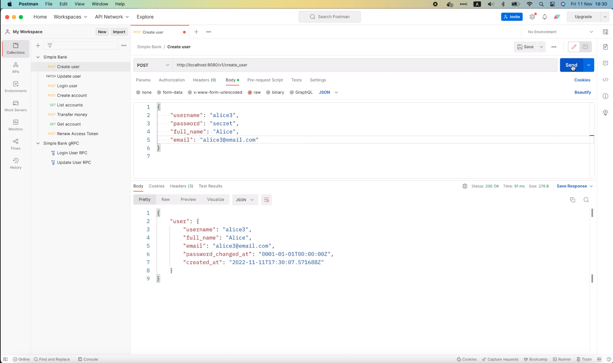

# Интегрируем асинхронный воркер с веб-сервером Go

[Оригинал](https://www.youtube.com/watch?v=eXYKGPEXocM)

Всем привет, рад вас снова видеть на мастер-классе по бэкенду. На предыдущей
лекции мы узнали, как реализовать шаблон "Worker" для отправки и обработки 
асинхронных задач с использованием Redis в качестве очереди сообщений.
Однако мы еще не интегрировали его с нашим бэкенд веб-сервером. Итак, 
сегодня я покажу вам, как это сделать.

## Интегрируем воркер с нашим бэкенд веб-сервером

Если вы ещё не прочитали эту [лекцию](part54-rus.md) к этому [видео](https://www.youtube.com/watch?v=XOXdYs8mKkI), я 
настоятельно рекомендую сначала сделать это, прежде чем переходить к этой 
лекции. Хорошо, первое, что нам нужно сделать, это запустить сервер Redis 
на нашей локальной машине.

Это можно легко сделать с помощью Docker. Просто поищите по ключевому слову
"redis" на [веб-сайте DockerHub] (https://hub.docker.com/) и выберите этот 
официальный образ Redis с более чем 1 миллиардом загрузок.


На момент написания этой лекции последней версией образа была 7, поэтому я 
буду использовать — `7-alpine`. Давайте откроем `Makefile` проекта 
`Simple Bank` и добавим в конец новую команду "redis". Затем добавим этот
оператор для запуска нового контейнера Redis:

```makefile
redis:
	docker run --name redis
```

По сути это означает, что мы хотим, чтобы контейнер назывался "redis". Далее
добавьте следующее сопоставление портов:

```makefile
redis:
	docker run --name redis -p 6379:6379
```

Это означает, что нужно сопоставить порт `6379` хост-машины с внутренним 
портом `6379` контейнера Redis, который фактически является портом 
сервера Redis по умолчанию. Затем мы используем ключ `-d` для запуска 
контейнера в фоновом режиме

```makefile
redis:
	docker run --name redis -p 6379:6379 -d
```

и, наконец, мы указываем название образа в конце оператора:
`redis:7-alpine`.

```makefile
redis:
	docker run --name redis -p 6379:6379 -d redis:7-alpine
```

Теперь я добавлю эту новую команду "redis" в список PHONY

```makefile
.PHONY: postgres createdb dropdb migrateup migratedown migrateup1 migratedown1 db_docs db_schema sqlc test server mock proto evans redis
```

После этого откройте терминал и выполните

```shell
make redis
```

Docker загрузит образ Redis на наш локальный компьютер и запустит для нас 
новый контейнер Redis.

```shell
make redis
docker run --name redis -p 6379:6379 -d redis:7-alpine
Unable to find image 'redis:7-alpine' locally
7-alpine: Pulling from library/redis
c158987b0551: Pull complete 
1a990ecc86f0: Pull complete 
f2520a938316: Pull complete 
f7ed7b580c2c: Pull complete 
d48b7a41c3f1: Pull complete 
b7e40f3e68f9: Pull complete 
Digest: sha256:9dc2499d6c21f869a6e22b170003483d3fca8c03992f4a11f6493c0b392da40f
Status: Downloaded newer image for redis:7-alpine
322f00ec2f8a3926ebca13e1c97c35d00fe3e7b483d3b5ba57a27b810bf0c79d
```

Теперь если я выполню команду

```shell
docker ps -a
```

то мы увидим, что сервер Redis запущен и работает.



Убедитесь, что сопоставление портов правильное, как мы указали в 
операторе `docker run`. Здесь видно, что контейнер `postgres` не запущен, 
поэтому мне придется запустить его с помощью этой команды:

```shell
docker start postgres12
postgres12
```

Итак, теперь и база данных Postgres, и контейнер Redis запущены и работают.
Мы можем проверить подключение к серверу Redis с помощью этой команды:

```shell
docker exec -it redis redis-cli ping
PONG
```

Если она возвращает сообщение `PONG` как показано здесь, значит, всё в 
порядке и мы можем взаимодействовать с сервером Redis. Хорошо, давайте 
вернёмся к нашему коду.

Я открою файл `app.env` и добавлю новую переменную окружения для
адреса сервера Redis. Её значение будет равно `localhost`, а адрес
порта `6379`.

```
REDIS_ADDRESS=0.0.0.0:6379
```

Затем в файле `config.go` внутри пакета `util` добавим новое поле 
`RedisAddress` типа `string` в структуру `Config`. И его дескриптор должен
совпадать с названием переменной окружения, которую мы только что 
объявили.

```go
type Config struct {
	...
    MigrationURL         string        `mapstructure:"MIGRATION_URL"`
    RedisAddress         string        `mapstructure:"REDIS_ADDRESS"`
    HTTPServerAddress    string        `mapstructure:"HTTP_SERVER_ADDRESS"`
	...
}
```

Хорошо, теперь давайте откроем файл `main.go` и добавим код для 
подключения к Redis.

В функции `main` непосредственно перед запуском сервера, я определю новую 
переменную для настроек Redis типа `asynq.RedisClientOpt{}`. Этот объект
позволит нам настроить множество различных параметров для взаимодействия с
Redis сервером. 

```go
func main() {
	...
	store := db.NewStore(conn)

	redisOpt := asynq.RedisClientOpt{}
	...
}
```

Например, адрес сервера,

```go
type RedisClientOpt struct {
	...
	// Redis server address in "host:port" format.
	Addr string
	...
}
```

имя пользователя и пароль для аутентификации соединения,

```go
type RedisClientOpt struct {
	...
	// Username to authenticate the current connection when Redis ACLs are used.
	// See: https://redis.io/commands/auth.
	Username string

	// Password to authenticate the current connection.
	// See: https://redis.io/commands/auth.
	Password string
	...
}
```

номер БД Redis,

```go
type RedisClientOpt struct {
	...
	// Redis DB to select after connecting to a server.
	// See: https://redis.io/commands/select.
	DB int
	...
}
```

продолжительность тайм-аута

```go
type RedisClientOpt struct {
	...
	// Dial timeout for establishing new connections.
	// Default is 5 seconds.
	DialTimeout time.Duration

	// Timeout for socket reads.
	// If timeout is reached, read commands will fail with a timeout error
	// instead of blocking.
	//
	// Use value -1 for no timeout and 0 for default.
	// Default is 3 seconds.
	ReadTimeout time.Duration

    // Timeout for socket writes.
    // If timeout is reached, write commands will fail with a timeout error
    // instead of blocking.
    //
    // Use value -1 for no timeout and 0 for default.
    // Default is ReadTimout.
    WriteTimeout time.Duration
	...
}
```

или размер пула соединений.

```go
type RedisClientOpt struct {
	...
	// Maximum number of socket connections.
	// Default is 10 connections per every CPU as reported by runtime.NumCPU.
	PoolSize int
	...
}
```

И если вы подключаетесь к продакшен Redis серверу, который использует 
TLS для защиты соединений, вы должны задать соответствующие значения 
для этого поля `TLSConfig`.

```go
type RedisClientOpt struct {
    ...
	// TLS Config used to connect to a server.
	// TLS will be negotiated only if this field is set.
	TLSConfig *tls.Config
    ...
}
```

В нашем учебном примере мы просто подключаемся к локальному Redis контейнеру,
поэтому я просто задам значение для самого важного поля: адрес сервера 
Redis, то есть `config.RedisAddress`. Другие поля будут использовать 
значения по умолчанию.

```go
func main() {
    ...
    store := db.NewStore(conn)

	redisOpt := asynq.RedisClientOpt{
		Addr: config.RedisAddress,
	}
	...
}
```

Хорошо, теперь используя эту переменную с настройками Redis, мы можем 
создать новый распределитель задач, вызвав `worker.NewRedisTaskDistributor()`
и передав в него объект `redisOpt`. Затем присвойте возвращаемое значение 
переменной с названием `taskDistributor`.

```go
func main() {
    ...
	redisOpt := asynq.RedisClientOpt{
        Addr: config.RedisAddress,
    }

    taskDistributor := worker.NewRedisTaskDistributor(redisOpt)
	...
}
```

Следующий шаг: мы добавим этот распределитель задач в структуру gRPC 
сервера, чтобы он был доступен всем его RPC функциям-обработчикам.
Давайте откроем файл `server.go` внутри пакета `gapi`. Я добавлю
новое поле, назвав его `taskDistributor`, в структуру `Server`.

```go
// Server обслуживает gRPC запросы нашего банковского сервиса.
type Server struct {
	pb.UnimplementedSimpleBankServer
	config          util.Config
	store           db.Store
	tokenMaker      token.Maker
	taskDistributor worker.TaskDistributor
}
```

Нам также нужно добавить `taskDistributor` в качестве одного из входных 
аргументов функции `NewServer()`,

```go
func NewServer(config util.Config, store db.Store, taskDistributor worker.TaskDistributor) (*Server, error) {
	...
}
```

а также здесь при инициализации объекта `Server`.

```go
func NewServer(config util.Config, store db.Store, taskDistributor worker.TaskDistributor) (*Server, error) {
	...
	server := &Server{
        config:     config,
        store:      store,
        tokenMaker: tokenMaker,
        taskDistributor: taskDistributor,
    }
	...
}
```

Хорошо, теперь, когда этот `taskDistributor` добавлен к серверу, мы можем 
открыть файл `rpc_create_user.go` и использовать его для создания новой 
задачи по отправке письма для подтверждения адреса электронной
почты здесь.

```go
func (server *Server) CreateUser(ctx context.Context, req *pb.CreateUserRequest) (*pb.CreateUserResponse, error) {
    ...
	
    // Отправляем письмо для подтверждения адреса электронной почты пользователю
	rsp := &pb.CreateUserResponse{
		User: convertUser(user),
	}
	return rsp, nil
}
```

Давайте вызовем `server.taskDistributor.DistributeTaskSendVerifyEmail()`, 
затем передадим туда контекст и объект `taskPayload`. Мы можем создать
`taskPayload` здесь чуть выше с помощью `worker.PayloadSendVerifyEmail()`, 
и его единственное поле `username` должно быть равно `user.Username`.

```go
func (server *Server) CreateUser(ctx context.Context, req *pb.CreateUserRequest) (*pb.CreateUserResponse, error) {
    ...

    taskPayload := &worker.PayloadSendVerifyEmail{
		Username: user.Username,
	}
	server.taskDistributor.DistributeTaskSendVerifyEmail(ctx, taskPayload)

	rsp := &pb.CreateUserResponse{
		User: convertUser(user),
	}
	return rsp, nil
}
```

Мы можем также передать здесь некоторые настройки для `anynq`

```go
server.taskDistributor.DistributeTaskSendVerifyEmail(ctx, taskPayload/*, options*/)
```

но давайте займёмся этим позже.

Пока что давайте будем использовать настройки по умолчанию. Этот вызов

```go
server.taskDistributor.DistributeTaskSendVerifyEmail(ctx, taskPayload)
```

может вернуть ошибку, поэтому я сохраню его в переменной `err` и проверю
равна ли ошибка `nil` или нет. Если она не `nil`, мы вернем клиенту 
внутреннюю ошибку с сообщением "failed to distribute
task to send verify email" («не удалось распределить задачу 
по отправке письма для подтверждения адреса электронной почты»).

```go
func (server *Server) CreateUser(ctx context.Context, req *pb.CreateUserRequest) (*pb.CreateUserResponse, error) {
    ...
	err = server.taskDistributor.DistributeTaskSendVerifyEmail(ctx, taskPayload)
	if err != nil {
        return nil, status.Errorf(codes.Internal, "failed to distribute task to send verify email: %s", err)
	}
	...
}
```

Теперь я обращу ваше внимание на то, что код, написанный выше, не самое 
лучшее решение поставленной задачи. Подумайте что произойдёт если код
создающий нового пользователя в БД успешно выполниться, но возникнет сбой
при отправке задачи в Redis? В этом случае клиенты получат внутреннюю 
ошибку, но не смогут повторить запрос, создающий нового пользователя, 
поскольку пользователь с таким именем уже будет существовать в базе. 
Поэтому правильнее было бы создать пользователя и отправить задачу в Redis
в рамках одной транзакции БД. Таким образом, если мы не сможем отправить 
задачу, произойдёт откат транзакции и после этого клиент сможет повторить 
попытку. Но такой вариант решения я реализую на следующей лекции.

```go
func (server *Server) CreateUser(ctx context.Context, req *pb.CreateUserRequest) (*pb.CreateUserResponse, error) {
    ...
	// TODO: используйте транзакцию БД
	taskPayload := &worker.PayloadSendVerifyEmail{
        Username: user.Username,
    }
    err = server.taskDistributor.DistributeTaskSendVerifyEmail(ctx, taskPayload)
    if err != nil {
        return nil, status.Errorf(codes.Internal, "failed to distribute task to send verify email: %s", err)
    }
	...
}
```

А пока что давайте сначала рассмотрим эту простую реализацию, хотя она 
и не идеальна. Итак, давайте вернёмся к файлу `main.go` и исправим некоторые 
ошибки, которые только что появились из-за изменений, внесённых нами в 
структуру `Server`.

Здесь, в начале функции `runGrpcServer()`

```go
func runGrpcServer(config util.Config, store db.Store) {
	server, err := gapi.NewServer(config, store)
	...
}
```

мы вызываем `gapi.NewServer()`, но теперь для создания нового сервера 
нужен ещё один аргумент: `taskDistributor`. Поэтому я скопирую 
этот фрагмент `taskDistributor worker.TaskDistributor` и добавлю его в
сигнатуру функции. После этого мы можем передать `taskDistributor` при 
вызове этой функции `NewServer()`.

```go
func runGrpcServer(config util.Config, store db.Store, taskDistributor worker.TaskDistributor) {
    server, err := gapi.NewServer(config, store, taskDistributor)
	...
}
```

Я сделаю то же самое для функции `runGatewayServer()`: добавлю 
`taskDistributor` в качестве третьего аргумента этой функции и использую
его в коде для создания нового сервера. 

```go
func runGatewayServer(config util.Config, store db.Store, taskDistributor worker.TaskDistributor) {
	server, err := gapi.NewServer(config, store, taskDistributor)
	...
}
```

Хорошо, затем в функции `main()` мы должны добавить этот объект 
`taskDistributor` к двум вызовам функций, которые запускают gRPC сервер и 
сервер шлюза. И этого будет достаточно, чтобы реализовать часть, касающуюся 
распределения задач.

```go
func main() {
	...
	
	go runGatewayServer(config, store, taskDistributor)
	runGrpcServer(config, store, taskDistributor)
    //runGinServer(config, store)
}
```

Если мы сделаем только это, то задача будет только отправлена в очередь
Redis, но их пока никто не заберет для обработки.

Поэтому последний шаг, который мы должны сделать, это запустить обработчик 
задач. Я собираюсь написать отдельную функцию для этого.

Эта функция принимает два входных аргумента: параметр для настроек Redis 
типа `asynq.RedisClientOpt`, чтобы знать, как подключиться к Redis, и 
хранилище типа `db.Store`, чтобы иметь возможность взаимодействовать с 
базой данных.

```go
func runTaskProcessor(redisOpt asynq.RedisClientOpt, store db.Store) {

}
```

В этой функции давайте вызовем `worker.NewRedisTaskProcessor()`, передав на
вход параметр для настроек Redis и хранилище для работы с БД. Она вернет 
объект `taskProcessor`.

```go
func runTaskProcessor(redisOpt asynq.RedisClientOpt, store db.Store) {
	taskProcessor := worker.NewRedisTaskProcessor(redisOpt, store)
}
```

Теперь, прежде чем запускать обработчик, я добавлю сообщение в лог 
информационного уровня с текстом "start task processor" («запущен 
обработчик задач»).

```go
func runTaskProcessor(redisOpt asynq.RedisClientOpt, store db.Store) {
	taskProcessor := worker.NewRedisTaskProcessor(redisOpt, store)
	log.Info().Msg("start task processor")
}
```

Затем давайте вызовем `taskProcessor.start()` и сохраним возвращаемую функцией
ошибку в эту переменную.

```go
func runTaskProcessor(redisOpt asynq.RedisClientOpt, store db.Store) {
	taskProcessor := worker.NewRedisTaskProcessor(redisOpt, store)
	log.Info().Msg("start task processor")
	err := taskProcessor.Start()
}
```

Если ошибка не `nil`, то мы запишем сообщение в лог "failed to start 
task processor" («не удалось запустить обработчик задач»), добавив к нему
исходную ошибку и завершив выполнение приложения.

```go
func runTaskProcessor(redisOpt asynq.RedisClientOpt, store db.Store) {
	...
	err := taskProcessor.Start()
	if err != nil {
        log.Fatal().Err(err).Msg("failed to start task processor")
    }
}
```

OK, функция для запуска обработчика задач готова.

Давайте вернёмся к функции `main` и воспользуемся только что написанной 
функцией. Нам нужно будет вызвать `runTaskProcessor` в отдельной горутине, 
потому что при запуске обработчика, сервер `asynq` будет блокироваться и
продолжать опрашивать Redis, ожидая новых задач. Как я уже говорил на 
предыдущей лекции, его принцип работы очень похож на HTTP веб-сервер. 
Таким образом, он блокируется, как и HTTP-сервер, в ожидании запросов 
от клиента.

```go
func main() {
	...
	
	taskDistributor := worker.NewRedisTaskDistributor(redisOpt)
    go runTaskProcessor(redisOpt, store)
	go runGatewayServer(config, store, taskDistributor)
	runGrpcServer(config, store, taskDistributor)
    //runGinServer(config, store)
}
```

Хорошо, теперь и распределитель задач, и обработчик задач интегрированы 
в наш веб-сервер.

Пришло время запустить сервер и протестировать их.

Я выполню

```shell
make server
go run main.go
6:23PM INF db migrated successfully
6:23PM INF start gRPC server at [::]:9090
6:23PM INF start task processor
asynq: pid=21501 2022/11/11 17:23:20.966246 INFO: Starting processing
6:23PM INF start HTTP gateway server at [::]:8080
```

в терминале.

Как видно, сервер запущен и работает, и есть сообщение в логе о том, что 
обработчик задач запущен.

Я открою Postman и отправлю следующий запрос `CreateUser`.


Ой, мы получили ошибку "username already exists" («пользователь с таким 
именем уже существует»). Поэтому давайте попробуем использовать другое 
имя пользователя ("alice1") и также изменим адрес электронной почты на
"alice1@email.com". Затем я повторно отправлю запрос.



На этот раз запрос успешно выполнен и в логах мы видим, что задача по 
отправке письма для подтверждения адреса электронной почты была поставлена
в очередь.

```shell
6:23PM INF enqueued task max_retry=25 payload="{\"username\":\"alice1\"}" queue=default type=task:send_verify_email
6:23PM INF received an HTTP request duration=83.568098 method=POST path=/v1/create_user protocol=http status_code=200 status_text=OK
```

Здесь указана вся информация связанная с задачей. Например, максимальное 
количество повторных попыток, полезная нагрузка, название очереди и тип 
задачи. Тут мы также видим ещё одно сообщение о том, что задача была 
успешно обработана.

```shell
6:23PM INF processed task email=alice1@email.com payload="{\"username\":\"alice1\"}" type=task:send_verify_email
```

Здесь отображается адрес электронной почты, именно такой, как мы указали 
в запросе. Задача обрабатывается немедленно, потому что мы не задавали 
в настройках никаких параметров задержки. Но если вы хотите, мы можем легко 
сделать это с помощью параметра для настроек `asynq`. Мы также можем 
изменить параметр `max_retry` или отправить задачу в определенную очередь, 
а не в очередь по умолчанию.

Сейчас я покажу вам как это сделать.

Здесь перед распределением задачи я создам новый срез `asynq.Option`.

```go
func (server *Server) CreateUser(ctx context.Context, req *pb.CreateUserRequest) (*pb.CreateUserResponse, error) {
	...
	
	// TODO: используйте транзакцию БД
	taskPayload := &worker.PayloadSendVerifyEmail{
		Username: user.Username,
	}
	opts := []asynq.Option{
		
	}
	...
}
```

Во-первых, давайте добавим параметр `asynq.MaxRetry()` и установим для 
него значение 10. Это означает, что мы разрешаем повторно запускать задачу 
не более 10 раз в случае сбоя. Затем давайте добавим параметр 
`asynq.ProcessIn()` и зададим его равнім 10 секундам. Это добавит 
определенную задержку к задаче, так что она будет извлечена из очереди
обработчиком только через 10 секунд. И если у вас существует несколько 
задач с разными уровнями приоритета, вы можете использовать параметр 
`asynq.Queue`, чтобы отправить их в разные очереди. Например, здесь я 
отправляю эту задачу в очередь с названием `critical`.

```go
func (server *Server) CreateUser(ctx context.Context, req *pb.CreateUserRequest) (*pb.CreateUserResponse, error) {
	...
	
	// TODO: используйте транзакцию БД
	taskPayload := &worker.PayloadSendVerifyEmail{
		Username: user.Username,
	}
	opts := []asynq.Option{
        asynq.MaxRetry(10),
        asynq.ProcessIn(10 * time.Second),
        asynq.Queue("critical"),
	}
	...
}
```

Итак, теперь мы можем добавить срез с параметрами в качестве последнего 
аргумента при вызове `DistributeTaskSendVerifyEmail`.

```go
func (server *Server) CreateUser(ctx context.Context, req *pb.CreateUserRequest) (*pb.CreateUserResponse, error) {
	...

	// TODO: используйте транзакцию БД
	taskPayload := &worker.PayloadSendVerifyEmail{
        Username: user.Username,
    }
	opts := []asynq.Option{
        asynq.MaxRetry(10),
        asynq.ProcessIn(10 * time.Second),
        asynq.Queue("critical"),
	}
    err = server.taskDistributor.DistributeTaskSendVerifyEmail(ctx, taskPayload, opts...)
	...
}
```

Затем вернемся в терминал и перезапустим сервер.

```shell
make server
go run main.go
6:26PM INF db migrated successfully
6:26PM INF start gRPC server at [::]:9090
6:26PM INF start task processor
asynq: pid=22034 2022/11/11 17:26:59.475563 INFO: Starting processing
6:26PM INF start HTTP gateway server at [::]:8080
```

А в Postman я изменю имя пользователя и адрес электронной почты на
"alice2" и повторно отправлю запрос.


Он успешно выполнен. Но на этот раз сообщение в логе немного поменялось.

```shell
4:42PM INF enqueued task max_retry=10 payload="{\"username\":\"alice2\"}" queue=critical type=task:send_verify_email
4:42PM INF received an HTTP request duration=98.824783 method=POST path=/v1/create_user protocol=http status_code=200 status_text=OK
```

Значение `max_retry` изменилось с 25 на 10, а название очереди теперь 
равно `critical`, а не `default`, как раньше. В логе есть сообщение о 
том, что задача ставится в очередь, но нет сообщения о том, что она
обработана. Это связано с тем, что у нас существует 10-секундная задержка.
Однако, даже если мы подождём более 10 секунд, она всё равно не будет
обработана. Дело в том, что мы ещё указали обработчику задач, что нужно 
извлекать задачу из очереди `critical`. Таким образом, он ищет задачи для
обработки только в очереди `default`.

Поэтому давайте вернёмся к файлу `processor.go` и исправим этот момент.
Здесь, при создании нового сервера `asynq`,

```go
func NewRedisTaskProcessor(redisOpt asynq.RedisClientOpt, store db.Store) TaskProcessor {
	server := asynq.NewServer(
		redisOpt,
		asynq.Config{},
	)

	return &RedisTaskProcessor{
		server: server,
		store:  store,
	}
}
```

мы можем передать определенный параметр с настройками. В нашем случае
мы определим карту `Queues`, указывающую `asynq` названия очередей и
соответствующие им значения приоритета, из которых нужно извлекать задачи.
Пример как это можно сделать показан в приведённом ниже комментарии, который
можно использовать в качестве документации.

```go
// List of queues to process with given priority value. Keys are the names of the
// queues and values are associated priority value.
//
// If set to nil or not specified, the server will process only the "default" queue.
//
// Priority is treated as follows to avoid starving low priority queues.
//
// Example:
//
//     Queues: map[string]int{
//         "critical": 6,
//         "default":  3,
//         "low":      1,
//     }
//
// With the above config and given that all queues are not empty, the tasks
// in "critical", "default", "low" should be processed 60%, 30%, 10% of
// the time respectively.
//
// If a queue has a zero or negative priority value, the queue will be ignored.
Queues map[string]int
```

Итак, я скопирую этот фрагмент

```go
Queues map[string]int
```

вставлю его в наш код, поставлю там двоеточие и пару фигурных скобок,
чтобы инициализировать пустую карту. Затем в начало файла я добавлю две 
константы для имён очередей. Первую — для очереди `critical`, а 
вторую — для `default`.

```go
const (
	QueueCritical = "critical"
	QueueDefault = "default"
)

type TaskProcessor interface {
	Start() error
	ProcessTaskSendVerifyEmail(ctx context.Context, task *asynq.Task) error
}
```

Затем в карте я задам приоритет для очереди `critical` равный 10, а 
для `default` — 5.

```go
func NewRedisTaskProcessor(redisOpt asynq.RedisClientOpt, store db.Store) TaskProcessor {
	server := asynq.NewServer(
		redisOpt,
	    asynq.Config{
            Queues: map[string]int{
                QueueCritical: 10,
                QueueDefault:  5,
            },
        },
	)

	return &RedisTaskProcessor{
		server: server,
		store:  store,
	}
}
```

После этого в функции-обработчике RPC `CreateUser` я заменю эту строку 
`critical` на `worker.QueueCritical` и на этом всё.

```go
func (server *Server) CreateUser(ctx context.Context, req *pb.CreateUserRequest) (*pb.CreateUserResponse, error) {
	...
	
	// TODO: используйте транзакцию БД
	taskPayload := &worker.PayloadSendVerifyEmail{
		Username: user.Username,
	}
	opts := []asynq.Option{
        asynq.MaxRetry(10),
        asynq.ProcessIn(10 * time.Second),
        asynq.Queue(worker.QueueCritical),
	}
	...
}
```

Давайте сохраним код и вернемся в терминал, чтобы перезапустить сервер.

```shell
make server
go run main.go
6:29PM INF db migrated successfully
6:29PM INF start task processor
6:29PM INF start gRPC server at [::]:9090
asynq: pid=22360 2022/11/21 17:29:40.952616 INFO: Starting processing
6:29PM INF start HTTP gateway server at [::]:8080
```

Как только сервер запустится, мы увидим, что задача отправить письмо 
пользователю с именем "alice2" была выполнена.

```shell
6:29PM INF processed task email=alice2@email.com payload="{\"username\":\"alice2\"}" type=task:send_verify_email
```

Вот в чем сила использования Redis в качестве очереди задач. Даже при 
перезапуске сервера все существующие задачи по-прежнему благополучно 
сохраняются в очереди. Теперь, прежде чем мы закончим, давайте откроем
Postman и отправим еще один запрос на создание нового пользователя "alice3".



Затем взглянем на сообщения в логе.

```shell
6:30PM INF enqueued task max_retry=10 payload="{\"username\":\"alice3\"}" queue=critical type=task:send_verify_email
6:30PM INF received an HTTP request duration=83.956013 method=POST path=/v1/create_user protocol=http status_code=200 status_text=OK
```

Мы видим, что новая задача уже помещена в `critical` очередь и примерно 
через 10 секунд она будет обработана воркером.

```shell
6:30PM INF processed task email=alice3@email.com payload="{\"username\":\"alice3\"}" type=task:send_verify_email
```

И на этом мы закончим сегодняшнюю лекцию об интеграции асинхронных 
воркеров с веб-сервером.

Надеюсь, она была интересной и полезной для вас. На следующей лекции
мы узнаем как сделать интеграцию ещё более надежной, используя 
транзакцию БД при отправке задачи в Redis.

Большое спасибо за время, потраченное на чтение! Желаю Вам получать 
удовольствие от обучения и до встречи на следующей лекции.