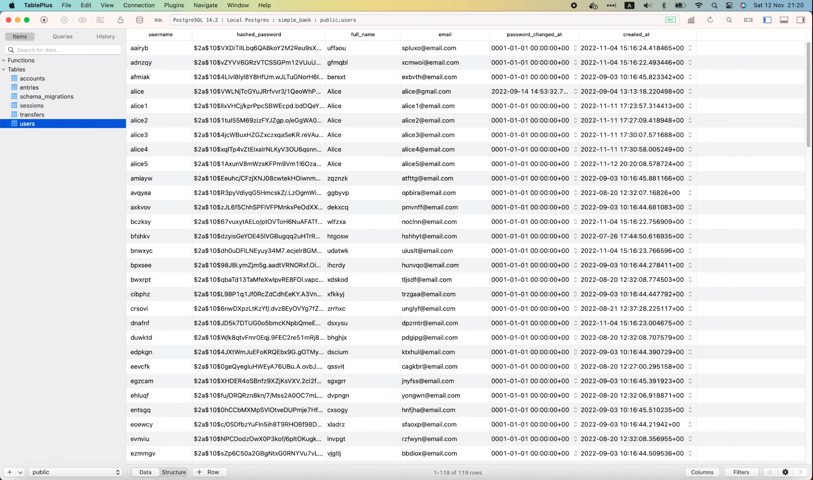

# Why you should send async tasks to Redis within a DB transaction

[Original video](https://www.youtube.com/watch?v=ZfFxdPbgN88)

Hello everyone, welcome to the backend master class. In the previous lecture,
we've integrated an async worker into our web server's API to send a 
verification email after a new user is created. However, as I said last 
time, the way we're doing it right now is not the best.

## Why current solution is not the best

We're trying to send a task to a Redis queue after the query to create a new 
user record in the database is completed. But, what will happen if we cannot 
send the task to Redis? Or in other words, what if this statement

```go
err = server.taskDistributor.DistributeTaskSendVerifyEmail(ctx, taskPayload, opts...)
```

returns a not-nil error?

Well, how about we start the server and try it out?

```shell
make server
go run main.go
9:19PM INF db migrated successfully
9:19PM INF start gRPC server at [::]:9090
9:19PM INF start task processor
asynq: pid=44557 2022/11/12 20:19:39.232061 INFO: Starting processing
9:19PM INF start HTTP gateway server at [::]:8080
```

OK, now the server is up and running.

What I'm gonna do is, on a new terminal, run

```shell
docker stop redis
```

to stop the Redis server. Then let's open Postman and try to send this
`CreateUser` request with a new username and email: "alice5".


As you can see, this time, we got an error: "failed to distribute task to 
send verify email". That's because our Golang server couldn't connect to 
Redis to send the task. If we look at the logs, there are a lot of errors 
print out here,


because `asynq` is unable to connect to Redis. However, that's not a 
problem. The main problem is in the Postgres database,



user "alice5" is already successfully inserted. But from the client's point
of view,since it received a `500 Internal Error`, it will think that the 
server fails to create the user, and might attempt to retry sending the
same request. And if it does so, it will receive another error: "username
already exists".


This behavior is not acceptable, because on one hand, it prevents user 
from retrying, and on the other hand, the verify email will never be sent
to the user, and thus, there's no way for them to know that their account
has been created.

So how can we fix it?

As I've suggested in the previous video, we should send the task to Redis
in the same DB transaction with the one that inserts the new user into 
the database. That way, if it fails to send the task, the whole transaction
will be rolled back and the user won't exist in the database, which means,
the client can safely retry the request without any issues.

Alright, let me show you how to do that!

## Send the task to Redis in DB transaction

In the `db/sqlc` folder, I'm gonna create a new file called 
`tx_create_user.go`. We will implement the transaction to create a new
user in this file. It should be pretty similar to the transfer money 
transaction that we wrote in lecture 6 and by the way, I'm gonna refactor
the codes a bit to make it cleaner. Let's move all of the codes related 
to this transfer transaction to a new file called `tx_transfer.go`. OK,
so now each transaction is written in its own separate file.

I'm gonna copy some code of this transfer transaction

```go
type TransferTxParams struct {
	FromAccountID int64 `json:"from_account_id"`
	ToAccountID   int64 `json:"to_account_id"`
	Amount        int64 `json:"amount"`
}

type TransferTxResult struct {
	Transfer    Transfer `json:"transfer"`
	FromAccount Account  `json:"from_account"`
	ToAccount   Account  `json:"to_account"`
	FromEntry   Entry    `json:"from_entry"`
	ToEntry     Entry    `json:"to_entry"`
}

var txKey = struct{}{}

func (store *SQLStore) TransferTx(ctx context.Context, arg TransferTxParams) (TransferTxResult, error) {
	var result TransferTxResult

	err := store.execTx(ctx, func(q *Queries) error {
		var err error

		txName := ctx.Value(txKey)

		fmt.Println(txName, "create transfer")
		result.Transfer, err = q.CreateTransfer(ctx, CreateTransferParams{
			FromAccountID: arg.FromAccountID,
			ToAccountID:   arg.ToAccountID,
			Amount:        arg.Amount,
		})
		if err != nil {
			return err
		}

		fmt.Println(txName, "create entry 1")
		result.FromEntry, err = q.CreateEntry(ctx, CreateEntryParams{
			AccountID: arg.FromAccountID,
			Amount:    -arg.Amount,
		})
		if err != nil {
			return err
		}

		fmt.Println(txName, "create entry 2")
		result.ToEntry, err = q.CreateEntry(ctx, CreateEntryParams{
			AccountID: arg.ToAccountID,
			Amount:    arg.Amount,
		})
		if err != nil {
			return err
		}

		if arg.FromAccountID < arg.ToAccountID {
			result.FromAccount, result.ToAccount, err = addMoney(ctx, q, arg.FromAccountID, -arg.Amount, arg.ToAccountID, arg.Amount)
		} else {
			result.ToAccount, result.FromAccount, err = addMoney(ctx, q, arg.ToAccountID, arg.Amount, arg.FromAccountID, -arg.Amount)
		}

		return nil
	})

	return result, err
}
```

and paste it to our `create_user` transaction. Then let's change all 
occurrences of `TransferTx` to `CreateUserTx`.

Next, I will delete all the codes that only related to the transfer 
transaction. That way we will have a clean code snippet to implement our
new transaction.

```go
type CreateUserTxParams struct {
}

type CreateUserTxResult struct {
}

func (store *SQLStore) CreateUserTx(ctx context.Context, arg CreateUserTxParams) (CreateUserTxResult, error) {
	var result CreateUserTxResult

	err := store.execTx(ctx, func(q *Queries) error {
		var err error

		return err
	})

	return result, err
}
```

Alright, now the transaction is almost empty.

First, let's fill in the `create_user` transaction parameters. As you 
might have guessed, we need to have the `CreateUserParams` in order to 
call the `CreateUser` function of the store, so I embed it here inside
the `CreateUserTxParams` struct. Then, we will add a very special parameter
called `AfterCreate`. And it's special because it is in fact a callback
function, which takes a user as input and returns an error.

```go
type CreateUserTxParams struct {
	CreateUserParams
	AfterCreate func(user User) error
}
```

The idea is, this function will be executed after the user is inserted, 
inside the same transaction. And its output error will be used to decide 
whether to commit or rollback the transaction. Then from outside, we will 
use the callback function to send the async task to Redis.

OK, let's go back to the transaction, and fill in the fields for the 
`CreateUserTxResult`. In this case, the transaction will have only 1 single
output: the created user record.

```go
type CreateUserTxResult struct {
	User User
}
```

Alright, next, let's implement the body of the transaction. I'm gonna use
the `q` argument of this function

```go
err := store.execTx(ctx, func(q *Queries) error {
    var err error

    return err
})
```

to call `q.CreateUser()` with the input context, and the `CreateUserParams`
we got from the input argument of the transaction. This function will 
return a User record and an error. So we can store the output directly 
inside the `result.User` field.

```go
func (store *SQLStore) CreateUserTx(ctx context.Context, arg CreateUserTxParams) (CreateUserTxResult, error) {
	var result CreateUserTxResult

	err := store.execTx(ctx, func(q *Queries) error {
		var err error

		result.User, err = q.CreateUser(ctx, arg.CreateUserParams)

		return err
	})

	return result, err
}
```

Then let's check if error is `nil` or not. If it is not `nil`, we simply
return it, so the transaction can be rolled back. Otherwise, the user has
been successfully created, so it's time to execute the callback function:
`arg.AfterCreate()` and pass in the created `result.User` as input. The
output error of this function will be returned, so that the transaction can
be rolled back in case error is not `nil`.

```go
func (store *SQLStore) CreateUserTx(ctx context.Context, arg CreateUserTxParams) (CreateUserTxResult, error) {
	var result CreateUserTxResult

	err := store.execTx(ctx, func(q *Queries) error {
		var err error

		result.User, err = q.CreateUser(ctx, arg.CreateUserParams)
		if err != nil {
			return err
		}
		err = arg.AfterCreate(result.User)
		return err
	})

	return result, err
}
```

We can also combine these 2 statements

```go
err = arg.AfterCreate(result.User)
return err
```

into 1 single statement like this.

```go
return arg.AfterCreate(result.User)
```

And that's it! The `CreateUser` transaction is completed.

Now we can go back to the `CreateUser` RPC to use it.

However, we will need to add the new transaction to the `Store` interface 
first, because we're using this interface as a layer of abstraction, so 
it can be easily mocked when we want to unit test the APIs. All we have
to do is to copy the function signature of the `CreateUserTx` and paste
it inside the `Store` interface.

```go
type Store interface {
	Querier
	TransferTx(ctx context.Context, arg TransferTxParams) (TransferTxResult, error)
	CreateUserTx(ctx context.Context, arg CreateUserTxParams) (CreateUserTxResult, error)
}
```

OK, now it's ready to be used. In the `CreateUser` RPC, we can replace
this `store.CreateUser` function call

```go
func (server *Server) CreateUser(ctx context.Context, req *pb.CreateUserRequest) (*pb.CreateUserResponse, error) {
	...

	user, err := server.store.CreateUser(ctx, arg)
	...
}
```

with the new transaction.

But first, I'm gonna update the input argument to `db.CreateUserTxParams`
and its first field is `CreateUserParams`.

```go
arg := db.CreateUserTxParams{
    CreateUserParams: db.CreateUserParams{
        
    },
    Username:       req.GetUsername(),
    HashedPassword: hashedPassword,
    FullName:       req.GetFullName(),
    Email:          req.GetEmail(),
}
```

We can move all of these data inside this object.

```go
arg := db.CreateUserTxParams{
    CreateUserParams: db.CreateUserParams{
        Username:       req.GetUsername(),
        HashedPassword: hashedPassword,
        FullName:       req.GetFullName(),
        Email:          req.GetEmail(),
    },
}
```

Then the second field is a `AfterCreate` callback function. This is the 
place where we should send an async task to Redis. So let's move all of 
these codes

```go
taskPayload := &worker.PayloadSendVerifyEmail{
    Username: user.Username,
}
opts := []asynq.Option{
    asynq.MaxRetry(10),
    asynq.ProcessIn(10 * time.Second),
    asynq.Queue(worker.QueueCritical),
}
err = server.taskDistributor.DistributeTaskSendVerifyEmail(ctx, taskPayload, opts...)
if err != nil {
    return nil, status.Errorf(codes.Internal, "failed to distribute task to send verify email: %s", err)
}
```

inside the callback function. Most of its content can be kept the same,
except for the error checking part, which we can safely remove, and just
return it to the caller of the callback function, which is the create
user transaction code that we've written before.

```go
arg := db.CreateUserTxParams{
    CreateUserParams: db.CreateUserParams{
        Username:       req.GetUsername(),
        HashedPassword: hashedPassword,
        FullName:       req.GetFullName(),
        Email:          req.GetEmail(),
    },
    AfterCreate: func(user db.User) error {
        taskPayload := &worker.PayloadSendVerifyEmail{
            Username: user.Username,
        }
        opts := []asynq.Option{
            asynq.MaxRetry(10),
            asynq.ProcessIn(10 * time.Second),
            asynq.Queue(worker.QueueCritical),
        }
        return server.taskDistributor.DistributeTaskSendVerifyEmail(ctx, taskPayload, opts...)
    },
}
```

So now we have prepared the input data for the transaction, it's time to
change this `store.CreateUser` function call to `CreateUserTx`.

```go
func (server *Server) CreateUser(ctx context.Context, req *pb.CreateUserRequest) (*pb.CreateUserResponse, error) {
	...

	user, err := server.store.CreateUserTx(ctx, arg)
	...
}
```

The output of this function has also changed compared to before, so I'm
gonna save it in a new variable called `txResult`. And we can get the 
created user record via that `txResult.User` field.

```go
func (server *Server) CreateUser(ctx context.Context, req *pb.CreateUserRequest) (*pb.CreateUserResponse, error) {
    ...
	txResult, err := server.store.CreateUserTx(ctx, arg)
	if err != nil {
		if pqErr, ok := err.(*pq.Error); ok {
			switch pqErr.Code.Name() {
			case "unique_violation":
				return nil, status.Errorf(codes.AlreadyExists, "username already exists: %s", err)
			}
		}
		return nil, status.Errorf(codes.Internal, "failed to create user: %s", err)
	}

	rsp := &pb.CreateUserResponse{
		User: convertUser(txResult.User),
	}
	return rsp, nil
}
```

And that will be it!

We've updated the codes to send task to Redis in the same DB transaction
that creates a new user.

Now let's restart the server and test it out.

```shell
make server
```


Since the Redis server is not running, we will see a lot of error logs
from `asynq`.

In Postman, I'm gonna change the username and email to "alice6" and send
the request to create this new user.


As expected, the request failed because the server cannot send task to 
Redis, but this time, if we look at the database, we will see that user
"alice6" doesn't exist.


That's because the transaction has been rolled back, when the call to 
send task to Redis failed.

This will allow the client to retry the same request without any issues.
To prove that, I'm gonna start the Redis server.

```shell
docker start redis
```

As soon as the Redis server is up and running, we will no longer see error
logs from `asynq`. Let's clear the screen to make it easier to read 
future logs.

Now, I'm gonna resend the same request in Postman.


As you can see, this time the request is successful. A new user has been
created. And if we look at the logs, it's saying that a task to send verify
email has been enqueued.

```shell
9:31PM INF enqueued task max_retry=10 payload="{\"username\":\"alice6\"}" queue=critical type=task:send_verify_email
9:31PM INF received an HTTP request duration=83.760943 method=POST path=/v1/create_user protocol=http status_code=200 status_text=OK
```

We also see user "alice6" shows up in the database. And after about 10
seconds, the task has been successfully processed.

```shell
9:32PM INF processed task email=alice6@email.com payload="{\"username\":\"alice6\"}" type=task:send_verify_email
```

Awesome!

Before we finish, you might notice that there are several errors in some
test files of the `api` package. And if we look into this error, it's 
saying: "MockStore doesn't implement the db.Store interface (missing 
method CreateUserTx)". That's because we have added a new function 
`CreateUserTx` to the `Store` interface, but we haven't regenerated the 
mocking codes for that function yet. So to fix this, all we have to do is
regenerating the `MockStore`.

Let's open the terminal and run:

```shell
make mock
mockgen -package mockdb -destination db/mock/store.go github.com/MaksimDzhangirov/backendBankExample/db/sqlc Store
```

And that's it!

Now if we go back to the codes, we will see that all errors are gone.

And that wraps up today's lecture about sending async tasks to Redis 
within a DB transaction.

I hope it was interesting and useful for you. Thanks a lot for watching,
happy learning, and see you in the next lecture!