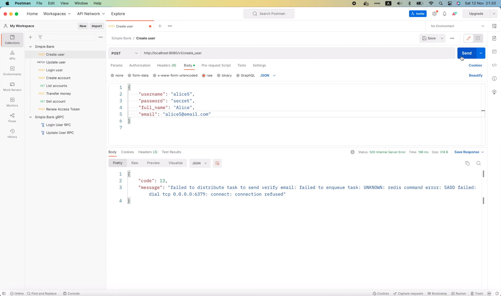

# Почему вы должны отправлять асинхронные задачи в Redis в рамках транзакции БД

[Оригинал](https://www.youtube.com/watch?v=ZfFxdPbgN88)

Всем привет, рад вас снова видеть на мастер-классе по бэкенду. На предыдущей
лекции мы интегрировали асинхронный воркер в API нашего веб-сервера, чтобы
отправлять письма для подтверждения адреса электронной почты после создания
нового пользователя. Однако, как я уже говорил на прошлой лекции, сейчас
мы реализовали не самое лучшее решение проблемы.

## Почему текущее решение не самое лучшее

Мы пытаемся отправить задачу в очередь Redis после того как выполнится 
запрос на создание новой записи пользователя в базе данных. Но что 
произойдет, если мы не сможем отправить задачу в Redis? Или, другими 
словами, что, если эта команда

```go
err = server.taskDistributor.DistributeTaskSendVerifyEmail(ctx, taskPayload, opts...)
```

вернёт ошибку не равную `nil`?

Что ж, запустим сервер и попробуем смоделировать эту ситуацию?

```shell
make server
go run main.go
9:19PM INF db migrated successfully
9:19PM INF start gRPC server at [::]:9090
9:19PM INF start task processor
asynq: pid=44557 2022/11/12 20:19:39.232061 INFO: Starting processing
9:19PM INF start HTTP gateway server at [::]:8080
```

Хорошо, теперь сервер запущен и работает.

Теперь в новом окне терминала я выполню

```shell
docker stop redis
```

чтобы остановить Redis сервер. Затем давайте откроем Postman и попробуем 
отправить следующий запрос `CreateUser` с новым именем пользователя и 
электронной почтой: "alice5".



Как видите, на этот раз мы получили ошибку: "failed to distribute task to
send verify email" («не удалось распределить задачу отправки письма для 
подтверждения адреса электронной почты». Она возникла, поскольку наш 
Golang сервер не смог подключиться к Redis для отправки задачи. Если мы 
посмотрим логи, то увидим, что подряд выводится множество ошибок,


потому что `asynq` не может подключиться к Redis. Однако, проблема не в 
этом. Основная проблема в базе данных Postgres,


так как пользователь "alice5" успешно вставлен в таблицу. Но с точки 
зрения клиента, поскольку он получил `500 Internal Error`, он будет 
думать, что серверу не удалось создать пользователя, и может попытаться 
повторно отправить тот же запрос. И если он это сделает, то получит ещё 
одну ошибку: "username already exists" («данное имя пользователя уже 
существует»). 


Такое поведение неприемлемо, потому что, с одной стороны, оно не позволяет
пользователю повторить попытку, а с другой стороны, электронное письмо с 
подтверждением никогда не будет отправлено пользователю, и, таким образом, 
он не сможет узнать, что его учетная запись была создана.

Итак, как мы можем это исправить?

Как я предложил в предыдущем видео, мы должны отправить задачу в Redis
в рамках той же транзакции БД, которая вставляет нового пользователя в 
базу данных. Таким образом, если ему не удастся отправить задачу, вся 
транзакция будет отменена, и пользователя не будет существовать в базе 
данных, а это означает, что клиент может безопасно повторить запрос без 
каких-либо проблем.

Хорошо, позвольте мне показать вам, как это сделать!

## Отправляем задачу в Redis в рамках транзакции БД

В папке `db/sqlc` я создам новый файл под названием `tx_create_user.go`.
Мы реализуем транзакцию для создания нового пользователя в этом файле.
Она должна быть очень похожа на транзакцию для перевода денег, которую мы
писали в лекции 6, и, кстати, я собираюсь немного отрефакторить код, чтобы
сделать его понятным. Давайте переместим весь код, связанный с этой 
транзакцией в новый файл с названием `tx_transfer.go`. Итак, теперь каждая
транзакция будет реализовываться в своём отдельном файле.

Я скопирую кое-какой код из этой транзакции для перевода денег

```go
type TransferTxParams struct {
	FromAccountID int64 `json:"from_account_id"`
	ToAccountID   int64 `json:"to_account_id"`
	Amount        int64 `json:"amount"`
}

type TransferTxResult struct {
	Transfer    Transfer `json:"transfer"`
	FromAccount Account  `json:"from_account"`
	ToAccount   Account  `json:"to_account"`
	FromEntry   Entry    `json:"from_entry"`
	ToEntry     Entry    `json:"to_entry"`
}

var txKey = struct{}{}

func (store *SQLStore) TransferTx(ctx context.Context, arg TransferTxParams) (TransferTxResult, error) {
	var result TransferTxResult

	err := store.execTx(ctx, func(q *Queries) error {
		var err error

		txName := ctx.Value(txKey)

		fmt.Println(txName, "create transfer")
		result.Transfer, err = q.CreateTransfer(ctx, CreateTransferParams{
			FromAccountID: arg.FromAccountID,
			ToAccountID:   arg.ToAccountID,
			Amount:        arg.Amount,
		})
		if err != nil {
			return err
		}

		fmt.Println(txName, "create entry 1")
		result.FromEntry, err = q.CreateEntry(ctx, CreateEntryParams{
			AccountID: arg.FromAccountID,
			Amount:    -arg.Amount,
		})
		if err != nil {
			return err
		}

		fmt.Println(txName, "create entry 2")
		result.ToEntry, err = q.CreateEntry(ctx, CreateEntryParams{
			AccountID: arg.ToAccountID,
			Amount:    arg.Amount,
		})
		if err != nil {
			return err
		}

		if arg.FromAccountID < arg.ToAccountID {
			result.FromAccount, result.ToAccount, err = addMoney(ctx, q, arg.FromAccountID, -arg.Amount, arg.ToAccountID, arg.Amount)
		} else {
			result.ToAccount, result.FromAccount, err = addMoney(ctx, q, arg.ToAccountID, arg.Amount, arg.FromAccountID, -arg.Amount)
		}

		return nil
	})

	return result, err
}
```

и вставлю его в нашу транзакцию `create_user`. Затем давайте изменим 
все вхождения `TransferTx` на `CreateUserTx`.

Далее я удалю весь код, касающийся только транзакции для перевода. Таким 
образом, у нас будет очищенный от ненужных частей фрагмент кода для 
реализации нашей новой транзакции.

```go
type CreateUserTxParams struct {
}

type CreateUserTxResult struct {
}

func (store *SQLStore) CreateUserTx(ctx context.Context, arg CreateUserTxParams) (CreateUserTxResult, error) {
	var result CreateUserTxResult

	err := store.execTx(ctx, func(q *Queries) error {
		var err error

		return err
	})

	return result, err
}
```

Хорошо, в настоящий момент внутри нашей транзакции почти ничего нет.

Во-первых, давайте заполним параметры транзакции `create_user`.
Как вы могли догадаться, нам нужны `CreateUserParams`, чтобы вызвать
функцию `CreateUser` хранилища, поэтому я встрою их сюда, в структуру
`CreateUserTxParams`. Затем мы добавим специальный параметр 
`AfterCreate`. Его особенность заключается в том, что на самом деле
это функция обратного вызова, которая принимает пользователя в качестве 
входных данных и возвращает ошибку.

```go
type CreateUserTxParams struct {
	CreateUserParams
	AfterCreate func(user User) error
}
```

Идея заключается в том, что эта функция будет выполняться после вставки
пользователя в рамках той же транзакции. И выдаваемая ей ошибка будет 
использоваться для принятия решения о фиксации или откате транзакции.
Затем извне мы будем использовать функцию обратного вызова для отправки 
асинхронной задачи в Redis.

Хорошо, давайте вернемся к транзакции и заполним поля для 
`CreateUserTxResult`. В нашем случае транзакция будет возвращать в 
качестве результата только одну переменную: созданную запись пользователя. 

```go
type CreateUserTxResult struct {
	User User
}
```

Итак, теперь давайте реализуем тело транзакции. Я воспользуюсь аргументом
`q` этой функции

```go
err := store.execTx(ctx, func(q *Queries) error {
    var err error

    return err
})
```

для вызова `q.CreateUser()` передав в функцию входной контекст и
`CreateUserParams`, которые мы получили из входного аргумента транзакции.
Эта функция вернет созданную в БД запись пользователя `User` и ошибку.
Таким образом, мы можем сохранить результат непосредственно в 
поле `result.User`.

```go
func (store *SQLStore) CreateUserTx(ctx context.Context, arg CreateUserTxParams) (CreateUserTxResult, error) {
	var result CreateUserTxResult

	err := store.execTx(ctx, func(q *Queries) error {
		var err error

		result.User, err = q.CreateUser(ctx, arg.CreateUserParams)

		return err
	})

	return result, err
}
```

Затем давайте проверим равна ли ошибка `nil`. Если нет, мы просто 
возвращаем её, чтобы транзакцию можно было откатить. В противном случае 
пользователь был успешно создан, поэтому пришло время выполнить функцию 
обратного вызова: `arg.AfterCreate()` и передать созданную запись о 
пользователе `result.User` в качестве входных данных. В качестве результата
выполнения этой функции будет возвращена ошибка, так что транзакцию можно
будет откатить, если она не равна `nil`.

```go
func (store *SQLStore) CreateUserTx(ctx context.Context, arg CreateUserTxParams) (CreateUserTxResult, error) {
	var result CreateUserTxResult

	err := store.execTx(ctx, func(q *Queries) error {
		var err error

		result.User, err = q.CreateUser(ctx, arg.CreateUserParams)
		if err != nil {
			return err
		}
		err = arg.AfterCreate(result.User)
		return err
	})

	return result, err
}
```

Мы также можем объединить эти 2 команды

```go
err = arg.AfterCreate(result.User)
return err
```

в одну следующим образом.

```go
return arg.AfterCreate(result.User)
```

Вот и всё! Мы завершили работу над транзакцией `CreateUser`.

Теперь мы можем вернуться к RPC `CreateUser`, чтобы воспользоваться ею.

Однако сначала нам нужно будет добавить новую транзакцию в интерфейс `Store`,
так как мы используем этот интерфейс как уровень абстракции, чтобы
его можно было легко имитировать, когда мы хотим осуществить unit
тестирование API. Всё, что нам нужно сделать, это скопировать сигнатуру 
функции `CreateUserTx` и вставить ее в интерфейс `Store`.

```go
type Store interface {
	Querier
	TransferTx(ctx context.Context, arg TransferTxParams) (TransferTxResult, error)
	CreateUserTx(ctx context.Context, arg CreateUserTxParams) (CreateUserTxResult, error)
}
```

Хорошо, теперь транзакцию можно использовать. В RPC `CreateUser` мы можем 
заменить этот вызов функции `store.CreateUser`

```go
func (server *Server) CreateUser(ctx context.Context, req *pb.CreateUserRequest) (*pb.CreateUserResponse, error) {
	...

	user, err := server.store.CreateUser(ctx, arg)
	...
}
```

новой транзакцией.

Но сначала изменю входной аргумент на `db.CreateUserTxParams`, а его первое
поле — на `CreateUserParams`.

```go
arg := db.CreateUserTxParams{
    CreateUserParams: db.CreateUserParams{
        
    },
    Username:       req.GetUsername(),
    HashedPassword: hashedPassword,
    FullName:       req.GetFullName(),
    Email:          req.GetEmail(),
}
```

Мы можем переместить все эти данные внутрь этого объекта.

```go
arg := db.CreateUserTxParams{
    CreateUserParams: db.CreateUserParams{
        Username:       req.GetUsername(),
        HashedPassword: hashedPassword,
        FullName:       req.GetFullName(),
        Email:          req.GetEmail(),
    },
}
```

Затем вторым полем будет функция обратного вызова `AfterCreate`.
В ней мы должны отправить асинхронную задачу в Redis. Итак, давайте 
переместим весь этот код 

```go
taskPayload := &worker.PayloadSendVerifyEmail{
    Username: user.Username,
}
opts := []asynq.Option{
    asynq.MaxRetry(10),
    asynq.ProcessIn(10 * time.Second),
    asynq.Queue(worker.QueueCritical),
}
err = server.taskDistributor.DistributeTaskSendVerifyEmail(ctx, taskPayload, opts...)
if err != nil {
    return nil, status.Errorf(codes.Internal, "failed to distribute task to send verify email: %s", err)
}
```

внутрь функции обратного вызова. Большую его часть можно оставить без 
изменений, за исключением той, где происходит проверка ошибок. Её мы можем
безопасно удалить и просто вернуть ошибку тому, кто вызвал функцию 
обратного вызова, а именно коду транзакции создания пользователя, который
мы написали ранее.

```go
arg := db.CreateUserTxParams{
    CreateUserParams: db.CreateUserParams{
        Username:       req.GetUsername(),
        HashedPassword: hashedPassword,
        FullName:       req.GetFullName(),
        Email:          req.GetEmail(),
    },
    AfterCreate: func(user db.User) error {
        taskPayload := &worker.PayloadSendVerifyEmail{
            Username: user.Username,
        }
        opts := []asynq.Option{
            asynq.MaxRetry(10),
            asynq.ProcessIn(10 * time.Second),
            asynq.Queue(worker.QueueCritical),
        }
        return server.taskDistributor.DistributeTaskSendVerifyEmail(ctx, taskPayload, opts...)
    },
}
```

Итак, теперь когда мы подготовили входные данные для транзакции, пришло 
время изменить вызов функции `store.CreateUser` на `CreateUserTx`.

```go
func (server *Server) CreateUser(ctx context.Context, req *pb.CreateUserRequest) (*pb.CreateUserResponse, error) {
	...

	user, err := server.store.CreateUserTx(ctx, arg)
	...
}
```

То, что эта функция возвращает также изменилось, поэтому я сохраню 
результат в новой переменной под названием `txResult`. И мы можем 
получить созданную запись о пользователе, обратившись к полю 
`txResult.User`.

```go
func (server *Server) CreateUser(ctx context.Context, req *pb.CreateUserRequest) (*pb.CreateUserResponse, error) {
    ...
	txResult, err := server.store.CreateUserTx(ctx, arg)
	if err != nil {
		if pqErr, ok := err.(*pq.Error); ok {
			switch pqErr.Code.Name() {
			case "unique_violation":
				return nil, status.Errorf(codes.AlreadyExists, "username already exists: %s", err)
			}
		}
		return nil, status.Errorf(codes.Internal, "failed to create user: %s", err)
	}

	rsp := &pb.CreateUserResponse{
		User: convertUser(txResult.User),
	}
	return rsp, nil
}
```

И это всё что нам нужно сделать!

Мы обновили код, чтобы отправка задачи в Redis осуществилась в рамках той 
же транзакции БД, которая создает нового пользователя.

Теперь давайте перезапустим сервер и протестируем его работу.

```shell
make server
```


Поскольку сервер Redis не запущен, мы увидим множество сообщений об
ошибках в логах от `asynq`.

В Postman я изменю имя пользователя и адрес электронной почты на "alice6" 
и отправлю запрос на создание этого нового пользователя.


Как и ожидалось, выполнить запрос не удалось, потому что сервер не может
отправить задачу в Redis, но на этот раз, мы посмотрим в базу данных, то
увидим, что пользователя «alice6» не существует.


Всё потому, что произошёл откат транзакции, после того как не удалось 
выполнить запрос на отправку задачи в Redis. 

Это позволит клиенту повторить тот же запрос без каких-либо проблем. 
Чтобы доказать это, я запущу сервер Redis.

```shell
docker start redis
```

Как только сервер Redis будет запущен и начнёт работать, мы больше не 
увидим сообщения об ошибках в логах от `asynq`. Давайте очистим экран 
терминала, чтобы было проще читать будущие сообщения в логах.

Теперь я повторно отправлю тот же запрос в Postman.


Как видите, на этот раз запрос выполнен успешно. Создан новый 
пользователь. И если мы посмотрим в логи, то увидим там сообщение о том, 
что задача по отправке письма для подтверждения адреса электронной почты
была поставлена в очередь.

```shell
9:31PM INF enqueued task max_retry=10 payload="{\"username\":\"alice6\"}" queue=critical type=task:send_verify_email
9:31PM INF received an HTTP request duration=83.760943 method=POST path=/v1/create_user protocol=http status_code=200 status_text=OK
```

Мы также видим, что пользователь "alice6" появился в базе данных. И 
примерно через 10 секунд задача была успешно обработана.

```shell
9:32PM INF processed task email=alice6@email.com payload="{\"username\":\"alice6\"}" type=task:send_verify_email
```

Потрясающие!

Прежде чем мы закончим, возможно вы заметили, что в некоторых тестовых 
файлах пакета `api` возникла ошибка. И если мы наведём на неё, то 
увидим текст: "MockStore doesn't implement the db.Store interface (missing
method CreateUserTx)" («MockStore не реализует интерфейс db.Store 
(отсутствует метод CreateUserTx)»). Ошибка возникла из-за того, что мы 
добавили новую функцию `CreateUserTx` к интерфейсу `Store`, но ещё не
перегенерировали код, который имитирует работу этой функции. Итак, чтобы
исправить её, всё, что нам нужно сделать, это перегенерировать `MockStore`.

Давайте откроем терминал и запустим:

```shell
make mock
mockgen -package mockdb -destination db/mock/store.go github.com/MaksimDzhangirov/backendBankExample/db/sqlc Store
```

Вот и всё, что нужно было сделать!

Теперь если мы вернемся к коду, то увидим, что все ошибки пропали.

На этом мы завершим сегодняшнюю лекцию об отправке асинхронных задач в
Redis в рамках транзакции БД.

Надеюсь, она была интересной и полезной для вас. Большое спасибо за 
время, потраченное на чтение, желаю Вам получать удовольствие от 
обучения и до встречи на следующей лекции!