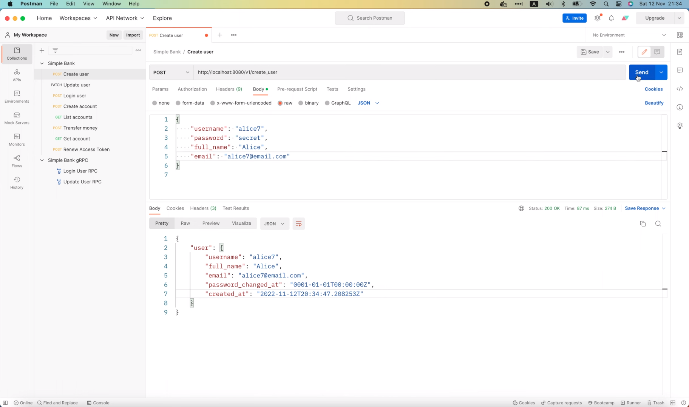

# How to handle errors and print logs for Go Asynq workers

[Original video](https://www.youtube.com/watch?v=YgfmPIJRg2U)

Hello everyone, welcome to the backend master class. Continue with what 
we've doing in the last 3 lectures about implementing async background
workers with Redis. Today let's learn how to handle errors in the 
workers properly.

## How to handle errors in the workers

First, let's see what happens if there's an error during the task 
processing. I'm gonna open Postman, and try to send a new request
with a new username and email: "alice7".



OK, the request is successful, and a task to send an email to this new 
user has been enqueued.

```shell
9:34PM INF enqueued task max_retry=10 payload="{\"username\":\"alice7\"}" queue=critical type=task:send_verify_email
9:34PM INF received an HTTP request duration=83.416061 method=POST path=/v1/create_user protocol=http status_code=200 status_text=OK
```

There's a 10-second delay before this task is picked up by the worker, so
I'm gonna quickly run

```shell
docker stop postgres12
postgres12
```

to stop the database container.

Now, as the DB is stopped, we expect to see some error logs here, because
the worker couldn't be able to query the user information.

As you can see in the code, we're looking for the user by username in
the database,

```go
func (processor RedisTaskProcessor) ProcessTaskSendVerifyEmail(ctx context.Context, task *asynq.Task) error {
	...
    user, err := processor.store.GetUser(ctx, payload.Username)
    if err != nil {
        if err == sql.ErrNoRows {
            return fmt.Errorf("user doen't exist: %w", asynq.SkipRetry)
        }
        return fmt.Errorf("failed to get user: %w", err)
    }
	...
}
```

so that we can have the address to send the verification email.

However, even after 10 seconds, there are still no error logs or anything 
showing up to tell us what happens to the task.

This makes me think that the task has already been executed and failed, 
but `asynq` didn't print out any logs because we haven't specified how 
errors in the tasks should be handled.

To confirm this, let's go back to the code, and open the `processor.go`
file. Here, when creating the `asynq` server,

```go
func NewRedisTaskProcessor(redisOpt asynq.RedisClientOpt, store db.Store) TaskProcessor {
    server := asynq.NewServer(
        redisOpt,
        asynq.Config{
            Queues: map[string]int{
                QueueCritical: 10,
                QueueDefault:  5,
            },
        },
    )
	...
}
```

we have an option to set an error handler function.

```go
ErrorHandler ErrorHandler
```

This function will be executed whenever there's an error in the task.
You can see an example hare.

```go
// ErrorHandler handles errors returned by the task handler.
//
// HandleError is invoked only if the task handler returns a non-nil error.
//
// Example:
//
//     func reportError(ctx context, task *asynq.Task, err error) {
//         retried, _ := asynq.GetRetryCount(ctx)
//         maxRetry, _ := asynq.GetMaxRetry(ctx)
//     	   if retried >= maxRetry {
//             err = fmt.Errorf("retry exhausted for task %s: %w", task.Type, err)
//     	   }
//         errorReportingService.Notify(err)
//     })
//
//     ErrorHandler: asynq.ErrorHandlerFunc(reportError)
ErrorHandler ErrorHandler
```

This `reportError` function will basically send a notification if a task
failed and the maximum number of retries has been reached. The 
`ErrorHandler` is in fact an interface with only 1 function: `HandleError`

```go
// An ErrorHandler handles an error occured during task processing.
type ErrorHandler interface {
	HandleError(ctx context.Context, task *Task, err error)
}
```

which takes a context, a task and error as input arguments.

Let's go back to the task processor to add it to our `asynq` server.

Here, in the `asynq.Config`, I'm gonna add the `ErrorHandler`. Its type
is gonna be `asynq.ErrorHandlerFunc`. This type is already defined in
the `asynq` package as an alias of this function signature.

```go
type ErrorHandlerFunc func(ctx context.Context, task *Task, err error)
```

So I'm gonna copy it, and paste it to our code, like this.

```go
func NewRedisTaskProcessor(redisOpt asynq.RedisClientOpt, store db.Store) TaskProcessor {
    server := asynq.NewServer(
        redisOpt,
        asynq.Config{
            Queues: map[string]int{
                QueueCritical: 10,
                QueueDefault:  5,
            },
            ErrorHandler: asynq.ErrorHandlerFunc(func(ctx context.Context, task *Task, err error) {
            
            }),
        },
    )
	...
}
```

It is in fact a type conversion, but for function instead of normal 
variable. And we will have to add the `asynq` package here,

```go
ErrorHandler: asynq.ErrorHandlerFunc(func(ctx context.Context, task *asynq.Task, err error)
```

because that's where the `Task` type is defined.

Alright, now all we need to do is print out some logs in this function.
Let's call `log.Error().Msg()` and write a simple message here, such as:
"process task failed". I'm gonna add the original error here to let us
know why it failed. We should also print out the type of the task, and
maybe the task payload as well, to make it easier to debug if necessary.
All of these infos are provided in the task parameter of this function.

```go
func NewRedisTaskProcessor(redisOpt asynq.RedisClientOpt, store db.Store) TaskProcessor {
    server := asynq.NewServer(
        redisOpt,
        asynq.Config{
            Queues: map[string]int{
                QueueCritical: 10,
                QueueDefault:  5,
            },
            ErrorHandler: asynq.ErrorHandlerFunc(func(ctx context.Context, task *Task, err error) {
                log.Error().Err(err).Str("type", task.Type()).
                    Bytes("payload", task.Payload()).Msg("process task failed")
            }),
        },
    )
	...
}
```

OK, now let's go back to the terminal and restart the server.

```
make server
go run main.go
9:39PM FTL cannot create new migrate instance error="dial tcp[::1]:5432: connect: connection refused"
exit status 1
make: *** [server] Error 1
```

Oops, the server couldn't start because the database is not running. So
let's run 

```shell
docker start postgres12
postgres12
```

in this terminal.

Then go back here, and run 

```shell
make server
go run main.go
9:39PM INF db migrated successfully
9:39PM INF start gRPC server at [::]:9090
9:39PM INF start task processor
asynq: pid=47543 2022/11/12 20:39:47.499012 INFO: Starting processing
9:39PM INF start HTTP gateway server at [::]:8080
```

again. Alright, this time the server started successfully.

Now we can run 

```shell
docker stop postgres12
postgres12
```

to stop the DB.

If I go back to the previous terminal tab, we can see that the task to send
email to "alice7" has been processed.

```shell
9:32PM INF processed task email=alice7@email.com payload="{\"username\":\"alice7\"}" type=task:send_verify_email
```

So I think it managed to run before I stop the Postgres server. Then, we 
have no choice but to rerun the test again. First I will start the Postgres
server again so that a new user can be inserted.

```shell
docker start postgres12
postgres12
```

Now let's open Postman, and change the username and email to "alice8" 
and send this create user request to the server.


OK, the request is successful, I'm gonna quickly stop the Postgres server

```shell
docker stop postgres12
postgres12
```

before the send email task is run.

Remember that we have 10 seconds delay.

This time, after a while, an error log shows up on the screen.

```shell
9:40PM ERR process task failed error="failed to get user: dial tcp [::1]:5432: connect: connection refused" payload="{\"username\":\"alice8\"}" type=task:send_verify_email 
```

It says: "process task failed", and the original error is: failed to get 
user, because it cannot connect to the database on localhost port 5432.
We also see the task payload: username "alice8", and the task type 
`send_verify_email` here.

After a little while, this failed task will be retried,

```shell
9:41PM ERR process task failed error="failed to get user: dial tcp [::1]:5432: connect: connection refused" payload="{\"username\":\"alice8\"}" type=task:send_verify_email 
```

and as you can see, it's still unable to connect to the DB, so another 
error is printed out again.

Now let's see that will happen if I start the Postgres container.

```shell
docker start postgres12
postgres12
```

And go back to the server to watch the logs.

This time, the task is successfully processed.

```shell
9:41PM INF processed task email=alice8@email.com payload="{\"username\":\"alice8\"}" type=task:send_verify_email
```

Awesome!

If you wonder how long does it take before the task is retried, you can
take a look at the `asynq` server config. There's a Retry Delay function

```go
// Function to calculate retry delay for a failed task.
//
// By default, it uses exponential backoff algorithm to calculate the delay.
RetryDelayFunc RetryDelayFunc
```

that will allow you to set up your own retry delay duration.

If you don't set this up, then by default, it will use exponential backoff
algorithm to calculate the delay.

Alright, so that's how we print out error logs of the async tasks. You 
can also change the code in the error handler function to send 
notification on your email, slack, or whatever channel you want.

Now I'm gonna show you one more thing.

## Fix `asynq` logging format for some messages 

If you look at the logs of the server, you will notice that some logs
from `asynq` is not well formatted.

```shell
asynq: pid=47543 2022/11/12 20:39:47.499012 INFO: Starting processing
```

Let's see what happens if we suddenly stop the Redis server.

```shell
docker stop redis
redis
```

As you can see, a lot of `asynq` error logs are printed out here,

```shell
redis: 2022/11/12 21:42:18 pubsub.go:159: redis: discarding bad PubSub connection: EOF
redis: 2022/11/12 21:42:18 pubsub.go:159: redis: discarding bad PubSub connection: EOF
redis: 2022/11/12 21:42:18 pubsub.go:159: redis: discarding bad PubSub connection: EOF
asynq: pid=47543 2022/11/12 20:42:19.189548 ERROR: Dequeue error: UNKNOWN: redis eval error: dial tcp 0.0.0.0:6379: connect: connection refused
asynq: pid=47543 2022/11/12 20:42:19.681271 ERROR: Failed to delete expired completed tasks from queue "default": INTERNAL_ERROR: redis eval error: dial tcp 0.0.0.0:6379: connect: connection refused
asynq: pid=47543 2022/11/12 20:42:19.758938 ERROR: Failed to delete expired completed tasks from queue "critical": INTERNAL_ERROR: redis eval error: dial tcp 0.0.0.0:6379: connect: connection refused
asynq: pid=47543 2022/11/12 20:42:22.205767 ERROR: Dequeue error: UNKNOWN: redis eval error: dial tcp 0.0.0.0:6379: connect: connection refused
```

but they don't follow the logging format of our web server, so there 
might be a problem if we want to parse and index the logs for monitoring
and searching later.

Let's start the Redis server again,

```shell
docker start redis
redis
```

and next, I'm gonna show you how to force `asynq` to follow our log 
format.

If we continue looking at the `asynq` server config, we will see there's
a `Logger` field, which will allow us to specify a custom logger for
the `asynq` server.

```go
// Logger specifies the logger used by the server instance.
//
// If unset, default logger is used.
Logger Logger
```

And there's also a `LogLevel` field to tell it what is the minimum log 
level that should be written.

```go
// LogLevel specifies the minimum log level to enable.
//
// If unset, InfoLevel is used by default.
LogLevel LogLevel
```

Now, if we open  the definition of this `Logger`,

```go
// Logger supports logging at various log levels.
type Logger interface {
	// Debug logs a message at Debug level.
	Debug(args ...interface{})

	// Info logs a message at Info level.
	Info(args ...interface{})

	// Warn logs a message at Warning level.
	Warn(args ...interface{})

	// Error logs a message at Error level.
	Error(args ...interface{})

	// Fatal logs a message at Fatal level
	// and process will exit with status set to 1.
	Fatal(args ...interface{})
}
```

we will see that it's also an interface with 5 functions corresponding
to the 5 different levels of log: "Debug", "Info", "Warn", "Error" and
"Fatal".

So to write a custom logger, we will have to implement a struct with 
all of these functions.

So let's go back to our code, and in the worker package, I'm gonna create
a new file called `logger.go`. Then let's paste in all 5 functions that
I've copied from the `Logger` interface before. Next, I'm gonna define
a new type `Logger` struct and a function to create a new `Logger` object.
It doesn't need to store any data, so let's just return an empty `Logger`.

```go
type Logger struct {
}

func NewLogger() *Logger {
	return &Logger{}
}

// Debug logs a message at Debug level.
Debug(args ...interface{})

// Info logs a message at Info level.
Info(args ...interface{})

// Warn logs a message at Warning level.
Warn(args ...interface{})

// Error logs a message at Error level.
Error(args ...interface{})

// Fatal logs a message at Fatal level
// and process will exit with status set to 1.
Fatal(args ...interface{})
```

Now, what we need to do is to add the logger receiver in front of these 5
functions to turn them all into methods of the `Logger` struct. That's how
we make our custom `Logger` struct to implement all required functions
of the `asynq` Logger interface.

```go
// Debug logs a message at Debug level.
func (logger *Logger) Debug(args ...interface{}) {

}

// Info logs a message at Info level.
func (logger *Logger) Info(args ...interface{}) {

}

// Warn logs a message at Warning level.
func (logger *Logger) Warn(args ...interface{}) {

}

// Error logs a message at Error level.
func (logger *Logger) Error(args ...interface{}) {

}

// Fatal logs a message at Fatal level
// and process will exit with status set to 1.
func (logger *Logger) Fatal(args ...interface{}) {

}
```

Now, the hard part is, how to print out the logs in our desired format?

Well, in fact, it's not that hard! I'm gonna add one more method called
`Print()` to the `Logger` struct.

This method will be shared and called by all other 5 functions, because
they all want the same thing: print out the logs, just at different levels.

So, level is one parameter of this function, and its type should be 
`zerolog.Level`. The rest arguments is gonna be interfaces.

```go
func (logger *Logger) Print(level zerolog.Level, args ...interface{}) {

}
```

Now, in this function, we can call `log.WithLevel()` and pass in the 
input log level argument. Then, we chain this with the `Msg()` function.
However, this function takes an input string, but we only have a list of
argument interfaces. So how can we turn them all into string? Well, we can
simply use the `fmt.Sprint()` function of the standard library. It will 
merge all the input arguments together into 1 single string for us.

```go
func (logger *Logger) Print(level zerolog.Level, args ...interface{}) {
	log.WithLevel(level).Msg(fmt.Sprint(args...))
}
```

Now with the `Print()` function implemented, all we have to do is, call
it in other functions. In the `Debug()` function, we will pass in 
`zerolog.DebugLevel`, and the rest of the arguments. Similar for the 
`Info()` function, we will pass in `zerolog.InfoLevel`, the `Warn()` 
function, we will use `zerolog.WarnLevel`. In the `Error()` function, 
we must change the level to `zerolog.ErrorLevel`. And finally, in the 
`Fatal()` function, we will use `zerolog.FatalLevel`.

```go
// Debug logs a message at Debug level.
func (logger *Logger) Debug(args ...interface{}) {
	logger.Print(zerolog.DebugLevel, args...)
}

// Info logs a message at Info level.
func (logger *Logger) Info(args ...interface{}) {
	logger.Print(zerolog.InfoLevel, args...)
}

// Warn logs a message at Warning level.
func (logger *Logger) Warn(args ...interface{}) {
	logger.Print(zerolog.WarnLevel, args...)
}

// Error logs a message at Error level.
func (logger *Logger) Error(args ...interface{}) {
	logger.Print(zerolog.ErrorLevel, args...)
}

// Fatal logs a message at Fatal level
// and process will exit with status set to 1.
func (logger *Logger) Fatal(args ...interface{}) {
	logger.Print(zerolog.FatalLevel, args...)
}
```

That's basically it!

We now have our own custom logger.

What left is just adding this custom logger to the `asynq` server. In the
task processor's `asynq` config struct, I'm gonna set the `Logger` field
to `NewLogger()` and voilà, we're done!

```go
func NewRedisTaskProcessor(redisOpt asynq.RedisClientOpt, store db.Store) TaskProcessor {
	server := asynq.NewServer(
		redisOpt,
		asynq.Config{
			Queues: map[string]int{
				QueueCritical: 10,
				QueueDefault:  5,
			},
			ErrorHandler: asynq.ErrorHandlerFunc(func(ctx context.Context, task *asynq.Task, err error) {
				log.Error().Err(err).Str("type", task.Type()).
					Bytes("payload", task.Payload()).Msg("process task failed")
			}),
			Logger: NewLogger(),
		},
	)
	...
}
```

Now let's go back to the terminal and give it some tests. I'm gonna 
restart the server.

```go
make server
go run main.go
9:47PM INF db migrated successfully
9:47PM INF start gRPC server at [::]:9090
9:47PM INF start task processor
9:47PM INF Starting processing
9:47PM INF start HTTP gateway server at [::]:8080
```

OK, this time, you can see that, the `asynq` server log "Start processing"
is already following our logging format. Now let's see what happens if I
stop the Redis server.

```shell
docker stop redis
redis
```

This time, we will see that all the `asynq` errors logs have been well 
formatted exactly as we wanted them to be.

```shell
redis: 2022/11/12 21:47:59 pubsub.go:159: redis: discarding bad PubSub connection: EOF
redis: 2022/11/12 21:47:59 pubsub.go:159: redis: discarding bad PubSub connection: EOF
redis: 2022/11/12 21:47:59 pubsub.go:159: redis: discarding bad PubSub connection: EOF
9:48PM ERR Failed to write server state data: UNKNOWN: redis command error: SADD failed: dial tcp 0.0.0.0:6379: connect: connection refused
9:48PM ERR Failed to forward scheduled tasks: INTERNAL_ERROR: INTERNAL_ERROR: redis eval error: dial tcp 0.0.0.0:6379: connect: connection refused
9:48PM ERR Dequeue error: UNKNOWN: redis eval error: dial tcp 0.0.0.0:6379: connect: connection refused
9:48PM ERR Dequeue error: UNKNOWN: redis eval error: dial tcp 0.0.0.0:6379: connect: connection refused
9:48PM ERR Failed to forward scheduled tasks: INTERNAL_ERROR: INTERNAL_ERROR: redis eval error: dial tcp 0.0.0.0:6379: connect: connection refused
9:48PM ERR Failed to write server state data: UNKNOWN: redis command error: SADD failed: dial tcp 0.0.0.0:6379: connect: connection refused
9:48PM ERR Failed to delete expired completed tasks from queue "critical": INTERNAL_ERROR: redis eval error: dial tcp 0.0.0.0:6379: connect: connection refused
9:48PM ERR Failed to delete expired completed tasks from queue "default": INTERNAL_ERROR: redis eval error: dial tcp 0.0.0.0:6379: connect: connection refused
```

There are still 3 lines of logs that don't have the same format, but they
actually come from the `go-redis` package, which `asynq` is using under
the hood to talk to Redis. You can try to force its logger to follow the
same format as well. I'll leave it as an exercise for you to do. You can
take a look at [my code on GitHub](https://github.com/techschool/simplebank/commit/663ff51ac4875e1b87f7c18eae101dcd7129b2a2) to
see how I do it.

And don't forget, you can always join Tech School's Discord server if 
you have any questions or things that you want to discuss with me and
other students.

Alright, that brings us to the end of this video. Today we've learn how 
to properly handle errors and write logs in our `asynq` task processor 
server. I hope it was interesting and useful for you.

Thanks a lot for watching, happy learning, and see you in the next 
lecture!
