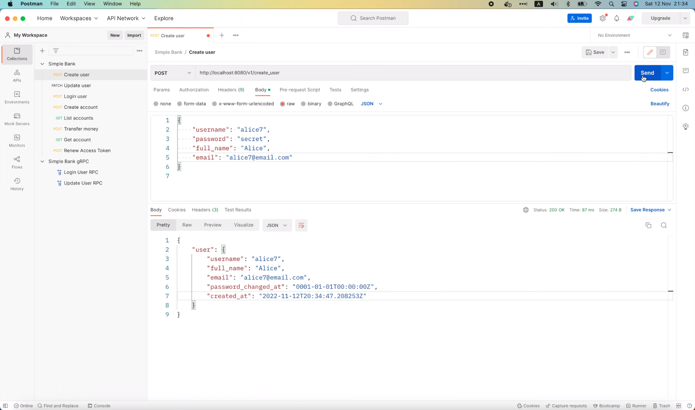
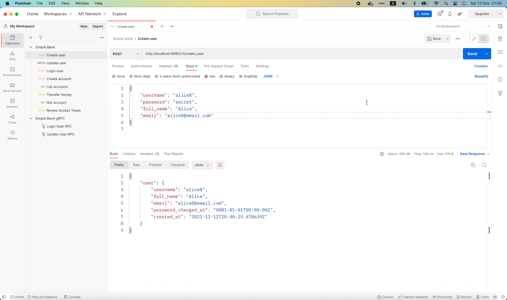

# Как обрабатывать ошибки и выводить сообщения в логи для асинхронных Go воркеров

[Оригинал](https://www.youtube.com/watch?v=YgfmPIJRg2U)

Всем привет, рад вас снова видеть на мастер-классе по бэкенду. Продолжим
то, чем мы занимались на последних трех лекциях, связанных с реализацией
асинхронных фоновых рабочих процессов с помощью Redis. Сегодня давайте 
научимся правильно обрабатывать ошибки в воркерах.

## Как обрабатывать ошибки в воркерах

Во-первых, давайте посмотрим, что произойдет, если во время обработки 
задачи возникнет ошибка. Я открою Postman и попытаюсь отправить новый 
запрос с новым именем пользователя и электронной почтой: "alice7".



OK, запрос успешно выполнен, и задача по отправке письма этому новому 
пользователю поставлена в очередь.

```shell
9:34PM INF enqueued task max_retry=10 payload="{\"username\":\"alice7\"}" queue=critical type=task:send_verify_email
9:34PM INF received an HTTP request duration=83.416061 method=POST path=/v1/create_user protocol=http status_code=200 status_text=OK
```

Существует 10-секундная задержка перед тем, как эта задача будет взята для
обработки воркером, поэтому я, пока этого не произошло, выполню в терминале

```shell
docker stop postgres12
postgres12
```

чтобы остановить контейнер базы данных.

Теперь, когда контейнер БД остановлен, мы ожидаем увидеть сообщения об 
ошибках в логах, поскольку воркер не сможет запросить информацию о 
пользователе.

Как видно из кода, мы ищем пользователя по `username` в базе данных,

```go
func (processor RedisTaskProcessor) ProcessTaskSendVerifyEmail(ctx context.Context, task *asynq.Task) error {
	...
    user, err := processor.store.GetUser(ctx, payload.Username)
    if err != nil {
        if err == sql.ErrNoRows {
            return fmt.Errorf("user doen't exist: %w", asynq.SkipRetry)
        }
        return fmt.Errorf("failed to get user: %w", err)
    }
	...
}
```

чтобы узнать адрес, куда будет отправляться письмо для подтверждения.

Однако даже по прошествии 10 секунд по-прежнему нет сообщений об ошибках
в логах или чего-либо, что могло бы указать нам, что происходит с
задачей.

Это наводит меня на мысль, что задача уже была выполнена и завершилась 
с ошибкой, но `asynq` не вывел в лог каких-либо сообщений, потому что мы 
не указали как должны обрабатываться ошибки в задачах.

Чтобы убедиться в этом, вернемся к коду и откроем файл `processor.go`. 
Здесь, при создании сервера `asynq`,

```go
func NewRedisTaskProcessor(redisOpt asynq.RedisClientOpt, store db.Store) TaskProcessor {
    server := asynq.NewServer(
        redisOpt,
        asynq.Config{
            Queues: map[string]int{
                QueueCritical: 10,
                QueueDefault:  5,
            },
        },
    )
	...
}
```

у нас есть возможность задать функцию для обработки ошибок.

```go
ErrorHandler ErrorHandler
```

Эта функция будет выполняться всякий раз, когда в задаче возникает ошибка.
Пример можно увидеть ниже.

```go
// ErrorHandler handles errors returned by the task handler.
//
// HandleError is invoked only if the task handler returns a non-nil error.
//
// Example:
//
//     func reportError(ctx context, task *asynq.Task, err error) {
//         retried, _ := asynq.GetRetryCount(ctx)
//         maxRetry, _ := asynq.GetMaxRetry(ctx)
//     	   if retried >= maxRetry {
//             err = fmt.Errorf("retry exhausted for task %s: %w", task.Type, err)
//     	   }
//         errorReportingService.Notify(err)
//     })
//
//     ErrorHandler: asynq.ErrorHandlerFunc(reportError)
ErrorHandler ErrorHandler
```

Эта функция `reportError` по сути отправляет оповещение, если задача 
завершилась с ошибкой и было достигнуто максимальное количество попыток 
повторного выполнения. `ErrorHandler` на самом деле является интерфейсом 
с одним единственным методом: `HandleError`

```go
// An ErrorHandler handles an error occured during task processing.
type ErrorHandler interface {
	HandleError(ctx context.Context, task *Task, err error)
}
```

который принимает контекст, задачу и ошибку в качестве входных аргументов.

Вернемся к обработчику задач, чтобы добавить эту функцию для обработки 
ошибок в наш `asynq` сервер.

Здесь, в `asynq.Config`, я добавлю `ErrorHandler`. Её тип
будет `asynq.ErrorHandlerFunc`. Этот тип уже определен в
пакет `asynq` как псевдоним сигнатуры следующей функции.

```go
type ErrorHandlerFunc func(ctx context.Context, task *Task, err error)
```

Поэтому я скопирую его и вставлю в наш код, вот так.

```go
func NewRedisTaskProcessor(redisOpt asynq.RedisClientOpt, store db.Store) TaskProcessor {
    server := asynq.NewServer(
        redisOpt,
        asynq.Config{
            Queues: map[string]int{
                QueueCritical: 10,
                QueueDefault:  5,
            },
            ErrorHandler: asynq.ErrorHandlerFunc(func(ctx context.Context, task *Task, err error) {
            
            }),
        },
    )
	...
}
```

На самом деле это преобразование типа, но для функции вместо обычной 
переменной. И нам нужно будет добавить вот сюда пакет `asynq`,

```go
ErrorHandler: asynq.ErrorHandlerFunc(func(ctx context.Context, task *asynq.Task, err error)
```

потому что именно там определяется тип `Task`.

Хорошо, теперь все, что нам нужно сделать, это вывести какие-то сообщения 
в лог в этой функции. Давайте вызовем `log.Error().Msg()` и выведем здесь 
простое сообщение, например: "process task failed" («обработать задачу 
не удалось»). Я добавлю исходную ошибку сюда, чтобы мы знали причину из-за
которой произошёл сбой. Мы также должны распечатать тип задачи и, 
возможно, полезную нагрузку задачи, чтобы при необходимости упростить 
отладку. Всю эту информацию можно получить из параметра `task` этой
функции.

```go
func NewRedisTaskProcessor(redisOpt asynq.RedisClientOpt, store db.Store) TaskProcessor {
    server := asynq.NewServer(
        redisOpt,
        asynq.Config{
            Queues: map[string]int{
                QueueCritical: 10,
                QueueDefault:  5,
            },
            ErrorHandler: asynq.ErrorHandlerFunc(func(ctx context.Context, task *Task, err error) {
                log.Error().Err(err).Str("type", task.Type()).
                    Bytes("payload", task.Payload()).Msg("process task failed")
            }),
        },
    )
	...
}
```

Хорошо, теперь вернемся в терминал и перезапустим сервер.

```
make server
go run main.go
9:39PM FTL cannot create new migrate instance error="dial tcp[::1]:5432: connect: connection refused"
exit status 1
make: *** [server] Error 1
```

Ой, сервер не запустился, поскольку не работает база данных. Поэтому 
давайте выполним

```shell
docker start postgres12
postgres12
```

в другом терминале.

Затем вернёмся к предыдущему и опять запустим

```shell
make server
go run main.go
9:39PM INF db migrated successfully
9:39PM INF start gRPC server at [::]:9090
9:39PM INF start task processor
asynq: pid=47543 2022/11/12 20:39:47.499012 INFO: Starting processing
9:39PM INF start HTTP gateway server at [::]:8080
```

Хорошо, на этот раз сервер успешно запустился.

Теперь мы можем выполнить

```shell
docker stop postgres12
postgres12
```

чтобы остановить БД.

Если я вернусь на предыдущую вкладку терминала, то мы увидим, что задача 
по отправке письма пользователю "alice7" была обработана.

```shell
9:39PM INF processed task email=alice7@email.com payload="{\"username\":\"alice7\"}" type=task:send_verify_email
```

Таким образом, обработка произошла до того как я успел остановить сервер 
Postgres. Тогда у нас нет другого выбора, кроме как повторить тест заново.
Сначала я снова запущу сервер Postgres, чтобы можно было вставить 
нового пользователя.

```shell
docker start postgres12
postgres12
```

Сейчас давайте откроем Postman, изменим имя пользователя и адрес 
электронной почты на "alice8" и отправим этот запрос для создания 
пользователя на сервер.



ОК, запрос успешно выполнен, поэтому я остановлю Postgres сервер . 

```shell
docker stop postgres12
postgres12
```

до того как задача по отправке письма будет взята в обработку.

Помните, что существует 10-секундная задержка.

На этот раз через некоторое время на экране появляется сообщение об ошибке
в логе.

```shell
9:40PM ERR process task failed error="failed to get user: dial tcp [::1]:5432: connect: connection refused" payload="{\"username\":\"alice8\"}" type=task:send_verify_email 
```

В нём говорится: "process task failed" («обработать задачу
не удалось») и указана исходная ошибка: не удалось извлечь пользователя,
поскольку воркер не может подключиться к базе данных на локальном 
порту 5432. Мы также видим здесь полезную нагрузку задачи: имя 
пользователя "alice8" и тип задачи `send_verify_email `.

Через некоторое время эта завершившаяся со сбоем задача будет 
повторно запущена

```shell
9:41PM ERR process task failed error="failed to get user: dial tcp [::1]:5432: connect: connection refused" payload="{\"username\":\"alice8\"}" type=task:send_verify_email 
```

и, как видите, воркер по-прежнему не может подключиться к БД, поэтому снова
выводится ещё одна ошибка.

Теперь давайте посмотрим, что произойдет, если я запущу контейнер Postgres.

```shell
docker start postgres12
postgres12
```

И вернусь в окно терминала, где был запущен сервер, чтобы просмотреть логи.

На этот раз задача успешно обработана.

```shell
9:41PM INF processed task email=alice8@email.com payload="{\"username\":\"alice8\"}" type=task:send_verify_email
```

Потрясающие!

Если вам интересно, сколько времени требуется, прежде чем задача будет 
повторно запущена, вы можете взглянуть на настройки сервера `asynq`. 
Существует функция задержки повторного вызова

```go
// Function to calculate retry delay for a failed task.
//
// By default, it uses exponential backoff algorithm to calculate the delay.
RetryDelayFunc RetryDelayFunc
```

которая позволит вам задать собственную продолжительность задержки 
повторного запуска.

Если вы не задаёте свою, то по умолчанию для расчета задержки будет 
использоваться алгоритм экспоненциальной выдержки. 

Теперь вы знаете как вывести сообщения об ошибках в логи для асинхронных
задач. Вы также можете изменить код в функции для обработки ошибок, чтобы
отправлять оповещение по электронной почте, в Slack или любой другой 
канал, который вы хотите.

Сейчас я покажу вам ещё кое-что.

## Исправляем формат логирования, используемый `asynq`, для некоторых сообщений

Если вы посмотрите на логи сервера, то заметите, что некоторые сообщения в
логах от `asynq` отформатированы не так, как остальные.

```shell
asynq: pid=47543 2022/11/12 20:39:47.499012 INFO: Starting processing
```

Давайте посмотрим, что произойдет, если мы вдруг остановим сервер Redis.

```shell
docker stop redis
redis
```

Как видите, здесь в логах выводится множество сообщений об ошибках
`asynq`,

```shell
redis: 2022/11/12 21:42:18 pubsub.go:159: redis: discarding bad PubSub connection: EOF
redis: 2022/11/12 21:42:18 pubsub.go:159: redis: discarding bad PubSub connection: EOF
redis: 2022/11/12 21:42:18 pubsub.go:159: redis: discarding bad PubSub connection: EOF
asynq: pid=47543 2022/11/12 20:42:19.189548 ERROR: Dequeue error: UNKNOWN: redis eval error: dial tcp 0.0.0.0:6379: connect: connection refused
asynq: pid=47543 2022/11/12 20:42:19.681271 ERROR: Failed to delete expired completed tasks from queue "default": INTERNAL_ERROR: redis eval error: dial tcp 0.0.0.0:6379: connect: connection refused
asynq: pid=47543 2022/11/12 20:42:19.758938 ERROR: Failed to delete expired completed tasks from queue "critical": INTERNAL_ERROR: redis eval error: dial tcp 0.0.0.0:6379: connect: connection refused
asynq: pid=47543 2022/11/12 20:42:22.205767 ERROR: Dequeue error: UNKNOWN: redis eval error: dial tcp 0.0.0.0:6379: connect: connection refused
```

но они не соответствуют формату логирования, который используется нашим 
веб-сервером, поэтому могут возникнуть проблемы, если мы захотим 
проанализировать и проиндексировать логи для последующего мониторинга
и поиска.

Давайте снова запустим сервер Redis,

```shell
docker start redis
redis
```

а затем я покажу вам, как сделать так, что сообщения `asynq` 
соответствовали нашему формату логирования.

Если мы посмотрим на настройки сервера `asynq`, то увидим поле `Logger`, 
которое позволит нам указать собственный логгер для сервера `asynq`.

```go
// Logger specifies the logger used by the server instance.
//
// If unset, default logger is used.
Logger Logger
```

И также существует поле `LogLevel`, позволяющее указать какой минимальный
уровень важности лога должен использоваться.

```go
// LogLevel specifies the minimum log level to enable.
//
// If unset, InfoLevel is used by default.
LogLevel LogLevel
```

Теперь, если мы откроем определение этого `Logger`,

```go
// Logger supports logging at various log levels.
type Logger interface {
	// Debug logs a message at Debug level.
	Debug(args ...interface{})

	// Info logs a message at Info level.
	Info(args ...interface{})

	// Warn logs a message at Warning level.
	Warn(args ...interface{})

	// Error logs a message at Error level.
	Error(args ...interface{})

	// Fatal logs a message at Fatal level
	// and process will exit with status set to 1.
	Fatal(args ...interface{})
}
```

то увидим, что это также интерфейс с пятью методами, которым соответствует
пять различных уровней важности лога: "Debug", "Info", "Warn", "Error" и
"Fatal".

Итак, чтобы написать собственный логгер, нам нужно будет реализовать 
структуру со всеми этими методами.

Поэтому давайте вернёмся к нашему коду и в пакете `worker`, я создам
новый файл с названием `logger.go`. Затем давайте вставим туда все пять
функций, которые я ранее скопировал из интерфейса `Logger`. Далее я 
определю новый тип — структуру `Logger` и функцию для создания нового 
объекта `Logger`. Ему не нужно хранить какие-либо данные, поэтому давайте
просто вернем пустой `Logger`.

```go
type Logger struct {
}

func NewLogger() *Logger {
	return &Logger{}
}

// Debug logs a message at Debug level.
Debug(args ...interface{})

// Info logs a message at Info level.
Info(args ...interface{})

// Warn logs a message at Warning level.
Warn(args ...interface{})

// Error logs a message at Error level.
Error(args ...interface{})

// Fatal logs a message at Fatal level
// and process will exit with status set to 1.
Fatal(args ...interface{})
```

Теперь нам нужно добавить приемник `logger` перед этими пятью функциями,
чтобы превратить их все в методы структуры `Logger`. Вот как мы создаём
нашу собственную структуру `Logger` для реализации всех необходимых 
методов интерфейса `asynq.Logger`.

```go
// Debug logs a message at Debug level.
func (logger *Logger) Debug(args ...interface{}) {

}

// Info logs a message at Info level.
func (logger *Logger) Info(args ...interface{}) {

}

// Warn logs a message at Warning level.
func (logger *Logger) Warn(args ...interface{}) {

}

// Error logs a message at Error level.
func (logger *Logger) Error(args ...interface{}) {

}

// Fatal logs a message at Fatal level
// and process will exit with status set to 1.
func (logger *Logger) Fatal(args ...interface{}) {

}
```

Теперь самое сложное: как вывести сообщения в лог в желаемом нами формате?

Ну, на самом деле, это не так уж и сложно! Я добавлю ещё один метод
под названием `Print()` в структуру `Logger`.

Этот метод будет общим и вызываться всеми остальными пятью функциями,
потому что все они хотят одного и того же: выводить сообщения в лог 
только с разным уровнем важности.

Поэтому уровень важности — это один из параметров этой функции и его 
тип должен быть `zerolog.Level`. Остальные аргументы будут интерфейсами.

```go
func (logger *Logger) Print(level zerolog.Level, args ...interface{}) {

}
```

Теперь в этой функции мы можем вызвать `log.WithLevel()` и передать туда
входной аргумент — уровень важности лога. После этого по цепочке 
мы вызываем функцию `Msg()`. Однако эта функция принимает входную 
строку, а у нас второй аргумент — список интерфейсов. Итак, как мы можем 
превратить его в строку? Что ж, мы можем просто использовать 
функцию `fmt.Sprint()` из стандартной библиотеки. Он объединит все 
входные аргументы в одну строку за нас.

```go
func (logger *Logger) Print(level zerolog.Level, args ...interface{}) {
	log.WithLevel(level).Msg(fmt.Sprint(args...))
}
```

Теперь, когда реализована функция `Print()`, все, что нам нужно сделать, 
это вызвать её в других функциях. В функцию `Debug()` мы передадим 
`zerolog.DebugLevel` и остальные аргументы. Аналогично для 
функции `Info()`, мы передадим `zerolog.InfoLevel`, для функции `Warn()` 
мы будем использовать `zerolog.WarnLevel`. В функции `Error()` мы должны 
изменить уровень на `zerolog.ErrorLevel`. И, наконец, в функции `Fatal()` 
мы будем использовать `zerolog.FatalLevel`.

```go
// Debug logs a message at Debug level.
func (logger *Logger) Debug(args ...interface{}) {
	logger.Print(zerolog.DebugLevel, args...)
}

// Info logs a message at Info level.
func (logger *Logger) Info(args ...interface{}) {
	logger.Print(zerolog.InfoLevel, args...)
}

// Warn logs a message at Warning level.
func (logger *Logger) Warn(args ...interface{}) {
	logger.Print(zerolog.WarnLevel, args...)
}

// Error logs a message at Error level.
func (logger *Logger) Error(args ...interface{}) {
	logger.Print(zerolog.ErrorLevel, args...)
}

// Fatal logs a message at Fatal level
// and process will exit with status set to 1.
func (logger *Logger) Fatal(args ...interface{}) {
	logger.Print(zerolog.FatalLevel, args...)
}
```

На этом по сути всё!

Теперь у нас есть наш собственный логгер.

Осталось просто добавить его в `asynq` сервер. В структуру для настройки
обработчика задач `asynq` я задам для поля `Logger` значение 
`NewLogger()` и вуаля, всё готово!

```go
func NewRedisTaskProcessor(redisOpt asynq.RedisClientOpt, store db.Store) TaskProcessor {
	server := asynq.NewServer(
		redisOpt,
		asynq.Config{
			Queues: map[string]int{
				QueueCritical: 10,
				QueueDefault:  5,
			},
			ErrorHandler: asynq.ErrorHandlerFunc(func(ctx context.Context, task *asynq.Task, err error) {
				log.Error().Err(err).Str("type", task.Type()).
					Bytes("payload", task.Payload()).Msg("process task failed")
			}),
			Logger: NewLogger(),
		},
	)
	...
}
```

Теперь давайте вернёмся в терминал и протестируем его. Я перезагружу 
сервер.

```shell
make server
go run main.go
9:47PM INF db migrated successfully
9:47PM INF start gRPC server at [::]:9090
9:47PM INF start task processor
9:47PM INF Starting processing
9:47PM INF start HTTP gateway server at [::]:8080
```

OK, на этом раз как видите, сообщение в логе "Start processing" от
`asynq` сервера уже соответствует нашему формату логирования. Теперь 
давайте посмотрим, что произойдет, если я остановлю сервер Redis.

```shell
docker stop redis
redis
```

На этот раз мы увидим, что все `asynq` сообщения об ошибках в логах
были правильно отформатированы именно так, как мы хотели.

```shell
redis: 2022/11/12 21:47:59 pubsub.go:159: redis: discarding bad PubSub connection: EOF
redis: 2022/11/12 21:47:59 pubsub.go:159: redis: discarding bad PubSub connection: EOF
redis: 2022/11/12 21:47:59 pubsub.go:159: redis: discarding bad PubSub connection: EOF
9:48PM ERR Failed to write server state data: UNKNOWN: redis command error: SADD failed: dial tcp 0.0.0.0:6379: connect: connection refused
9:48PM ERR Failed to forward scheduled tasks: INTERNAL_ERROR: INTERNAL_ERROR: redis eval error: dial tcp 0.0.0.0:6379: connect: connection refused
9:48PM ERR Dequeue error: UNKNOWN: redis eval error: dial tcp 0.0.0.0:6379: connect: connection refused
9:48PM ERR Dequeue error: UNKNOWN: redis eval error: dial tcp 0.0.0.0:6379: connect: connection refused
9:48PM ERR Failed to forward scheduled tasks: INTERNAL_ERROR: INTERNAL_ERROR: redis eval error: dial tcp 0.0.0.0:6379: connect: connection refused
9:48PM ERR Failed to write server state data: UNKNOWN: redis command error: SADD failed: dial tcp 0.0.0.0:6379: connect: connection refused
9:48PM ERR Failed to delete expired completed tasks from queue "critical": INTERNAL_ERROR: redis eval error: dial tcp 0.0.0.0:6379: connect: connection refused
9:48PM ERR Failed to delete expired completed tasks from queue "default": INTERNAL_ERROR: redis eval error: dial tcp 0.0.0.0:6379: connect: connection refused
```

Если присмотреться до сих пор 3 строки в логах не соответствуют принятому 
нами формату логирования, но на самом деле они выводятся пакетом `go-redis`,
который `asynq` использует под капотом для взаимодействия с Redis.
Попытайтесь настроить его логгер так, чтобы он использовал наш формат 
логирования. Я оставлю эту задачу вам в качестве упражнения. Вы можете 
посмотреть [мой код на GitHub](https://github.com/techschool/simplebank/commit/663ff51ac4875e1b87f7c18eae101dcd7129b2a2), 
чтобы узнать, как я это сделал.

И не забывайте, вы всегда можете присоединиться к [Discord серверу Tech 
School](https://bit.ly/techschooldc), если у вас возникли какие-либо 
вопросы или вы хотите что-то обсудить со мной и другими студентами.

Хорошо, на этом закончим сегодняшнюю лекцию. Сегодня мы узнали, как 
правильно обрабатывать ошибки и выводить сообщения в лог нашего `asynq` 
сервера для обработки задач. Надеюсь, лекция была интересной и полезной для 
вас.

Большое спасибо за время, потраченное на чтение, желаю Вам получать 
удовольствие от обучения и до встречи на следующей лекции!