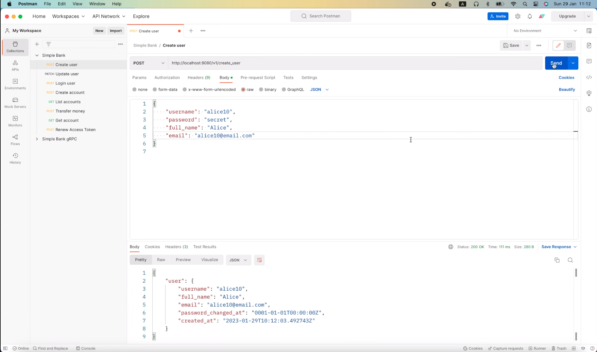
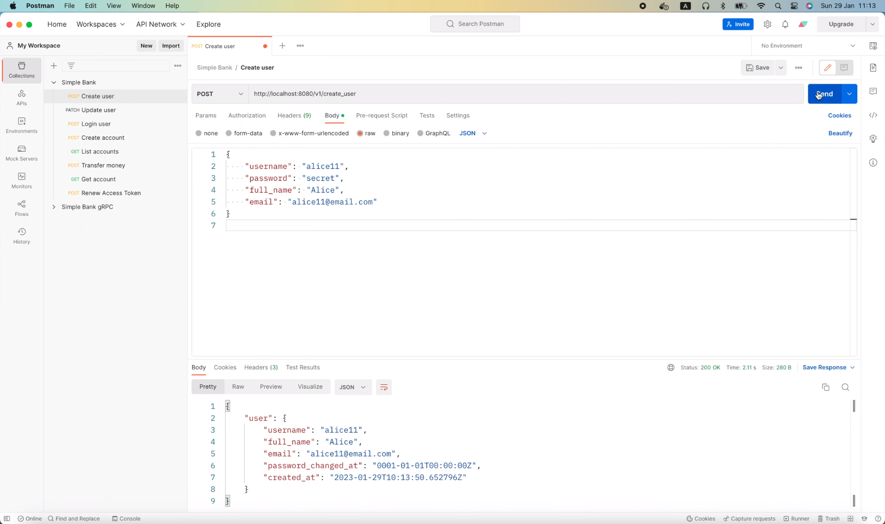
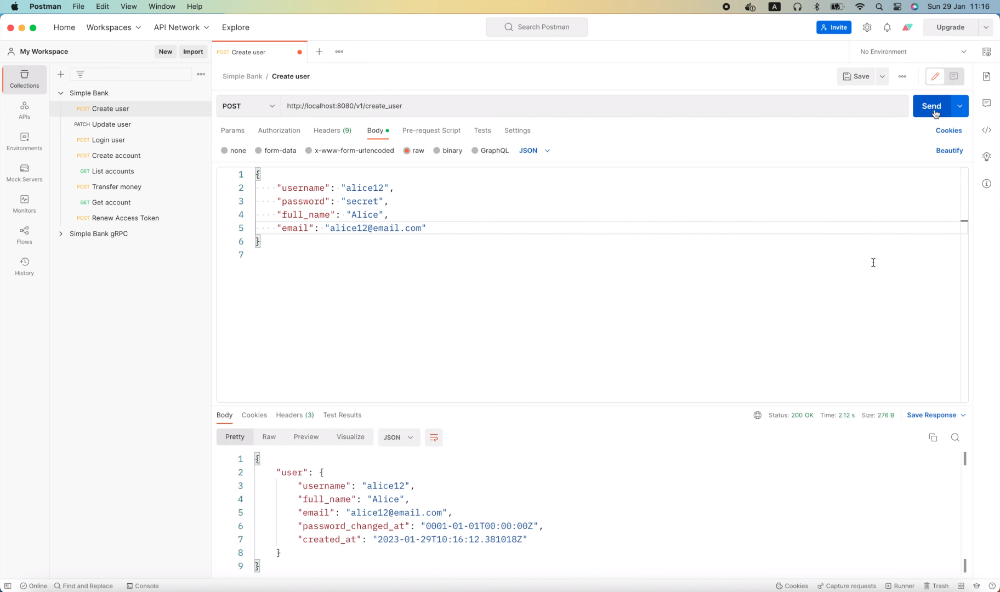
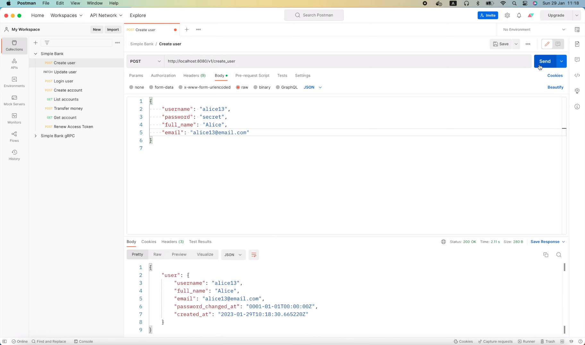

# Почему небольшая задержка может быть полезна для ваших асинхронных задач

[Оригинал](https://www.youtube.com/watch?v=ILNiZgseLUI)

Всем привет! Рад вас снова видеть на мастер-классе по бэкенду! Продолжаем
тему, связанную с фоновыми воркерами. Сегодня я покажу вам, почему важно 
добавлять небольшую задержку к вашей асинхронной задаче прежде чем её 
обработать.

## Почему важна задержка

Если вы ещё помните в лекции 56 курса мы реализовали эту транзакцию
`CreateUser`

```go
func (server *Server) CreateUser(ctx context.Context, req *pb.CreateUserRequest) (*pb.CreateUserResponse, error) {
	...
	arg := db.CreateUserTxParams{
        CreateUserParams: db.CreateUserParams{
            Username:       req.GetUsername(),
            HashedPassword: hashedPassword,
            FullName:       req.GetFullName(),
            Email:          req.GetEmail(),
        },
        AfterCreate: func(user db.User) error {
            taskPayload := &worker.PayloadSendVerifyEmail{
                Username: user.Username,
            }
            opts := []asynq.Option{
                asynq.MaxRetry(10),
                asynq.ProcessIn(10 * time.Second),
                asynq.Queue(worker.QueueCritical),
            }
            return server.taskDistributor.DistributeTaskSendVerifyEmail(ctx, taskPayload, opts...)
        },
    }
	
	txResult, err := server.store.CreateUserTx(ctx, arg)
	...
}
```

с функцией обратного вызова: `AfterCreate`. Эта функция будет вызываться 
после создания нового пользователя, чтобы отправить асинхронную задачу
для подтверждения адреса электронной почты в Redis. И здесь вы видите, что
существует 10-секундная задержка, `asynq.ProcessIn(10 * time.Second)`. 
Это означает, что задача будет выбрана воркером только через 10 секунд 
после её создания. Теперь, чтобы понять, почему важна эта задержка, 
давайте посмотрим, что произойдет, если я закомментирую эту строку.

```go
func (server *Server) CreateUser(ctx context.Context, req *pb.CreateUserRequest) (*pb.CreateUserResponse, error) {
	...
	arg := db.CreateUserTxParams{
        CreateUserParams: db.CreateUserParams{
            Username:       req.GetUsername(),
            HashedPassword: hashedPassword,
            FullName:       req.GetFullName(),
            Email:          req.GetEmail(),
        },
        AfterCreate: func(user db.User) error {
            taskPayload := &worker.PayloadSendVerifyEmail{
                Username: user.Username,
            }
            opts := []asynq.Option{
                asynq.MaxRetry(10),
                // asynq.ProcessIn(10 * time.Second),
                asynq.Queue(worker.QueueCritical),
            }
            return server.taskDistributor.DistributeTaskSendVerifyEmail(ctx, taskPayload, opts...)
        },
    }
	
	txResult, err := server.store.CreateUserTx(ctx, arg)
	...
}
```

Затем давайте откроем терминал и проведем несколько тестов. Во-первых, 
давайте удостоверимся, что и Postgres, и Redis запущены и работают.

```shell
docker ps
CONTAINER ID   IMAGE                                                       COMMAND                  CREATED        STATUS                          PORTS                                       NAMES
1ef5fb823898   redis:7-alpine                                              "docker-entrypoint.s…"   3 weeks ago    Up 2 seconds                    0.0.0.0:6379->6379/tcp, :::6379->6379/tcp   redis
88cabd7ba6ab   postgres:12-alpine                                          "docker-entrypoint.s…"   3 weeks ago    Up 7 seconds                    0.0.0.0:5432->5432/tcp, :::5432->5432/tcp   postgres12
```

OK, так и есть!

Итак, мы можем запустить наш веб-сервер.

```shell
make server
go run main.go
11:11AM INF db migrated successfully
11:11AM INF start gRPC server at [::]:9090
11:11AM INF start task processor
11:11AM INF Starting processing
11:11AM INF start HTTP gateway server at [::]:8080
```

После этого я открою Postman и отправлю запрос на создание нового 
пользователя: «alice10».



Хорошо, запрос успешно выполнен. Теперь давайте просмотрим логи 
веб-сервера.

```shell
11:12AM INF enqueued task max_retry=10 payload="{\"username\":\"alice10\"}" queue=critical type=task:send_verify_email
11:12AM INF received an HTTP request duration=101.917294 method=POST path=/v1/create_user protocol=http status_code=200 status_text=OK
11:12AM INF processed task email=alice10@email.com payload="{\"username\":\"alice10\"}" type=task:send_verify_email
```

Из них видно, что сервер получил запрос и поставил в очередь задачу для
подтверждения адреса электронной почты. И эта задача была сразу же 
обработана.

Не возникло никаких проблем. Значит ли это, что нам не нужно вставлять 
искусственную задержку перед выполнением задачи? На самом деле нет. Проблем
не возникло конкретно в данный момент, но это не означает, что они не 
возникнут в другой раз.

Давайте посмотрим на реализацию транзакции `CreateUser`.

```go
func (store *SQLStore) CreateUserTx(ctx context.Context, arg CreateUserTxParams) (CreateUserTxResult, error) {
	var result CreateUserTxResult

	err := store.execTx(ctx, func(q *Queries) error {
		var err error

		result.User, err = q.CreateUser(ctx, arg.CreateUserParams)
		if err != nil {
			return err
		}
		return arg.AfterCreate(result.User)
	})

	return result, err
}
```

Здесь функция `AfterCreate` вызывается в конце транзакции, но поскольку
она написана внутри функции `execTx`, эта функция фактически запускается
до фиксации транзакции. Как вы видите здесь,

```go
func (store *SQLStore) execTx(ctx context.Context, fn func(*Queries) error) error {
    ...
	
	err = fn(q)
	if err != nil {
        if rbErr := tx.Rollback(); rbErr != nil {
            return fmt.Errorf("tx err: %v, rb err: %v", err, rbErr)
        }
        return err
    }

    return tx.Commit()
}
```

функция вызывается и если она возвращает ошибку, то произойдёт откат 
транзакции. В противном случае она будет зафиксирована в базе данных.

А что произойдет, если в какой-то момент базе данных придётся поработать под 
высокой нагрузкой и обработать множество одновременных запросов, и 
поэтому фиксация этой транзакции занимает больше времени, чем обычно?

Например, мы можем добавить `time.Sleep` величиной в 2 секунды, чтобы 
сымитировать эту ситуацию.

```go
func (store *SQLStore) execTx(ctx context.Context, fn func(*Queries) error) error {
    ...
	
	err = fn(q)
	if err != nil {
        if rbErr := tx.Rollback(); rbErr != nil {
            return fmt.Errorf("tx err: %v, rb err: %v", err, rbErr)
        }
        return err
    }

    time.Sleep(2 * time.Second)
    return tx.Commit()
}
```

Давайте посмотрим что произойдёт в этом случае.

Я перезапущу веб-сервер.

```shell
make server
go run main.go
11:13AM INF db migrated successfully
11:13AM INF start gRPC server at [::]:9090
11:13AM INF start task processor
11:13AM INF Starting processing
11:13AM INF start HTTP gateway server at [::]:8080
```

И вернусь в Postman, чтобы отправить запрос на создание нового 
пользователя: "alice11".



Его выполнение займёт примерно 2 секунды из-за команды `Sleep()`. Но 
теперь, если мы просмотрим логи,

```shell
11:13AM INF enqueued task max_retry=10 payload="{\"username\":\"alice11\"}" queue=critical type=task:send_verify_email
11:13AM ERR process task failed error="user doen't exist: skip retry for the task" payload="{\"username\":\"alice11\"}" type=task:send_verify_email
11:13AM WRN Retry exhausted for task id=4ec2e205-bdac-4211-912b-52afdf789f8f
11:13AM INF received an HTTP request duration=2100.460659 method=POST path=/v1/create_user protocol=http status_code=200 status_text=OK
```

то увидим, что задача была поставлена в очередь и была обработана, но
её выполнение завершилось с ошибкой, потому что пользователя не удалось 
найти в базе данных.

Смогли ли вы понять почему возникла ошибка? Она связана с тем, что для 
фиксации транзакции потребовалось две секунды, но задача для отправки письма
была поставлена в очередь без задержек, поэтому она была обработана 
воркером немедленно. И из-за этого, когда воркер попытался найти 
пользователя в базе данных, он не мог найти запись, так как транзакция 
ещё не была зафиксирована. Также в коде, если пользователя не удалось 
найти, мы возвращаем ошибку `asynq.SkipRetry`,

```go
func (processor RedisTaskProcessor) ProcessTaskSendVerifyEmail(ctx context.Context, task *asynq.Task) error {
	...

	user, err := processor.store.GetUser(ctx, payload.Username)
	if err != nil {
		if err == sql.ErrNoRows {
			return fmt.Errorf("user doen't exist: %w", asynq.SkipRetry)
		}
		return fmt.Errorf("failed to get user: %w", err)
	}

	...
}
```

поэтому в этом случае задаче не будет запущена повторно. И это действительно
большая проблема, потому что пользователь никогда не получит письмо для
подтверждения адреса электронной почты.

Итак, теперь вы знаете почему важна эта десяти секундная задержка. Она 
создаёт отсрочку, позволяя зафиксировать транзакцию в БД до того, как
асинхронная задача будет выбрана воркером.

Хорошо, давайте перезапустим сервер и проверим работу приложения с 
задержкой!

```shell
go run main.go
11:16AM INF db migrated successfully
11:16AM INF start gRPC server at [::]:9090
11:16AM INF start task processor
11:16AM INF Starting processing
11:16AM INF start HTTP gateway server at [::]:8080
```

Я изменю `username` и `email` на "alice12". И повторно отправлю запрос
на создание пользователя. Он займёт две секунды, как и ранее.



Но на этот раз в логах сервера

```shell
11:16AM INF enqueued task max_retry=10 payload="{\"username\":\"alice12\"}" queue=critical type=task:send_verify_email
11:16AM INF received an HTTP request duration=2109.752549 method=POST path=/v1/create_user protocol=http status_code=200 status_text=OK
```

мы не видим никаких ошибок. Это связано с тем, что задача была задержана
на десять секунд. Поэтому пока что она была только поставлена в очередь.
И будет обработана воркером только через десять секунд.

```shell
11:16AM INF processed task email=alice12@email.com payload="{\"username\":\"alice12\"}" type=task:send_verify_email
```

К этому моменту транзакция, создающая пользователя, уже зафиксирована.
Таким образом, задача будет успешно обработана без каких-либо проблем.
Вот так небольшая задержка может помочь нам легко решить эту проблему.
Но убедитесь, что вы задали правильную величину задержки для своей 
задачи, потому что, например, здесь

```go
func (server *Server) CreateUser(ctx context.Context, req *pb.CreateUserRequest) (*pb.CreateUserResponse, error) {
	...
	arg := db.CreateUserTxParams{
        CreateUserParams: db.CreateUserParams{
            Username:       req.GetUsername(),
            HashedPassword: hashedPassword,
            FullName:       req.GetFullName(),
            Email:          req.GetEmail(),
        },
        AfterCreate: func(user db.User) error {
            taskPayload := &worker.PayloadSendVerifyEmail{
                Username: user.Username,
            }
            opts := []asynq.Option{
                asynq.MaxRetry(10),
                asynq.ProcessIn(10 * time.Second),
                asynq.Queue(worker.QueueCritical),
            }
            return server.taskDistributor.DistributeTaskSendVerifyEmail(ctx, taskPayload, opts...)
        },
    }
	
	txResult, err := server.store.CreateUserTx(ctx, arg)
	...
}
```

если мы просто задержим обработку задачи на одну секунду,
`asynq.ProcessIn(1 * time.Second)`, что меньше двух секунд, которые
необходимы для фиксации транзакции, то проблема все равно возникнет.

Обычно десяти секунд должно быть достаточно для фиксации транзакции, но 
мы никогда не знаем наверняка. В некоторых редких случаях могло случиться
что угодно. Таким образом, один из способов решить эту проблему — всегда 
разрешать повторный запуск задачи.

Мы можем просто закомментировать эту команду `async.SkipRetry`.

```go
func (processor RedisTaskProcessor) ProcessTaskSendVerifyEmail(ctx context.Context, task *asynq.Task) error {
	...

	user, err := processor.store.GetUser(ctx, payload.Username)
	if err != nil {
		// if err == sql.ErrNoRows {
		//	return fmt.Errorf("user doen't exist: %w", asynq.SkipRetry)
		// }
		return fmt.Errorf("failed to get user: %w", err)
	}

	...
}
```

Таким образом, даже если пользователь не будет найден, задача будет 
повторно запущена через некоторое время, и, надеюсь, к тому моменту она 
будет успешно выполнена, когда транзакция будет зафиксирована.

Конечно, если транзакцию не удастся зафиксировать, пользователь никогда 
не будет создан в БД, поэтому задача всегда будет завершаться ошибкой.
Но это не важно, потому что в конце концов количество повторных попыток
запуска иссякнет, так как в данном случае мы установили максимальное 
количество повторных попыток равным 10, `asynq.MaxRetry(10)`.

Хорошо, давайте перезапустим сервер и проведем ещё один тест.

```shell
make server
go run main.go
11:18AM INF db migrated successfully
11:18AM INF start gRPC server at [::]:9090
11:18AM INF start task processor
11:18AM INF Starting processing
11:18AM INF start HTTP gateway server at [::]:8080
```

В Postman я изменю `username` и `email` на "alice13" и повторно 
отправлю запрос!



Запрос успешно выполнен через 2 секунды. Но на этот раз в логе

```shell
11:18AM INF enqueued task max_retry=10 payload="{\"username\":\"alice13\"}" queue=critical type=task:send_verify_email
11:18AM ERR process task failed error="failed to get user: sql: no rows in result set" payload="{\"username\":\"alice13\"}" type=task:send_verify_email
11:18AM INF received an HTTP request duration=2102.003726 method=POST path=/v1/create_user protocol=http status_code=200 status_text=OK
```

задача была выполнена один раз и завершилась с ошибкой. Это связано с тем,
что мы задали задержку равной всего одной секунде.

Но обратите внимание, что мы удалили команду `async.SkipRetry`, поэтому 
эта задача будет повторно запущена позже. OK, как видите, через 
некоторое время задача повторяется и успешно выполнена.

```shell
11:19AM INF processed task email=alice13@email.com payload="{\"username\":\"alice13\"}" type=task:send_verify_email
```

Именно так, как мы и хотели.

Прежде чем мы закончим, я верну время задержки равным десяти секундам,

```go
func (server *Server) CreateUser(ctx context.Context, req *pb.CreateUserRequest) (*pb.CreateUserResponse, error) {
	...
	arg := db.CreateUserTxParams{
        CreateUserParams: db.CreateUserParams{
            Username:       req.GetUsername(),
            HashedPassword: hashedPassword,
            FullName:       req.GetFullName(),
            Email:          req.GetEmail(),
        },
        AfterCreate: func(user db.User) error {
            taskPayload := &worker.PayloadSendVerifyEmail{
                Username: user.Username,
            }
            opts := []asynq.Option{
                asynq.MaxRetry(10),
                asynq.ProcessIn(10 * time.Second),
                asynq.Queue(worker.QueueCritical),
            }
            return server.taskDistributor.DistributeTaskSendVerifyEmail(ctx, taskPayload, opts...)
        },
    }
	
	txResult, err := server.store.CreateUserTx(ctx, arg)
	...
}
```

и удалю эту команду `time.Sleep` в функции `execTx`.

```go
func (store *SQLStore) execTx(ctx context.Context, fn func(*Queries) error) error {
    ...
	
	err = fn(q)
	if err != nil {
        if rbErr := tx.Rollback(); rbErr != nil {
            return fmt.Errorf("tx err: %v, rb err: %v", err, rbErr)
        }
        return err
    }
	
    return tx.Commit()
}
```

Я оставлю этот оператор `asynq.SkipRetry` здесь, как образец, но 
закомментирую его.

```go
func (processor RedisTaskProcessor) ProcessTaskSendVerifyEmail(ctx context.Context, task *asynq.Task) error {
	...

	user, err := processor.store.GetUser(ctx, payload.Username)
	if err != nil {
		// if err == sql.ErrNoRows {
		//	return fmt.Errorf("user doen't exist: %w", asynq.SkipRetry)
		// }
		return fmt.Errorf("failed to get user: %w", err)
	}

	...
}
```

И на этом закончим лекцию о важности задержки при выполнении асинхронных 
задач.

Надеюсь, она была интересной и полезной для вас.

Большое спасибо за время, потраченное на чтение, желаю Вам получать
удовольствие от обучения и до встречи на следующей лекции!
