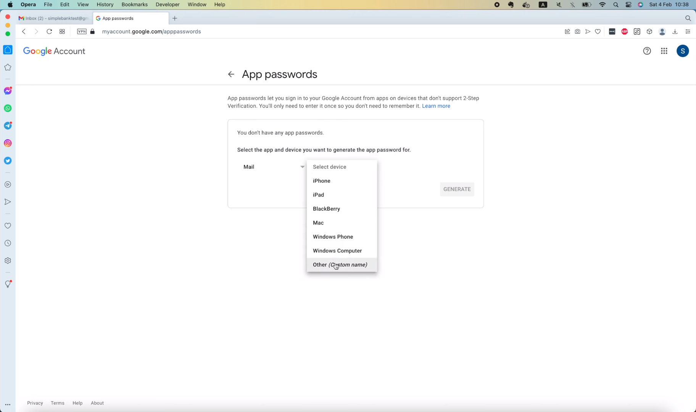

# How to send emails in Go via Gmail

[Original video](https://www.youtube.com/watch?v=L9TbZxpykLQ)

Hello everyone, welcome to the backend master class! Today let's learn 
how to send emails in Golang. We can do that with the help of the 
standard `net/smtp` [package](https://pkg.go.dev/net/smtp). It 
implements the Simple Mail Transfer Protocol defined in RFC 5321. If you're
curious about this RFC, you can follow [this link](https://rfc-editor.org/rfc/rfc5321.html) to
read it. The most important function in the `smtp` package is the 
`SendMail` [function](https://pkg.go.dev/net/smtp#SendMail). There is an
example here that shows how we can use it to send emails.

```go
package main

import (
	"log"
	"net/smtp"
)

func main() {
	// Set up authentication information.
	auth := smtp.PlainAuth("", "user@example.com", "password", "mail.example.com")

	// Connect to the server, authenticate, set the sender and recipient,
	// and send the email all in one step.
	to := []string{"recipient@example.net"}
	msg := []byte("To: recipient@example.net\r\n" +
		"Subject: discount Gophers!\r\n" +
		"\r\n" +
		"This is the email body.\r\n")
	err := smtp.SendMail("mail.example.com:25", auth, "sender@example.org", to, msg)
	if err != nil {
		log.Fatal(err)
	}
}
```

Basically, we will first create an SMTP plain auth object by providing an
email address, its password, and an authentication server. Then we define
the recipient's email address and the content of the message. Everything
in the email, including the attachments must be concatenated together 
into 1 single binary message, which should follow the RFC 822 standard.
You can read more about this standard by following [this link](https://rfc-editor.org/rfc/rfc822.html).

Once we have the message correctly formatted, we can use the 
`smtp.SendMail` function to send the email to the recipients. Now, although
it's possible to write the code on our own to format the message exactly
as specified in the standard, it's a bit time-consuming and tedious. So
Let's save us some time by using an existing community package that 
already implemented this feature.

[One package](https://github.com/go-gomail/gomail) that has nearly 4000 
stars is `gomail`. Its API is pretty easy to use and supports many features.
However, its last update was back in 2016, 7 years ago. So I think it's a
bit old and no longer maintained. [Another package](https://github.com/jordan-wright/email) is 
`email` by Jordan Wright, which has more than 2000 stars, and the last
updated time is 2021, only 2 years ago. I've used both of these packages,
and they're all good. But I think `email` package's API is cleaner and
easier to use than `gomail`. So I'm gonna use it in this video. Let's 
copy this `go get` command and run it in the terminal to install the 
package.

```shell
go get github.com/jordan-wright/email
go: downloading github.com/jordan-wright/email v4.0.1-0.20210109023952-943e75fe5223+incompatible
go: added github.com/jordan-wright/email v4.0.1-0.20210109023952-943e75fe5223+incompatible
```

Alright, the package has been downloaded and also added to the indirect
dependency list of `go.mod` file.

```
github.com/hashicorp/hcl v1.0.0 // indirect
github.com/jordan-wright/email v4.0.1-0.20210109023952-943e75fe5223+incompatible // indirect
github.com/json-iterator/go v1.1.12 // indirect
```

## Implementing `mail` package

Next, I'm gonna create a new folder called `mail`. And inside this folder,
let's add a new file: `sender.go`. We will add some code to send emails
in this file. As always, to make the code more abstract adn easier to 
test, I'm gonna define an `EmailSender` interface.

```go
type EmailSender interface {
}
```

It will have only 1 function called `SendEmail`, which takes several input
arguments, such as: the email's `subject` of type `string`, the `content` of 
the email, also of type `string`, then a list of email addresses to send
the email to. Sometimes we also want to send the email with `cc` and 
`bcc` recipients, so the next 2 arguments are used for this purpose. 
Finally, we might want to attach some files to the email, so the last 
argument is a list of attached files' names. This function will return an 
error if it fails to send the email.

```go
type EmailSender interface {
	SendEmail(
		subject string,
		content string,
		to []string,
		cc []string,
		bcc []string,
		attachFiles []string,
	) error
}
```

Alright, now let's write a struct that implements this interface. For this
demo, we're gonna send emails from Gmail account which I have created for
testing purposes.


So I'm gonna define a new type `GmailSender` struct. In this struct, let's
add a `name` field of type `string`. The recipients will see this name as
the sender of the email. The next field is the address of the account
from which we will send emails. And the last field is gonna be the password
to access that account. Of course, we won't use the real password here,
but I will show you how to generate an app password later.

```go
type GmailSender struct {
	name              string
	fromEmailAddress  string
	fromEmailPassword string
}
```

For now, let's add a function to create a `NewGmailSender`. It will take
3 input arguments for the `name`, the `fromEmailAddress`, and 
`fromEmailPassword`, all of type `string`. And it will return the abstract
`EmailSender` interface we defined above.

```go
func NewGmailSender(name string, fromEmailAddress string, fromEmailPassword string) EmailSender {

}
```

In this function, we'll return a pointer to a new `GmailSender` object, 
and we store the 3 input arguments to the corresponding fields of this
object.

```go
func NewGmailSender(name string, fromEmailAddress string, fromEmailPassword string) EmailSender {
	return &GmailSender{
		name:              name,
		fromEmailAddress:  fromEmailAddress,
		fromEmailPassword: fromEmailPassword,
	}
}
```

Now. we're seeing some red lines here, because the `GmailSender` doesn't
implement the SendEmail method required by `EmailSender` interface yet.
So I'm gonna copy that method signature, and paste it to the end of this
file. Then, let's add a `sender` receiver of type `GmailSender` to the
front of this function. That's how we make this struct to satisfy the 
requirement of the interface.

```go
func (sender *GmailSender) SendEmail(
	subject string,
	content string,
	to []string,
	cc []string,
	bcc []string,
	attachFiles []string,
) error {

}
```

Alright, now let's implement the method.

First, let's create a new email object by calling `email.NewEmail()`. This
function comes from the `email` package that we installed before.

```go
func (sender *GmailSender) SendEmail(
	subject string,
	content string,
	to []string,
	cc []string,
	bcc []string,
	attachFiles []string,
) error {
	e := email.NewEmail()
}
```

So now, as we have really used the package, we can run

```shell
go mod tidy
```

in the terminal to move it to the direct dependency list.

```
github.com/hibiken/asynq v0.23.0
github.com/jordan-wright/email v4.0.1-0.20210109023952-943e75fe5223+incompatible
github.com/lib/pq v1.10.5
```

OK, let's go back to the code and set the correct values to the `NewEmail` 
object. First, the `e.From` field is gonna be a combination of the email
sender's name and email address. So here I use the `fmt.Sprintf()` function
to join them together. Next, the `Subject` field will be set to the input
`subject`. For the content, we normally want to write it in HTML, so here
I'll set `e.HTML` to the input `content` variable. But we have to do a 
type conversion here because content is a string, while the HTML field
is a []byte slice. The next 3 fields: `e.To`, `e.Cc` and `e.Bcc` can be
set to their corresponding input arguments. OK, now we will iterate through
this attachment list `attachFiles`, and for each file, call `e.AttachFile`
and pass in its name. This function will return an attachment object and
an error. We don't need to do anything with the attachment, so here I just
put a blank identifier for it. Then let's check if error is `nil` or not.
If it is not `nil`, we'll wrap and return it with this message: "failed
to attach file".

```go
func (sender *GmailSender) SendEmail(
	subject string,
	content string,
	to []string,
	cc []string,
	bcc []string,
	attachFiles []string,
) error {
	e := email.NewEmail()
	e.From = fmt.Sprintf("%s <%s>", sender.name, sender.fromEmailAddress)
	e.Subject = subject
	e.HTML = []byte(content)
	e.To = to
	e.Cc = cc
	e.Bcc = bcc

	for _, f := range attachFiles {
		_, err := e.AttachFile(f)
		if err != nil {
			return fmt.Errorf("failed to attach file %s: %w", f, err)
		}
	}
}
```

Finally, if no errors occur, we'll move to the next step, which is, 
authenticating with the SMTP server. I'm gonna call the `smtp.PlainAuth()`
function. Usually, the first argument - `identity` can be left empty, 
then the username should be set to the sender's `fromEmailAddress`. The 
password should be the sender's `fromEmailPassword`. And the last argument 
is a host, which should be set to the address of the SMTP authentication
server. In our case, we're using Gmail, so I'll define a constant 
`smtpAuthAddress` at the top of the file,

```go
import (
	"fmt"
	"net/smtp"

	"github.com/jordan-wright/email"
)

const (
	smtpAuthAddress = "smtp.gmail.com"
)
```

and set its value to "smtp.gmail.com".

Then we can pass this constant into the `smtp.PlainAuth()` function. The
output of it will be an `smtp.Auth` object. So I'm gonna save it to this
variable.

```go
func (sender *GmailSender) SendEmail(
    subject string,
    content string,
    to []string,
    cc []string,
    bcc []string,
    attachFiles []string,
) error {
	...

	for _, f := range attachFiles {
        _, err := e.AttachFile(f)
        if err != nil {
            return fmt.Errorf("failed to attach file %s: %w", f, err)
        }
    }
	
	smtpAuth := smtp.PlainAuth("", sender.fromEmailAddress, sender.fromEmailPassword, smtpAuthAddress)
}
```

With this variable, we're finally able to send the email by calling 
`e.Send()`. But we also need to give it the address of the SMTP server. 
For Gmail, this address will be a bit different from the auth server
address. So I'm gonna declare a new constant here,

```go
const (
	smtpAuthAddress   = "smtp.gmail.com"
	smtpServerAddress = "smtp.gmail.com:587"
)
```

and set its value to "smtp.gmail.com", port "587".

Alright, now we can pass in this function the SMTP server address and the
SMTP auth object. Finally, we return the output error of it to the caller
of this function.

```go
func (sender *GmailSender) SendEmail(
    subject string,
    content string,
    to []string,
    cc []string,
    bcc []string,
    attachFiles []string,
) error {
    ...
    
    smtpAuth := smtp.PlainAuth("", sender.fromEmailAddress, sender.fromEmailPassword, smtpAuthAddress)
    return e.Send(smtpServerAddress, smtpAuth)
}
```

And that's it! The `SendEmail()` function is completed.

## Writing tests to check `SendEmail` functionality

Now let's write some tests to see if it's working properly or not. I'm 
gonna create a new file called `sender_test.go` in the same `mail` 
package. Then let's add a new function `TestSendEmailWithGmail()`, which
takes a `testing.T` object as input argument.

```go
func TestSendEmailWithGmail(t *testing.T) {

}
```

In order to send emails, we'll need a sender's name, an email address
and its password. So I'm gonna define and get them from environment 
variables. In the `app.env` file let's add a new variable called
`EMAIL_SENDER_NAME` and set its value to `Simple Bank`. Then another
variable for the `EMAIL_SENDER_ADDRESS`. I've created a Gmail account
just for testing, its address is `simplebanktest@gmail.com`. So I'm 
gonna copy and paste it to our `app.env` file. Now comes the most 
important value: `EMAIL_SENDER_PASSWORD`. Should we use the real password
of the simple bank test account here? No. Even if you try to use the real
password here, Gmail won't allow you to authenticate with it. For 
programmatic access, we will have to generate an app password, which I 
think is better because we can easily manage it, and revoke access
if necessary. First, we have to open the "Manage your Google Account" 
page. And open the "Security" tab on the left.

In order to create an app password, we have to enable 2-step 
verification. So I'm gonna click on these "2-Step Verification" 
and "GET STARTED" buttons.


Google might ask you to enter your password, then it will ask for a 
phone number that you want to use. You can choose how to get the 
verification code. I'm gonna choose text message, and click `Next`.


On the next page, we'll have to enter the code that Google sent us.


If the code is correct, we can click this button


to turn on the 2-step verification.

Now, if we go back to the security page, a new App password button will
show up in the `Signing in to Google` section.


Let's click on it to open the `App passwords` screen.



We don't have any app passwords yet, so let's go ahead to create a new
one. I'm gonna select the `Mail` app, and in the `Select device` list
let's choose "Other".

We can give it a name to easily remember. Let's call it Simple Bank 
Service. The click `Generate`.


Google will give you this app password with 16 characters.


Let's copy and paste it to our `app.env` file.

```env
EMAIL_SENDER_NAME=Simple Bank
EMAIL_SENDER_ADDRESS=simplebanktest@gmail.com
EMAIL_SENDER_PASSWORD=jekfcygyenvzekke
```

Once we click `Done` and go back to the security page, we'll see that 
there's 1 app password available here.


If we click on this button,


it will bring us to a page to manage the app passwords. This is our 
Simple Bank Service's password, and next to it is a delete icon, which 
we can use to delete the password if we want to.

Alright, let's go back to the code. Now, as we've added these 3 new 
variables, we'll need to update the `Config` struct to include them. I'm 
gonna duplicate this `TokenSymmetricKey` field, and change its name to 
`EmailSenderName`. And copy its environment variable's name to the
`mapstructure` tag.

```go
type Config struct {
    ...
    EmailSenderName      string        `mapstructure:"EMAIL_SENDER_NAME"`
}
```

Let's do the same for the `EmailSenderAddress` and the `EmailSenderPassword`
field.

```go
type Config struct {
    ...
    EmailSenderAddress   string        `mapstructure:"EMAIL_SENDER_ADDRESS"`
    EmailSenderPassword  string        `mapstructure:"EMAIL_SENDER_PASSWORD"`
}
```

OK, now we're ready to write the test.

In this `TestSendEmailWithGmail()` function, I'm gonna load the config 
by calling `util.LoadConfig()`, and pass in the location of the folder
containing the `app.env` file.

```go
func TestSendEmailWithGmail(t *testing.T) {
    config, err := util.LoadConfig("..")
    require.NoError(t, err)
}
```

These 2 dots mean the parent folder of the current `mail` folder. We
require that no error should be returned. Then we can create a 
`NewGmailSender` with the `config.EmailSenderName`, 
`config.EmailSenderAddress` and `config.EmailSenderPassword`.

```go
func TestSendEmailWithGmail(t *testing.T) {
    config, err := util.LoadConfig("..")
    require.NoError(t, err)
    
    sender := NewGmailSender(config.EmailSenderName, config.EmailSenderAddress, config.EmailSenderPassword)
}
```

Now I'm gonna define the subject of the email, let's say "A test email". 
The content of the email will be a simple HTML script. In Go, we can use 
this backtick character to define a multiline string. Let's start the 
email with a `<h1>` tag saying "Hello world" followed by a `<p>` tag
with content: "This is a test message from" and a link to the 
`techschool.guru` website. Now, the recipient email will be 
`techschool.guru@gmail.com`. Of course, you can add more emails here if
you want since it's a list of strings.

```go
func TestSendEmailWithGmail(t *testing.T) {
    ...

    sender := NewGmailSender(config.EmailSenderName, config.EmailSenderAddress, config.EmailSenderPassword)
	
    subject := "A test email"
    content := `
    <h1>Hello world</h1>
    <p>This is a test message from <a href="http://techschool.guru">Tech school</a></p>
    `
    to := []string{"techschool.guru@gmail.com"}
}
```

For this test, let's ignore the `cc` or `bcc` list. So next, the attachment
files. I'm gonna add the `README.md` file to the list. OK, now we can 
call `sender.SendEmail()` function, and pass in the subject, the content,
and the receiver's email address. The `cc` and `bcc` parameters will be
`nil`. And finally the list of attached files. We require this function
to return no errors. And that's it. We're done!

```go
func TestSendEmailWithGmail(t *testing.T) {
    ...
	
	to := []string{"techschool.guru@gmail.com"}
	attachFiles := []string{"../README.md"}

	err = sender.SendEmail(subject, content, to, nil, nil, attachFiles)
	require.NoError(t, err)
}
```

Let's click this button "Run test" to run the test.

```shell
=== RUN   TestSendEmailWithGmail
--- PASS: TestSendEmailWithGmail (1.11s)
PASS
ok      github.com/techschool/simplebank/mail    1.417s
```

It passed. Awesome!

I'm gonna open Tech School's email to check if the email is actually 
delivered. And yes, it is successfully delivered.


We can see the test email here.


The name of the sender is `Simple Bank`, and its address is 
`simplebanktest@gmail.com`. The receiver's address is indeed 
`techschool.guru@gmail.com`. Its body contains a big "Hello world"
message and a link to the Tech School's YouTube page. And finally, 
the README.md file is presented in the attachment. If we open the 
"Sent" box of the Simple Bank Test account,


we will also see the same email.

So it works!

We've successfully written the code to send emails using a Gmail 
account. Of course, there are other ways to send emails, like using
a third-party service, which often involves a domain verification step.

It will be very useful if you want to be able to send emails from any
address of the same domain that you own.

If you're using AWS, you can take a look at SES, or [Amazon Simple Email 
Service](https://aws.amazon.com/ses/). It's pretty easy to use, and most
of our code written so far can be used together with the AWS Golang SDK,
with just a few lines of configuration.


And that's all I wanted to share with you in this video. I hope it was
interesting and useful for you.

Thanks a lot for watching! Happy learning, and see you in the next 
lecture.
