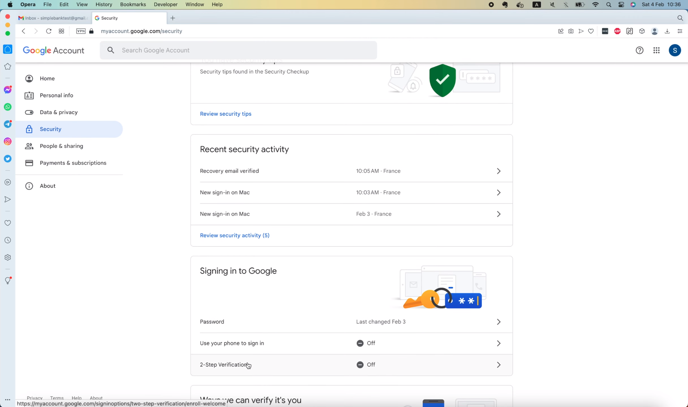
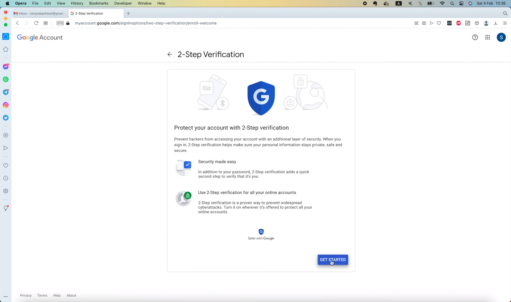
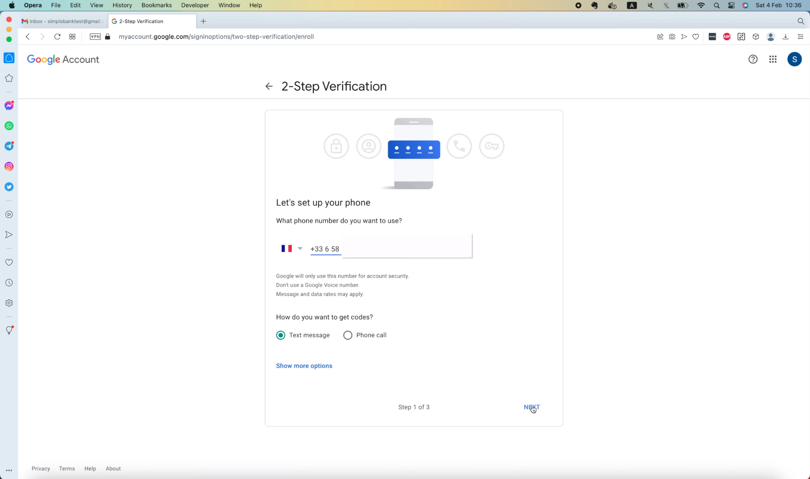
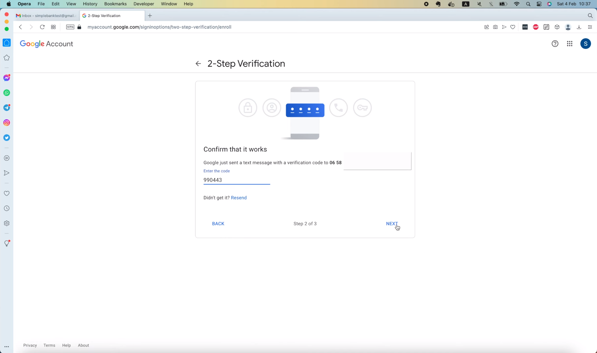
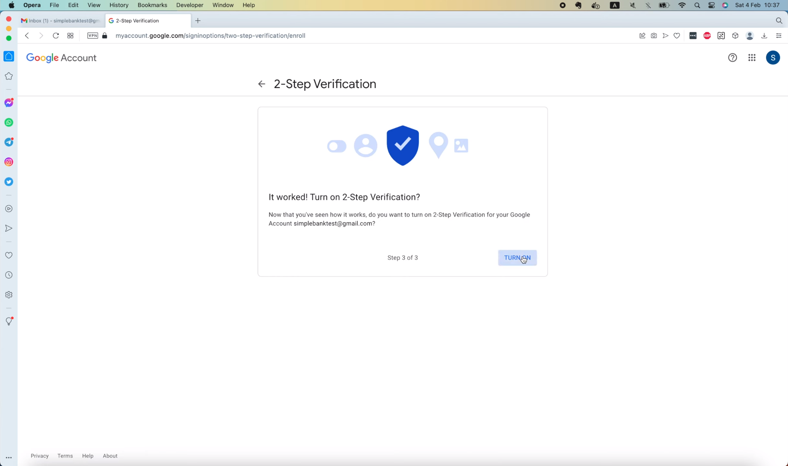
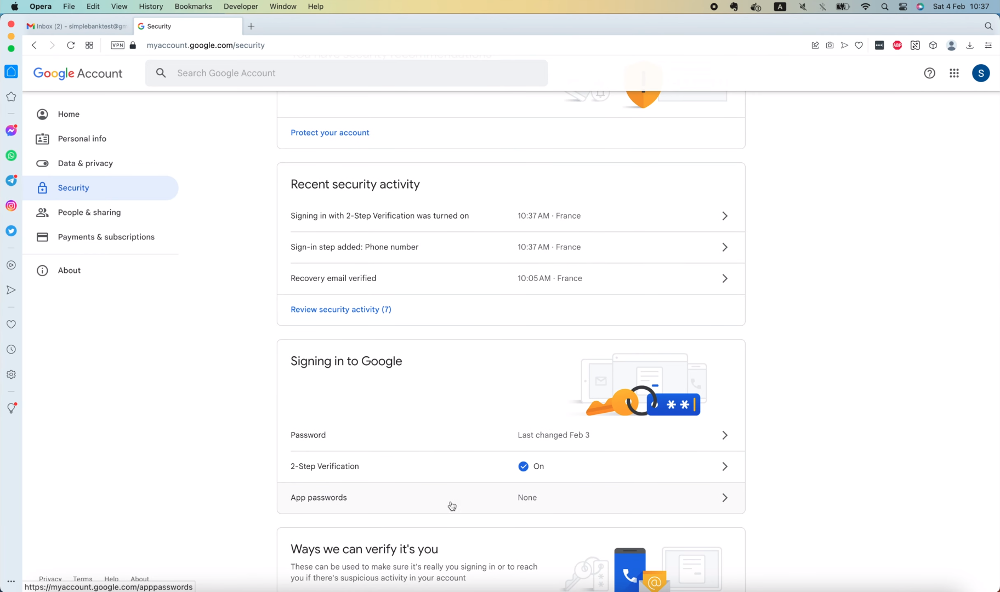
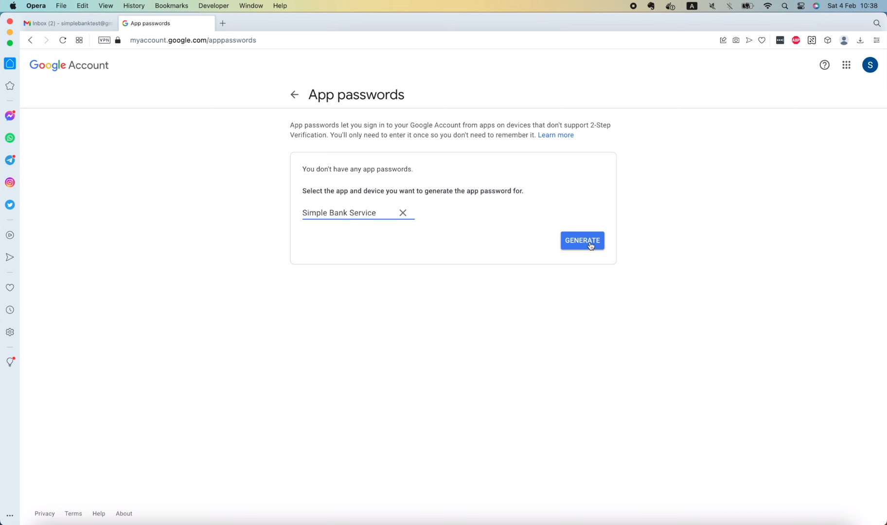
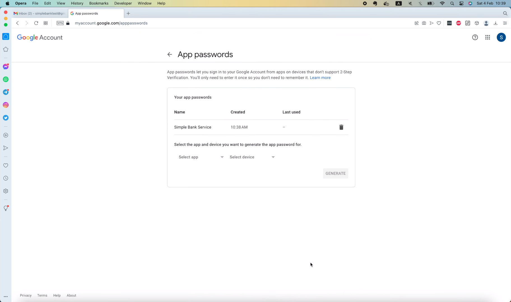
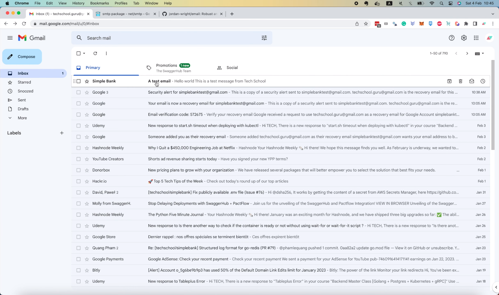
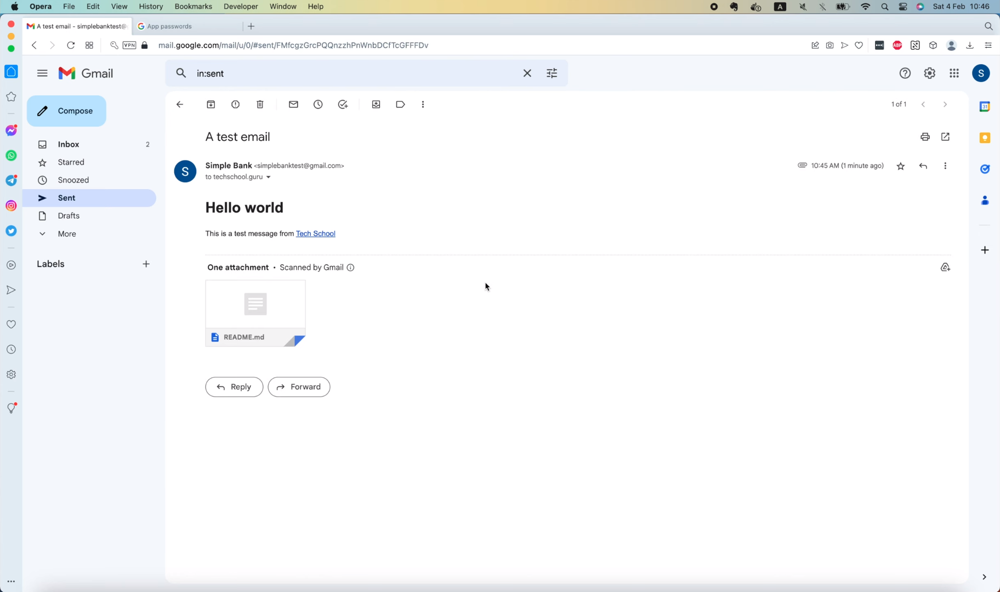

# Как отправлять электронные письма в Go с помощью Gmail

[Оригинал](https://www.youtube.com/watch?v=L9TbZxpykLQ)

Всем привет, рад вас снова видеть на мастер-классе по бэкенду! Сегодня 
давайте научимся отправлять электронные письма в Golang. Для этого мы 
можем использовать стандартный [пакет](https://pkg.go.dev/net/smtp) 
`net/smtp`. Он реализует Simple Mail Transfer Protocol («простой 
протокол передачи почты»), определенный в RFC 5321. Если вы хотите узнать
больше об этом RFC, перейдите по [этой ссылке](https://rfc-editor.org/rfc/rfc5321.html),
чтобы прочитать его содержимое. Самая важная функция в пакете `smtp` – это
[функция](https://pkg.go.dev/net/smtp#SendMail) `SendMail`. Здесь ниже 
показан пример, как мы можем использовать её для отправки электронных писем.

```go
package main

import (
	"log"
	"net/smtp"
)

func main() {
	// Set up authentication information.
	auth := smtp.PlainAuth("", "user@example.com", "password", "mail.example.com")

	// Connect to the server, authenticate, set the sender and recipient,
	// and send the email all in one step.
	to := []string{"recipient@example.net"}
	msg := []byte("To: recipient@example.net\r\n" +
		"Subject: discount Gophers!\r\n" +
		"\r\n" +
		"This is the email body.\r\n")
	err := smtp.SendMail("mail.example.com:25", auth, "sender@example.org", to, msg)
	if err != nil {
		log.Fatal(err)
	}
}
```

По сути, мы сначала создадим простой объект SMTP аутентификации, передавая
адрес электронной почты, его пароль и сервер аутентификации. Затем мы 
задаём адрес электронной почты получателя и содержимое сообщения.
Всё в электронном письме, включая вложения, должно быть объединено в 
одно двоичное сообщение, которое должно соответствовать стандарту RFC 822.
Вы можете узнать больше об этом стандарте, перейдя по [этой
ссылке](https://rfc-editor.org/rfc/rfc822.html).

Как только мы правильно отформатируем сообщение, мы можем использовать 
функцию `smtp.SendMail` для отправки электронной почты получателям. 
Теперь, хотя мы и можем написать свой собственный код для форматирования 
сообщения точно так, как указано в стандарте, это занимает время и 
утомительно. Итак, давайте сэкономим время, используя существующий пакет, 
написанный сообществом, в котором уже реализована эта функция.

[Первый из рассматриваемых нами пакетов](https://github.com/go-gomail/gomail), который 
имеет почти 4000 звезд, называется `gomail`. Его API довольно прост в
использовании и поддерживает множество функций. Однако он последний раз 
обновлялся ещё в 2016 году, семь лет назад. Поэтому я думаю, что он немного 
устарел и больше не поддерживается. [Второй пакет] (https://github.com/jordan-wright/email) — это
`email` от Джордана Райта (Jordan Wright), который имеет более 2000 звезд,
последний раз обновлялся в 2021 году, всего два года назад. Я использовал 
оба этих пакета, и оба они хороши. Но я думаю, что API пакета `email` чище
и проще в использовании, чем `gomail`. Так что собираюсь использовать его в 
этой лекции. Давайте скопируем эту команду `go get` и запустим её в 
терминале, чтобы установить пакет.

```shell
go get github.com/jordan-wright/email
go: downloading github.com/jordan-wright/email v4.0.1-0.20210109023952-943e75fe5223+incompatible
go: added github.com/jordan-wright/email v4.0.1-0.20210109023952-943e75fe5223+incompatible
```

Хорошо, пакет был загружен, а также добавлен в список косвенных 
зависимостей файла `go.mod`.

```
github.com/hashicorp/hcl v1.0.0 // indirect
github.com/jordan-wright/email v4.0.1-0.20210109023952-943e75fe5223+incompatible // indirect
github.com/json-iterator/go v1.1.12 // indirect
```

## Реализуем пакет `mail`

Далее я создам новую папку под названием `mail`. И внутрь этой папки
давайте добавим новый файл: `sender.go`. Мы поместим код для отправки 
писем в этот файл. Как всегда, чтобы сделать код более абстрактным и чтобы
его было проще тестировать, я определю интерфейс `EmailSender`.

```go
type EmailSender interface {
}
```

Он будет иметь только один метод с названием `SendEmail`, который принимает
несколько входных аргументов, таких как: `subject` — тема письма типа 
`string`, `content` — содержание письма, также типа `string` затем список 
адресов электронной почты, на которые следует отправить письмо. Иногда мы 
также хотим отправить электронное письмо с получателями `cc` и `bcc`, 
поэтому для этой цели используются следующие 2 аргумента. Наконец, мы 
можем захотеть прикрепить некоторые файлы к электронному письму, поэтому 
последний аргумент — это список с названиями прикрепленных файлов. Эта 
функция вернет ошибку, если ей не удастся отправить электронное письмо.

```go
type EmailSender interface {
	SendEmail(
		subject string,
		content string,
		to []string,
		cc []string,
		bcc []string,
		attachFiles []string,
	) error
}
```

Хорошо, теперь давайте создадим структуру, реализующую этот интерфейс. Для
этого демонстрационного учебного примера мы будем отправлять электронные 
письма из учетной записи Gmail, которую я создал для тестирования 
правильности работы приложения.


Итак, я ниже определяю новую структуру `GmailSender`. В эту структуру 
добавим поле `name` типа `string`. Получателями письма оно будет отображаться 
как имя отправителя электронного письма. Следующее поле 
(`fromEmailAddress`) — это адрес аккаунта, с которого мы будем отправлять
электронные письма. И последнее поле (`fromEmailPassword`) — пароль для 
доступа к этой учетной записи. Конечно, здесь мы не будем использовать 
настоящий пароль, но позже я покажу вам, как сгенерировать пароль приложения.

```go
type GmailSender struct {
	name              string
	fromEmailAddress  string
	fromEmailPassword string
}
```

А пока давайте добавим функцию для создания структуры — `NewGmailSender`.
Она будет принимать три входных аргумента для `name`, `fromEmailAddress`,
`fromEmailPassword`, все типа `string` и вернёт абстрактный интерфейс 
`EmailSender`, который мы определили выше.

```go
func NewGmailSender(name string, fromEmailAddress string, fromEmailPassword string) EmailSender {

}
```

В этой функции мы вернем указатель на новый объект `GmailSender` и сохраним 
три входных аргумента в соответствующих полях этого объекта.

```go
func NewGmailSender(name string, fromEmailAddress string, fromEmailPassword string) EmailSender {
	return &GmailSender{
		name:              name,
		fromEmailAddress:  fromEmailAddress,
		fromEmailPassword: fromEmailPassword,
	}
}
```

Сейчас мы увидели, что здесь появились красные волнистые линии, поскольку
`GmailSender` еще не реализует метод `SendEmail`, требуемый интерфейсом 
`EmailSender`. Итак, я скопирую сигнатуру этого метода и вставлю её в конец
этого файла. Затем давайте добавим получатель `sender` типа `GmailSender`
перед этой функцией. Сделав это, наша структура будет удовлетворять
требованиям интерфейса.

```go
func (sender *GmailSender) SendEmail(
	subject string,
	content string,
	to []string,
	cc []string,
	bcc []string,
	attachFiles []string,
) error {

}
```

Хорошо, теперь давайте реализуем метод.

Во-первых, давайте создадим новый объект электронной почты, вызвав 
`email.NewEmail()`. Эта функция находится в пакете `email`, который мы 
установили ранее.

```go
func (sender *GmailSender) SendEmail(
	subject string,
	content string,
	to []string,
	cc []string,
	bcc []string,
	attachFiles []string,
) error {
	e := email.NewEmail()
}
```

Итак, теперь, когда мы действительно использовали пакет, мы можем 
запустить

```shell
go mod tidy
```

в терминале, чтобы переместить его в список прямых зависимостей.

```
github.com/hibiken/asynq v0.23.0
github.com/jordan-wright/email v4.0.1-0.20210109023952-943e75fe5223+incompatible
github.com/lib/pq v1.10.5
```

Хорошо, давайте вернемся к коду и зададим правильные значения для 
объекта `NewEmail`. Во-первых, поле `e.From` будет представлять собой 
комбинацию имени отправителя и адреса электронной почты. Итак, здесь я 
использую функцию `fmt.Sprintf()`, чтобы соединить их. Затем поле `Subject`
будет равно входному аргументу `subject`. Что касается содержимого,
обычно мы записываем его в виде HTML, поэтому здесь я задам для `e.HTML`
значение входной переменной `content`. Но здесь мы должны осуществить
преобразование типов, поскольку содержимое — это строка, а поле `e.HTML`
— это срез типа `[]byte`. Следующие 3 поля: `e.To`, `e.Cc` и `e.Bcc` могут 
быть приравнены соответствующим входным аргументам. Хорошо, теперь мы 
пройдемся в цикле по этому списку вложений `attachFiles`, и для каждого 
файла вызовем `e.AttachFile`, передав его имя. Эта функция вернет объект 
вложения и ошибку. С вложением ничего делать не нужно, поэтому здесь я просто
подставлю пустой идентификатор для него. Затем давайте проверим, является 
ли ошибка `nil` или нет. Если она не `nil`, мы обернём и вернём её со 
следующим сообщением: "failed to attach file" («не удалось вложить 
файл»).

```go
func (sender *GmailSender) SendEmail(
	subject string,
	content string,
	to []string,
	cc []string,
	bcc []string,
	attachFiles []string,
) error {
	e := email.NewEmail()
	e.From = fmt.Sprintf("%s <%s>", sender.name, sender.fromEmailAddress)
	e.Subject = subject
	e.HTML = []byte(content)
	e.To = to
	e.Cc = cc
	e.Bcc = bcc

	for _, f := range attachFiles {
		_, err := e.AttachFile(f)
		if err != nil {
			return fmt.Errorf("failed to attach file %s: %w", f, err)
		}
	}
}
```

Наконец, если ошибок не возникнет, мы перейдем к следующему шагу, то есть 
к аутентификации на SMTP-сервере. Я вызову функцию `smtp.PlainAuth()`. 
Обычно первый аргумент — `identity` можно оставить пустым, а имя 
пользователя должно быть приравнено к `fromEmailAddress` отправителя.
Пароль — к `fromEmailPassword` отправителя. И последний аргумент — это 
хост, который должен быть задан равным адресу SMTP-сервера
аутентификации. В нашем случае мы используем Gmail, поэтому я определю 
константу `smtpAuthAddress` в начале файла,

```go
import (
	"fmt"
	"net/smtp"

	"github.com/jordan-wright/email"
)

const (
	smtpAuthAddress = "smtp.gmail.com"
)
```

и установлю для неё значение "smtp.gmail.com".

Затем мы можем передать эту константу в функцию `smtp.PlainAuth()`. 
В результате её выполнения получим объект `smtp.Auth`, который я сохраню
в эту переменную `smtpAuth`.

```go
func (sender *GmailSender) SendEmail(
    subject string,
    content string,
    to []string,
    cc []string,
    bcc []string,
    attachFiles []string,
) error {
	...

	for _, f := range attachFiles {
        _, err := e.AttachFile(f)
        if err != nil {
            return fmt.Errorf("failed to attach file %s: %w", f, err)
        }
    }
	
	smtpAuth := smtp.PlainAuth("", sender.fromEmailAddress, sender.fromEmailPassword, smtpAuthAddress)
}
```

С помощью этой переменной мы, наконец, можем отправить электронное письмо,
вызвав `e.Send()`. Но нам также нужно передать в эту функцию адрес 
SMTP-сервера. Для Gmail этот адрес будет немного отличаться от адреса 
сервера авторизации. Итак, я объявлю здесь новую константу,

```go
const (
	smtpAuthAddress   = "smtp.gmail.com"
	smtpServerAddress = "smtp.gmail.com:587"
)
```

и задам для неё значение "smtp.gmail.com", порт "587".

Хорошо, теперь мы можем передать в эту функцию адрес SMTP-сервера и 
объект SMTP аутентификации. Наконец, мы возвращаем ошибку, выдаваемую 
этой функцией, вызывающей стороне.

```go
func (sender *GmailSender) SendEmail(
    subject string,
    content string,
    to []string,
    cc []string,
    bcc []string,
    attachFiles []string,
) error {
    ...
    
    smtpAuth := smtp.PlainAuth("", sender.fromEmailAddress, sender.fromEmailPassword, smtpAuthAddress)
    return e.Send(smtpServerAddress, smtpAuth)
}
```

Вот и всё! Мы закончили реализацию функции `SendEmail()`. 

## Написание тестов для проверки функционала `SendEmail`

Теперь давайте напишем несколько тестов, чтобы посмотреть, правильно ли она
работает или нет. Я создам новый файл с названием `sender_test.go` в 
том же пакете `mail`. Затем добавим новую функцию 
`TestSendEmailWithGmail()`, которая принимает объект `testing.T` в 
качестве входного аргумента.

```go
func TestSendEmailWithGmail(t *testing.T) {

}
```

Чтобы отправлять электронные письма, нам потребуется имя отправителя, 
адрес электронной почты и его пароль. Итак, я определю и буду получать
их из переменных окружения. В файл `app.env` давайте добавим новую 
переменную с названием `EMAIL_SENDER_NAME` и установим для неё значение
`Simple Bank`. Затем создадим ещё одну переменную `EMAIL_SENDER_ADDRESS`.
Я создал учетную запись Gmail только для тестирования правильности работы
с адресом `simplebanktest@gmail.com`. Так что я скопирую и вставлю его в 
наш файл `app.env`. Теперь самое важное значение: `EMAIL_SENDER_PASSWORD`.
Должны ли мы использовать настоящий пароль нашего аккаунта `simplebanktest`
здесь? Нет. Даже если вы попытаетесь использовать здесь настоящий пароль, 
Gmail не позволит вам пройти аутентификацию с его помощью. Для 
программного доступа к аккаунту нам придется сгенерировать пароль приложения.
На мой взгляд так даже лучше, потому что мы можем легко им управлять и 
при необходимости отзывать доступ. Для этого, во-первых, нам нужно открыть
страницу "Manage your Google Account" («Управление вашей учетной записью 
Google»). А затем вкладку "Security" («Безопасность») слева.

Чтобы создать пароль для приложения, мы должны включить двухэтапную 
аутентификацию. Итак, я нажму на эти кнопки "2-Step Verification" 
(«Двухэтапная аутентификация») и "GET STARTED" («НАЧАТЬ»).





Google может попросить вас ввести пароль, а затем запросит номер 
телефона, который вы хотите использовать. Вы можете выбрать, как получить 
код подтверждения (через "Text message" (текстовое сообщение) или "Phone
call" (телефонный звонок)). Я выберу текстовое сообщение и нажму `Next` 
(«Далее»).



На следующей странице нам нужно будет ввести код, который нам 
прислал Google.



Если код введён правильно, мы можем нажать эту кнопку 



чтобы включить двухэтапную аутентификацию.

Теперь, если мы вернемся на страницу `Security` («Безопасность»),
в разделе `Signing in to Google` («Вход в Google») появится новая 
кнопка `App passwords` («Пароли для приложений»).



Щелкнем по нему, чтобы открыть страницу `App passwords` («Пароли для 
приложений»).


У нас пока что нет паролей для приложений, поэтому давайте создадим новый.
Я выберу приложение `Mail` («Почта»), а в списке `Select device` («Выбор
устройства») — "Other" («Другое»).

Мы можем задать для него имя, чтобы его было проще запомнить. Давайте назовём
его `Simple Bank Service` («Сервис Simple Bank»). Затем нажмите `Generate` 
(«Сгенерировать»).



Google создаст вам пароль для этого приложения из 16 символов.


Давайте скопируем и вставим его в наш файл `app.env`.

```env
EMAIL_SENDER_NAME=Simple Bank
EMAIL_SENDER_ADDRESS=simplebanktest@gmail.com
EMAIL_SENDER_PASSWORD=jekfcygyenvzekke
```

Как только мы нажмем `Done` («Готово») и вернёмся на страницу `Security`, 
то увидим, что здесь стал доступен один пароль для приложения.


Если мы нажмем на эту кнопку `App passwords`,



то попадем на страницу для управления паролями приложений. Здесь находится
наш пароль для «Сервиса Simple Bank», а рядом с ним — значок удаления, 
который мы можем использовать для удаления пароля, если захотим.

Хорошо, давайте вернёмся к коду. Теперь, когда мы создали эти 3 новые 
переменные, нам нужно обновить структуру `Config`, чтобы добавить их.
Я продублирую это поле `TokenSymmetricKey` и изменю его имя на
`EmailSenderName`. Скопируйте название его переменной окружения 
в дескриптор `mapstructure`.

```go
type Config struct {
    ...
    EmailSenderName      string        `mapstructure:"EMAIL_SENDER_NAME"`
}
```

Давайте сделаем то же самое для полей `EmailSenderAddress` и 
`EmailSenderPassword`.

```go
type Config struct {
    ...
    EmailSenderAddress   string        `mapstructure:"EMAIL_SENDER_ADDRESS"`
    EmailSenderPassword  string        `mapstructure:"EMAIL_SENDER_PASSWORD"`
}
```

Хорошо, теперь мы готовы написать тест.

В этой функции `TestSendEmailWithGmail()` я загружу конфигурацию, вызвав
`util.LoadConfig()` и передав путь к папке, содержащей файл `app.env`.

```go
func TestSendEmailWithGmail(t *testing.T) {
    config, err := util.LoadConfig("..")
    require.NoError(t, err)
}
```

Эти две точки означают родительскую папку относительно текущей папки
`mail`. Мы проверяем, что функция не возвращает никаких ошибок. Затем
мы можем создать `NewGmailSender`, используя `config.EmailSenderName`,
`config.EmailSenderAddress` и `config.EmailSenderPassword`.

```go
func TestSendEmailWithGmail(t *testing.T) {
    config, err := util.LoadConfig("..")
    require.NoError(t, err)
    
    sender := NewGmailSender(config.EmailSenderName, config.EmailSenderAddress, config.EmailSenderPassword)
}
```

Теперь я определю тему письма, допустим, "A test email" («Тестовое 
письмо»). Содержимое письма будет представлять собой простой HTML-скрипт.
В Go мы можем использовать символ обратной кавычки для определения 
многострочной строки. Давайте начнем электронное письмо с тега `<h1>` 
с надписью "Hello world", за которым следует тег `<p>` с содержимым:
"This is a test message from" («Это тестовое сообщение от») и ссылка на
веб-сайт `techschool.guru`. Далее укажем адрес электронной почты 
получателя — `techschool.guru@gmail.com`. Конечно, вы можете добавить 
сюда больше адресов электронной почты, если хотите, так как это список 
строк.

```go
func TestSendEmailWithGmail(t *testing.T) {
    ...

    sender := NewGmailSender(config.EmailSenderName, config.EmailSenderAddress, config.EmailSenderPassword)
	
    subject := "A test email"
    content := `
    <h1>Hello world</h1>
    <p>This is a test message from <a href="http://techschool.guru">Tech school</a></p>
    `
    to := []string{"techschool.guru@gmail.com"}
}
```

Для этого теста давайте проигнорируем список `cc` или `bcc`. Итак, 
далее следует список со вложенными файлами. Я добавлю туда файл 
`README.md`. Хорошо, теперь мы можем вызвать функцию `sender.SendEmail()`
и передать тему, содержимое и адрес электронной почты получателя. Параметры
`cc` и `bcc` будут равны `nil`. И, наконец, отправим в функцию список 
прикрепленных файлов. Затем проверим, что эта функция не возвращает ошибок.
Вот и всё. Мы закончили писать тест!

```go
func TestSendEmailWithGmail(t *testing.T) {
    ...
	
	to := []string{"techschool.guru@gmail.com"}
	attachFiles := []string{"../README.md"}

	err = sender.SendEmail(subject, content, to, nil, nil, attachFiles)
	require.NoError(t, err)
}
```

Давайте нажмем на кнопку "Run test" («Запустить тест»), чтобы выполнить 
его.

```shell
=== RUN   TestSendEmailWithGmail
--- PASS: TestSendEmailWithGmail (1.11s)
PASS
ok      github.com/techschool/simplebank/mail    1.417s
```

Он успешно пройден. Потрясающе!

Я открою электронную почту Tech School, чтобы проверить получили мы письмо
или нет. И как видим, оно было успешно доставлено.



Внутри мы увидим содержимое нашего тестового письма.


Имя отправителя — `Simple Bank`, а его адрес —
`simplebanktest@gmail.com`. Адрес получателя действительно
`techschool.guru@gmail.com`. Тело письма состоит из заголовка "Hello world"
и ссылки на YouTube страницу Tech School. И, наконец, во вложении мы видим
файл `README.md`. Если мы откроем вкладку "Sent" («Отправленные»)
тестовой учетной записи Simple Bank,




мы также увидим то же самое электронное письмо.

Так что всё работает как надо!

Мы успешно написали код для отправки электронных писем с использованием
учетной записи Gmail. Конечно, есть и другие способы отправки электронных
писем, например, использование стороннего сервиса, который часто 
включает этап подтверждения прав собственности на домен.

Его стоит использовать, если вы хотите иметь возможность отправлять
электронные письма с любого адреса домена, которым владеете.

Если вы работаете с AWS, обратите внимание на SES или [Amazon Simple Email
Service](https://aws.amazon.com/ses/). Его довольно просто использовать,
и большую часть нашего кода, написанного до сих пор, можно применять 
вместе с AWS Golang SDK, добавив всего несколько строк с настройками.


И это всё, чем я хотел поделиться с вами на этой лекции. Надеюсь, она была
интересной и полезной для вас.

Большое спасибо за время, потраченное на чтение! Желаю Вам получать
удовольствие от обучения и до встречи на следующей лекции.