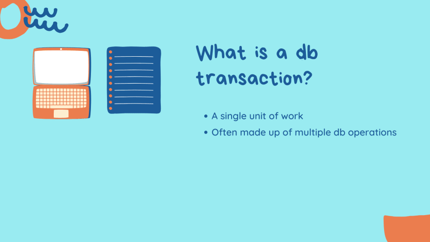
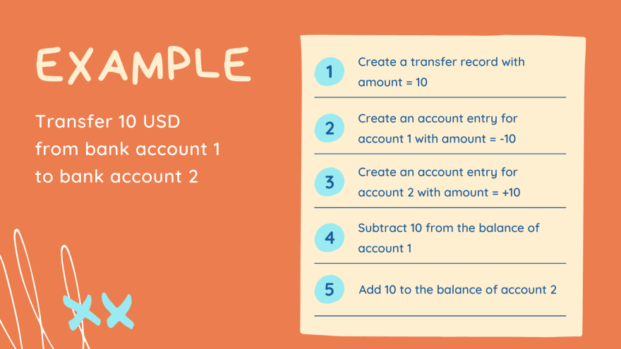
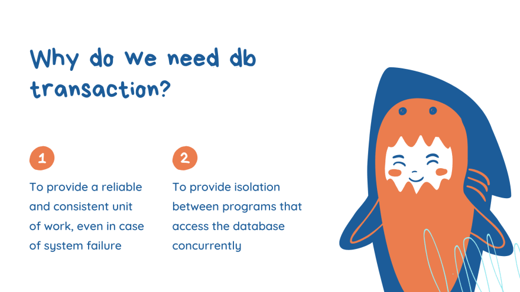
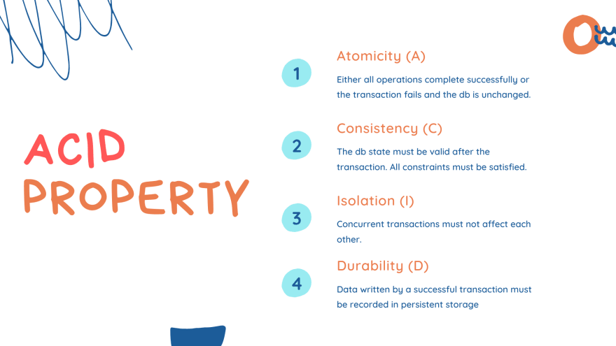
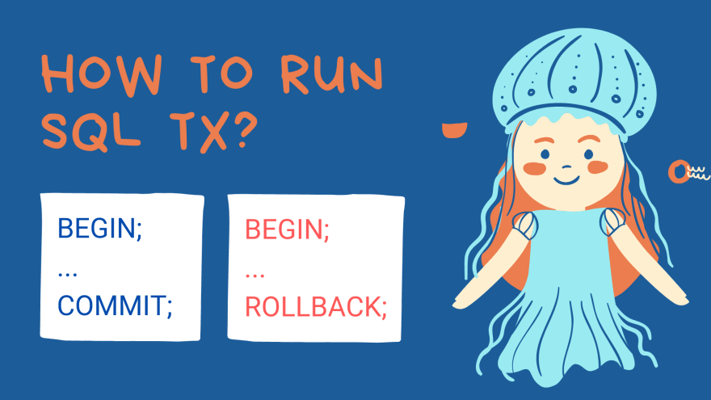
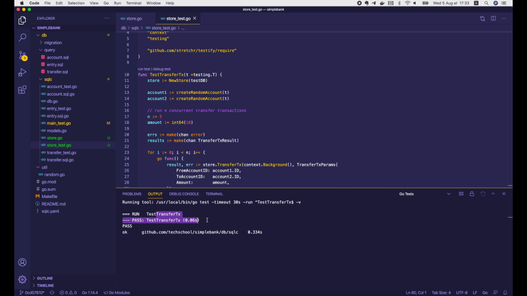
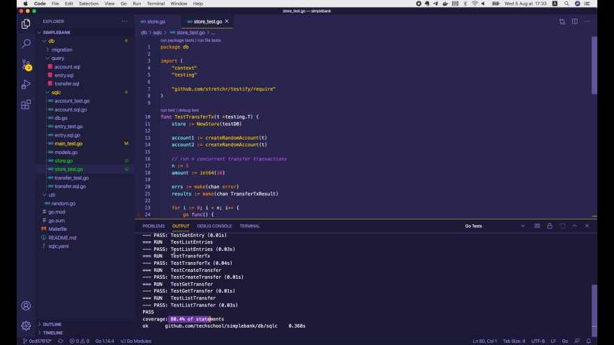

# Правильный способ реализовать транзакции в базе данных на Golang

[Оригинал](https://dev.to/techschoolguru/a-clean-way-to-implement-database-transaction-in-golang-2ba)

Привет, рад вас снова видеть!

В предыдущих лекциях мы научились писать код на Golang для выполнения CRUD 
операций для каждой отдельной таблицы базы данных простого примера банковского
приложения.

Но в реальном приложении нам часто приходится выполнять транзакции, которые 
объединяют некоторые операции из нескольких таблиц. Сегодня мы изучим правильный 
способ реализовать это на Golang.

Ниже:
* Ссылка на [плейлист с видео лекциями на Youtube](https://bit.ly/backendmaster)
* И на [Github репозиторий](https://github.com/techschool/simplebank)

## Транзакция базы данных

Прежде чем мы перейдем к написанию кода, давайте немного поговорим о 
транзакциях!

## Что такое транзакция БД?
Ну, по сути, это минимальная логически осмысленная единица работы, которая 
часто состоит из нескольких операций с базой данных.



Например, пусть в нашем простом банковском приложении мы хоти мы хотим перевести 
10 долларов США со счёта 1 на счёт 2.



Эта транзакция состоит из 5 операций:

1. Мы создаем запись в таблице `transfer` с суммой, равной 10.
2. Мы создаем запись в таблице `entry` для счёта 1 с суммой, равной -10, так 
   как деньги уходят с этого счёта.
3. Мы создаем еще одну запись в таблице `entry` для счёта 2, но с суммой, 
   равной 10, так как на этот счет поступают деньги.
4. Затем обновляем баланс (`balance`) счёта 1, вычитая из него 10.
5. И, наконец, обновляем баланс (`balance`) счёта 2, добавляя к нему 10.

Это транзакция, которую мы собираемся реализовать в этой статье. Мы вернёмся к 
ней чуть позже.

## Почему нам нужно использовать транзакцию БД?



Существуют 2 основные причины:

1. Мы хотим, чтобы наша группа логически объединённых последовательных 
   операций работала надежно и стабильно даже в случае сбоя системы.
2. Мы хотим обеспечить изоляцию между программами, которые одновременно 
   обращаются к базе данных.
   
## Свойства ACID

Для достижения этих двух целей транзакция базы данных должна удовлетворять 
свойствам ACID, где:



* `A` — `Atomicity` (атомарность), что означает либо все операции транзакции завершаются 
  успешно, либо вся транзакция завершается со сбоем, и все откатывается, база 
  данных не изменяется.
* `C` — `Consistency` (согласованность), что означает, что состояние базы данных должно оставаться 
  корректным после выполнения транзакции. Точнее, все данные, записываемые в 
  базу данных, должны быть корректными в соответствии с предопределенными 
  правилами, включая ограничения, каскадность и триггеры.
* `I` — `Isolation` изолированность, означающая, что все транзакции, которые 
  выполняются одновременно, не должны влиять друг на друга. Существует несколько 
  уровней изоляции, которые определяют, когда изменения, сделанные 
  одной транзакцией, могут быть видны другим. Подробнее об этом мы узнаем в 
  другой лекции.
* Последним свойством является `D`, `Durability` (прочность). В основном это 
  означает, что все данные, записанные успешной транзакцией, должны остаться 
  сохранёнными и не могут быть потеряны даже в случае сбоя системы.
  
## Как осуществить транзакцию с помощью SQL в базе данных?



Сделать это довольно просто:

* Мы начинаем транзакцию с помощью инструкции `BEGIN`.
* Затем вводим ряд обычных SQL-запросов (или операций).
* Если все они будут успешными, мы ФИКСИРУЕМ (`COMMIT`) транзакцию, чтобы 
  сделать её постоянной, база данных перейдёт в новое состояние.
* В противном случае, если какой-либо запрос завершится ошибкой, мы ОТМЕНИМ (`ROLLBACK`) 
  транзакцию, таким образом, все изменения, сделанные предыдущими запросами в 
  транзакции, исчезнут, а база данных останется такой же, какой она была до 
  транзакции.

Итак, теперь у нас есть некоторое базовое представление о транзакциях базы 
данных. Давайте узнаем, как реализовать их в Golang.

## Реализация транзакций в БД на Go

Я собираюсь создать новый файл `store.go` внутри папки `db/sqlc`. В этом файле 
давайте определим новую структуру `Store`.

```go
type Store struct {
}
```

Это хранилище будет предоставлять все функции для выполнения запросов к базе 
данных по отдельности, а также их комбинации в рамках транзакции.

### Использование композиции для расширения функциональности Queries

Для отдельных запросов у нас уже есть структура `Queries`, сгенерированная `sqlc`, 
которую мы изучили в предыдущих лекциях.

Однако каждый запрос выполняет только одну операцию с одной конкретной таблицей. 
Таким образом, структура `Queries` не поддерживает транзакцию. Вот почему мы 
должны расширить его функциональность, встроив её в структуру `Store` 
следующим образом:

```go
type Store struct {
    *Queries
}
```

Это называется `композицией`, и это предпочтительный способ расширения 
функциональности структуры в Golang вместо наследования. После внедрения `Queries` 
в `Store` все отдельные функции запросов, предоставляемые `Queries`, будут 
доступны в `Store`.

Мы можем реализовать поддержку транзакций, добавляя дополнительные функции в 
эту новую структуру. Для этого нам нужно, чтобы в `Store` был объект `sql.DB`, 
поскольку он необходим для создания новой транзакции базы данных.

```go
type Store struct {
    *Queries
    db *sql.DB
}
```

## Создаём новый Store

Хорошо, теперь давайте добавим функцию для создания нового объекта `Store`. Она 
принимает `sql.DB` в качестве входных данных и возвращает `Store`. Внутри мы 
просто создаем новый объект `Store` и возвращаем его.

```go
func NewStore(db *sql.DB) *Store {
    return &Store{
        db:      db,
        Queries: New(db),
    }
}
```

Здесь `db` - входная переменная типа `sql.DB`, а `Queries` создаются путем вызова 
функции `New()`, передавая туда объект `db`. Функция New() была сгенерирована 
`sqlc`, как мы уже знаем из предыдущих лекций. Он создает и возвращает объект 
`Queries`.

## Выполняем обобщенную транзакцию БД

Далее мы добавим в `Store` функцию для выполнения универсальной транзакции 
базы данных.

```go
func (store *Store) execTx(ctx context.Context, fn func(*Queries) error) error {
    ...
}
```

Идея проста: она принимает контекст и функцию обратного вызова в качестве 
входных данных, затем запускает новую транзакцию базы данных, создает новый 
объект `Queries` с этой транзакцией, вызывает функцию обратного вызова с 
созданными `Queries` и, наконец, фиксирует или откатывает транзакцию, на основе 
ошибки, возвращаемой этой функцией.

Давайте реализуем её!

Во-первых, чтобы начать новую транзакцию, мы вызываем `store.db.BeginTx()`, 
передаем контекст и, возможно, `sql.TxOptions`.

```go
tx, err := store.db.BeginTx(ctx, &sql.TxOptions{})
```

Этот параметр позволяет нам установить свой пользовательский уровень изоляции 
для этой транзакции.

```go
type TxOptions struct {
    Isolation IsolationLevel
    ReadOnly  bool
}
```

Если мы не укажем его явно, то будет использоваться уровень изоляции сервера 
базы данных по умолчанию, который в случае `Postgres` — `read-commit`.

Подробнее об этом мы узнаем в другой лекции. А пока давайте просто передадим 
здесь `nil`, чтобы использовать значение по умолчанию.

```go
func (store *Store) execTx(ctx context.Context, fn func(*Queries) error) error {
    tx, err := store.db.BeginTx(ctx, nil)
    if err != nil {
        return err
    }

    q := New(tx)
    ...
}
```

Функция `BeginTx()` возвращает объект транзакции или ошибку. Если ошибка не 
равна `nil`, мы просто возвращаем ее немедленно. В противном случае мы вызываем 
функцию `New()` с созданной транзакцией `tx` и возвращаем новый объект `Queries`.

Это та же самая функция `New()`, которую мы использовали в функции 
`NewStore()`. Единственное отличие состоит в том, что вместо передачи `sql.DB` 
мы теперь передаем объект `sql.Tx`. Это работает, потому что функция `New()` 
принимает интерфейс `DBTX`, как мы видели в предыдущей лекции:

```go
type DBTX interface {
    ExecContext(context.Context, string, ...interface{}) (sql.Result, error)
    PrepareContext(context.Context, string) (*sql.Stmt, error)
    QueryContext(context.Context, string, ...interface{}) (*sql.Rows, error)
    QueryRowContext(context.Context, string, ...interface{}) *sql.Row
}

func New(db DBTX) *Queries {
    return &Queries{db: db}
}
```

Итак, теперь когда у нас есть запросы, которые выполняются внутри транзакции, мы 
можем вызывать входную функцию, передав туда эти запросы и посмотреть что она 
вернёт.

Если ошибка не равна `nil`, то нам нужно откатить транзакцию, вызвав `tx.Rollback()`. 
Функция также возвращает ошибку из-за которой произошёл откат.

Если ошибка отката также не равна `nil`, то мы должны сообщить о двух ошибках. 
Поэтому мы объединяем их в одну единственную ошибку, используя `fmt.Errorf()` 
перед возвратом:

```go
func (store *Store) execTx(ctx context.Context, fn func(*Queries) error) error {
    tx, err := store.db.BeginTx(ctx, &sql.TxOptions)
    if err != nil {
        return err
    }

    q := New(tx)
    err = fn(q)
    if err != nil {
        if rbErr := tx.Rollback(); rbErr != nil {
            return fmt.Errorf("tx err: %v, rb err: %v", err, rbErr)
        }
        return err
    }

    return tx.Commit()
}
```

В случае успешного отката мы просто возвращаем исходную ошибку транзакции.

Наконец, если все операции в транзакции выполнены успешно, мы просто фиксируем 
транзакцию с помощью `tx.Commit()` и возвращаем ее ошибку вызывающей стороне.

На этом работа с функцией `execTx()` закончена. Обратите внимание, что эта 
функция не экспортируется (она начинается со строчной буквы `e`), потому что 
мы не хотим, чтобы внешний пакет вызывал ее напрямую. Вместо этого мы 
предоставим экспортированную функцию для каждой конкретной транзакции.

## Реализуем транзакцию для перевода денег

Теперь давайте добавим новую функцию `TransferTx()` для реализации в качестве примера 
транзакции перевода денег, который мы обсуждали в начале лекции.

Вспомним, что она создаёт новую запись в таблице `transfer`, добавляет две новые
записи в таблицу `entries` и обновляет два баланса счёта в рамках одной 
транзакции базы данных.

Входными данными этой функции будут контекст и объект-аргумент типа 
`TransferTxParams`. И он вернет объект `TransferTxResult` или ошибку.

```go
func (store *Store) TransferTx(ctx context.Context, arg TransferTxParams) (TransferTxResult, error) {
}
```

Структура `TransferTxParams` содержит все необходимые входные параметры для 
перевода денег между двумя счетами:

```go
type TransferTxParams struct {
    FromAccountID int64 `json:"from_account_id"`
    ToAccountID   int64 `json:"to_account_id"`
    Amount        int64 `json:"amount"`
}
```

* `FromAccountID` - это ID, с которого будут отправлены деньги.
* `ToAccountID` - это ID, на который будут отправлены деньги.
* И последнее поле - `Amount` сумма отправленных денег.

Структура `TransferTxResult` содержит результат транзакции перевода. Она имеет 
5 полей:

```go
type TransferTxResult struct {
    Transfer    Transfer `json:"transfer"`
    FromAccount Account  `json:"from_account"`
    ToAccount   Account  `json:"to_account"`
    FromEntry   Entry    `json:"from_entry"`
    ToEntry     Entry    `json:"to_entry"`
}
```

* Созданную запись `Transfer`.
* `FromAccount` после вычитания из его баланса.
* `ToAccount` после добавления к его баланса.
* `FromEntry`, где указывается, что деньги перемещаются из `FromAccount`.
* И `ToEntry`, где указывается, что деньги перемещаются на `ToAccount`.

Итак, теперь мы можем реализовать транзакцию перевода. Сначала мы создаем 
пустой результат транзакции. Затем мы вызываем функцию `store.execTx()`, которую 
мы написали ранее, чтобы создать и запустить новую транзакцию в базе данных.

```go
func (store *Store) TransferTx(ctx context.Context, arg TransferTxParams) (TransferTxResult, error) {
    var result TransferTxResult

    err := store.execTx(ctx, func(q *Queries) error {
        ...
        return nil
    })

    return result, err
}
```

Мы передаем контекст и функцию обратного вызова. А пока давайте просто вернем 
`nil` в этом обратном вызове. Наконец, мы возвращаем результат и ошибку вызова 
`execTx()`.

Теперь вернемся к реализации функции обратного вызова. По сути, мы можем 
использовать объект запросов `q` для вызова любой отдельной CRUD функции, 
которую он предоставляет.

Имейте в виду, что этот объект запросов создается из одной единственной 
транзакции базы данных, поэтому все его методы, которые мы вызываем, будут 
выполняться в этой транзакции.

Итак, давайте создадим запись в таблице `transfer`, вызвав `q.CreateTransfer()`, 
передав входной контекст и аргумент `CreateTransferParams`:

```go
func (store *Store) TransferTx(ctx context.Context, arg TransferTxParams) (TransferTxResult, error) {
    ...

    err := store.execTx(ctx, func(q *Queries) error {
        var err error

        result.Transfer, err = q.CreateTransfer(ctx, CreateTransferParams{
            FromAccountID: arg.FromAccountID,
            ToAccountID:   arg.ToAccountID,
            Amount:        arg.Amount,
        })
        if err != nil {
            return err
        }

        ...

        return nil
    })

    return result, err
}
```

Получившийся результат будет сохранён в `result.Transfer` или ошибку. Если 
ошибка не равна `nil`, мы просто сразу возвращаем её.

Здесь видно, что мы обращаемся к переменной `result` внешней функции 
изнутри этой функции обратного вызова. Аналогично для переменной `arg`.

Это делает функцию обратного вызова `замыканием`. Поскольку в Go пока отсутствует 
поддержка дженериков, замыкание часто используется, когда мы хотим получить 
результат от функции обратного вызова, потому что сама функция обратного 
вызова не знает точного типа результата, который она должна вернуть.

Итак, первый шаг — создать запись в таблице `transfer` о переводе выполнен. 
Следующим шагом является добавление двух записей в таблицу `account`: одна — для 
`FromAccount` и одна — для `ToAccount`.

Мы вызываем `q.CreateAccountEntry()`, передаем контекст и `CreateAccountEntryParams`, 
где `AccountID` — это `arg.FromAccountID`, а Amount — это `-arg.Amount`, потому 
что деньги уходят с этого счёта.

```go
func (store *Store) TransferTx(ctx context.Context, arg TransferTxParams) (TransferTxResult, error) {
    ...

    err := store.execTx(ctx, func(q *Queries) error {
        var err error

        result.Transfer, err = q.CreateTransfer(ctx, CreateTransferParams{
            FromAccountID: arg.FromAccountID,
            ToAccountID:   arg.ToAccountID,
            Amount:        arg.Amount,
        })
        if err != nil {
            return err
        }

        result.FromEntry, err = q.CreateEntry(ctx, CreateEntryParams{
            AccountID: arg.FromAccountID,
            Amount:    -arg.Amount,
        })
        if err != nil {
            return err
        }

        ...

        return nil
    })

    return result, err
}
```

Как и ранее, если ошибка не равна `nil`, мы просто возвращаем ее, чтобы 
транзакция откатилась.

Мы делаем то же самое, чтобы создать запись в таблице `account` для счёта `to`. 
Но на этот раз возвращаем результат в `result.ToEntry`, `AccountID` — 
`arg.ToAccountID`, а `Amount` — просто `arg.Amount`, поскольку на этот счет 
поступают деньги.

```go
func (store *Store) TransferTx(ctx context.Context, arg TransferTxParams) (TransferTxResult, error) {
    ...

    err := store.execTx(ctx, func(q *Queries) error {
        var err error

        result.Transfer, err = q.CreateTransfer(ctx, CreateTransferParams{
            FromAccountID: arg.FromAccountID,
            ToAccountID:   arg.ToAccountID,
            Amount:        arg.Amount,
        })
        if err != nil {
            return err
        }

        result.FromEntry, err = q.CreateEntry(ctx, CreateEntryParams{
            AccountID: arg.FromAccountID,
            Amount:    -arg.Amount,
        })
        if err != nil {
            return err
        }

        result.ToEntry, err = q.CreateEntry(ctx, CreateEntryParams{
            AccountID: arg.ToAccountID,
            Amount:    arg.Amount,
        })
        if err != nil {
            return err
        }

        return nil

        // TODO: update accounts' balance
    })

    return result, err
}
```

И мы закончили с созданием счётов. Последний шаг для обновления баланса учетной 
записи будет более сложным, поскольку он включает в себя блокировку и 
предотвращение потенциальной взаимной блокировки.

Поэтому, думаю, стоит рассказать об этом подробно в отдельной лекции. Давайте 
добавим сюда комментарий TODO, и мы вернемся к его реализации в дальнейшем.

## Тестируем транзакцию для перевода денег

На данный момент допустим, что наша транзакция для перевода считается выполненной,
если создана 1 записью в таблице `transfer` и 2 записи в таблице `account`. Мы 
должны протестировать её, чтобы убедиться, что она работает так, как ожидалось.

Я собираюсь создать новый файл `store_test.go`. Он находится в том же пакете `db`, 
что и наш `store.go`. Затем давайте определим новый unit тест для функции 
`TransferTx()`.

```go
func TestTransferTx(t *testing.T) {
    ...
}
```

Сначала нам нужно создать новый объект `Store`. Для функции `NewStore()` требуется 
объект `sql.DB`.

Если вы ещё не забыли, в предыдущей лекции мы уже создали объект `sql.DB` в 
файле `main_test.go` с помощью вызова функции `sql.Open()`:

```go
func TestMain(m *testing.M) {
    conn, err := sql.Open(dbDriver, dbSource)
    ...
}
```

Поэтому, чтобы повторно использовать его, здесь вместо присвоения результата 
переменной подключения мы объявим новую глобальную переменную: `testDB` и сохраним 
в ней результат команды `sql.Open()`.

```go
var testQueries *Queries
var testDB *sql.DB

func TestMain(m *testing.M) {
	var err error
	testDB, err = sql.Open(dbDriver, dbSource)
	if err != nil {
		log.Fatal("cannot connect to db:", err)
	}

	testQueries = New(testDB)

	os.Exit(m.Run())
}
```

Хорошо, теперь мы можем вернуться к нашему unit тесту и передать объект `testDB` 
в функцию `NewStore()` для создания нового `Store`:

```go
func TestTransferTx(t *testing.T) {
    store := NewStore(testDB)

    account1 := createRandomAccount(t)
    account2 := createRandomAccount(t)

    ...
}
```

Затем мы создаем 2 случайных счёта, используя функцию `createRandomAccount()`, 
которую мы написали в предыдущей лекции. Мы отправим деньги с `account1` на 
`account2`.

По моему опыту, мы всегда должны быть очень осторожны при написании транзакций 
базы данных. Их может быть легко написать, но также легко они могут стать кошмаром, 
если мы не будем учитывать их возможное параллельное выполнение.

Таким образом, лучший способ убедиться, что наша транзакция работает правильно, — это 
запустить ее с помощью нескольких горутин.

Допустим, я хочу запустить `n = 5` одновременных транзакций перевода, и каждая 
из них будет переводить сумму (`amount`) `10` с `account1` на `account2`. 
Поэтому я буду использовать простой цикл `for` с `n` итерациями:

```go
func TestTransferTx(t *testing.T) {
    store := NewStore(testDB)

    account1 := createRandomAccount(t)
    account2 := createRandomAccount(t)

    n := 5
    amount := int64(10)

    // запускаем n одновременных транзакций перевода
    for i := 0; i < n; i++ {
        go func() {
            result, err := store.TransferTx(context.Background(), TransferTxParams{
                FromAccountID: account1.ID,
                ToAccountID:   account2.ID,
                Amount:        amount,
            })

            ...
        }()
    }

    ...
}
```

И внутри цикла мы используем ключевое слово `go`, чтобы запустить новую горутину.
Внутри горутины мы вызываем функцию `store.TransferTx()` с фоновым контекстом и 
объектом `TransferTxParams`, где `FromAccountID` — это `account1.ID`, 
`ToAccountID` — это `account2.ID`, а `Amount` — `10`, поскольку мы задали 
`amount = 10` как было сказано выше.

Эта функция возвращает результат или ошибку. Мы не можем просто использовать 
`testify/require`, чтобы проверить их прямо здесь, поскольку эта функция 
выполняется внутри другой горутины, отличной от той, в которой работает наша 
функция `TestTransferTx`, поэтому нет гарантии, что она остановит весь тест, 
если условие не будет выполнено.

Правильно будет отправить ошибку и результат обратно в основную горутину, в 
которой выполняется наш тест, и осуществить проверку оттуда.

Для этого мы можем использовать каналы. Канал предназначен для взаимодействия 
параллельных горутин и позволяет им безопасно обмениваться данными друг с 
другом без явной блокировки.

В нашем случае нам нужен один канал для получения ошибок и еще один канал для 
получения `TransferTxResult`. Мы используем ключевое слово `make` для создания 
канала.

```go
func TestTransferTx(t *testing.T) {
    ...

    // запускаем n одновременных транзакций перевода
    errs := make(chan error)
    results := make(chan TransferTxResult)

    for i := 0; i < n; i++ {
        go func() {
            result, err := store.TransferTx(context.Background(), TransferTxParams{
                FromAccountID: account1.ID,
                ToAccountID:   account2.ID,
                Amount:        amount,
            })

            errs <- err
            results <- result
        }()
    }
}
```

Теперь внутри горутины мы можем послать ошибку (`err`) в канал `errs`, используя этот 
оператор со стрелкой `<-`. Канал должен быть слева, а данные для отправки — справа 
от оператора стрелки.

Точно так же мы отправляем результат (`result`) в канал результатов (`results`). 
Затем мы проверим эти ошибки и результаты извне.

Мы просто запускаем цикл `for` из `n` итераций. Чтобы получить ошибку из канала, 
мы используем тот же оператор стрелки, но на этот раз канал находится справа 
от стрелки, а переменная для хранения полученных данных — слева.

```go
func TestTransferTx(t *testing.T) {
    ...

    // запускаем n одновременных транзакций перевода
    ...

    // проверяем результаты
    for i := 0; i < n; i++ {
        err := <-errs
        require.NoError(t, err)

        result := <-results
        require.NotEmpty(t, result)

        ...
    }
}
```

Мы требуем отсутствия ошибок здесь, то есть полученная из канала ошибка должна 
быть равна `nil`. Точно так же мы получаем результат (`result`) из канала 
результатов (`results`) и проверяем, что результат (`result`) не является 
пустым объектом.

Так как результат (`result`) содержит несколько объектов внутри, давайте проверим каждый 
из них. Начните с `result.Transfer`:

```go
func TestTransferTx(t *testing.T) {
    ...

	// проверяем результаты
    for i := 0; i < n; i++ {
        err := <-errs
        require.NoError(t, err)

        result := <-results
        require.NotEmpty(t, result)

        // проверяем перевод
        transfer := result.Transfer
        require.NotEmpty(t, transfer)
        require.Equal(t, account1.ID, transfer.FromAccountID)
        require.Equal(t, account2.ID, transfer.ToAccountID)
        require.Equal(t, amount, transfer.Amount)
        require.NotZero(t, transfer.ID)
        require.NotZero(t, transfer.CreatedAt)

        ...
    }
}
```

Мы требуем, чтобы этот объект перевода не был пустым. Затем поле `FromAccountID` 
перевода должно быть равно `account1.ID`, поле `ToAccountID` перевода должно 
быть равно `account2.ID`, а `transfer.Amount` должно равняться исходной сумме 
(`amount`).

Поле `ID` перевода не должно быть нулевым, поскольку это поле с автоинкрементом. 
И, наконец, значение `transfer.CreatedAt` не должно быть нулевым, поскольку мы 
ожидаем, что база данных заполнит его значением по умолчанию, то есть текущей 
меткой времени.

Теперь, чтобы убедиться, что запись о переводе действительно создана в базе 
данных, мы должны вызвать `store.GetTransfer()`, чтобы найти запись с 
идентификатором, равным `transfer.ID`:

```go
func TestTransferTx(t *testing.T) {
    ...

	// проверяем результаты
    for i := 0; i < n; i++ {
        // проверяем перевод
        ...

        _, err = store.GetTransfer(context.Background(), transfer.ID)
        require.NoError(t, err)

        ...
    }
}
```

Здесь вы видите, что, поскольку объект `Queries` встроен в `Store`, функция 
`GetTransfer()` из `Queries` также доступна в `Store`.

Если перевод действительно произошёл, эта функция не должна возвращать 
ошибку, поэтому здесь нам нужно проверить, что не возникло ошибок.

Далее мы проверим записи, созданные в таблице `entries`. Во-первых, `FromEntry`:

```go
func TestTransferTx(t *testing.T) {
    ...

	// проверяем результаты
    for i := 0; i < n; i++ {
        // проверяем перевод
        ...

        // проверяем записи в таблице entries
        fromEntry := result.FromEntry
        require.NotEmpty(t, fromEntry)
        require.Equal(t, account1.ID, fromEntry.AccountID)
        require.Equal(t, -amount, fromEntry.Amount)
        require.NotZero(t, fromEntry.ID)
        require.NotZero(t, fromEntry.CreatedAt)

        _, err = store.GetEntry(context.Background(), fromEntry.ID)
        require.NoError(t, err)

        ...
    }
}
```

Как и раньше, мы проверяем, что она не пустая. Идентификатор счёта должен быть 
равен `account1.ID`, а сумма должна быть равна `-amount`, потому что деньги 
уходят. Наконец, поля `ID` и `created_at` записи не должны быть нулевыми.

Мы также пытаемся получить запись из базы данных, чтобы убедиться, что она 
действительно создана.

Проверка записи аналогична. Поэтому я просто копирую блок кода и меняю 
имена этих переменных и полей на `toEntry`.

```go
func TestTransferTx(t *testing.T) {
    ...

    // проверяем результаты
    for i := 0; i < n; i++ {
        // проверяем перевод
        ...

        // проверяем записи в таблице entries
        ...

        toEntry := result.ToEntry
        require.NotEmpty(t, toEntry)
        require.Equal(t, account2.ID, toEntry.AccountID)
        require.Equal(t, amount, toEntry.Amount)
        require.NotZero(t, toEntry.ID)
        require.NotZero(t, toEntry.CreatedAt)

        _, err = store.GetEntry(context.Background(), toEntry.ID)
        require.NoError(t, err)

        // TODO: check accounts' balance
    }
}
```

Идентификатор счёта должен быть `account2.ID` вместо `account1.ID`. И сумма 
должна быть `amount`, а не `-amount`, потому что деньги поступают.

После этого мы должны попытаться извлечь запись `toEntry` из базы данных 
вместо `fromEntry`.

Теперь имейте в виду, что мы также должны проверить баланс счетов. Но так как 
мы еще не реализовали часть для обновления баланса счетов, давайте просто 
добавим здесь комментарий TODO, и мы допишем код на следующей лекции.

Итак, тест готов, попробуем его запустить.

Он успешно пройден! Превосходно!



Давайте запустим тесты всего пакета.



Всё тесты успешно пройдены! Покрытие составляет около 80%, что очень хорошо.

И на этом завершим сегодняшнюю лекцию о том, как реализовать транзакцию базы 
данных в Golang. Я надеюсь вам она понравилась.

Вы можете попробовать реализовать обновление баланса счета самостоятельно, пока 
будите ожидать выход следующей лекции.

Желаю вам получать удовольствие от написания кода и увидимся на следующей 
лекции!