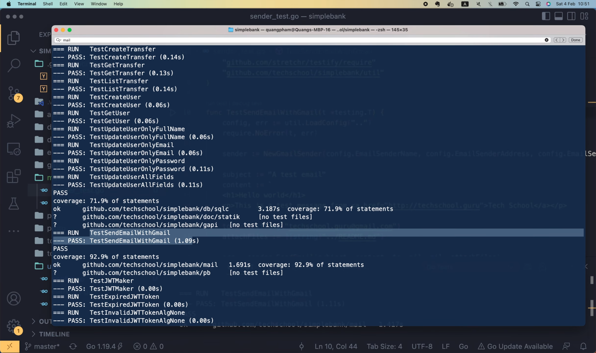
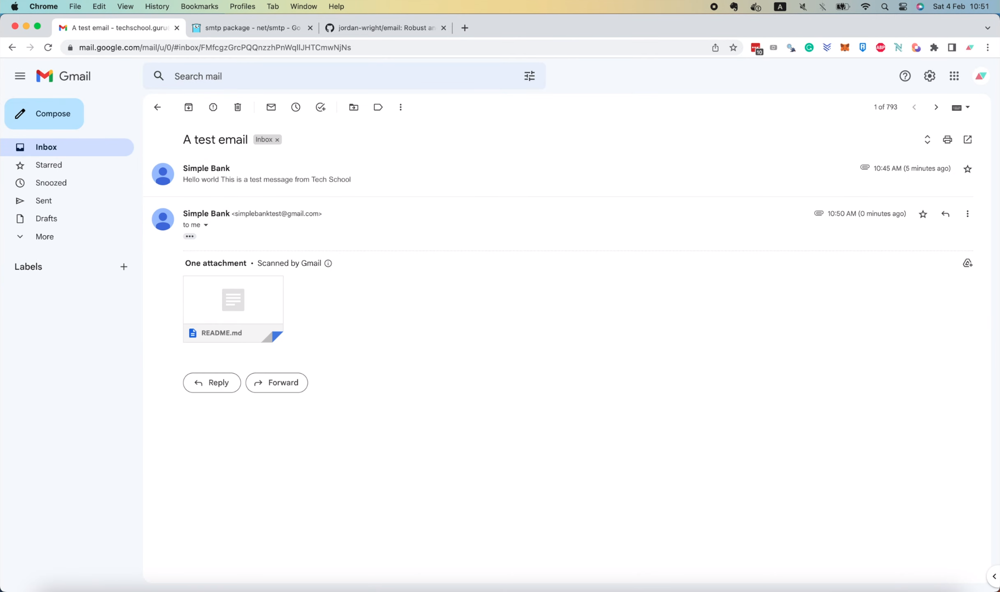
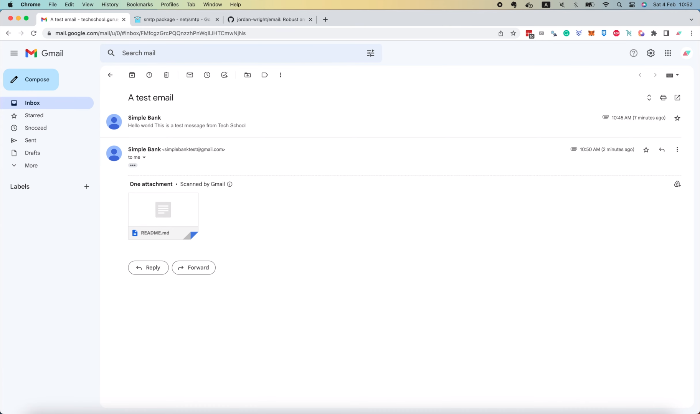
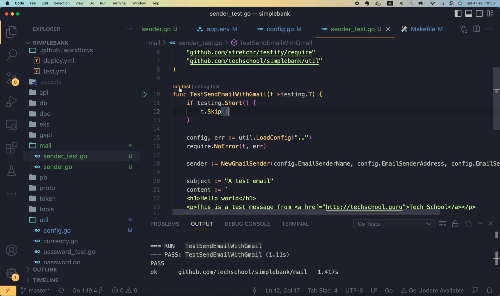
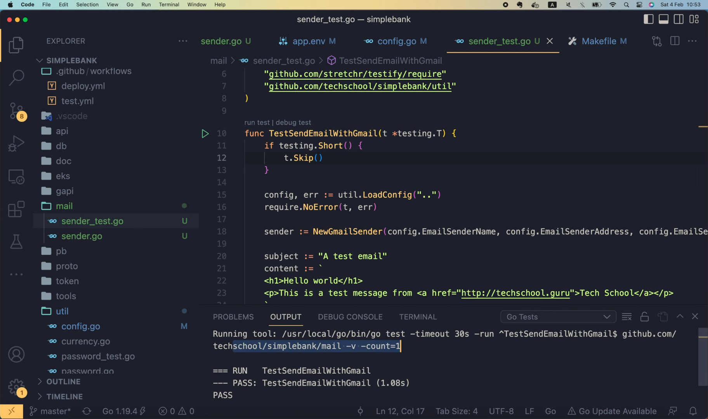
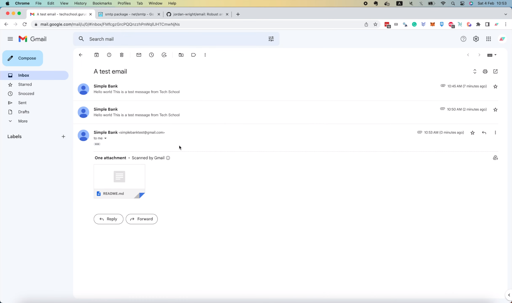
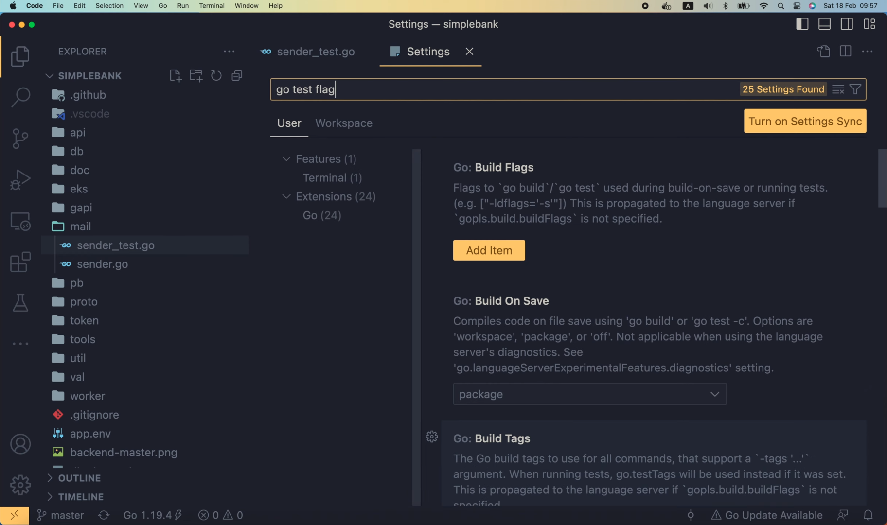
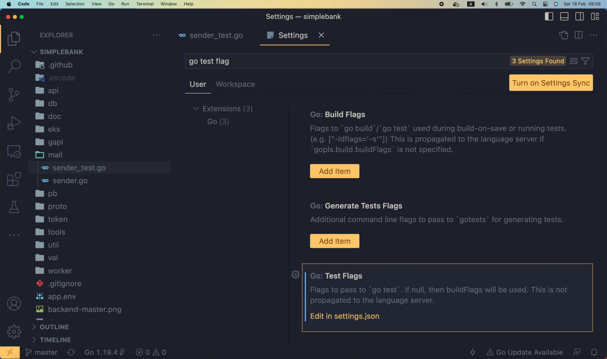

# How to skip test in Go and config test flag in VS Code

[Original video](https://www.youtube.com/watch?v=0UwZGM9iqTE)

Hello guys, welcome to the backend master class. In previous lecture, we've
written a test to send emails with Gmail. However, if we keep the test
like this, it will be run every time the GitHub CI test workflow is
triggered. Because in the workflow, we're using the "make test" command
to run all tests in the project.

```yaml
      - name: Run migrations
        run: make migrateup

      - name: Test
        run: make test
```

And whenever this command is run, the `TestSendEmail` will also be executed,
and a new email will be delivered.





This is really not something we want, because there would be a lot of spam
emails in the inbox.

So how can we skip only this test while still keeping the others?

## How to skip test in Go

Well, there's a very simple way to do that, using the `-short` flag.

At the beginning of the test, we can check if `testing.Short()` is `true`.
If it is, then it means that the `-short` flag has been set. And if that's
the case, this means we're telling Go that we only want to run "short" 
tests, or in other words, the tests that don't take a long time to run.
So, we should skip all tests that we think might be slow. We can easily
do that by calling the `t.Skip()` function.

```go
func TestSendEmailWithGmail(t *testing.T) {
    if testing.Short() {
        t.Skip()
    }
    
    config, err := util.LoadConfig("..")
    ...
}
```

With this change, the `SendEmail` test won't be executed if the `short`
flag is set. So what we need to do now is: open the Makefile, and add
the `-short` flag to the `test` command.

```makefile
...

test:
	go test -v -cover -short ./...

...
```

Pretty simple, right?

Alright, now if we run

```shell
make test
```

in the terminal, we'll see a log here saying that the `SendEmail` test
is skipped.

```shell
=== RUN   TestSendEmailWithGmail
    sender_test.go:12: 
--- SKIP: TestSendEmailWithGmail (0.00s)
PASS
```

And of course, there will be no new emails delivered to our inbox.



So it works! Excellent!

Note that, the change we just made doesn't affect how we develop and test
the feature in VS Code. We can still run the test here,



and the test is not skipped,



because by default, the `-short` flag is not set.

And so, a new email will still be delivered to our inbox, just as expected.



You can also change the behaviour of the test command in VS Code if you
want.

## Config test flag in VS Code

Just open the `Settings` page in `Code` menu, and search for `go test
flag`.



If you've installed the Go extension, you will see the `Test Flags` section
at the bottom.



This is where you can config the flags you want to pass into the `go test`
command.

Let's click "Edit in settings.json". It will bring you to the `go.testFlag`
section. Here I have defined 2 flags for my `test` command.

```json
{
    ...
    "extensions.ignoreRecommendations": false,
    "go.testFlags": [
        
        "-v",
        "-count=1"
    ],
    ...
}
```

The first one is the "-v" flag, which means "verbose". Normally Go only
prints out the logs if the test failed. But with the `verbose` flag 
enabled, it will always print out the logs, even if the test passed.

The second flag I set here is "-count=1". With this flag, I want to 
disable the test caching feature, so my test will always run when I
click the `Run test` button, even if there's no change in the code
or the test.

You can also add the `-short` flag here if you want,

```json
{
    ...
    "extensions.ignoreRecommendations": false,
    "go.testFlags": [
        "-short",
        "-v",
        "-count=1"
    ],
    ...
}
```

but I think it's better to not add it here, because when developing the
feature, we will always want to run the test, not skip it.

Alright, that's all I wanted to share with you in this video.

It was pretty short, but I hope it was still interesting and useful for
you.

Thanks a lot for watching. Happy learning, and see you in the next 
lecture!