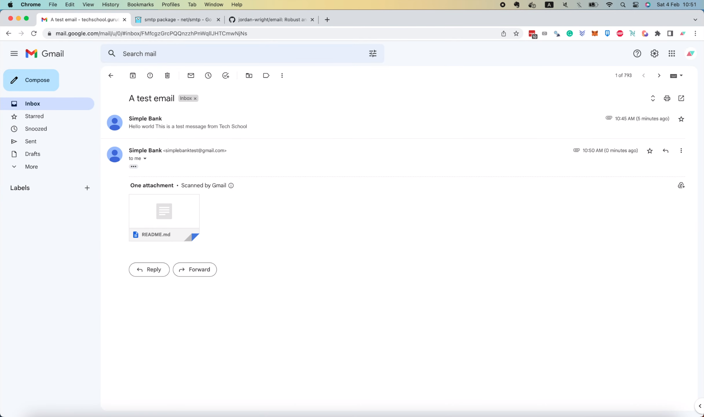
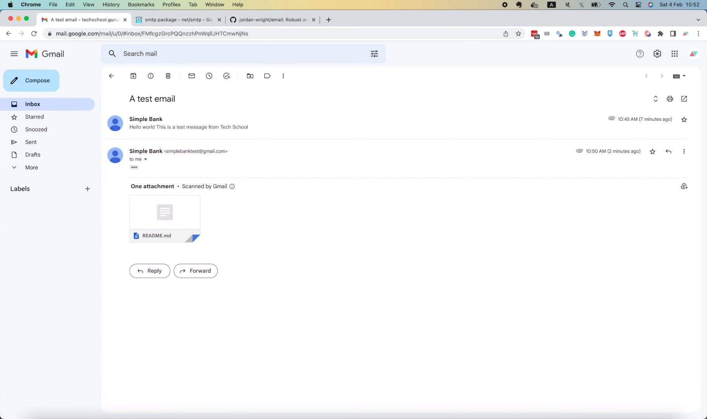
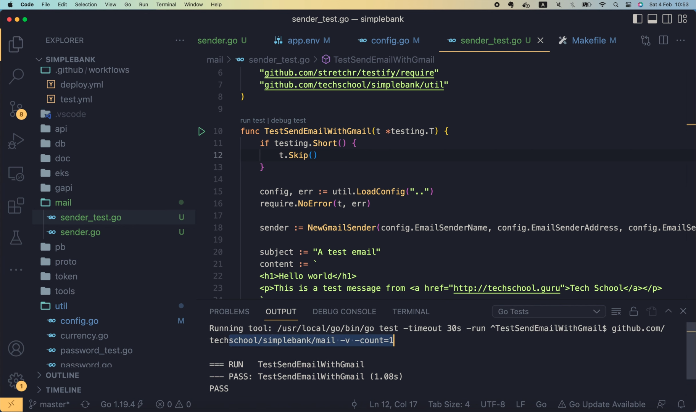
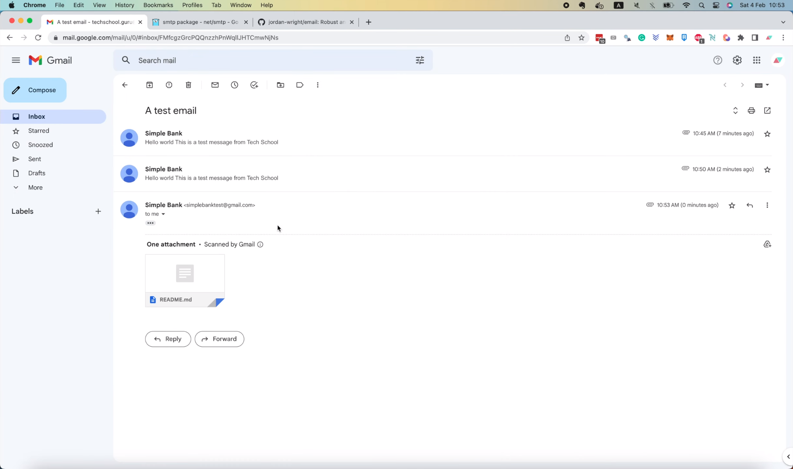
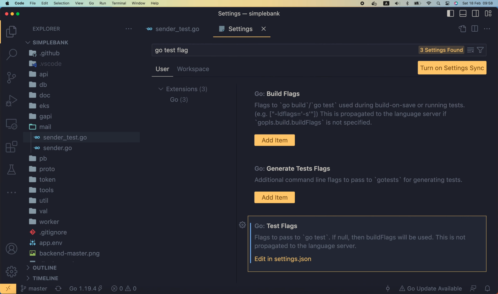

# Как пропустить тест в Go и настроить флаг, отвечающий за выполнение теста в VS Code

[Оригинал](https://www.youtube.com/watch?v=0UwZGM9iqTE)

Привет, ребята, добро пожаловать на мастер-класс по бэкенду. На предыдущей
лекции мы написали тест для отправки электронных писем с помощью Gmail.
Однако если мы оставим тест в таком виде, он будет запускаться каждый раз,
когда выполняется рабочий процесс тестирования GitHub CI. Это связано с 
тем, что в рабочем процессе мы используем команду "make test" для запуска 
всех тестов в проекте.

```yaml
      - name: Run migrations
        run: make migrateup

      - name: Test
        run: make test
```

И всякий раз, когда эта команда запускается, `TestSendEmail` также будет
выполняться, и будет отправлено и доставлено новое электронное письмо.




Это действительно не то, чего мы хотим, потому что в папке «Входящие» 
будет много спам-писем.

Так как же мы можем пропустить только этот тест, выполняя при этом остальные?

## Как пропустить тест в Go

На самом деле, существует очень простой способ сделать это, используя
флаг `-short`.

В начале теста мы можем проверить, равно ли `testing.Short()` `true`. Если
да, то это означает, что был установлен флаг `-short`. И в этом случае мы
сообщаем Go, что хотим запускать только "short" («короткие») тесты, или, 
другими словами, тесты, выполнение которых не занимает много времени. 
Итак, мы должны пропустить все тесты, которые, по нашему мнению, могут
быть медленными. Мы можем легко сделать это, вызвав функцию `t.Skip()`.

```go
func TestSendEmailWithGmail(t *testing.T) {
    if testing.Short() {
        t.Skip()
    }
    
    config, err := util.LoadConfig("..")
    ...
}
```

Внеся это изменение, тест `SendEmail` не будет выполняться, если установлен
флаг `short`. Таким образом, сейчас нам нужно открыть Makefile и добавить 
флаг `-short` в команду `test`.

```makefile
...

test:
	go test -v -cover -short ./...

...
```

Довольно просто, не так ли?

Хорошо, теперь, если мы запустим

```shell
make test
```

в терминале, то увидим там сообщение в логе, сообщающее о том, что тест 
`SendEmail` пропущен.

```shell
=== RUN   TestSendEmailWithGmail
    sender_test.go:12: 
--- SKIP: TestSendEmailWithGmail (0.00s)
PASS
```

И, конечно же, мы не увидим новых писем во «Входящих».



Таким образом, всё работает как надо! Отлично!

Обратите внимание, что только что внесенные нами изменения не влияют на 
то, как мы создаём и тестируем этот функционал в VS Code. Мы все ещё можем
запустить тест здесь,


и тест не будет пропущен,



потому что по умолчанию флаг `-short` не установлен.

Поэтому, как и ожидалось, во вкладке «Входящие» мы увидим новое 
полученное письмо.



Вы также можете изменить поведение при запуске команды для тестирования
в VS Code, если хотите.

## Настраиваем флаги для тестирования в VS Code

Просто откройте страницу `Settings` («Настройки») в меню `Code` («Код») и
осуществите поиск по строке `go test flag`.


Если вы установили расширение для Go, то вы увидите раздел `Test Flags`
«Флаги для тестов» внизу.



Здесь вы можете настроить флаги, которые хотите передать в команду `go test`.

Давайте нажмём "Edit in settings.json". В этом случае мы попадём в раздел
`go.testFlag`. Здесь я определил 2 флага для своей команды `test`.

```json
{
    ...
    "extensions.ignoreRecommendations": false,
    "go.testFlags": [
        
        "-v",
        "-count=1"
    ],
    ...
}
```

Первый — это флаг "-v", сокращение от "verbose". Обычно Go выводит 
сообщения в лог только в том случае, если тест не пройден. Но с 
включенным флагом `verbose`, он всегда будет выводить сообщения в лог, 
даже если тест успешно пройден.

Второй флаг, который я здесь задал, — "-count=1". С помощью этого флага 
я хочу отключить функцию кэширования тестов, чтобы мой тест всегда 
запускался, когда я нажимаю кнопку `Run test`, даже если в коде или 
тесте нет изменений.

Вы также можете добавить сюда флаг `-short`, если хотите,

```json
{
    ...
    "extensions.ignoreRecommendations": false,
    "go.testFlags": [
        "-short",
        "-v",
        "-count=1"
    ],
    ...
}
```
но я думаю, что лучше не добавлять его сюда, потому что при разработке 
нового функционала, мы всегда будем хотеть запустить тест, а не 
пропустить его.

Хорошо, это всё, чем я хотел поделиться с вами в этой лекции.

Она была довольно короткой, но я надеюсь, несмотря на это, всё равно
интересной и полезной для вас.

Большое спасибо за время, потраченное на чтение. Желаю Вам получать
удовольствие от обучения и до встречи на следующей лекции!
