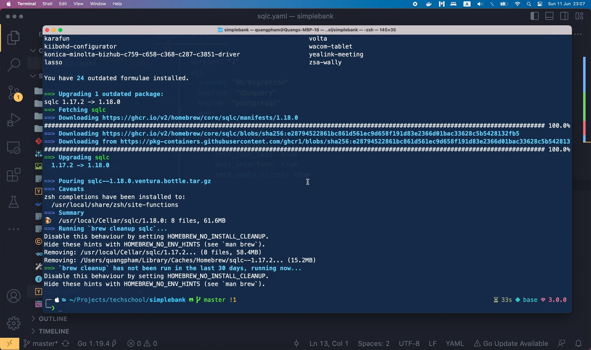
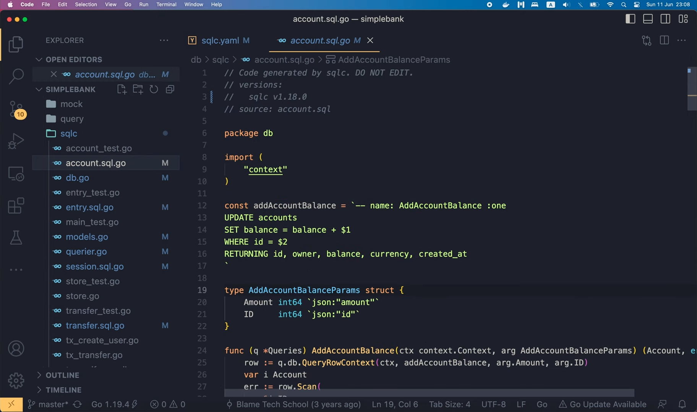

# Config sqlc version 2 for Go and Postgres

[Original video](https://www.youtube.com/watch?v=FfXE245HZB4)

Hello everyone, welcome to the backend master class. We've been using `sqlc`
a lot in our project to generate Golang code that helps us talk to the
database. A lot of new development has been done in `sqlc` since we first
installed it, so today let's try to update it to the latest version. Let's
start with the configuration version.

## Config `sqlc.yaml` file

If you look at [the documentation page](https://docs.sqlc.dev/en/latest/), 
you'll see that, now there are 2 ways to configure `sqlc`. In our project, 
we're still using [version 1](https://docs.sqlc.dev/en/latest/reference/config.html#version-1), 
so let's update it to the newer [version](https://docs.sqlc.dev/en/latest/reference/config.html#version-2). I'm gonna copy this version 2 configuration,

```yaml
version: "2"
sql:
- schema: "postgresql/schema.sql"
  queries: "postgresql/query.sql"
  engine: "postgresql"
  gen:
    go: 
      package: "authors"
      out: "postgresql"
- schema: "mysql/schema.sql"
  queries: "mysql/query.sql"
  engine: "mysql"
  gen:
    go:
      package: "authors"
      out: "mysql"
```

and paste it into our `sqlc.yaml` file. In their example, they defined 2
schema: 1 for Postgres, and 1 for MySQL. As we only use Postgres in our
project, I'm gonna delete the MySQL schema config. Alright, the field 
names of version 2 are pretty similar to those of version 1, so it's 
not hard to figure out how to write them.

```yaml
version: "2"
sql:
- schema: "postgresql/schema.sql"
  queries: "postgresql/query.sql"
  engine: "postgresql"
  gen:
    go: 
      package: "authors"
      out: "postgresql"
```

First, in the "schema" field, we can specify a single SQL file containing 
the whole DB schema like in their example, or we can also set it to a folder 
that contains all SQL migration files, which is "db/migration" in our 
project. Then in the "queries" field, we should specify a folder 
containing the SQL query files. In our case it is "db/query". The engine
field is "postgresql", so we don't have to change it. Next, the "gen" 
section of the config is where we tell `sqlc` how to generate codes for our
target programming language, which is Golang. The "package" field should
contain the name of the Go package, so it should be set to "db" since 
that's the package we're currently using. Then, we use the "out" field
to tell `sqlc`, where we want the generated code files to be written to.
In this case, it should be the "db/sqlc" folder, just like what we set in 
the "path" field of the config version 1. Now, the rest of the config file
is some boolean flags. That allows us to further customize the generated 
codes. We'll have to fix their indentation, so that they're aligned with
the "package" and "out" fields. The first option is "emit_json_tags". It
is set to "true", because we want to have JSON tags for the DB model 
structs. Since we don't use prepared queries, the second option can be set
to "false", or better removed. Then, we want to emit the `Querier` 
interface, since it'll be used to generate mocks for unit testing. We don't
want `sqlc` to emit exact table names for the model struct, because we want
it to use the singular form of the table for the model name. So this
option can be removed as well. Finally, "emit_empty_slices" is set to 
"true", since we want the slices returned by the query to be empty instead
of `nil`. There are many other options you can config, you can read more
about them on the documentation [page](https://docs.sqlc.dev/en/latest/reference/config.html#go).

```yaml
version: "2"
sql:
- schema: "db/migration"
  queries: "db/query"
  engine: "postgresql"
  gen:
    go: 
      package: "db"
      out: "db/sqlc"
      emit_json_tags: true
      emit_interface: true
      emit_empty_slices: true
```

Some options I find very useful are the ones to emit result struct as 
pointers or to emit function parameters struct as pointers. OK, so now 
we've reconfigured `sqlc` with the new config version 2.

Let's try to regenerate the codes. But first, I'm gonna check the current
`sqlc` binary version.

```shell
sqlc version
v1.17.2
```

It is 1.17.2, but if I'm not wrong the latest one at the time I record this
video is already 1.18. So I'm gonna run

```shell
brew upgrade sqlc
```

to install the latest version.



Indeed, `sqlc` has been upgraded to version 1.18.0.

```shell
sqlc version
v1.18.0
```

So now, let's run make sqlc to regenerate Golang codes for our queries.

```shell
make sqlc
sqlc generate
```

It's successful! And in the `db/sqlc` folder, we can see that several files
have changed.



In fact, it seems the generated Golang codes don't change, but only the 
comment containing the `sqlc` version used to generate the code is changed.

It's fine, as long as our codes still work well as before. So to make sure
of that, I'm gonna run some tests.

First, let's check if the database is running.

```shell
docker ps
```

The "docker ps" command doesn't show any containers, so let's run 
"docker ps -a" to list all of them.

```shell
docker ps -a
CONTAINER ID   IMAGE               COMMAND                    CREATED         STATUS                    PORTS    NAMES
c641c16b43e0   redis:7-alpine      "docker-entrypoint.s..."   7 months ago    Exited (0) 7 weeks ago             redis
3b411af7dc88   postgres:14-alpine  "docker-entrypoint.s..."   11 months ago   Exited (0) 7 weeks ago             postgres
```

OK, so both Postgres and Redis are stopped. 

Let's run "docker start postgres" and "docker start redis" to wake them up.

```shell
docker start postgres12 
postgres12
docker start redis 
redis
```

Alright, now both the containers are up and running.

```shell
docker ps
CONTAINER ID   IMAGE               COMMAND                    CREATED         STATUS          PORTS    NAMES
c641c16b43e0   redis:7-alpine      "docker-entrypoint.s..."   7 months ago    Up 3 seconds             redis
3b411af7dc88   postgres:14-alpine  "docker-entrypoint.s..."   11 months ago   Up 7 seconds             postgres
```

Let's clear the terminal, and run "make test".

```shell
make test
go test -v -cover -short ./...
...
PASS
coverage: 85.7% of statements
ok      github.com/techschool/simplebank/token    0.020s  coverage: 85.7% of statements
=== RUN   TestPassword
--- PASS: TestPassword (0.30s)
PASS
coverage: 35.5% of statements
ok      github.com/techschool/simplebank/util     0.328s  coverage: 35.5% of statements
?       github.com/techschool/simplebank/val      [no test files]
?       github.com/techschool/simplebank/worker   [no test files]
?       github.com/techschool/simplebank/worker/mock      [no test files]
```

This will run all tests in our project, including the DB test. So looks
like everything is working just fine. All test passed. Excellent!

So we've successfully updated `sqlc` configuration to version 2, and `sqlc` 
executable binary to 1.18.

In the next lecture, I'm gonna show you how to switch the db driver from 
`lib/pq` to `pgx`, since `lib/pq` package has been set to maintenance mode 
for a while, and `pgx` seems to be a better implementation, with more 
features.

Thanks a lot for watching this video, it was short, but I hope it's still 
useful for you. Happy learning! And I'll see you soon in the next lecture!