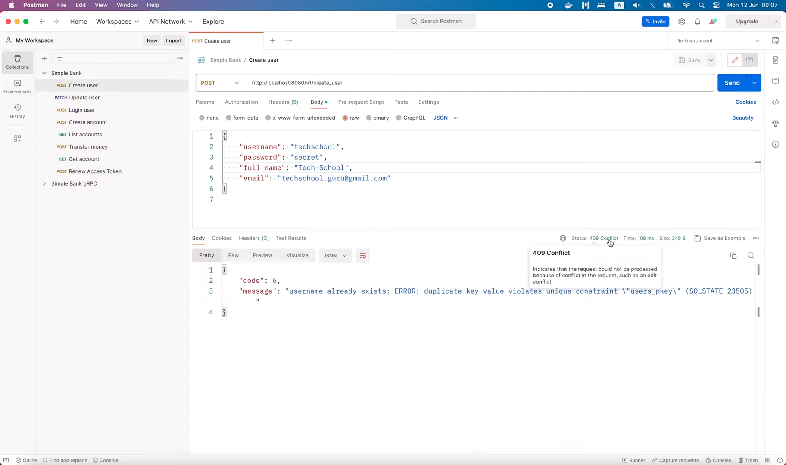
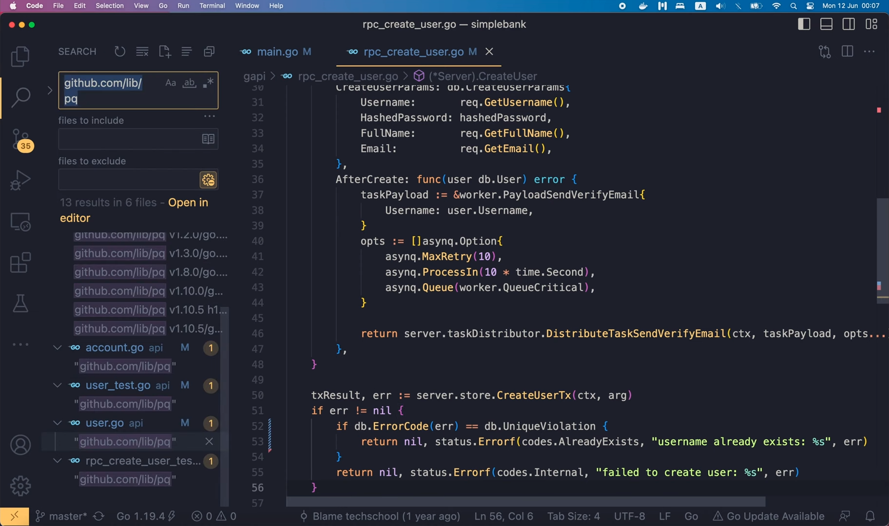
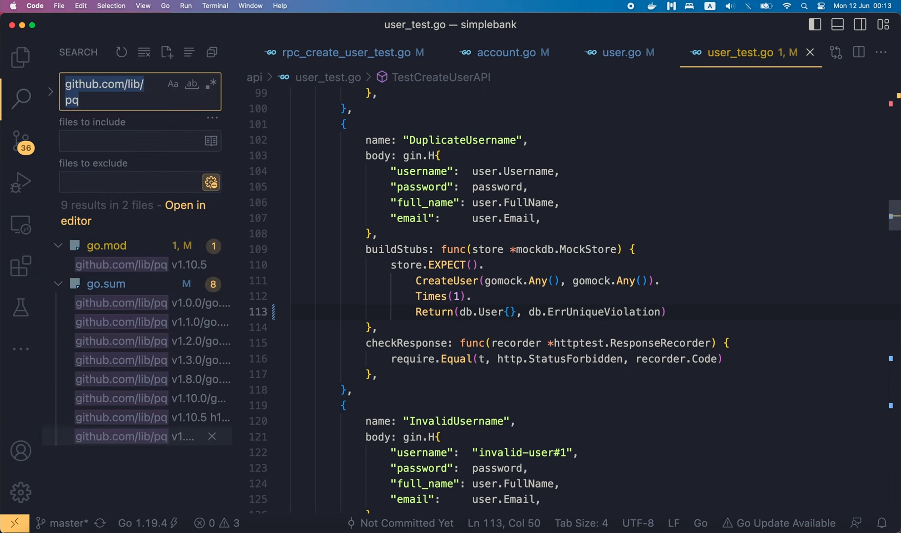
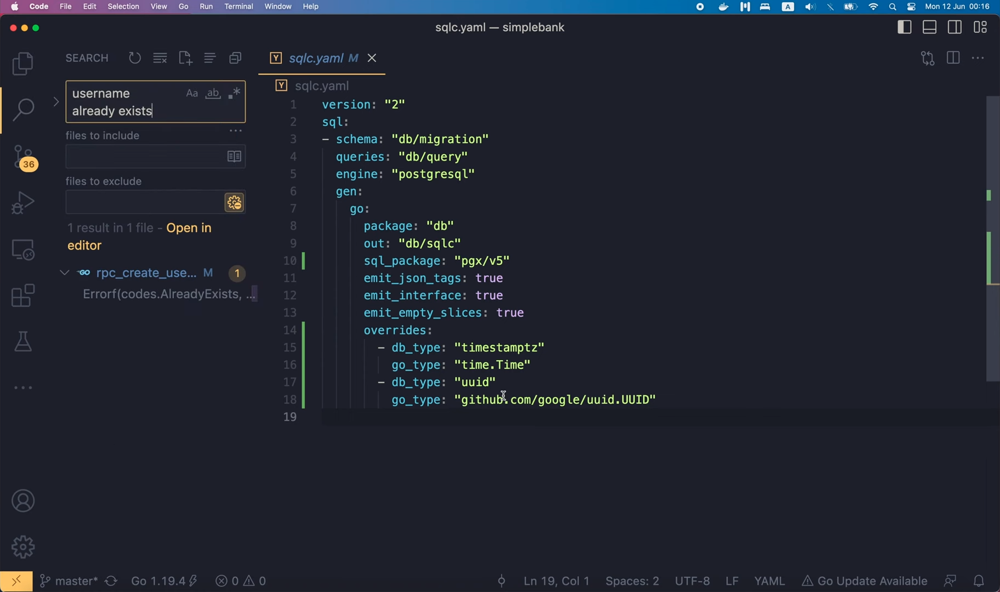
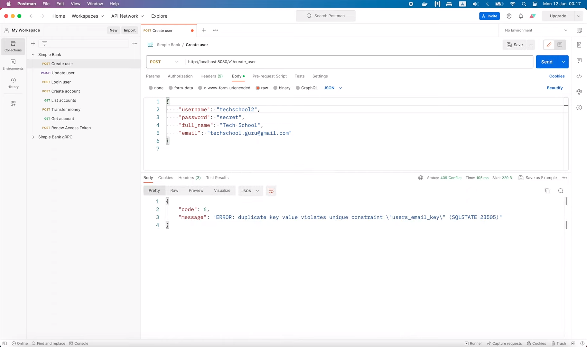
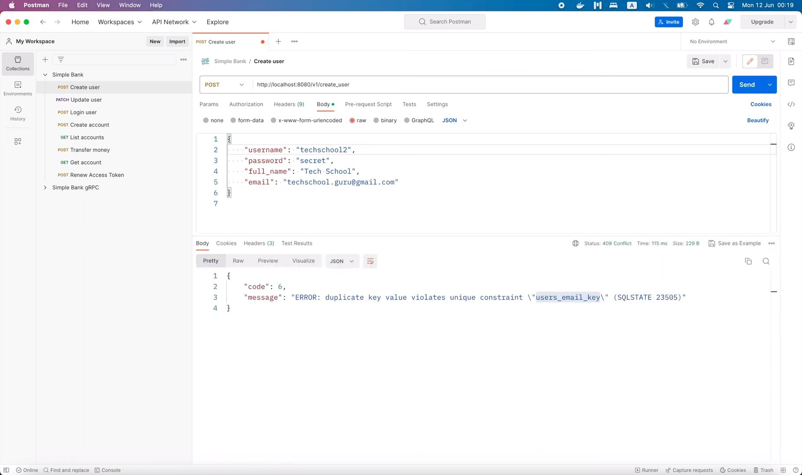
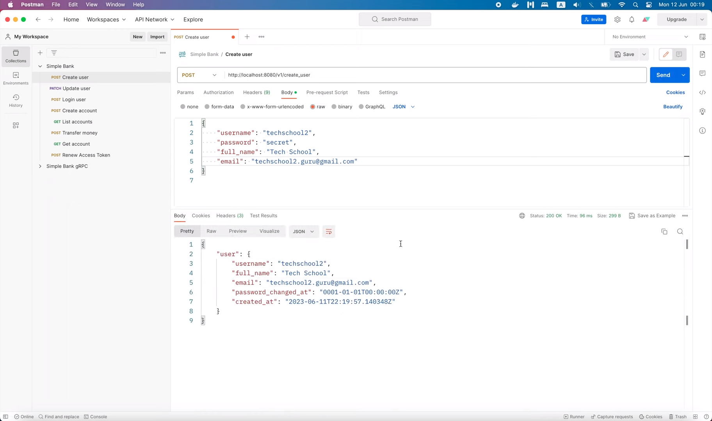

# How to handle DB errors with PGX driver

[Original video](https://www.youtube.com/watch?v=9vf3zxrMUgw)

Hello guys, welcome to the backend master class! In the previous lecture,
we switched the DB driver from `lib/pq` to `pgx`. However, we haven't fully 
gotten rid of `lib/pq` in our code yet. And that's the reason why the server
is returning 500 error when there's a duplicate username in the database.

```shell
11:54PM ERR received a HTTP request body="{\"code\":13, \"message\":\"failed to create user: ERROR: duplicate key value violates unique constraint \\\"users_key\\\" (SQLSTATE 23505)\"}" duration=93.07782 method=POST path=/v1/create_user protocol=http status_code=500 status_text="Internal Server Error"
```

In this case, it should return an AlreadyExists gRPC status code, which 
translates to "409 Conflict" HTTP status code. But since we still check the
error using lib/pq's `Error` interface,

```go
if err != nil {
	if pqErr, ok := err.(*pq.Error); ok {
		switch pqErr.Code.Name() {
		case "unique_violation":
			return nil, status.Errorf(codes.AlreadyExists, "username already exists: %s", err)
		}
	}
	return nil, status.Errorf(codes.Internal, "failed to create user: %s", err)
}
```

while the error returned this time actually comes from `pgx`, therefore 
it's not recognizable.

Now, in order to fix this, I'm gonna define a new function called 
`ErrorCode` in the `error.go` file, which takes an error object as input,
and returns an error code string as output.

```go
func ErrorCode(err error) string {
	var pgErr *pgconn.PgError
}
```

In this function, let's define a variable of type `PgError`. Note that the
type should come from the `pgconn` subpackage of `pgx/v5`. If we follow
the implementation of this `PgError` type, we'll see that it has a `Code` 
field of type `string`.

```go
type PgError struct {
	Severity         string
	Code             string
	Message          string
	Detail           string
	Hint             string
	Position         int32
	InternalPosition int32
	InternalQuery    string
	Where            string
	SchemaName       string
	TableName        string
	ColumnName       string
	DataTypeName     string
	ConstraintName   string
	File             string
	Line             int32
	Routine          string
}
```

And in fact, it's the code name that Postgres server returns to the DB 
driver to handle. You can search for it in the implementation of `lib/pq`.

```go
// Name returns a more human friendly rendering of the error code, namely the
// "condition name".
//
// See http://www.postgresql.org/docs/9.3/static/errcodes-appendix.html for
// details.
func (ec ErrorCode) Name() string {
	return errorCodeNames[ec]
}
```

```go
...
// Class 23 - Integrity Constraint Violation
"23000": "integrity_constraint_violation",
"23001": "restrict_violation",
"23502": "not_null_violation",
"23503": "foreign_key_violation",
"23505": "unique_violation",
"23514": "check_violation",
"23P01": "exclusion_violation",
...
```

And you can also find it in the [documentation page of Postgres](https://www.postgresql.org/docs/current/errcodes-appendix.html). Alright, I'm gonna copy these 2 error codes,

```go
"23503": "foreign_key_violation",
"23505": "unique_violation",
```

since they're being used in our implementation. Unlike, `lib/pq` `pgx` 
doesn't have a map from the error code number to its name, but it only
returns the original code number from Postgres.

So let's declare a constant `ForeignKeyViolation` with a value of this code
number. And another constant `UniqueViolation` with the other code number.

```go
const (
	ForeignKeyViolation = "23503"
	UniqueViolation     = "23505"
)
```

Then, let's try converting the input `err` variable to `pgErr` with the 
`errors.As()` function. If the conversion is successful, we'll return the 
`pgErr.Code`. Otherwise, we return an empty string.

```go
func ErrorCode(err error) string {
	var pgErr *pgconn.PgError
	if errors.As(err, pgErr) {
		return pgErr.Code
	}
	return ""
}
```

OK, it seems we've got a warning here:

The second argument of `errors.As` must be a non-nil pointer to a type that
implements the `Error` interface. This might be a bit confusing because
our `pgErr` variable is already a pointer, but actually, in the 
implementation of `pgx`,

```go
// PgError represents an error reported by the PostgreSQL server. See
// http://www.postgresql.org/docs/11/static/protocol-error-fields.html for
// detailed field description.
type PgError struct {
	Severity         string
	Code             string
	Message          string
	Detail           string
	Hint             string
	Position         int32
	InternalPosition int32
	InternalQuery    string
	Where            string
	SchemaName       string
	TableName        string
	ColumnName       string
	DataTypeName     string
	ConstraintName   string
	File             string
	Line             int32
	Routine          string
}

func (pe *PgError) Error() string {
	return pe.Severity + ": " + pe.Message + " (SQLSTATE " + pe.Code + ")"
}
```

the `pgError` struct doesn't implement the `Error` interface, but only the 
pointer version of it does. So here, we'll have to use an ampersand 
character to get a pointer to that pointer of `PgError`.

```go
func ErrorCode(err error) string {
	var pgErr *pgconn.PgError
	if errors.As(err, &pgErr) {
		return pgErr.Code
	}
	return ""
}
```

I know it sound weird, but that's just how things work here.

Alright, now let's go back to the `rpc_create_user.go` file. Here, I'm gonna
call the `db.ErrorCode()` function that we're just written, and if the 
output error code is `UniqueViolation`, we'll simply return the 
`AlreadyExists` gRPC code, saying "username already exists".

```go
if err != nil {
	if db.ErrorCode(err) == db.UniqueViolation {
		return nil, status.Errorf(codes.AlreadyExists, "username already exists: %s", err)
	}
	return nil, status.Errorf(codes.Internal, "failed to create user: %s", err)
}
```

And that's basically it!

I'm gonna restart the server,

```go
go run main.go
12:06AM INF db migrated successfully
12:06AM INF start gRPC server at [::]:9090
12:06AM INF start task processor
12:06AM INF Starting processing
12:06AM INF start HTTP gateway server at [::]:8080
```

and open Postman to send the create-user request again.



This time, instead of 500 Internal Server Error, we've got 409 Conflict 
status. That's exactly what we wanted.

So our changes actually work well in this case. But we have to make sure
there are no traces of `lib/pq` left in other places as well.

So let's search for it.



OK, looks like `lib/pq` is still being used in several files.

Let's take a look at the `create_user_test.go` file. I'm gonna delete
this import statement first,

```go
"github.com/lib/pq"
```

then an error will show up somewhere at the bottom of the file.

```go
buildStubs: func(store *mockdb.MockStore, taskDistributor *mockwk.MockTaskDistributor) {
	store.EXPECT().
		CreateUserTx(gomock.Any(), gomock.Any()).
		Times(1).
		Return(db.CreateUserTxResult{}, &pq.Error{Code: "23505"})

	taskDistributor.EXPECT().
		DistributeTaskSendVerifyEmail(gomock.Any(), gomock.Any(), gomock.Any()).
		Times(0)
},
```

Here, in `buildStubs` function, we're faking an error code that should be
returned by Postgres. So let's declare a new `UniqueViolation` error 
variable in the `error.go` file of the `db` package. That way, it can be 
reused in multiple places. It should be a pointer to a `PgError` object,

```go
var ErrUniqueViolation = &pgconn.PgError{
	Code: UniqueViolation,
}
```

whose `Code` field's value should be set to `UniqueViolation`.

Now, we can simply return this error object in the `buildStubs` function.

```go
buildStubs: func(store *mockdb.MockStore, taskDistributor *mockwk.MockTaskDistributor) {
	store.EXPECT().
		CreateUserTx(gomock.Any(), gomock.Any()).
		Times(1).
		Return(db.CreateUserTxResult{}, db.ErrUniqueViolation)

	taskDistributor.EXPECT().
		DistributeTaskSendVerifyEmail(gomock.Any(), gomock.Any(), gomock.Any()).
		Times(0)
},
```

Let's rerun the whole package test to make sure it's working properly.

```shell
Running tool: /usr/local/go/bin/go test -timeout 30s -coverprofile=/var/folders/wd/yz00fp3j0dv8lcc986n2whgc0000gn/T/vscode-goG2otyF/go-code-cover github.com/techschool/simplebank/gapi
-v -count=1

=== RUN   TestCreateUserAPI
=== RUN   TestCreateUserAPI/OK
...
PASS
coverage: 42.9% of statements
ok      github.com/techschool/simplebank/gapi     1.613s  coverage: 42.9% of statements
```

Indeed, all tests passed. Excellent!

Next, let's take a look at the `account.go` file of the `api` package.
Similar as before, I'll remove this import statement.

```go
"github.com/lib/pq"
```

An error will show up somewhere.

```go
if err != nil {
	if pqErr, ok := err.(*pq.Error); ok {
		switch pqErr.Code.Name() {
		case "foreign_key_violation", "unique_violation":
			ctx.JSON(http.StatusForbidden, errorResponse(err))
			return
		}
	}
	ctx.JSON(http.StatusInternalServerError, errorResponse(err))
	return
}
```

OK, so in this case, we want to check if the error is either a foreign-key
violation or a unique violation. So first, let's call the `db.ErrorCode()`
function to get the code from the `err`.

```go
errCode := db.ErrorCode(err)
```

Then, we check if `errCode` is `db.ForeignKeyViolation` or 
`db.UniqueViolation`. If it is, then a `StatusForbidden` will be returned
to the client.


```go
if err != nil {
	errCode := db.ErrorCode(err)
	if errCode == db.ForeignKeyViolation || errCode == db.UniqueViolation {
		ctx.JSON(http.StatusForbidden, errorResponse(err))
		return
	}
	ctx.JSON(http.StatusInternalServerError, errorResponse(err))
	return
}
```

Now let's see if we need to update anything in the `account_test.go` file.

It seems we haven't written a test for this case yet, so there's nothing
to change. You can try to add a new test for this case on your own if
you want.

Next, lt's take a look at the `user.go` file. I'm gonna remove this import

```go
"github.com/lib/pq"
```

statement. Then, an error will show up in the `createUser` function.

```go
if err != nil {
	if pqErr, ok := err.(*pq.Error); ok {
		switch pqErr.Code.Name() {
		case "unique_violation":
			ctx.JSON(http.StatusForbidden, errorResponse(err))
			return
		}
	}
	ctx.JSON(http.StatusInternalServerError, errorResponse(err))
	return
}
```

This time, we only need to check for the `UniqueViolation` error.

```go
if err != nil {
	if db.ErrorCode(err) == db.UniqueViolation {
		ctx.JSON(http.StatusForbidden, errorResponse(err))
		return
	}
	ctx.JSON(http.StatusInternalServerError, errorResponse(err))
	return
}
```

We'll also have to update the `user_test.go` file, remove this import 
`lib/pq` statement, and in the `buildStubs` function of the 
`TestCreateUserAPI`,

```go
buildStubs: func(store *mockdb.MockStore) {
	store.EXPECT().
		CreateUser(gomock.Any(), gomock.Any()).
		Times(1).
		Return(db.User{}, &pq.Error{Code: "23505"})
},
```

let's replace this `&pq.Error{Code: "23505"}` error object with 
`db.ErrUniqueViolation`.

```go
buildStubs: func(store *mockdb.MockStore) {
	store.EXPECT().
		CreateUser(gomock.Any(), gomock.Any()).
		Times(1).
		Return(db.User{}, db.ErrUniqueViolation)
},
```

Alright, so now, there's no import `lib/pq` in our code.



We can run 

```shell
go mod tidy
```

in the terminal to clean it up.

After this, we still see `lib/pq` in the `go.mod` file, but it's in the 
indirect dependency list,

```
github.com/lib/pq v1.10.5 // indirect
```

because it's still being used by the golang-migrate package. You can also
config golang-migrate to use `pgx` instead of `lib/pq` as well, but I 
think it's fine, as long as we don't use `lib/pq` directly in our code.

Now, to make sure everything is working fine, I'm gonna run the whole
`api` package test.

```shell
Running tool: /usr/local/go/bin/go test -timeout 30s -coverprofile=/var/folders/wd/yz00fp3j0dv8lcc986n2whgc0000gn/T/vscode-goG2otyF/go-code-cover github.com/techschool/simplebank/api
-v -count=1

=== RUN   TestGetAccountAPI
=== RUN   TestGetAccountAPI/OK
[GIN] 2023/06/12 - 00:14:10 | 200 |      322.43µs |                 | GET      "/accounts/417"
...
PASS
coverage: 75.8% of statements
ok      github.com/techschool/simplebank/api      1.254s      coverage: 75.8% of statements
```

All tests passed! Perfect.

By the way, there's a warning with this `io/ioutil` import, because the 
`ioutil` package is deprecated. So now, instead of `ioutil.ReadAll()`, we
can just use `io.ReadAll()`.

```go
func requireBodyMatchUser(t *testing.T, body *bytes.Buffer, user db.User) {
	data, err := io.ReadAll(body)
	...
}
```

Similar for the import in the `account_test.go` file. We should change all
`ioutil` to just `io`.

```go
func requireBodyMatchAccount(t *testing.T, body *bytes.Buffer, account db.Account) {
	data, err := io.ReadAll(body)
	...
}

func requireBodyMatchAccounts(t *testing.T, body *bytes.Buffer, accounts []db.Account) {
	data, err := io.ReadAll(body)
	...
}
```

And that will be it. We can run the tests again to make sure they're still
working.

```shell
Running tool: /usr/local/go/bin/go test -timeout 30s -coverprofile=/var/folders/wd/yz00fp3j0dv8lcc986n2whgc0000gn/T/vscode-goG2otyF/go-code-cover github.com/techschool/simplebank/api
-v -count=1

=== RUN   TestGetAccountAPI
=== RUN   TestGetAccountAPI/OK
[GIN] 2023/06/12 - 00:15:03 | 200 |      160.937µs |                 | GET      "/accounts/152"
...
PASS
coverage: 75.8% of statements
ok      github.com/techschool/simplebank/api      1.301s      coverage: 75.8% of statements
```

And before we finish, let's try starting the server and test it one more
time with Postman.

```shell
make server
go run main.go
12:16AM INF db migrated successfully
12:16AM INF start gRPC server at [::]:9090
12:16AM INF start task processor
12:16AM INF Starting processing
12:16AM INF start HTTP gateway server at [::]:8080
```

If I send the same request again,


we'll get 409 error status code with the message "username already exists".

What if I change the username to "techschool2"?


This time, we also get 409 and an error that says "username already 
exists". But in fact, it's the email that already exists. You can see that
in the violated unique constraint name. So to fix this, let's search for
the phrase "username already exists".



Here, we can just get rid of this phrase, and return only the error 
message.

```go
if err != nil {
	if db.ErrorCode(err) == db.UniqueViolation {
		return nil, status.Errorf(codes.AlreadyExists, "%s", err)
	}
	return nil, status.Errorf(codes.Internal, "failed to create user: %s", err)
}
```

Now if we restart the server and resend the same request, 

```shell
make server
go run main.go
12:17AM INF db migrated successfully
12:17AM INF start gRPC server at [::]:9090
12:17AM INF start task processor
12:17AM INF Starting processing
12:17AM INF start HTTP gateway server at [::]:8080
```



We'll get only the error message about the duplicate unique constraint for
the email.

If you want to do better, you can further check the violated constraint 
name in the code, and change the content of the message according to which
constraint is violated.

I'm not gonna do that, but I can show you where to get that constraint 
name value. In the `PgError` struct, besides the `Code`,

```go
// PgError represents an error reported by the PostgreSQL server. See
// http://www.postgresql.org/docs/11/static/protocol-error-fields.html for
// detailed field description.
type PgError struct {
	Severity         string
	Code             string
	Message          string
	Detail           string
	Hint             string
	Position         int32
	InternalPosition int32
	InternalQuery    string
	Where            string
	SchemaName       string
	TableName        string
	ColumnName       string
	DataTypeName     string
	ConstraintName   string
	File             string
	Line             int32
	Routine          string
}
```

we have many other fields. And you can find the `ConstraintName` in this 
struct. So let's try printing out this value in the `ErrorCode()` function.

```go
func ErrorCode(err error) string {
	var pgErr *pgconn.PgError
	if errors.As(err, &pgErr) {
		fmt.Println(">>", pgErr.ConstraintName)
		return pgErr.Code
	}
	return ""
}
```

Then restart the server,

```shell
make server
go run main.go
12:18AM INF db migrated successfully
12:18AM INF start gRPC server at [::]:9090
12:18AM INF start task processor
12:18AM INF Starting processing
12:18AM INF start HTTP gateway server at [::]:8080
```

and resend the request.



As you can see,

```shell
>> users_email_key
12:19AM ERR received a HTTP request body="{\"code\":6, \"message\":\"ERROR: duplicate key value violates unique constraint \\\"users_email_key\\\" (SQLSTATE 23505)\"}" duration=108.247613 method=POST path=/v1/create_user protocol=http status_code=409 status_text="Conflict"
```

the "users_email_key" constraint name is printed out.

OK, so now you know how to get the constraint name.

You can modify the code to use it and have better error message content on 
your own.

Now, if I change both the username and email to new values, and send the 
request.



A new user record will be successfully created in the database.

And that brings us to the end of this video.

We've learned how to properly handle DB errors using `pgx` driver. I hope
it was interesting and useful for you.

Thanks a lot for watching, happy learning, and see you in the next 
lecture!