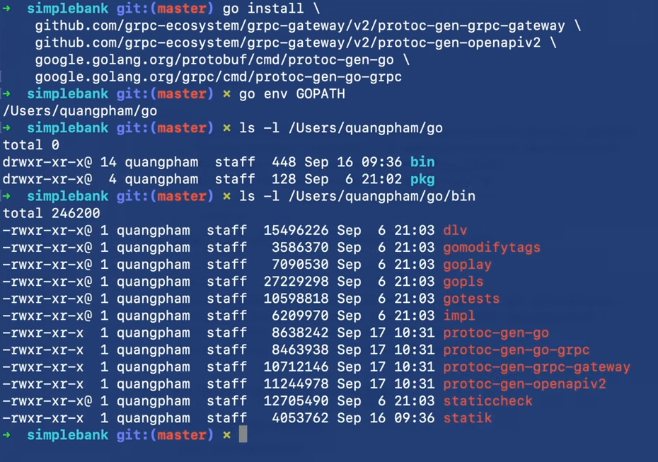
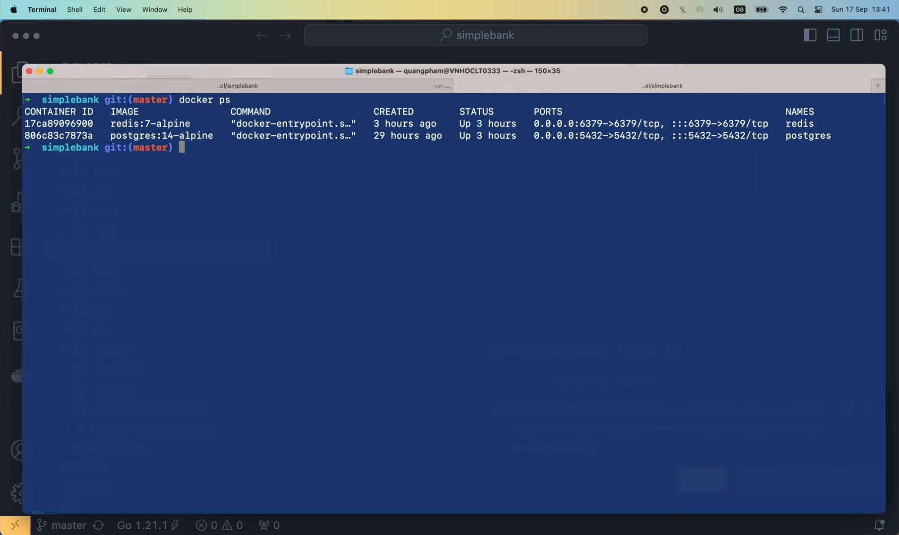
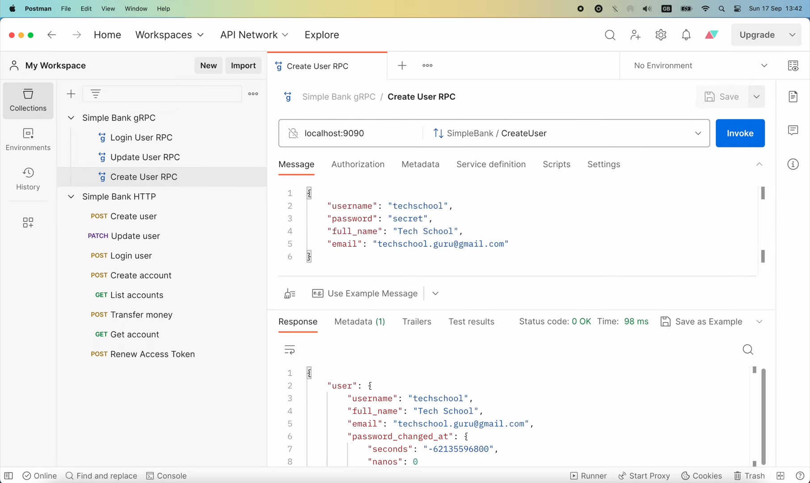
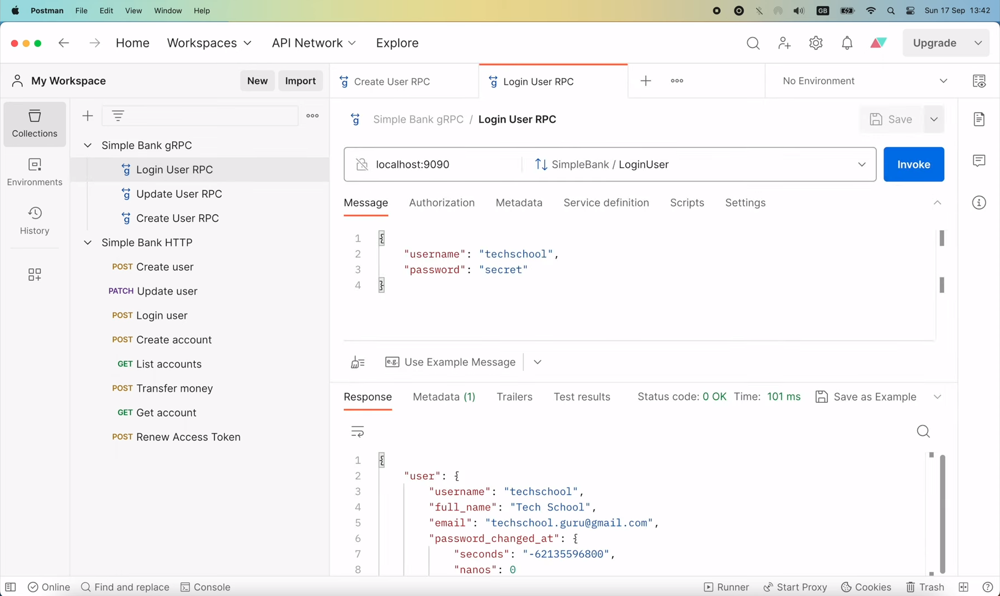
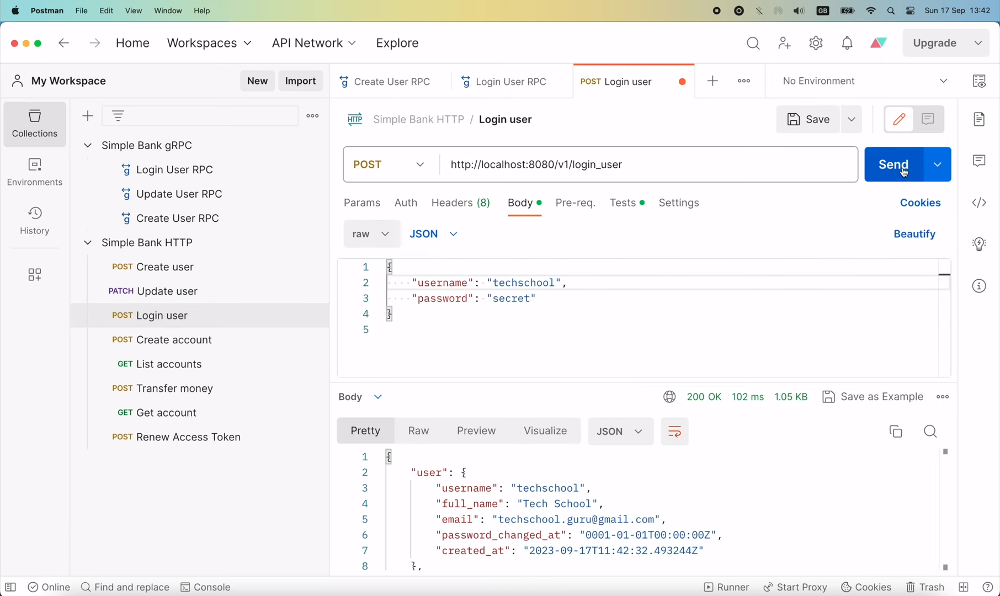

# How to install & use binary packages in Go

[Original video](https://www.youtube.com/watch?v=TnJ4ssoNvkY)

Hello guys, welcome to the backend master class! This is a short video
about how to use binary packages in Go. If you are using a new version
of Go, such as from v1.21, you might find out that there's an error in 
the `tools` package. It says "protoc-gen-grpc-gateway" is a program, not
an importable package. This basically means that in this Go version, 
importing a binary executable package is no longer possible, even if it's
just a blank import. These packages are all binary tools that help us
generate codes, and the reason we put them here, is just to keep track
of their version, just like what was suggested in the `grpc-gateway` 
[documentation page](https://github.com/grpc-ecosystem/grpc-gateway#compile-from-source). But
now, since the new version of Go doesn't allow this anymore, we must get
rid of the `tools` package, and just run the "go install" command in the
terminal to install all required executable packages.

## Install binary packages

```shell
go install \
    github.com/grpc-ecosystem/grpc-gateway/v2/protoc-gen-grpc-gateway \
    github.com/grpc-ecosystem/grpc-gateway/v2/protoc-gen-openapiv2 \
    google.golang.org/protobuf/cmd/protoc-gen-go \
    google.golang.org/grpc/cmd/protoc-gen-go-grpc
```

Doing this will place their binary files inside your `GOBIN` folder. If
you wonder where your `GOBIN` folder is, just run

```shell
go env GOPATH
```

like this. The "bin" folder is located inside this `GOPATH`.

Now, if we list out the content of this "bin" folder,



we will see the binary packages that we've just installed.

However, if we run 

```shell
which protoc-gen-grpc-gateway
protoc-gen-grpc-gateway not found
```

it still says that this binary file is not found.

That's because we haven't added the `GOBIN` folder to the system PATH.

So to fix this, we need add an `export` command in our shell's profile file.

Since I'm using `zsh`, I'll edit the `.zshrc` file in my home folder.

```shell
vi ~./zshrc
```

If you use `bashshell`, you'll probably need to edit the `.bash_profile` 
file.

OK, so I'm gonna add a new line here with this command:

```
export PATH=$PATH:$(go env GOPATH)
```

This will allow us to run and get the value of the `go env GOPATH` command.
Then append it with the `/bin` suffix.

```
export PATH=$PATH:$(go env GOPATH)/bin
```

And we're done. Let's save the file. The script inside `.zshrc` file will
be executed automatically everytime we open a new terminal tab, or when we
run the `source` command like this.

```shell
source ~/.zshrc
```

And the `GOBIN` folder will be added to the system PATH for us. Now, if
we run the

```shell
which protoc-gen-grpc-gateway
/Users/quangpham/go/bin/protoc-gen-grpc-gateway
```

command again, it will return the correct binary file inside the `go/bin`
folder.

To make sure, you can open a new terminal tab, and run the same command.

```shell
which protoc-gen-grpc-gateway
/Users/quangpham/go/bin/protoc-gen-grpc-gateway
```

If it returns the correct file, then we're good to go.

Now, since we're removed the `tools` package, let's run

```shell
go mod tidy
```

to clean up the packages inside `go.mod` and `go.sum` files.

Then, we can run

```shell
make proto
rm -f pb/*.go
rm -f doc/swagger/*.swagger.json
protoc --proto_path=proto --go_out=pb --go_opt=paths=source_relative \
    --go-grpc_out=pb --go-grpc_opt=paths=source_relative \
    --grpc-gateway_out=pb --grpc-gateway_opt=paths=source_relative \
    --openapiv2_out=doc/swagger --openapiv2_opt=allow_merge=true,merge_file_name=simple_bank \
    proto/*.proto
statik -src=./doc/swagger -dest=./doc
```

to regenerate Golang code for our gRPC servers. It's successful.
Excellent!

Let's check the content of the `pb` folder to see if there's anything
new.

```go
// Code generated by protoc-gen-go. DO NOT EDIT.
// versions:
// 	protoc-gen-go v1.28.1
// 	protoc        v4.24.3
// source: rpc_create_user.proto
```

OK, so the only thing that changed is the version of `protoc` and
`protoc-gen-go`. That's because I've just updated them to the latest
version recently. Fortunately, there's no breaking changes in the code. 
But to be sure, let's try to run the server and do some tests.

First, let's run

```shell
docker ps
```

to make sure `postgres` and `redis` are up and running.



OK, then I'm gonna start the server.

```shell
make server
go run main.go
1:41PM INF db migrated successfully
1:41PM INF start gRPC server at [::]:9090
1:41PM INF start task processor
1:41PM INF Starting processing
1:41PM INF start HTTP gateway server at [::]:8080
```

Now both gRPC and HTTP servers are ready, we can open Postman, and send
a gRPC request to create a new user.



Then send another gRPC request to log in that user.



Both are successful.

Let's also try sending this login request using HTTP API.



It's also successful. Awesome!

Last but not least, I'm gonna run the whole unit test sets to make sure
nothing is broken.

```shell
make test
go test -v -cover -short ./...
...
ok      github.com/techschool/simplebank/token    (cached)  coverage: 85.7% of statements
=== RUN   TestPassword
--- PASS: TestPassword (0.24s)
PASS
coverage: 35.5% of statements
ok      github.com/techschool/simplebank/util     (cached)  coverage: 35.5% of statements
```

Voilà, all tests passed. Excellent!

And that wraps up this short video about binary packages in Go, I hope
it was useful for you. Thanks a lot for watching, happy learning, and see
you in the next lecture!


