# Блокировка транзакций БД и как справиться с взаимной блокировкой

[Оригинал](https://dev.to/techschoolguru/db-transaction-lock-how-to-handle-deadlock-22o8)

Блокировку реализовать не так просто, как вы думаете!

На прошлой лекции мы узнали, как реализовать простую транзакцию для 
перевода денег. Однако мы еще не обновили баланс счетов, потому что сделать это 
сложнее и требует тщательной обработки параллельных транзакций, чтобы избежать 
взаимной блокировки.

Итак, в этой лекции мы собираемся реализовать этот функционал, чтобы узнать 
больше о блокировке базы данных и о том, как справляться с взаимной блокировкой.

Ниже:
* Ссылка на [плейлист с видео лекциями на Youtube](https://bit.ly/backendmaster)
* И на [Github репозиторий](https://github.com/techschool/simplebank)

## Разработка через тестирование

Сегодня я буду использовать другой подход при разработке, а именно разработку 
через тестирование (или TDD). Идея такова: сначала мы пишем тесты, чтобы 
сломать наш текущий код. Затем мы постепенно исправляем код, пока тесты не будут 
успешно пройдены.

Итак, вот тест, который мы написали на предыдущей лекции:

```go
func TestTransferTx(t *testing.T) {
    store := NewStore(testDB)

    account1 := createRandomAccount(t)
    account2 := createRandomAccount(t)

    // запускаем n одновременных транзакций перевода
    n := 5
    amount := int64(10)
    
    errs := make(chan error)
    results := make(chan TransferTxResult)

    for i := 0; i < n; i++ {
        go func() {
            result, err := store.TransferTx(context.Background(), TransferTxParams{
                FromAccountID: account1.ID,
                ToAccountID:   account2.ID,
                Amount:        amount,
            })

            errs <- err
            results <- result
        }()
    }

    // проверяем результаты
    for i := 0; i < n; i++ {
        err := <-errs
        require.NoError(t, err)

        result := <-results
        require.NotEmpty(t, result)

        // проверяем перевод
        transfer := result.Transfer
        require.NotEmpty(t, transfer)
        require.Equal(t, account1.ID, transfer.FromAccountID)
        require.Equal(t, account2.ID, transfer.ToAccountID)
        require.Equal(t, amount, transfer.Amount)
        require.NotZero(t, transfer.ID)
        require.NotZero(t, transfer.CreatedAt)
        
        _, err = store.GetTransfer(context.Background(), transfer.ID)
        require.NoError(t, err)

        // проверяем записи в таблице entries
        fromEntry := result.FromEntry
        require.NotEmpty(t, fromEntry)
        require.Equal(t, account1.ID, fromEntry.AccountID)
        require.Equal(t, -amount, fromEntry.Amount)
        require.NotZero(t, fromEntry.ID)
        require.NotZero(t, fromEntry.CreatedAt)

        _, err = store.GetEntry(context.Background(), fromEntry.ID)
        require.NoError(t, err)

        toEntry := result.ToEntry
        require.NotEmpty(t, toEntry)
        require.Equal(t, account2.ID, toEntry.AccountID)
        require.Equal(t, amount, toEntry.Amount)
        require.NotZero(t, toEntry.ID)
        require.NotZero(t, toEntry.CreatedAt)
        
        _, err = store.GetEntry(context.Background(), toEntry.ID)
        require.NoError(t, err)

        // TODO: check accounts' balance
    }
}
```

Он создает 5 подпрограмм для выполнения 5 одновременных транзакций перевода, 
каждая из которых будет переводить одинаковую сумму денег с `account1` на
`account2`. Затем он выполняет итерацию по списку результатов, чтобы проверить 
созданные объекты в таблицах `transfers` и `entries`.

Теперь, чтобы закончить этот тест, нам нужно проверить полученные из таблицы
`accounts` записи и их баланс.

Начнем со счетов. Сначала `fromAccount`, откуда снимаются деньги. Проверяем, он 
не должен быть пустым. И его `ID` должен быть равен `account1.ID`.

Аналогично для `toAccount`, куда поступают деньги. Объект `Account` не должен 
быть пустым. И его `ID` должен быть равен `account2.ID`.

```go
func TestTransferTx(t *testing.T) {
    ...

    // проверяем результаты
    for i := 0; i < n; i++ {
        ...

        // проверяем счета
        fromAccount := result.FromAccount
        require.NotEmpty(t, fromAccount)
        require.Equal(t, account1.ID, fromAccount.ID)

        toAccount := result.ToAccount
        require.NotEmpty(t, toAccount)
        require.Equal(t, account2.ID, toAccount.ID)

        // TODO: check accounts' balance
    }
}
```

Далее мы проверим баланс счетов. Мы вычисляем разницу `diff1` между 
`account1.Balance` (баланс до перевода) и `fromAccount.Balance` (баланс после
перевода). Эта `diff1` представляет собой сумму денег, которая уходит со 
`account1`.

Точно так же мы вычисляем разницу `diff2` между `toAccount.Balance` (баланс 
до перевода) и `account2.Balance` (баланс после перевода). Эта разница2 — это 
сумма денег, которая поступает на `account2`.

```go
func TestTransferTx(t *testing.T) {
    ...

    // проверяем результаты
    for i := 0; i < n; i++ {
        ...

        // проверяем баланс счетов
        diff1 := account1.Balance - fromAccount.Balance
        diff2 := toAccount.Balance - account2.Balance
        require.Equal(t, diff1, diff2)
        require.True(t, diff1 > 0)
        require.True(t, diff1%amount == 0) // 1 * amount, 2 * amount, 3 * amount, ..., n * amount
    }
}
```

Если транзакция работает правильно, то `diff1` и `diff2` должны быть одинаковыми, 
и они должны быть положительным числом.

Кроме того, эта разница должна быть кратна сумме денег, которая перемещается при 
каждой транзакции. Причина в том, что баланс `account1` будет уменьшен на единожды 
после 1-й транзакции, затем дважды после 2-й транзакции, трижды после 3-й 
транзакции и так далее.

Из-за этого, если мы вычисляем `k = diff1 / amount`, то `k` должно быть целым 
числом от 1 до `n`, где `n` — количество выполненных транзакций.

```go
func TestTransferTx(t *testing.T) {
    ...

    // проверяем результаты
    existed := make(map[int]bool)

    for i := 0; i < n; i++ {
        ...

        // проверяем баланс счетов
        ...

        k := int(diff1 / amount)
        require.True(t, k >= 1 && k <= n)

        require.NotContains(t, existed, k)
        existed[k] = true
    }
}
```

Более того, `k` должно быть уникальным для каждой транзакции, что означает, что `k` 
должно быть равно 1 для первой транзакции, 2 для второй, 3 для 3-й и так далее, 
пока `k` не станет равным `n`.

Чтобы проверить это, нам нужно объявить новую переменную с именем `exists` типа 
`map[int]bool`. Затем в цикле проверить, что существующая карта не содержит 
`k`. После этого мы присваиваем `exists[k]` значение `true`.

В конце концов, после цикла `for` мы должны проверить получившиеся обновленные 
балансы двух счетов.

Сначала мы получаем обновленную запись `account1` из базы данных, вызывая 
`store.GetAccount()` с фоновым контекстом и идентификатором `account1`. Этот 
запрос не должен возвращать ошибку. Таким же образом получаем обновленную 
запись `account2` из базы данных.

```go
func TestTransferTx(t *testing.T) {
    ...

    // проверяем результаты
    existed := make(map[int]bool)
    for i := 0; i < n; i++ {
        ...
    }

    // проверяем получившиеся обновленные балансы
    updatedAccount1, err := store.GetAccount(context.Background(), account1.ID)
    require.NoError(t, err)

    updatedAccount2, err := store.GetAccount(context.Background(), account2.ID)
    require.NoError(t, err)

    require.Equal(t, account1.Balance-int64(n)*amount, updatedAccount1.Balance)
    require.Equal(t, account2.Balance+int64(n)*amount, updatedAccount2.Balance)
}
```

Теперь после `n` транзакций остаток на `account1` должен уменьшиться на 
`n * amount`. Поэтому мы требуем, чтобы `updatedAccount1.Balance` был равен 
этому значению. `amount` имеет тип `int64`, поэтому нам нужно преобразовать `n` 
в `int64`, прежде чем выполнять умножение.

Мы делаем то же самое для `updatedAccount2.Balance`, за исключением того, что 
его значение должно увеличиться на `n * amount`, а не уменьшиться.

Вот и все! Мы закончили с тестом. Но перед запуском я собираюсь добавить в него 
несколько логов, чтобы увидеть результаты более четко.

Во-первых, давайте распечатаем баланс счетов перед транзакцией. Затем 
распечатаем их обновленные балансы после выполнения всех транзакций. Я также 
хочу видеть получившийся баланс после каждой транзакции, поэтому давайте также 
добавим лог в цикл `for`.

Итак, вот как выглядит окончательная версия теста:

```go
func TestTransferTx(t *testing.T) {
    store := NewStore(testDB)

    account1 := createRandomAccount(t)
    account2 := createRandomAccount(t)
    fmt.Println(">> before:", account1.Balance, account2.Balance)

    n := 5
    amount := int64(10)

    errs := make(chan error)
    results := make(chan TransferTxResult)

    // запускаем n одновременных транзакций перевода
    for i := 0; i < n; i++ {
        go func() {
            result, err := store.TransferTx(context.Background(), TransferTxParams{
                FromAccountID: account1.ID,
                ToAccountID:   account2.ID,
                Amount:        amount,
            })

            errs <- err
            results <- result
        }()
    }

    // проверяем результаты
    existed := make(map[int]bool)

    for i := 0; i < n; i++ {
        err := <-errs
        require.NoError(t, err)

        result := <-results
        require.NotEmpty(t, result)

        // проверяем перевод
        transfer := result.Transfer
        require.NotEmpty(t, transfer)
        require.Equal(t, account1.ID, transfer.FromAccountID)
        require.Equal(t, account2.ID, transfer.ToAccountID)
        require.Equal(t, amount, transfer.Amount)
        require.NotZero(t, transfer.ID)
        require.NotZero(t, transfer.CreatedAt)

        _, err = store.GetTransfer(context.Background(), transfer.ID)
        require.NoError(t, err)

        // проверяем записи в таблице entries
        fromEntry := result.FromEntry
        require.NotEmpty(t, fromEntry)
        require.Equal(t, account1.ID, fromEntry.AccountID)
        require.Equal(t, -amount, fromEntry.Amount)
        require.NotZero(t, fromEntry.ID)
        require.NotZero(t, fromEntry.CreatedAt)

        _, err = store.GetEntry(context.Background(), fromEntry.ID)
        require.NoError(t, err)

        toEntry := result.ToEntry
        require.NotEmpty(t, toEntry)
        require.Equal(t, account2.ID, toEntry.AccountID)
        require.Equal(t, amount, toEntry.Amount)
        require.NotZero(t, toEntry.ID)
        require.NotZero(t, toEntry.CreatedAt)

        _, err = store.GetEntry(context.Background(), toEntry.ID)
        require.NoError(t, err)

        // проверяем счета
        fromAccount := result.FromAccount
        require.NotEmpty(t, fromAccount)
        require.Equal(t, account1.ID, fromAccount.ID)

        toAccount := result.ToAccount
        require.NotEmpty(t, toAccount)
        require.Equal(t, account2.ID, toAccount.ID)

        // проверяем баланс счетов
        fmt.Println(">> tx:", fromAccount.Balance, toAccount.Balance)

        diff1 := account1.Balance - fromAccount.Balance
        diff2 := toAccount.Balance - account2.Balance
        require.Equal(t, diff1, diff2)
        require.True(t, diff1 > 0)
        require.True(t, diff1%amount == 0) // 1 * amount, 2 * amount, 3 * amount, ..., n * amount

        k := int(diff1 / amount)
        require.True(t, k >= 1 && k <= n)
        require.NotContains(t, existed, k)
        existed[k] = true
    }

    // проверяем получившиеся обновленные балансы
    updatedAccount1, err := store.GetAccount(context.Background(), account1.ID)
    require.NoError(t, err)

    updatedAccount2, err := store.GetAccount(context.Background(), account2.ID)
    require.NoError(t, err)

    fmt.Println(">> after:", updatedAccount1.Balance, updatedAccount2.Balance)

    require.Equal(t, account1.Balance-int64(n)*amount, updatedAccount1.Balance)
    require.Equal(t, account2.Balance+int64(n)*amount, updatedAccount2.Balance)
}
```

Давайте запустим его!

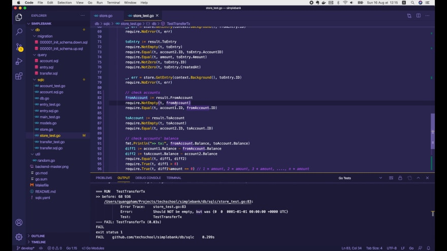

Он завершается неудачей в строке 83, где мы ожидаем, что `fromAccount` не будет 
пустым. Но, конечно, в данный момент он пуст, потому что мы еще не реализовали 
этот функционал.

Итак, давайте вернемся к файлу `store.go`, чтобы реализовать его!

## Обновляем баланс счёта [неправильно]

Один простой и интуитивно понятный способ изменить баланс счёта — 
сначала получить этот счёт из базы данных, затем добавить или вычесть некоторую 
сумму из его баланса и сохранить его обратно в базу данных.

Однако это часто делается неправильно без надлежащего механизма блокировки. Я 
собираюсь показать вам, в чём именно ошибка при написании такого кода!

Сначала мы вызываем `q.GetAccount()`, чтобы получить запись `fromAccount` и 
присвоить её переменной `account1`. Если `err` не равен `nil`, мы возвращаем её.

```go
func (store *Store) TransferTx(ctx context.Context, arg TransferTxParams) (TransferTxResult, error) {
    var result TransferTxResult

    err := store.execTx(ctx, func(q *Queries) error {
        ...

        // переводим деньги с account1
        account1, err := q.GetAccount(ctx, arg.FromAccountID)
        if err != nil {
            return err
        }

        result.FromAccount, err = q.UpdateAccount(ctx, UpdateAccountParams{
            ID:      arg.FromAccountID,
            Balance: account1.Balance - arg.Amount,
        })
        if err != nil {
            return err
        }
    }

    return result, err
}
```

В противном случае мы вызываем `q.UpdateAccount()`, чтобы обновить баланс 
этого счёта. Идентификатор должен быть `arg.FromAccountID`, а баланс будет 
изменен на `account1.Balance - arg.Amount`, поскольку деньги списываются с 
этого счета.

Обновленный счёт будет сохранен в `result.FromAccount`. И если мы получим 
ошибку, просто вернем её.

После этого считается, что мы списали деньги с `fromAccount`. Теперь мы можем 
сделать то же самое, чтобы перевести эти деньги на `toAccount`.

```go
func (store *Store) TransferTx(ctx context.Context, arg TransferTxParams) (TransferTxResult, error) {
    var result TransferTxResult

    err := store.execTx(ctx, func(q *Queries) error {
        ...

        // переводим деньги с account1
        ...

        // переводим деньги на account2
        account2, err := q.GetAccount(ctx, arg.ToAccountID)
        if err != nil {
            return err
        }

        result.ToAccount, err = q.UpdateAccount(ctx, UpdateAccountParams{
            ID:      arg.ToAccountID,
            Balance: account2.Balance + arg.Amount,
        })
        if err != nil {
            return err
        }
    }

    return result, err
}
```

Здесь идентификатор счёта должен быть равен `arg.ToAccountID`. Результат будет 
сохранен в `result.ToAccount`. И новый баланс должен быть равен 
`account2.Balance + arg.Amount`, потому что деньги поступают на этот счёт.

Итак, реализация завершена. Однако я предупреждаю вас, что она работает 
неправильно. Давайте повторно запустим наш тест, чтобы посмотреть, как она 
работает!

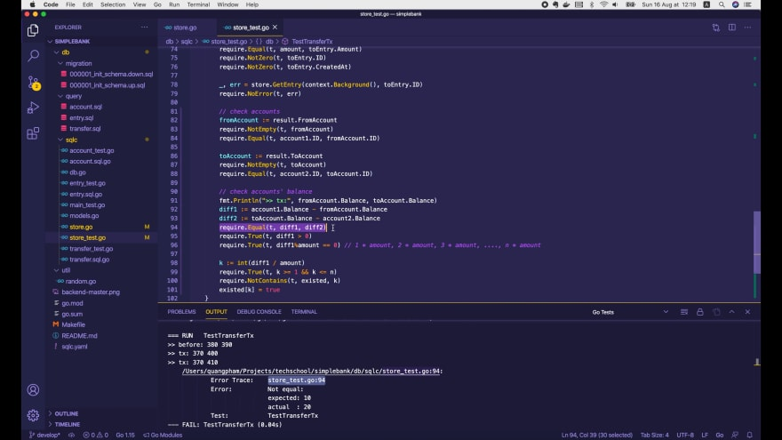

Тест по-прежнему не пройден. Но на этот раз ошибка в строке 94, где мы 
сравниваем сумму денег, уходящую с `account1`, с суммой, поступающей на 
`account2`.

В логах мы видим, что первая транзакция успешно выполнилась. Баланс `account1` 
уменьшается на `10`, с `380` до `370`. А баланс `account2` увеличивается на такую же 
сумму, с `390` до `400`.

Но этого не происходит во второй транзакции. Баланс `account2` увеличивается 
ещё на `10`, до `410`. В то время как баланс `account1` остается прежним, 
равным `370`.

Чтобы понять почему, давайте посмотрим на запрос GetAccount:

```postgresql
-- name: GetAccount :one
SELECT * FROM accounts
WHERE id = $1 LIMIT 1;
```

Это обычный `SELECT`, поэтому он не блокирует чтение той же записи `Account` 
другими транзакциями.

Таким образом, две транзакции одновременно могут получить одно и то же значение
`account1` с исходным балансом `380`. Таким образом, это объясняет, почему обе 
они имеют обновленный баланс `370` после выполнения.

## Запрос без блокировки

Чтобы продемонстрировать этот случай, давайте запустим консоль `psql` в двух 
разных вкладках терминала и выполним две параллельные транзакции.

В первой транзакции выполним обычный запрос `SELECT`, чтобы получить запись 
счёта с ID = 1.

```postgresql
SELECT * FROM accounts WHERE id = 1;
```

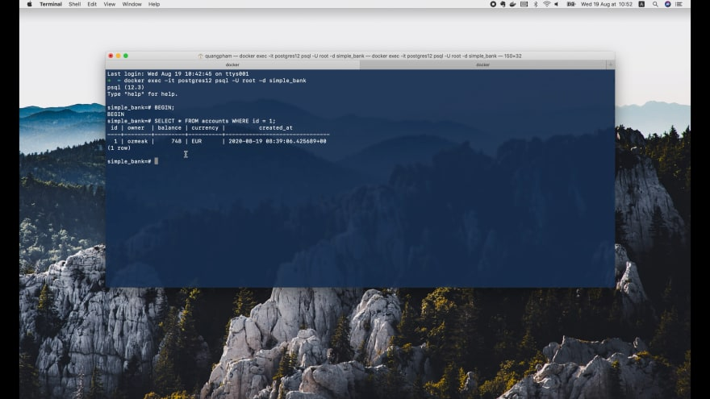

Баланс этого счета составляет 748 долларов США.

Теперь я запущу этот запрос в другой транзакции.

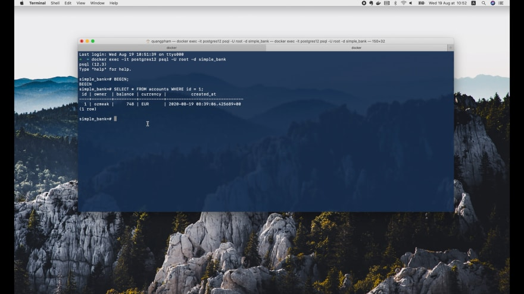

Как видите, та же запись возвращается сразу же без блокировки. Это не то, чего
мы хотим. Итак, давайте откатим обе транзакции и узнаем, как решить эту
проблему.

## Запрос с блокировкой

Я начну две новые транзакции. Но на этот раз мы добавим инструкцию `FOR 
UPDATE` в конце оператора `SELECT`.

```postgresql
SELECT * FROM accounts WHERE id = 1 FOR UPDATE;
```

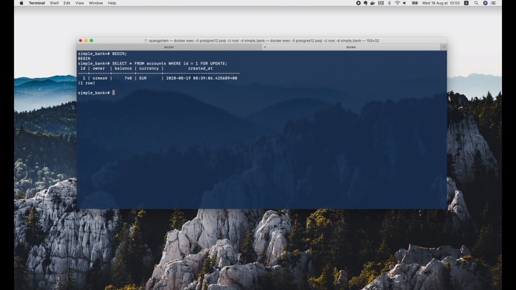

Теперь первая транзакция по-прежнему получает запись немедленно. Но когда мы 
запускаем этот запрос для второй транзакции:


Она заблокирована и должна ждать, пока первая транзакция не будет ЗАФИКСИРОВАНА 
(COMMIT) или ОТКАТАНА (ROLLBACK).

Вернемся к этой транзакции и обновим баланс счета до 500:

```postgresql
UPDATE accounts SET balance = 500 WHERE id = 1;
```

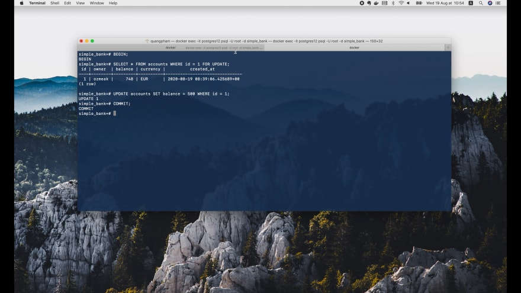

После этого обновления вторая транзакция по-прежнему заблокирована. Однако, 
как только мы ЗАФИКСИРОВАЛИ (COMMIT) первую транзакцию:

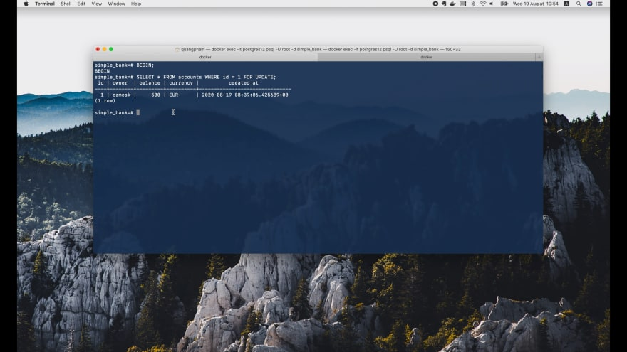

Мы видим, что вторая транзакция разблокируется сразу, и она получает только 
что обновленный счёт с балансом в 500 евро. Это именно то, чего мы хотим 
добиться!

## Обновляем баланс счёта, используя блокировку

Вернемся к файлу `account.sql` и добавим новый запрос для получения счёта 
для обновления:

```postgresql
-- name: GetAccountForUpdate :one
SELECT * FROM accounts
WHERE id = $1 LIMIT 1
FOR UPDATE;
```

Затем мы открываем терминал и запускаем `make sqlc` для повторной генерации кода. 
Теперь в файле `account.sql.go` создастся новая функция `GetAccountForUpdate()`.

```go
const getAccountForUpdate = `-- name: GetAccountForUpdate :one
SELECT id, owner, balance, currency, created_at FROM accounts
WHERE id = $1 LIMIT 1
FOR UPDATE
`

func (q *Queries) GetAccountForUpdate(ctx context.Context, id int64) (Account, error) {
    row := q.db.QueryRowContext(ctx, getAccountForUpdate, id)
    var i Account
    err := row.Scan(
        &i.ID,
        &i.Owner,
        &i.Balance,
        &i.Currency,
        &i.CreatedAt,
    )
    return i, err
}
```

Мы можем использовать её в нашей транзакции для перевода денег. Здесь, чтобы 
получить первый счёт, мы вызываем `q.GetAccountForUpdate()` вместо 
`q.GetAccount()`. То же самое делаем для получения второго счёта.

```go
func (store *Store) TransferTx(ctx context.Context, arg TransferTxParams) (TransferTxResult, error) {
    var result TransferTxResult

    err := store.execTx(ctx, func(q *Queries) error {
        ...

        // переводим деньги с account1
        account1, err := q.GetAccountForUpdate(ctx, arg.FromAccountID)
        if err != nil {
            return err
        }

        result.FromAccount, err = q.UpdateAccount(ctx, UpdateAccountParams{
            ID:      arg.FromAccountID,
            Balance: account1.Balance - arg.Amount,
        })
        if err != nil {
            return err
        }

        // переводим деньги на account2
        account2, err := q.GetAccountForUpdate(ctx, arg.ToAccountID)
        if err != nil {
            return err
        }

        result.ToAccount, err = q.UpdateAccount(ctx, UpdateAccountParams{
            ID:      arg.ToAccountID,
            Balance: account2.Balance + arg.Amount,
        })
        if err != nil {
            return err
        }
    }

    return result, err
}
```

Хорошо, теперь мы ожидаем, что это тест будет успешно пройден. Давайте 
перезапустим его.

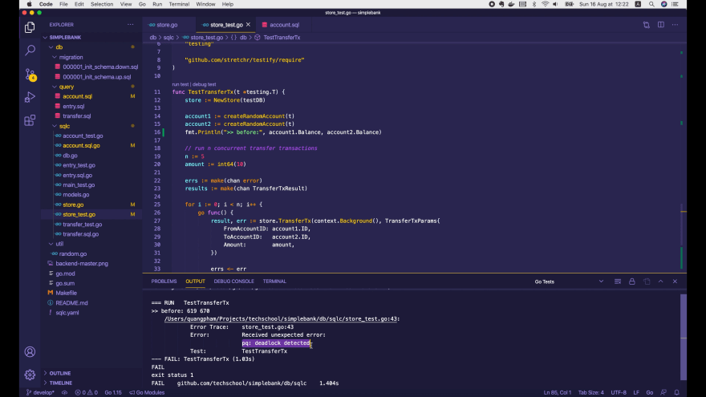

К сожалению, тест по-прежнему не пройден. На этот раз обнаружена ошибка 
взаимной блокировки. Так что мы можем сделать?

Не волнуйтесь! Я покажу вам, как провести отладку этой ситуации с взаимной 
блокировкой.

## Отладка взаимной блокировки

Чтобы выяснить, почему возникла взаимная блокировка, нам нужно вывести 
некоторую информацию, чтобы увидеть, какая транзакция вызывает какой запрос и в 
каком порядке.

Для этого мы должны присвоить каждой транзакции имя и передать его в функцию 
`TransferTx()` через аргумент контекста.

Теперь внутри этого цикла `for` теста я создам переменную `txName` для хранения 
имени транзакции. Мы используем функцию `fmt.Sprintf()` и счетчик `i` для 
создания разных имен: `tx 1`, `tx 2`, `tx 3` и так далее.

Затем внутри горутины вместо передачи фонового контекста мы будем передавать 
новый контекст с именем транзакции.

```go
func TestTransferTx(t *testing.T) {
    ...

    // запускаем n одновременных транзакций перевода
    for i := 0; i < n; i++ {
        txName := fmt.Sprintf("tx %d", i+1)

        go func() {
            ctx := context.WithValue(context.Background(), txKey, txName)

            result, err := store.TransferTx(ctx, TransferTxParams{
                FromAccountID: account1.ID,
                ToAccountID:   account2.ID,
                Amount:        amount,
            })

            errs <- err
            results <- result
        }()
    }

    // проверяем результаты
    ...
}
```

Чтобы добавить имя транзакции в контекст, мы вызываем `context.WithValue()`, 
передаем фоновый контекст в качестве его родителя и пару ключ-значение, где 
значение — это имя транзакции.

В документации говорится, что ключ контекста не должен быть строкового типа 
или любого встроенного типа, чтобы избежать коллизий между пакетами. Обычно мы 
должны определить переменную типа struct{} для ключа контекста.

Поэтому я добавлю новую переменную `txKey` в файл `store.go`, потому что позже 
нам придется использовать этот ключ для получения имени транзакции из 
входного контекста функции `TransferTx()`.

```go
var txKey = struct{}{}

func (store *Store) TransferTx(ctx context.Context, arg TransferTxParams) (TransferTxResult, error) {
    ...
}

...
```

Здесь вторая скобка в `struct{}{}` означает, что мы создаем новый пустой объект 
типа `struct{}`.

Теперь в функции `TransferTx()` контекст будет содержать имя транзакции. Мы 
можем узнать его, вызвав `ctx.Value()`, чтобы получить значение `txKey` из 
контекста.

Теперь у нас есть имя транзакции, мы можем выводить его в какие-то логи. Выведем
это имя транзакции и первую операцию: `create transfer` (создать перевод). 
Затем проделайте то же самое для остальных операций:

```go
func (store *Store) TransferTx(ctx context.Context, arg TransferTxParams) (TransferTxResult, error) {
    var result TransferTxResult

    err := store.execTx(ctx, func(q *Queries) error {
        var err error

        txName := ctx.Value(txKey)

        fmt.Println(txName, "create transfer")
        result.Transfer, err = q.CreateTransfer(ctx, CreateTransferParams{
            FromAccountID: arg.FromAccountID,
            ToAccountID:   arg.ToAccountID,
            Amount:        arg.Amount,
        })
        if err != nil {
            return err
        }

        fmt.Println(txName, "create entry 1")
        result.FromEntry, err = q.CreateEntry(ctx, CreateEntryParams{
            AccountID: arg.FromAccountID,
            Amount:    -arg.Amount,
        })
        if err != nil {
            return err
        }

        fmt.Println(txName, "create entry 2")
        result.ToEntry, err = q.CreateEntry(ctx, CreateEntryParams{
            AccountID: arg.ToAccountID,
            Amount:    arg.Amount,
        })
        if err != nil {
            return err
        }

        // move money out of account1
        fmt.Println(txName, "get account 1")
        account1, err := q.GetAccountForUpdate(ctx, arg.FromAccountID)
        if err != nil {
            return err
        }

        fmt.Println(txName, "update account 1")
        result.FromAccount, err = q.UpdateAccount(ctx, UpdateAccountParams{
            ID:      arg.FromAccountID,
            Balance: account1.Balance - arg.Amount,
        })
        if err != nil {
            return err
        }

        // move money into account2
        fmt.Println(txName, "get account 2")
        account2, err := q.GetAccountForUpdate(ctx, arg.ToAccountID)
        if err != nil {
            return err
        }

        fmt.Println(txName, "update account 2")
        result.ToAccount, err = q.UpdateAccount(ctx, UpdateAccountParams{
            ID:      arg.ToAccountID,
            Balance: account2.Balance + arg.Amount,
        })
        if err != nil {
            return err
        }
    })

    return result, err
}
```

Хорошо, теперь когда логи добавлены, мы можем перезапустить тест, чтобы 
посмотреть, что идёт не так.

Но чтобы упростить отладку, мы не должны запускать слишком много одновременных 
транзакций. Поэтому я собираюсь изменить `n` с `5` на `2`.

```go
func TestTransferTx(t *testing.T) {
    ...

    n := 2
    amount := int64(10)

    errs := make(chan error)
    results := make(chan TransferTxResult)

    // запускаем n одновременных транзакций перевода
    ...
}
```

Затем давайте проведем тест!

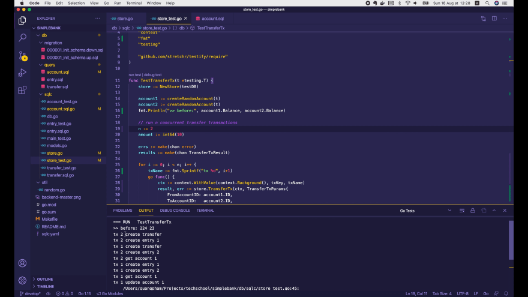

И вуаля, у нас все еще есть взаимная блокировка. Но на этот раз у нас есть 
подробная информация о том, что произошло.

Как видно:

* Транзакция 2 выполнила первые 2 операции: `create transfer` и `create entry 1`.
* Затем запустилась транзакция 1, чтобы начать свою операцию `create transfer`.
* После этого транзакция 2 продолжила выполнять следующие 2 операции:
  `create entry 2` и `get account 1`.
* Наконец, транзакция 1 выполнила следующие 4 операции: create entry 1, 
  create entry 2, `get account 1` и `update account 1`.
* И в этот момент мы получаем взаимную блокировку.

Итак, теперь мы точно знаем, что произошло. Теперь нам нужно выяснить причину, 
почему это произошло.

## Воспроизводим ситуацию с взаимной блокировкой в psql консоли

Откроем базу данных `simple_bank` в TablePlus. На данный момент в ней 2 аккаунта 
с одинаковым изначальным балансом - `100 USD`.

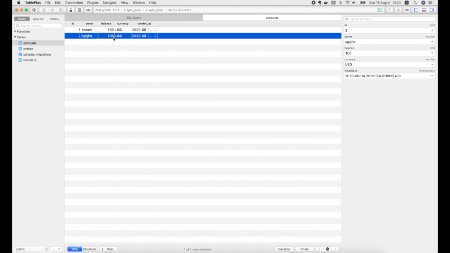

Я также подготовил транзакцию для перевода денег в виде списка SQL запросов, 
которые будут выполняться точно так же, как мы реализовали в нашем коде на 
Golang:

```postgresql
BEGIN;

SELECT * FROM accounts WHERE id = 1;

INSERT INTO transfers (from_account_id, to_account_id, amount) VALUES (1, 2, 10) RETURNING *;

INSERT INTO entries (account_id, amount) VALUES (1, -10) RETURNING *;
INSERT INTO entries (account_id, amount) VALUES (2, 10) RETURNING *;

SELECT * FROM accounts WHERE id = 1 FOR UPDATE;
UPDATE accounts SET balance = 90 WHERE id = 1 RETURNING *;

SELECT * FROM accounts WHERE id = 2 FOR UPDATE;
UPDATE accounts SET balance = 110 WHERE id = 2 RETURNING *;

ROLLBACK;
```

* Транзакция начинается с инструкции BEGIN.
* Сначала мы ВСТАВЛЯЕМ (`INSERT`) новую запись (в таблицу `transfer`) о 
  переводе с `account1` на `account2` с суммой (`amount`) `10`.
* Затем мы ВСТАВЛЯЕМ (`INSERT`) новую запись (в таблицу `entry`) для `account1`
   с суммой `-10`.
* И ВСТАВЛЯЕМ (`INSERT`) новую запись (в таблицу `entry`) для `account2`
  с суммой `+10`.
* Далее мы ИЗВЛЕКАЕМ (`SELECT`) `account1` для обновления.
* И ОБНОВЛЯЕМ (`UPDATE`) баланс (`balance`) счёта значением `100-10`, т. е. 
  значением `90` USD.
* Аналогично ИЗВЛЕКАЕМ (`SELECT`) `account2` для обновления.
* И мы ОБНОВЛЯЕМ (`UPDATE`) его баланс значением `100+10`, т. е.
  значением `110` USD.
* Наконец, мы осуществляем ОТКАТ (`ROLLBACK`), когда возникает взаимная 
  блокировка.

Теперь, как я делал раньше, откроем терминал и запустим 2 psql консоли, 
чтобы выполнить 2 транзакции параллельно.

Начнем первую транзакцию с `BEGIN`. Затем откройте другую вкладку и войдите в
psql консоль. Запустите вторую транзакцию с помощью `BEGIN`.

Теперь мы используем ту информацию, которую получили из логов. Во-первых,
`transaction 2` должна выполнить два первых запроса для создания записей 
в таблицах `transfer` и `entry`:

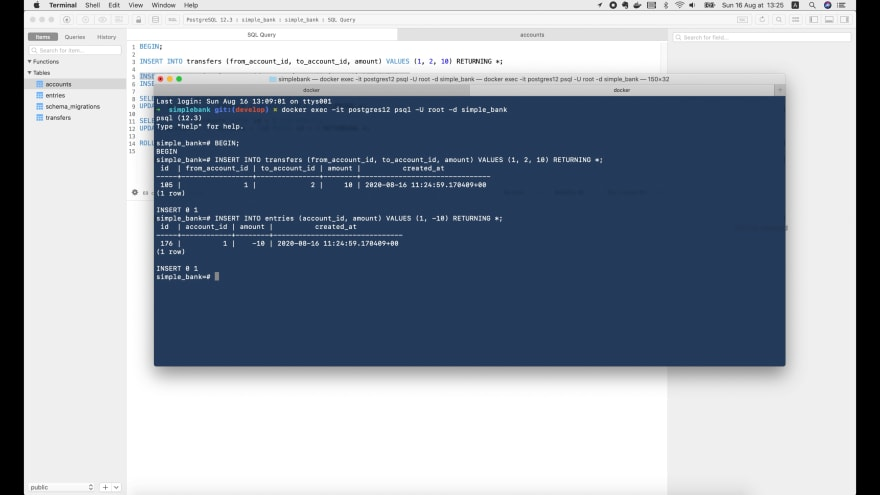

Вставка успешно прошла! Теперь нам нужно перейти к `transaction 1` и выполнить 
первый запрос для создания записи в таблице `transfer`.

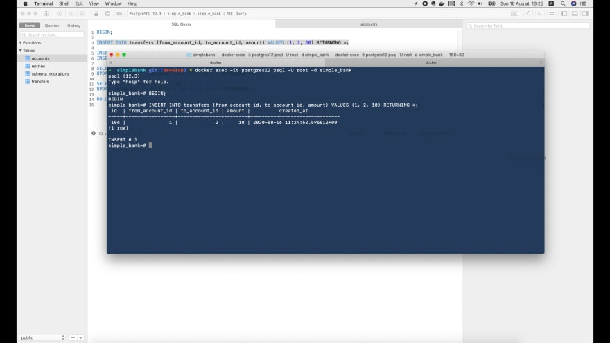

Теперь вернемся к `transaction 2` и запустим ее третий запрос, чтобы создать вторую 
запись в таблице `entry`, и четвертый запрос, чтобы получить учетную `account1` 
для обновления.

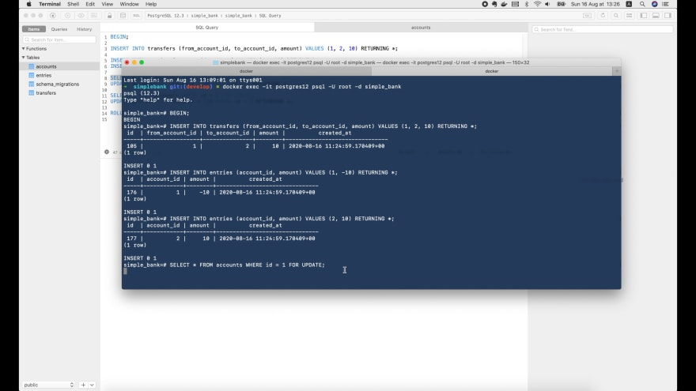

Мы видим, что этот запрос заблокирован. Он ожидает фиксации или отката
`transaction 1`, прежде чем продолжить.

Это звучит странно, потому что `transaction 1` только создает запись в таблице
transfers, а мы пытаемся получить запись из таблицы `accounts`. Почему 
`INSERT` в одну таблицу может блокировать `SELECT` из другой таблицы?

Чтобы убедиться в этом, давайте откроем эту страницу [Postgres Wiki](https://wiki.postgresql.org/wiki/Lock_Monitoring) об отслеживании
блокировок.

```postgresql
SELECT blocked_locks.pid     AS blocked_pid,
        blocked_activity.usename  AS blocked_user,
        blocking_locks.pid     AS blocking_pid,
        blocking_activity.usename AS blocking_user,
        blocked_activity.query    AS blocked_statement,
        blocking_activity.query   AS current_statement_in_blocking_process
FROM  pg_catalog.pg_locks         blocked_locks
JOIN pg_catalog.pg_stat_activity blocked_activity  ON blocked_activity.pid = blocked_locks.pid
JOIN pg_catalog.pg_locks         blocking_locks 
    ON blocking_locks.locktype = blocked_locks.locktype
    AND blocking_locks.database IS NOT DISTINCT FROM blocked_locks.database
    AND blocking_locks.relation IS NOT DISTINCT FROM blocked_locks.relation
    AND blocking_locks.page IS NOT DISTINCT FROM blocked_locks.page
    AND blocking_locks.tuple IS NOT DISTINCT FROM blocked_locks.tuple
    AND blocking_locks.virtualxid IS NOT DISTINCT FROM blocked_locks.virtualxid
    AND blocking_locks.transactionid IS NOT DISTINCT FROM blocked_locks.transactionid
    AND blocking_locks.classid IS NOT DISTINCT FROM blocked_locks.classid
    AND blocking_locks.objid IS NOT DISTINCT FROM blocked_locks.objid
    AND blocking_locks.objsubid IS NOT DISTINCT FROM blocked_locks.objsubid
    AND blocking_locks.pid != blocked_locks.pid

JOIN pg_catalog.pg_stat_activity blocking_activity ON blocking_activity.pid = blocking_locks.pid
WHERE NOT blocked_locks.granted;
```

Этот длинный и сложный запрос позволяет нам взглянуть на заблокированные 
запросы и то, что их блокирует. Итак, давайте скопируем и запустим его в TablePlus.

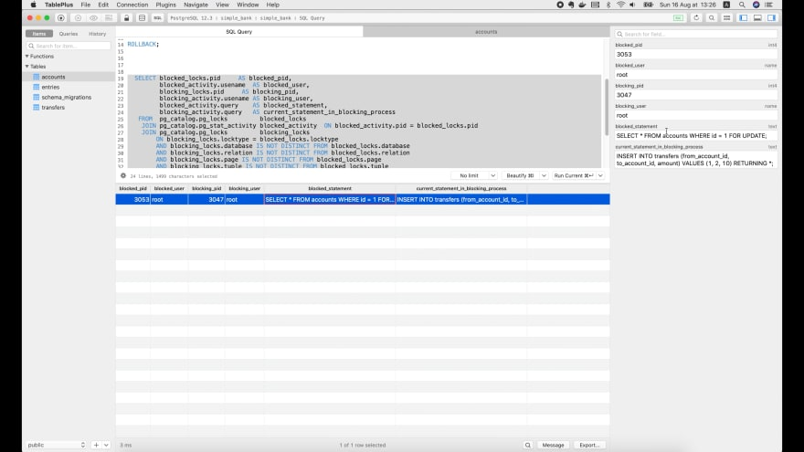

Как видите, заблокированным оператором является `SELECT FROM account FOR UPDATE`.
И тот, который блокирует его, — это `INSERT INTO`. Таким образом, действительно 
запросы к этим двум разным таблицам могут блокировать друг друга.

Давайте копнем глубже, чтобы понять, почему запрос `SELECT` должен ожидать 
запроса `INSERT`.

Если мы вернемся к [Postgres Wiki](https://wiki.postgresql.org/wiki/Lock_Monitoring) и 
прокрутим немного вниз, мы увидим еще один запрос, который позволит нам 
перечислить все блокировки в нашей базе данных.

Я немного изменю этот запрос, потому что хочу увидеть больше информации:

```postgresql
SELECT
    a.datname,
    a.application_name,
    l.relation::regclass,
    l.transactionid,
    l.mode,
    l.locktype,
    l.GRANTED,
    a.usename,
    a.query,
    a.pid
FROM
    pg_stat_activity a
    JOIN pg_locks l ON
    l.pid = a.pid
ORDER BY
    a.pid;
```

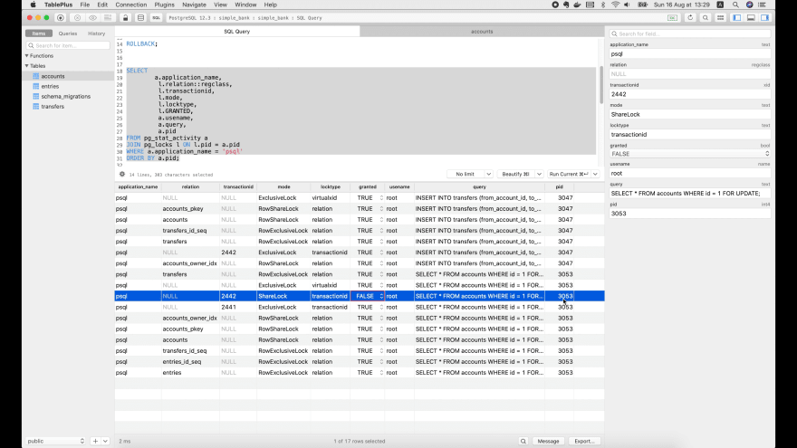

Теперь мы видим, что существует только одна блокировка, которая еще не 
разрешена. Он исходит из запроса `SELECT FROM account` для процесса с ID 
`3053`.

Причина, по которой она не разрешена, заключается в том, что она пытается 
получить `ShareLock` типа `transactionid`, где идентификатор транзакции 
равен 2442. Этот идентификатор транзакции удерживается `исключительно` другим 
процессом с идентификатором `3047` запросом `INSERT INTO transfers`.

Но почему таблица `SELECT FROM account` блокируется другой транзакцией, которая 
выполняет вставку в другую таблицу `INSERT INTO transfers`?

Что ж, если мы посмотрим на схему базы данных, мы увидим, что единственная 
связь между таблицами `accounts` и `transfers` — это ограничение внешнего 
ключа:

```postgresql
ALTER TABLE "entries" ADD FOREIGN KEY ("account_id") REFERENCES "accounts" ("id");

ALTER TABLE "transfers" ADD FOREIGN KEY ("from_account_id") REFERENCES "accounts" ("id");

ALTER TABLE "transfers" ADD FOREIGN KEY ("to_account_id") REFERENCES "accounts" ("id");
```

Столбцы `from_account_id` и `to_account_id` таблицы `transfers` ссылаются на 
столбец `id` таблицы `account`. Таким образом, любое ОБНОВЛЕНИЕ (`UPDATE`) 
идентификатора счёта повлияет на это ограничение внешнего ключа.

Вот почему, когда мы выбираем запись из таблицы `account` для обновления, она 
должна быть заблокирована, чтобы предотвратить конфликты и обеспечить 
согласованность данных.

С учётом этого, если мы продолжим выполнять остальные запросы `transaction 1`, 
чтобы создать `entry 1`, создать `entry 2` и выбрать `account 1` для 
обновления:

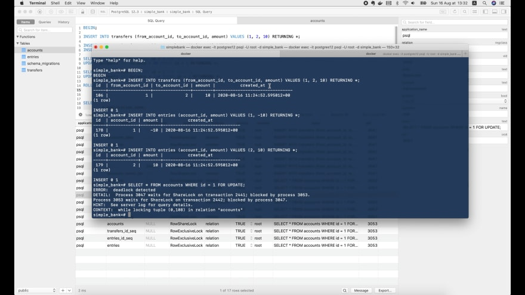

Мы получим взаимную блокировку, поскольку эти запросы также должен ожидать снятия
блокировки от `transaction 2`, в то время как `transaction 2` также ожидает 
снятия блокировки от этой `transaction 1`.

И это проясняет, как происходит взаимная блокировка. Но как от неё избавится?

## Исправляем взаимную блокировку [неправильно]

Как мы знаем, взаимная блокировка вызвана ограничениями внешнего ключа, поэтому 
один простой способ избежать этого — удалить эти ограничения.

Давайте попробуем закомментировать эти команды в файле `init_schema.up.sql`:

```postgresql
-- ALTER TABLE "entries" ADD FOREIGN KEY ("account_id") REFERENCES "accounts" ("id");

-- ALTER TABLE "transfers" ADD FOREIGN KEY ("from_account_id") REFERENCES "accounts" ("id");

-- ALTER TABLE "transfers" ADD FOREIGN KEY ("to_account_id") REFERENCES "accounts" ("id");
```

Затем запустите `make migratedown` в терминале, чтобы удалить схему базы данных. 
И запустите `make migrateup`, чтобы воссоздать новую схему базы данных без 
ограничений внешнего ключа.

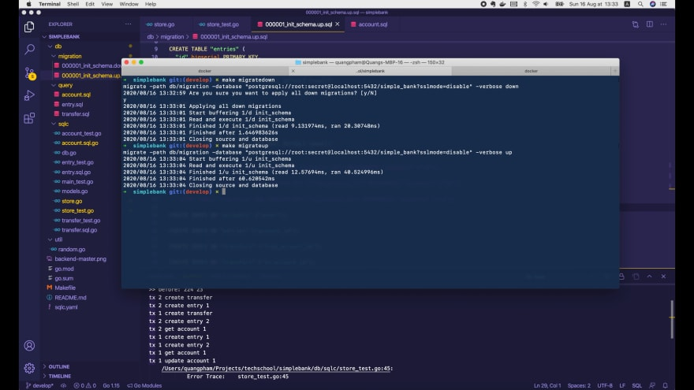

Хорошо, теперь, если мы снова запустим тест, он будет пройден, потому что 
ограничения исчезли и при выборе записей из таблицы `accounts` для обновления 
блокировка не требуется. А отсутствие блокировки означает отсутствие 
взаимной блокировки.

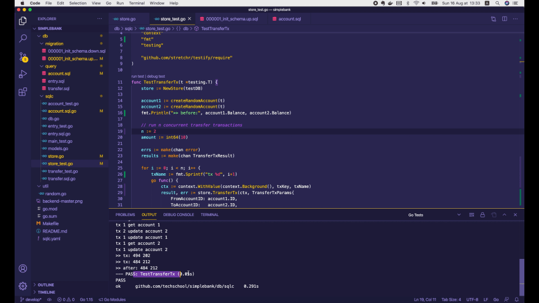

Однако это не лучшее решение, поскольку мы не хотим терять наши ограничения, 
которые обеспечивают согласованность наших данных.

Итак, давайте отменим эти изменения, запустим `make migratedown`, а затем 
снова `migrateup`, чтобы вернуть эти ограничения. Теперь тест снова 
провалится из-за взаимной блокировки.

Давайте узнаем лучший способ решить эту проблему.

## Исправляем взаимную блокировку [правильно]

Как мы уже знаем, блокировка транзакции требуется только потому, что Postgres 
опасается, что `transaction 1` обновит идентификатор счёта, что 
повлияет на ограничения внешнего ключа в таблице `transfers`.

Однако, если мы посмотрим на запрос `UpdateAccount`, мы увидим, что он изменяет 
только баланс счёта.

```postgresql
-- name: UpdateAccount :one
UPDATE accounts
SET balance = $2
WHERE id = $1
RETURNING *;
```

Идентификатор счёта никогда не будет изменен, потому что это первичный ключ 
таблицы `accounts`.

Таким образом, если мы сможем сообщить Postgres, что я выбираю этот счёт для 
обновления, но ее первичный ключ не будет затронут, то Postgres не нужно будет 
блокировать транзакцию и, следовательно, не будет взаимной блокировки.

К счастью, это очень легко сделать. В запросе `GetAccountForUpdate` вместо 
просто `SELECT FOR UPDATE` нам просто нужно внести уточнение: 
`SELECT FOR NO KEY UPDATE`

```postgresql
-- name: GetAccountForUpdate :one
SELECT * FROM accounts
WHERE id = $1 LIMIT 1
FOR NO KEY UPDATE;
```

Это сообщит Postgres, что мы не обновляем ключ или столбец `ID` в таблице
`accounts`.

Теперь давайте запустим `make sqlc` в терминале, чтобы перегенерировать код 
на Golang для этого запроса.

```go
const getAccountForUpdate = `-- name: GetAccountForUpdate :one
SELECT id, owner, balance, currency, created_at FROM accounts
WHERE id = $1 LIMIT 1
FOR NO KEY UPDATE
`

func (q *Queries) GetAccountForUpdate(ctx context.Context, id int64) (Account, error) {
    row := q.db.QueryRowContext(ctx, getAccountForUpdate, id)
    var i Account
    err := row.Scan(
        &i.ID,
        &i.Owner,
        &i.Balance,
        &i.Currency,
        &i.CreatedAt,
    )
    return i, err
}
```

Отлично, код обновлён. Давайте снова запустим наш тест!

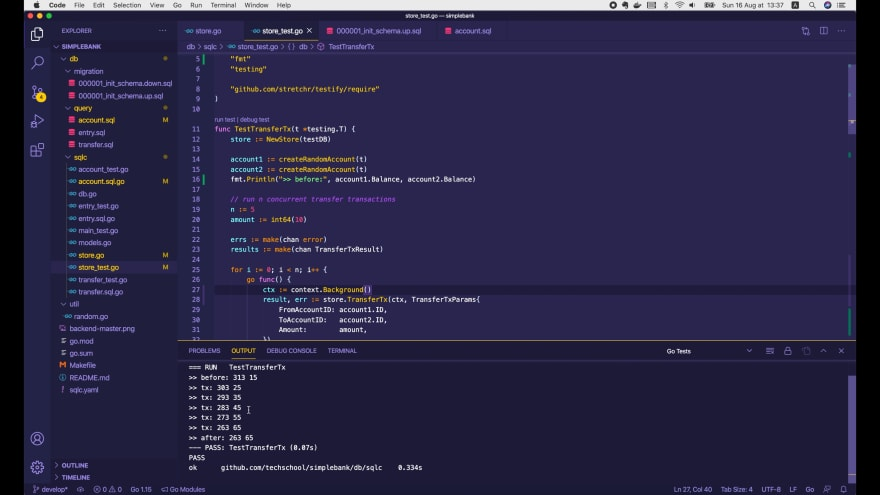

Он успешно пройден! Превосходно! Итак, наша отладка и исправления завершены.

## Обновляем баланс счёта [правильно]

Теперь, прежде чем мы закончим, я покажу вам гораздо лучший способ реализовать 
эту операцию обновления баланса счёта.

В настоящий момент нам нужно выполнить два запроса, чтобы получить счёт и 
обновить его баланс:

```go
func (store *Store) TransferTx(ctx context.Context, arg TransferTxParams) (TransferTxResult, error) {
    var result TransferTxResult

    err := store.execTx(ctx, func(q *Queries) error {
        ...

        // переводим деньги с account1
        account1, err := q.GetAccountForUpdate(ctx, arg.FromAccountID)
        if err != nil {
            return err
        }

        result.FromAccount, err = q.UpdateAccount(ctx, UpdateAccountParams{
            ID:      arg.FromAccountID,
            Balance: account1.Balance - arg.Amount,
        })
        if err != nil {
            return err
        }

        // переводим деньги на account2
        ...
    })

    return result, err
}
```

Вместо этого мы можем использовать только один запрос, чтобы напрямую добавить 
некоторую сумму к балансу счёта.

Для этого я добавлю новый SQL запрос с названием `AddAccountBalance` в файл 
`query/account.sql`.

```postgresql
-- name: AddAccountBalance :one
UPDATE accounts
SET balance = balance + $1
WHERE id = $2
RETURNING *;
```

Он похож на запрос `UpdateAccount`, за исключением того, что здесь мы 
устанавливаем `balance = balance + $2`.

Давайте запустим `make sqlc` для генерации кода. В структуру `Queries` успешно 
добавлена новая функция:

```go
const addAccountBalance = `-- name: AddAccountBalance :one
UPDATE accounts
SET balance = balance + $1
WHERE id = $2
RETURNING id, owner, balance, currency, created_at
`

type AddAccountBalanceParams struct {
    Balance int64 `json:"balance"`
    ID     int64 `json:"id"`
}

func (q *Queries) AddAccountBalance(ctx context.Context, arg AddAccountBalanceParams) (Account, error) {
    row := q.db.QueryRowContext(ctx, addAccountBalance, arg.Balance, arg.ID)
    var i Account
    err := row.Scan(
        &i.ID,
        &i.Owner,
        &i.Balance,
        &i.Currency,
        &i.CreatedAt,
    )
    return i, err
}
```

Однако параметр `balance` внутри структуры `AddAccountBalanceParams` сбивает с 
толку, поскольку мы просто добавляем некоторую сумму к балансу, а не меняем 
баланс счета на это значение.

Таким образом, этот параметр следовало бы называть `Amount`. Можем ли мы сообщить
об этом `sqlc`, чтобы он сделал это за нас?

Да, мы можем! В SQL запросе вместо `$2` можно указать `sqlc.arg(amount)`, а 
вместо `$1` следует указать `sqlc.arg(id)`

```postgresql
-- name: AddAccountBalance :one
UPDATE accounts
SET balance = balance + sqlc.arg(amount)
WHERE id = sqlc.arg(id)
RETURNING *;
```

Здесь `amount` and `id` - названия сгенерированных параметров. Давайте запустим 
`make sqlc` в терминале, чтобы повторно сгенерировать код.

```go
const addAccountBalance = `-- name: AddAccountBalance :one
UPDATE accounts
SET balance = balance + $1
WHERE id = $2
RETURNING id, owner, balance, currency, created_at
`

type AddAccountBalanceParams struct {
    Amount int64 `json:"amount"`
    ID     int64 `json:"id"`
}

func (q *Queries) AddAccountBalance(ctx context.Context, arg AddAccountBalanceParams) (Account, error) {
    row := q.db.QueryRowContext(ctx, addAccountBalance, arg.Amount, arg.ID)
    var i Account
    err := row.Scan(
        &i.ID,
        &i.Owner,
        &i.Balance,
        &i.Currency,
        &i.CreatedAt,
    )
    return i, err
}
```

В этот раз мы видим, что имя параметра изменилось на то, которое мы хотели. 
Здорово!

Теперь вернемся к файлу `store.go`, я уберу вызов `GetAccountForUpdate` и заменю 
`UpdateAccount()` на `AddAccountBalance()`:

```go
func (store *Store) TransferTx(ctx context.Context, arg TransferTxParams) (TransferTxResult, error) {
    var result TransferTxResult

    err := store.execTx(ctx, func(q *Queries) error {
        ...

        // переводим деньги с account1
        result.FromAccount, err = q.AddAccountBalance(ctx, AddAccountBalanceParams{
            ID:     arg.FromAccountID,
            Amount: -arg.Amount,
        })
        if err != nil {
            return err
        }

        // переводим деньги на account2
        result.ToAccount, err = q.AddAccountBalance(ctx, AddAccountBalanceParams{
            ID:     arg.ToAccountID,
            Amount: arg.Amount,
        })
        if err != nil {
            return err
        }

        return nil
    })

    return result, err
}
```

Обратите внимание, что сумма для добавления к `account1` должна быть равна 
`-amount`, потому что деньги снимаются со счёта.

Готово! Давайте запустим тест ещё раз.

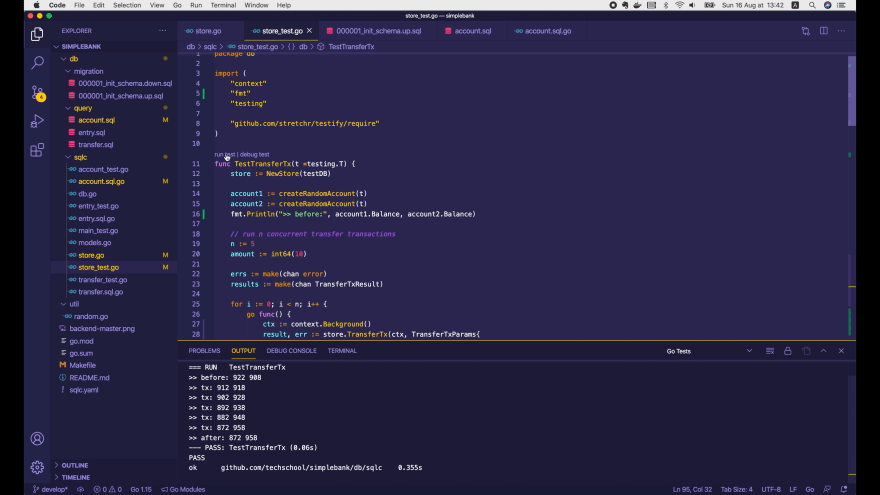

Да! Он успешно пройден! Давайте запустим тесты для всего пакета.

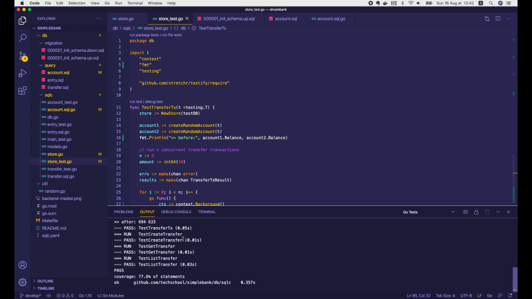

Все они успешно пройдены!

И это все, что касается сегодняшней лекции о блокировке транзакции БД и о 
том, как отлаживать взаимную блокировку. Я надеюсь вам она понравилась.

Надеюсь увидеть вас на следующей лекции, потому что проблема взаимной 
блокировки еще не полностью решена. Мы узнаем о ней гораздо больше.

А пока желаю вам получать удовольствие от написания кода и до скорой встречи!
