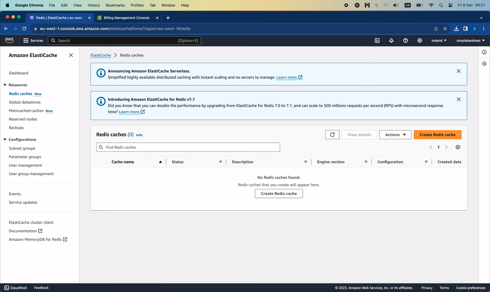

# Don't lose money on AWS

[Original video](https://www.youtube.com/watch?v=VEf7IpUn6BQ)

Hello everyone, welcome to the backend master class. This is a very short 
video, but a very important one because it might help you prevent money 
loss when testing on AWS. As you all know, in the last 2 lectures, we've
been using AWS to deploy our simple bank project.

## AWS Pricing

Although it's a free-tier, you should know that not everything is free. 
They have a limit for each service,

and you'll be charged if you go beyond that number.

## AWS Cost Management

Let's open the billing and cost management to check how much money I had to
pay during the last 2 month.

On October 2023? my bill was 18.46 USD.

The main contribution of this number comes from the domain registration,
because this is not included in the free-tier. So 13 USD was spent on this.

I also had to pay a small fee of 0.52 USD for the hasted zone on Route 53.
Then 0.28 USD for the Elastic compute Cloud , which I guess it's for
the EKS cluster. So everything seems reasonable.

Let's see the bill on November.

It's 21.52 USD. Why? I'm sure I had deleted the whole EKS cluster, the 
database and Redis instances.

Let's check the break-down cost per service.

So for Route 53, I still had to pay 0.5 USD for the hosted zone, which I 
forgot to delete. But the main cost came from the Elastic Load Balancing: 
17.39 USD, which is a hidden fee, because I didn't directly set up this 
service myself, but the EKS service do that for me behind the scene.

According to this bill, it seems there are 2 network load balancers 
running for the whole month, and the 1st one had used up all the hours
limit of the free-tier, so I had to pay for the other one.

## Delete load balancers

Let's search for Load balancer service to check this.

Indeed, there are 2 instances of the load balancers, which are still 
active. So I'm gonna select both of them, then click `Actions`, delete 
load balancer.

Type `confirm` to agree, and click "Delete".

OK, so now all the load balancers are gone. 

Hopefully I don't have to pay for this service again this month.

Let's check other services to make sure everything is clean.

In Route 53 service, open `Hosted Zones` page.

OK, so it seems I have already deleted the hosted zone recently.

Now let's open the Elastic Kubernetes Service. In the `Clusters` page,
we must make sure that the list is empty.

How about the RDS service? As you can see, I've deleted the Postgres 
database, so the list is also empty here.

## Delete Elastic Cash

Let's check the `ElastiCache` service, which we used for Redis.

The cluster was also deleted before. So we're all good. 

Now I'm gonna go back to the bills and select the one for this month: 
December.

OK, so looks like I'm still being charged some money for the `Secrets manager`
service.

Let's check it out! The `simple_bank` secret is still here,

so I'm gonna delete it now.

But it seems we can't delete it right now, and need to wait for at least
7 days. I'm gonna set the waiting period to 7, and click "Schedule 
deletion".

That's basically it! We've successfully cleaned up everything to avoid 
loosing money on AWS when we're done testing with it.

I hope this video will help you save some money. Thanks a lot for 
watching! Happy learning, and see you in the next lecture!