# Как избежать взаимной блокировки в транзакции БД? Порядок запросов имеет значение!

[Оригинал](https://dev.to/techschoolguru/how-to-avoid-deadlock-in-db-transaction-queries-order-matter-oh7)

Одним из самых сложных моментов при работе с транзакциями базы данных 
является блокировка и обработка взаимной блокировки.

По моему опыту, лучший способ справиться от взаимной блокировки — избежать её.
Под этим я подразумеваю, что мы должны правильно определять наши запросы в 
транзакции, чтобы исключить вероятность взаимной блокировки или, по крайней мере, 
свести к минимуму вероятность ее возникновения.

И это именно то, что я собираюсь рассказать вам в этой статье.

Ниже:
* Ссылка на [плейлист с видео лекциями на Youtube](https://bit.ly/backendmaster)
* И на [Github репозиторий](https://github.com/techschool/simplebank)

Хорошо, давайте приступим!

## Потенциальная ситуация с взаимной блокировкой

Это код транзакции для перевода денег, который мы реализовали в предыдущей 
лекции.

```go
func (store *Store) TransferTx(ctx context.Context, arg TransferTxParams) (TransferTxResult, error) {
    var result TransferTxResult

    err := store.execTx(ctx, func(q *Queries) error {
        var err error

        result.Transfer, err = q.CreateTransfer(ctx, CreateTransferParams{
            FromAccountID: arg.FromAccountID,
            ToAccountID:   arg.ToAccountID,
            Amount:        arg.Amount,
        })
        if err != nil {
            return err
        }

        result.FromEntry, err = q.CreateEntry(ctx, CreateEntryParams{
            AccountID: arg.FromAccountID,
            Amount:    -arg.Amount,
        })
        if err != nil {
            return err
        }

        result.ToEntry, err = q.CreateEntry(ctx, CreateEntryParams{
            AccountID: arg.ToAccountID,
            Amount:    arg.Amount,
        })
        if err != nil {
            return err
        }

        result.FromAccount, err = q.AddAccountBalance(ctx, AddAccountBalanceParams{
            ID:     arg.FromAccountID,
            Amount: -arg.Amount,
        })
        if err != nil {
            return err
        }

        result.ToAccount, err = q.AddAccountBalance(ctx, AddAccountBalanceParams{
            ID:     arg.ToAccountID,
            Amount: arg.Amount,
        })
        if err != nil {
            return err
        }

        return nil
    })

    return result, err
}
```

По сути, мы исправили проблему взаимной блокировки, вызванную ограничениями 
внешнего ключа. Однако, если мы внимательно посмотрим на код, мы увидим 
потенциальную ситуацию с взаимной блокировкой.

В этой транзакции мы обновляем баланс `fromAccount` и `toAccount`. И мы знаем, 
что им обоим требуется эксклюзивная блокировка для выполнения операции. Таким 
образом, если существует две одновременных транзакции с участием одной и той 
же пары счётов, может возникнуть потенциальная взаимная блокировка.

Но у нас уже есть тест, который запускает 5 одновременных транзакций перевода 
с одной и той же парой счётов, но взаимной блокировки не происходит, верно?

```go
func TestTransferTx(t *testing.T) {
store := NewStore(testDB)

    account1 := createRandomAccount(t)
    account2 := createRandomAccount(t)
    fmt.Println(">> before:", account1.Balance, account2.Balance)

    n := 5
    amount := int64(10)

    errs := make(chan error)
    results := make(chan TransferTxResult)

    // запускаем n одновременных транзакций перевода
    for i := 0; i < n; i++ {
        go func() {
            result, err := store.TransferTx(context.Background(), TransferTxParams{
                FromAccountID: account1.ID,
                ToAccountID:   account2.ID,
                Amount:        amount,
            })

            errs <- err
            results <- result
        }()
    }

    // проверяем результаты
    existed := make(map[int]bool)

    for i := 0; i < n; i++ {
        err := <-errs
        require.NoError(t, err)

        result := <-results
        require.NotEmpty(t, result)

        // проверяем перевод
        transfer := result.Transfer
        require.NotEmpty(t, transfer)
        require.Equal(t, account1.ID, transfer.FromAccountID)
        require.Equal(t, account2.ID, transfer.ToAccountID)
        require.Equal(t, amount, transfer.Amount)
        require.NotZero(t, transfer.ID)
        require.NotZero(t, transfer.CreatedAt)

        _, err = store.GetTransfer(context.Background(), transfer.ID)
        require.NoError(t, err)

        // проверяем записи в таблице entries
        fromEntry := result.FromEntry
        require.NotEmpty(t, fromEntry)
        require.Equal(t, account1.ID, fromEntry.AccountID)
        require.Equal(t, -amount, fromEntry.Amount)
        require.NotZero(t, fromEntry.ID)
        require.NotZero(t, fromEntry.CreatedAt)

        _, err = store.GetEntry(context.Background(), fromEntry.ID)
        require.NoError(t, err)

        toEntry := result.ToEntry
        require.NotEmpty(t, toEntry)
        require.Equal(t, account2.ID, toEntry.AccountID)
        require.Equal(t, amount, toEntry.Amount)
        require.NotZero(t, toEntry.ID)
        require.NotZero(t, toEntry.CreatedAt)

        _, err = store.GetEntry(context.Background(), toEntry.ID)
        require.NoError(t, err)

        // проверяем счета
        fromAccount := result.FromAccount
        require.NotEmpty(t, fromAccount)
        require.Equal(t, account1.ID, fromAccount.ID)

        toAccount := result.ToAccount
        require.NotEmpty(t, toAccount)
        require.Equal(t, account2.ID, toAccount.ID)

        // проверяем баланс счетов
        fmt.Println(">> tx:", fromAccount.Balance, toAccount.Balance)

        diff1 := account1.Balance - fromAccount.Balance
        diff2 := toAccount.Balance - account2.Balance
        require.Equal(t, diff1, diff2)
        require.True(t, diff1 > 0)
        require.True(t, diff1%amount == 0) // 1 * amount, 2 * amount, 3 * amount, ..., n * amount

        k := int(diff1 / amount)
        require.True(t, k >= 1 && k <= n)
        require.NotContains(t, existed, k)
        existed[k] = true
    }

    // проверяем получившиеся обновленные балансы
    updatedAccount1, err := store.GetAccount(context.Background(), account1.ID)
    require.NoError(t, err)

    updatedAccount2, err := store.GetAccount(context.Background(), account2.ID)
    require.NoError(t, err)

    fmt.Println(">> after:", updatedAccount1.Balance, updatedAccount2.Balance)

    require.Equal(t, account1.Balance-int64(n)*amount, updatedAccount1.Balance)
    require.Equal(t, account2.Balance+int64(n)*amount, updatedAccount2.Balance)
}
```

Верно! Однако все транзакции в нашем существующем тесте делают одно и то же: 
переводят деньги с `account1` на `account2`. Что будет, если некоторые из них 
будут переводить деньги с `account2` на `account1`?

Чтобы продемонстрировать как в этом случае сценарии может возникнуть взаимная 
блокировка, я подготовил две транзакции в TablePlus:

```postgresql
-- Tx1: переводим $10 с account 1 на account 2
BEGIN;

UPDATE accounts SET balance = balance - 10 WHERE id = 1 RETURNING *;
UPDATE accounts SET balance = balance + 10 WHERE id = 2 RETURNING *;

ROLLBACK;


-- Tx2: переводим $10 с account 2 на account 1
BEGIN;

UPDATE accounts SET balance = balance - 10 WHERE id = 2 RETURNING *;
UPDATE accounts SET balance = balance + 10 WHERE id = 1 RETURNING *;

ROLLBACK;
```

Первая транзакция переведет 10 долларов с `account1` на `account2`, сначала 
вычитая `10` из баланса `account1`, а затем добавляя `10` к балансу `account2`.

Теперь давайте откроем терминал для запуска этих транзакций в двух параллельных
psql консолях.

Сначала я запущу первую psql консоль и НАЧНУ (`BEGIN`) первую транзакцию. Затем 
я выполню её первый запрос, чтобы вычесть `10` из баланса `account1`.

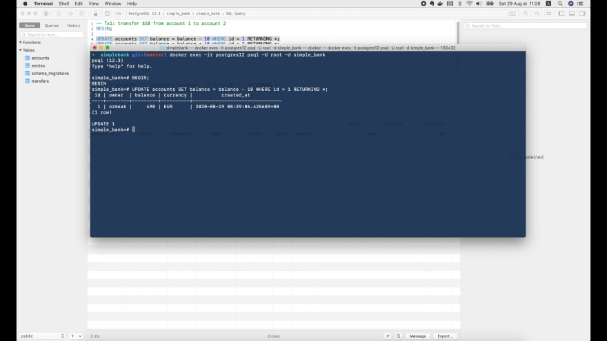

Счёт обновляется мгновенно. Теперь давайте откроем другую вкладку, запустим 
новую psql консоль и НАЧНЕМ (`BEGIN`) вторую транзакцию. Затем давайте запустим 
её первый запрос, чтобы вычесть `10` из баланса `account2`.

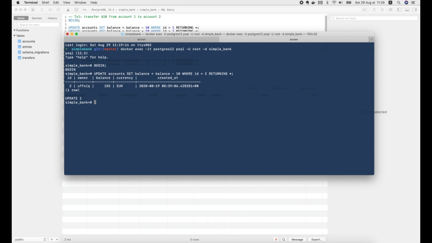

Этот запрос также выполняется сразу же. Теперь вернемся к первой транзакции и 
запустим её второй запрос, чтобы обновить баланс `account2`.

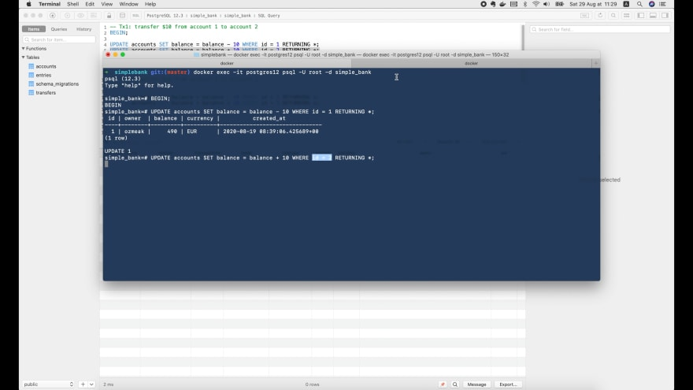

На этот раз запрос заблокирован, поскольку вторая транзакция также обновляет 
ту же самую `account2`.

Если мы вернемся в TablePlus и запустим этот запрос, чтобы вывести список всех 
блокировок:

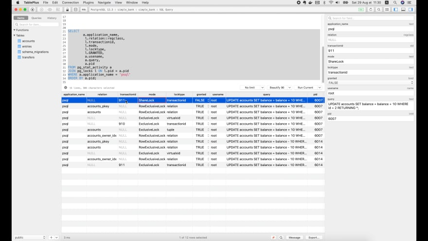

Мы видим, что этот запрос `update account 2` `transaction 1` пытается получить 
`ShareLock` транзакции с идентификатором `911`, но он еще не разрешен.

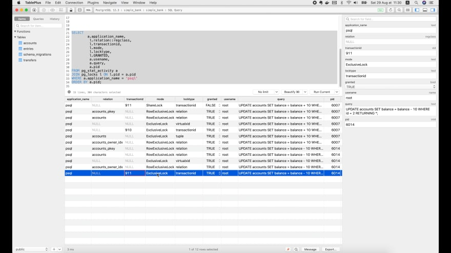

Это связано с тем, что `transaction 2` уже удерживает `ExclusiveLock` для того 
же идентификатора транзакции. Следовательно, `transaction 1` должна дождаться 
завершения `transaction 2`, прежде чем продолжить.

Теперь, если мы продолжим выполнение второго запроса `transaction 2` для 
обновления баланса `account1`:

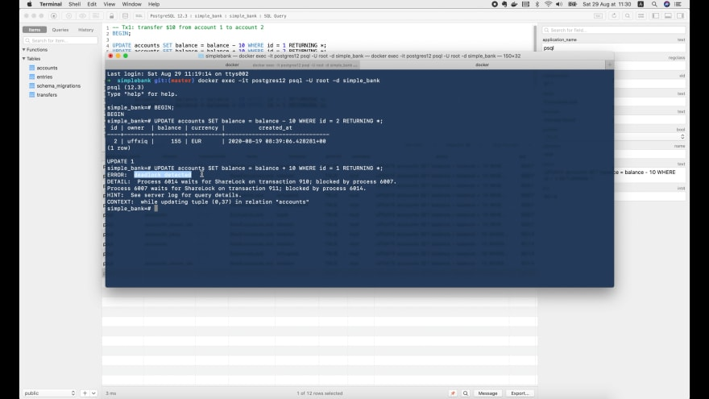

Мы получим взаимную блокировку, потому что эта запись `account1` обновляется
`transaction 1`, поэтому `transaction 2` также должна дождаться завершения
`transaction 1`, прежде чем получить результат этого запроса. Взаимная 
блокировка возникает из-за того, что эти две одновременные транзакции должны 
ждать друг друга.

Хорошо, теперь давайте откатим эти две транзакции, а затем вернемся к нашему 
простому банковскому приложению, чтобы воспроизвести эту ситуацию в тесте.

## Воспроизводим ситуацию с взаимной блокировкой в тесте

Новый тест будет очень поход на тот, который мы написали в прошлой лекции, 
поэтому я просто скопирую эту функцию `TestTransferTx` и изменю ее название на 
`TestTransferTxDeadlock`.

Предположим, мы собираемся запустить `n = 10` одновременных транзакций. Идея 
состоит в том, чтобы иметь `5` транзакций, отправляющие деньги с `account 1` 
на `account 2`, и еще `5` транзакций, которые отправляют деньги в обратном 
направлении, с `account 2` на `account 1`.

```go
func TestTransferTxDeadlock(t *testing.T) {
    store := NewStore(testDB)

    account1 := createRandomAccount(t)
    account2 := createRandomAccount(t)
    fmt.Println(">> before:", account1.Balance, account2.Balance)

    n := 10
    amount := int64(10)
    errs := make(chan error)

    ...
}
```

В этом тесте нам нужно только проверить ошибку взаимной блокировки, нам не 
нужно заботиться о результате, потому что он уже был проверен в другом тесте.
Поэтому я удалил канал с результатами (`results`) и просто оставил канал ошибок 
(`errs`).

Теперь внутри цикла for определим две новые переменные: `fromAccountID` будет 
`account1.ID`, а `toAccountID` будет `account2.ID`.

Но так как мы хотим, чтобы половина транзакций отправила деньги с `account2` 
на `account1`, я проверю, является ли счетчик `i` нечетным числом 
`(i % 2 = 1)`, и в этом случае `fromAccountID` должен быть равен 
`account2.ID`, а `toAccountID` - `account1`.

```go
func TestTransferTxDeadlock(t *testing.T) {
    ...

    for i := 0; i < n; i++ {
        fromAccountID := account1.ID
        toAccountID := account2.ID

        if i%2 == 1 {
            fromAccountID = account2.ID
            toAccountID = account1.ID
        }

        go func() {
            _, err := store.TransferTx(context.Background(), TransferTxParams{
                FromAccountID: fromAccountID,
                ToAccountID:   toAccountID,
                Amount:        amount,
            })

            errs <- err
        }()
    }
}
```

Теперь внутри горутины мы должны установить поля `TransferTxParams` значениями 
`fromAccountID` и `toAccountID`. Затем удалите оператор `results <- result`, 
потому что нас больше не интересует результат.

Хорошо, теперь часть, касающаяся проверки ошибок. Давайте удалим существующую 
карту и все внутри цикла `for`, кроме операторов проверки ошибок.

```go
func TestTransferTxDeadlock(t *testing.T) {
    ...

    for i := 0; i < n; i++ {
        err := <-errs
        require.NoError(t, err)
    }

    ...
}
```

Мы также хотим проверить получившийся обновленный баланс двух счетов. В этом 
случае производится 10 транзакций, которые перемещают одинаковую сумму между
`account1` и `account2`. Но из-за этого условия (i%2 == 1), 5 из них будут 
перемещать деньги с `account1` на `account2`, а остальные 5 переведут деньги 
с `account2` обратно на `account1`.

Поэтому мы ожидаем, что в итоге баланс и на `account1`, и на `account2` должен 
быть таким же, каким он был до транзакций.

```go
func TestTransferTxDeadlock(t *testing.T) {
    ...

    // check the final updated balance
    updatedAccount1, err := store.GetAccount(context.Background(), account1.ID)
    require.NoError(t, err)

    updatedAccount2, err := store.GetAccount(context.Background(), account2.ID)
    require.NoError(t, err)

    fmt.Println(">> after:", updatedAccount1.Balance, updatedAccount2.Balance)
    require.Equal(t, account1.Balance, updatedAccount1.Balance)
    require.Equal(t, account2.Balance, updatedAccount2.Balance)
}
```

Итак, здесь `updatedAccount1.Balance` должен равняться `account1.Balance`, а
`updatedAccount2.Balance` должен равняться `account2.Balance`.

Хорошо, давайте запустим этот тест!

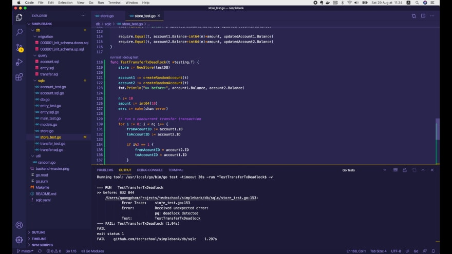

Как и ожидалось, у нас возникла ошибка взаимной блокировки. Давайте узнаем, как 
её исправить!

## Исправляем проблему взаимной блокировки

Как вы уже видели в примере, который мы запустили в psql консоли, причина 
взаимной блокировки заключается в другом порядке, когда две параллельные 
транзакции обновляют баланс счётов, где `transaction 1` обновляет `account 1` 
до `account 2`, а `transaction 2` обновляет `account 2` до `account 1`.

Таким образом, это дает нам представление о том, как можно избежать 
взаимной блокировки, заставив обе транзакции обновлять баланс счетов в одном и 
том же порядке. Допустим, в этой `transaction 2` мы просто переместим запрос 
на обновление `account 1` вверх, а все остальное оставляем без изменений.

```postgresql
-- Tx1: переводим $10 с account 1 на account 2
BEGIN;

UPDATE accounts SET balance = balance - 10 WHERE id = 1 RETURNING *;
UPDATE accounts SET balance = balance + 10 WHERE id = 2 RETURNING *;

ROLLBACK;


-- Tx2: переводим $10 с account 2 на account 1
BEGIN;

UPDATE accounts SET balance = balance + 10 WHERE id = 1 RETURNING *; -- moved up
UPDATE accounts SET balance = balance - 10 WHERE id = 2 RETURNING *;

ROLLBACK;
```

Итак, теперь и `transaction 1`, и `transaction 2` всегда будут обновлять
`account1` перед `account2`. Давайте попробуем запустить их в psql консоли, 
чтобы посмотреть, что произойдет!

Сначала начните `transaction 1` и выполните ее первый запрос для обновления
`account1`.

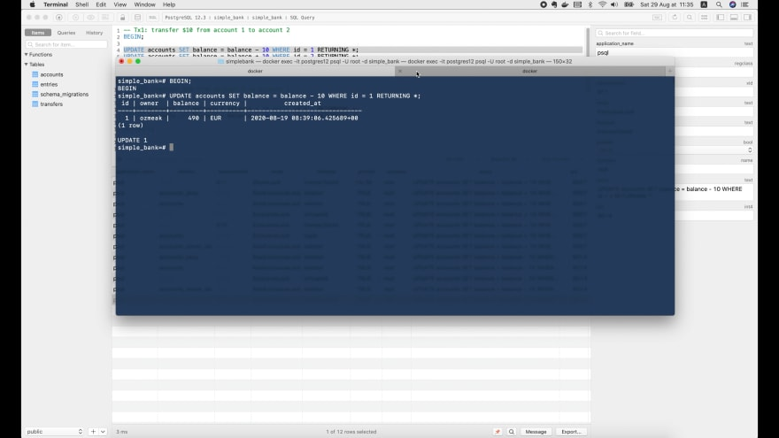

Затем переключитесь на другую консоль и начните `transaction 2`. Также 
выполните ее первый запрос для обновления `account1`.

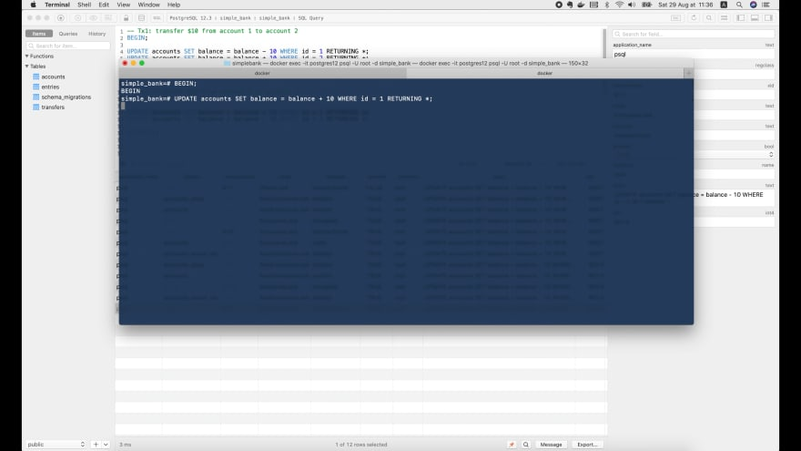

Теперь, в отличие от предыдущей ситуации, на этот раз запрос блокируется 
сразу, потому что `transaction 1` уже имеет эксклюзивную блокировку для 
обновления того же `account1`. Итак, давайте вернемся к `transaction 1` и 
запустим её второй запрос для обновления `account2`.

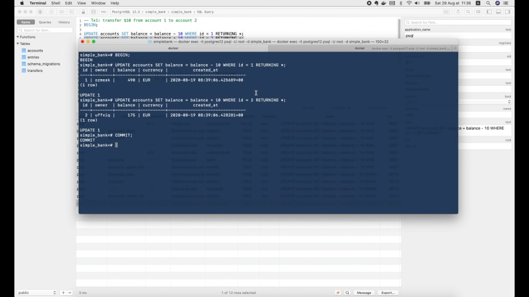

Запрос выполняется немедленно, а `transaction 2` по-прежнему заблокирована. 
После этого мы просто ФИКСИРУЕМ (`COMMIT`) эту `transaction 1`, чтобы снять 
блокировку. Затем переходим к `transaction 2`.

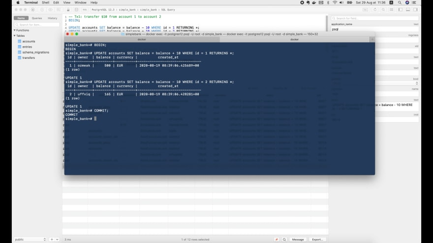

Мы видим, что она моментально разблокировалась, а баланс обновился до нового 
значения.

Мы можем выполнить второй запрос для обновления `account 2`, а затем успешно 
выполнить ФИКСАЦИЮ (`COMMIT`) `transaction 2` без взаимной блокировки.

Итак, теперь мы понимаем, что лучшая защита от взаимных блокировок — избегать 
их, следя за тем, чтобы все блокировки в нашем приложении происходили в одном
и том же порядке.

Например, в нашем случае мы можем легко изменить наш код, чтобы он всегда 
сначала обновлял счёт с меньшим значением идентификатора.

То есть мы проверяем, меньше ли `arg.FromAccountID`, чем `arg.ToAccountID`, 
и в этом случае `fromAccount` должен быть обновлен перед `toAccount`. В 
противном случае `toAccount` должен быть обновлен до `fromAccount`.

```go
func (store *Store) TransferTx(ctx context.Context, arg TransferTxParams) (TransferTxResult, error) {
    var result TransferTxResult

    err := store.execTx(ctx, func(q *Queries) error {
        ...

        if arg.FromAccountID < arg.ToAccountID {
            result.FromAccount, err = q.AddAccountBalance(ctx, AddAccountBalanceParams{
                ID:     arg.FromAccountID,
                Amount: -arg.Amount,
            })
            if err != nil {
                return err
            }

            result.ToAccount, err = q.AddAccountBalance(ctx, AddAccountBalanceParams{
                ID:     arg.ToAccountID,
                Amount: arg.Amount,
            })
            if err != nil {
                return err
            }
        } else {
            result.ToAccount, err = q.AddAccountBalance(ctx, AddAccountBalanceParams{
                ID:     arg.ToAccountID,
                Amount: arg.Amount,
            })
            if err != nil {
                return err
            }

            result.FromAccount, err = q.AddAccountBalance(ctx, AddAccountBalanceParams{
                ID:     arg.FromAccountID,
                Amount: -arg.Amount,
            })
            if err != nil {
                return err
            }
        }

        return nil
    })

    return result, err
}
```

Хорошо, теперь, после этого изменения, мы ожидаем, что взаимной блокировки 
не будет. Давайте повторно запустим наш тест!

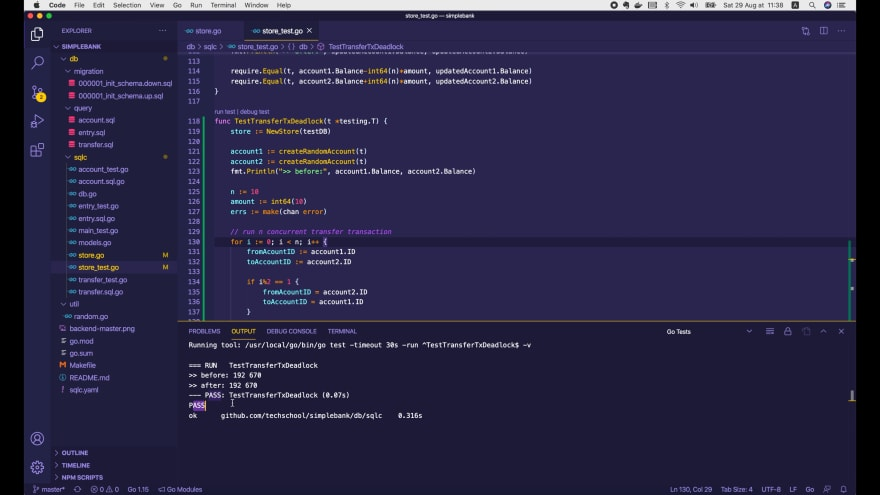

Он успешно пройден! В логах мы видим, что балансы до и после транзакций 
одинаковы. Превосходно!

## Рефакторинг кода

Прежде чем мы закончим, давайте проведём небольшой рефакторинг кода, потому что 
теперь он выглядит довольно длинным и повторяется в нескольких местах. Для этого я 
определю новую функцию `addMoney()` для добавления определенной суммы на два 
счёта.

В качестве входных параметров она принимает: контекст, объект запросов, 
идентификатор первого счёта, сумма, которая должна быть добавления на этот первый 
счёт, идентификатор второй учетной записи и сумма, добавляемая на этот
второй счёт.

Функция возвращает три значения: объект `account1`, объект `account2` после 
обновления и потенциальную ошибку. 

```go
func addMoney(
    ctx context.Context,
    q *Queries,
    accountID1 int64,
    amount1 int64,
    accountID2 int64,
    amount2 int64,
) (account1 Account, account2 Account, err error) {
    account1, err = q.AddAccountBalance(ctx, AddAccountBalanceParams{
        ID:     accountID1,
        Amount: amount1,
    })
    if err != nil {
        return
    }

    account2, err = q.AddAccountBalance(ctx, AddAccountBalanceParams{
        ID:     accountID2,
        Amount: amount2,
    })
    return
}
```

Внутри этой функции мы сначала вызываем `q.AddAcountBalance()`, чтобы добавить
`amount1` к балансу `account1`. Таким образом, `ID` должен быть равен
`accountID1`, а `Amount` - `amount1`. Сохраняем результаты в возвращаемые 
переменные `account1` и `err`.

Затем если `err` не равна `nil`, то просто завершаем работу функции. Здесь, 
поскольку мы используем именованные возвращаемые переменные, этот возврат без 
параметров практически не отличается от записи `return account1, account2, err`.
Это отличная синтаксическая особенность Go, которая делает код более лаконичным.

Мы делаем то же самое, чтобы добавить `amount2` к `account2`. Теперь, используя 
эту функцию `addMoney`, мы можем реорганизовать нашу транзакцию для перевода:

```go
func (store *Store) TransferTx(ctx context.Context, arg TransferTxParams) (TransferTxResult, error) {
    var result TransferTxResult

    err := store.execTx(ctx, func(q *Queries) error {
        ...

        if arg.FromAccountID < arg.ToAccountID {
            result.FromAccount, result.ToAccount, err = addMoney(ctx, q, arg.FromAccountID, -arg.Amount, arg.ToAccountID, arg.Amount)
        } else {
            result.ToAccount, result.FromAccount, err = addMoney(ctx, q, arg.ToAccountID, arg.Amount, arg.FromAccountID, -arg.Amount)
        }

        return err
    })

    return result, err
}
```

Если `fromAccountID` меньше, чем `toAccountID`, мы хотим обновить `fromAccount` 
перед `toAccount`. Итак, здесь мы вызываем `addMoney()`, передаем контекст
`ctx`, запрос `q`, `arg.FromAccountID`, `-arg.Amount`, потому что деньги 
снимаются со счёта, затем `arg.ToAccountID` и, наконец, `arg.Amount`, потому 
что деньги поступают на счёт.

Результат выполнения этой функции должен быть присвоен переменным 
`result.FromAccount`, `result.ToAccount` и `err`.

В противном случае, если `toAccountID` меньше, мы хотим убедиться, что 
`toAccount` обновляется до `fromAccount`. Поэтому мы просто дублируем 
предыдущую команду, но немного меняем её, чтобы изменить порядок счетов.

Вот и все! Рефакторинг проведён. Давайте перезапустим `TestTransferTxDeadlock`!

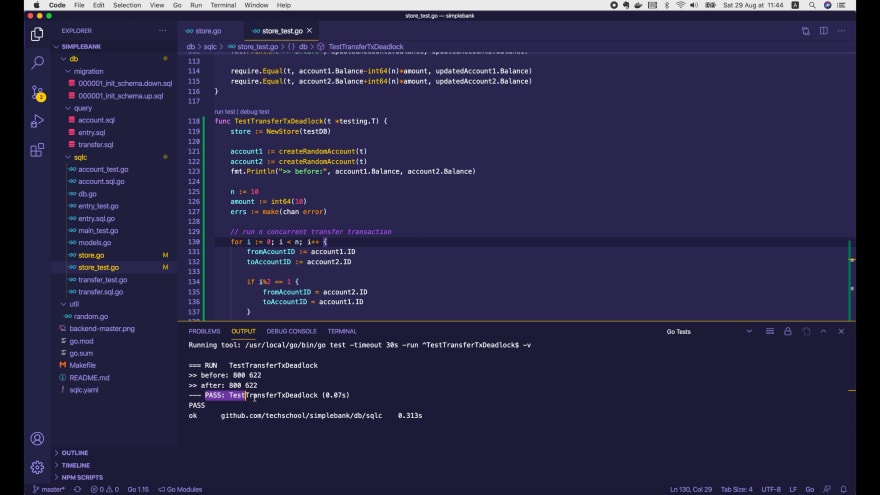

Он успешно пройден! Превосходно! Давайте также запустим тест `TestTransferTx`:

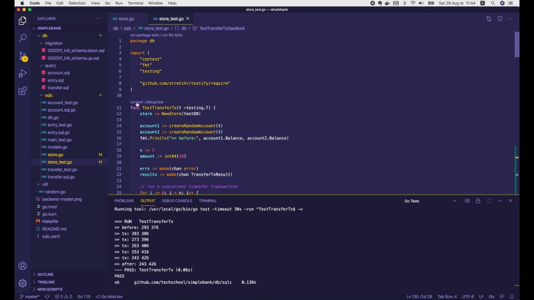

Он также пройден! И наконец повторно запустим тесты для всего пакета:

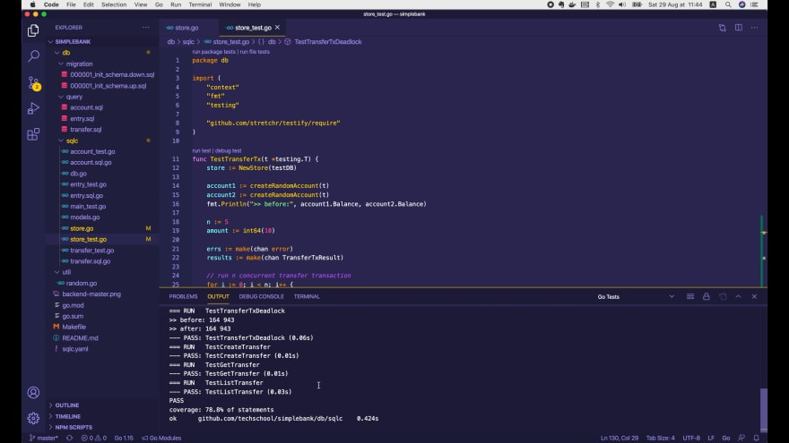

Все тесты успешно пройдены!

Так что теперь все работает корректно. Взаимная блокировка больше не 
представляет угрозы для нашего приложения.

Вот и подошла к концу сегодняшняя лекция. Надеюсь, что информация, которую вы
узнали из неё, пригодится вам.

Большое спасибо за время, потраченное на чтение! Желаю вам получать удовольствие 
от написания кода и до встречи на следующей лекции!