# Разбираемся в уровнях изоляции и проблемах, возникающих при чтении записи в MySQL и PostgreSQL

[Оригинал](https://dev.to/techschoolguru/understand-isolation-levels-read-phenomena-in-mysql-postgres-c2e)

При работе с `транзакциями базы данных` очень важно выбрать соответствующий 
`уровень изоляции` для нашего приложения. Хотя существует четко 
определенный стандарт, каждое ядро базы данных может реализовать его 
по-своему и, следовательно, может вести себя по-разному на каждом `уровне
изоляции`.

Сегодня мы подробно рассмотрим, как работает каждый уровень изоляции в 
MySQL и Postgres, выполнив несколько конкретных SQL запросов. Мы также 
узнаем, как каждый уровень изоляции предотвращает такие проблемы при 
чтении, как `«грязное» чтение`, `неповторяющееся чтение`, `фантомное чтение` и 
`аномалии упорядочения`.

Ниже:
* Ссылка на [плейлист с видео лекциями на Youtube](https://bit.ly/backendmaster)
* И на [Github репозиторий](https://github.com/techschool/simplebank)

Содержание

* Изоляция транзакций и проблемы, возникающие при чтении
    * Свойство ACID
    * Четыре проблемы, возникающие при чтении
    * Четыре уровня изоляции
    * Связь между уровнями изоляции и проблемами, возникающими при чтении
* Уровни изоляции в MySQL
    * Получаем текущий уровень изоляции в MySQL
    * Изменяем уровень изоляции в MySQL
    * Уровень изоляции Read uncommitted в MySQL
    * Уровень изоляции Read committed в MySQL
    * Уровень изоляции Repeatable read в MySQL
    * Уровень изоляции Serializable в MySQL
* Уровни изоляции в Postgres
    * Получаем текущий уровень изоляции в Postgres
    * Изменяем уровень изоляции в Postgres
    * Уровень изоляции Read uncommitted в Postgres
    * Уровень изоляции Read committed в Postgres
    * Уровень изоляции Repeatable read в Postgres
    * Аномалия упорядочения в Postgres
    * Уровень изоляции Serializable в Postgres
    * Как MySQL борется с аномалией упорядочения
* Резюме о взаимосвязи между уровнями изоляции и проблемами, возникающими при чтении
    * В MySQL
    * В Postgres
    * О чём стоит помнить
    * Ссылки

## Изоляция транзакций и проблемы, возникающие при чтении

Во-первых, давайте немного коснемся теории.

## Свойство ACID

Как мы уже узнали из предыдущей лекции, транзакция базы данных должна 
удовлетворять свойству ACID, которое означает `Atomicity` (атомарность),
`Consistency` (согласованность), `Isolation` (изолированность) и
`Durability` (прочность).

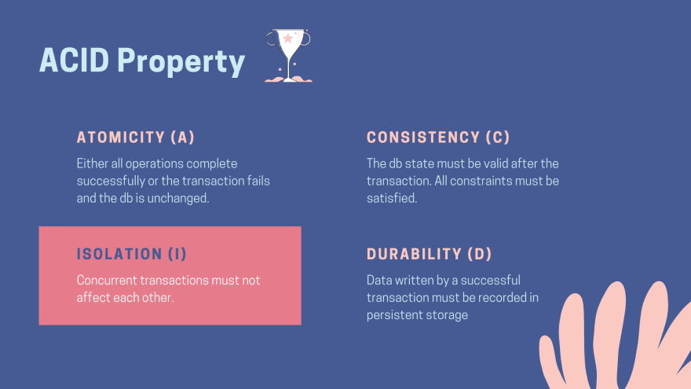

`Isolation` (изолированность) - это одно из четырех свойств транзакции базы 
данных, где на самом сильном уровне идеальная изоляция гарантирует, что все 
параллельные транзакции не будут влиять друг на друга.

Существует несколько способов вмешательства в транзакцию других транзакций, 
выполняющихся одновременно с ней. Это вмешательство вызовет то, что мы назвали 
проблемами при чтении.

## Четыре проблемы, возникающие при чтении

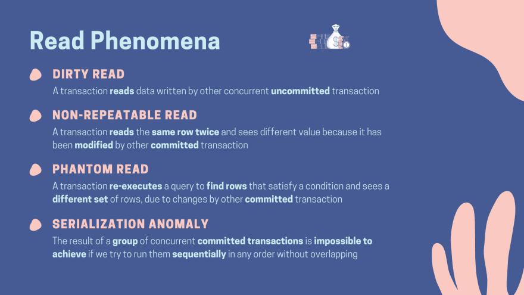

Вот некоторые проблемы при чтении, которые могут возникнуть, если база данных 
работает с низким уровнем изоляции транзакций:

* Во-первых, `«грязное» чтение`. Она возникает, когда транзакция читает данные, 
  записанные другой параллельной транзакцией, которая еще не была зафиксирована. 
  Это очень серьёзная проблема, потому что мы не знаем, будет ли эта другая 
  транзакция в конечном итоге зафиксирована или отменена. Таким образом, мы 
  можем в конечном итоге использовать неверные данные в случае отката.
* Вторая проблема, с которым мы можем столкнуться, — `неповторяющееся чтение`. 
  Когда при повторном чтении в рамках одной транзакции ранее прочитанные данные 
  оказываются изменёнными, потому что строка была изменена другой транзакцией, 
  которая была зафиксирована после первого чтения.
* `Фантомное чтение` - проблема, похожая на предыдущую, но влияет на запросы, 
  которые ищут несколько строк вместо одной. В этом случае один и тот же запрос,
  выполняемый повторно, возвращает другой набор строк из-за некоторых изменений, 
  сделанных другими недавно зафиксированными транзакциями, таких как вставка 
  новых строк или удаление существующих строк, которые удовлетворяют условию 
  поиска запроса текущей транзакции.
* Ещё одна проблема, связанная с порядком выполнения группы транзакций, — `аномалия 
  упорядочения`. Это когда результат группы одновременно совершенных 
  транзакций не совпадает с тем, что мы получили, если бы попытались 
  запустить их последовательно в любом порядке, одну за другой.

Не волнуйтесь, если вы не до конца можете себе представить эти проблемы 
прямо сейчас. Мы собираемся воспроизвести каждую из них в MySQL и Postgres 
чуть позже.

## Четыре уровня изоляции

В настоящее время для борьбы с этими проблемами, Американским национальным 
институтом стандартов или ANSI были определены 4 стандартных уровня изоляции.

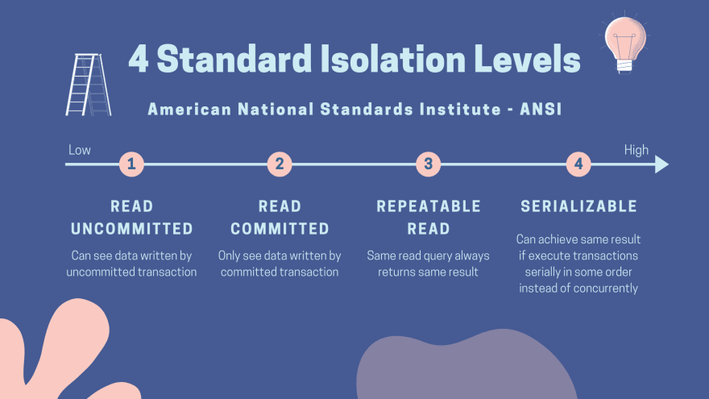

* Самый слабый уровень изоляции — это `read uncommitted` (чтение 
  незафиксированных данных). Транзакции на этом уровне могут видеть данные, 
  записанные другими незафиксированными транзакциями, что приводит к проблеме
  «грязного» чтения.
* Следующий уровень изоляции — `read committed` (чтение фиксированных данных), 
  в этом случае транзакции могут видеть только те данные, которые были 
  зафиксированы другими транзакциями. Из-за этого ситуация, при которой 
  возникает «грязное» чтение больше не возникает.
* Немного более строгим является уровень изоляции `repeatable read` 
  (повторяющееся чтение). Это гарантирует, что один и тот же запрос на выборку 
  всегда будет возвращать один и тот же результат, независимо от того, сколько 
  раз он выполняется, даже если некоторые другие параллельные транзакции 
  зафиксировали новые изменения, удовлетворяющие запросу.
* Наконец, самый сильным уровнем изоляции является `serializable` 
  (упорядочиваемость). Параллельные транзакции, выполняемые на этом уровне, 
  гарантированно смогут дать тот же результат, как если бы они выполнялись 
  последовательно в некотором порядке, одна за другой, без перекрытия. Таким 
  образом, это означает, что существует по крайней мере один способ упорядочить 
  эти параллельные транзакции, так что если мы будем запускать их одну за 
  другой, конечный результат будет одинаковым.

## Связь между уровнями изоляции и проблемами, возникающими при чтении

Хорошо, теперь пришло время определить связь между уровнями изоляции и
проблемами, возникающими при чтении. Мы собираемся запустить несколько 
транзакций с разными уровнями изоляции в MySQL и Postgres, чтобы выяснить, 
какие проблемы возможны на каждом уровне. Затем мы перенесём эту информацию в 
эту сводную диаграмму:

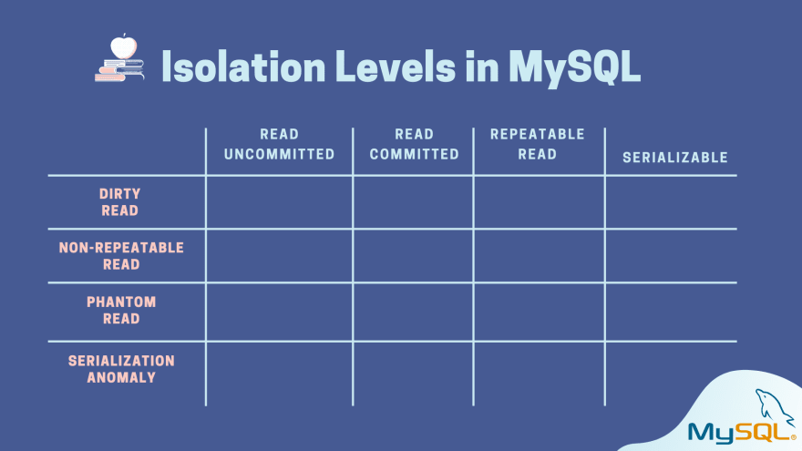

Здесь у меня запущено два docker контейнера, один — Postgres версии 12, а 
другой — MySQL версии 8. Внутри этих контейнеров я также подготовил простую 
схему базы данных банка с некоторыми исходными данными, подобными тем, с 
которыми работали в предыдущих лекциях.

```shell
❯ docker ps

CONTAINER ID        IMAGE                COMMAND                  CREATED             STATUS              PORTS                               NAMES
35f16aed1206        mysql:8              "docker-entrypoint.s…"   8 days ago          Up 50 seconds       0.0.0.0:3306->3306/tcp, 33060/tcp   mysql8
f9cdf61fcb0a        postgres:12-alpine   "docker-entrypoint.s…"   3 weeks ago         Up 54 seconds       0.0.0.0:5432->5432/tcp              postgres12
```

## Уровни изоляции в MySQL

Давайте подключимся к консоли MySQL и получим доступ к базе данных 
`simple_bank`.

```shell
❯ docker exec -it mysql8 mysql -uroot -psecret simple_bank

mysql>
```

### Получаем текущий уровень изоляции в MySQL

Чтобы получить уровень изоляции транзакций текущего сеанса, мы можем выполнить 
команду:

```shell
mysql> select @@transaction_isolation;
+-------------------------+
| @@transaction_isolation |
+-------------------------+
| REPEATABLE-READ         |
+-------------------------+
1 row in set (0.00 sec)
```

По умолчанию как мы видим он равен `repeatable read`. Этот уровень применяется 
только к этому конкретному сеансу консоли MySQL. 

Существует также глобальный уровень изоляции, который применяется ко всем 
сеансам при их первом запуске. Мы можем получить его значение, добавив `global` 
к предыдущему запросу на выборку.

```shell
mysql> select @@global.transaction_isolation;
+--------------------------------+
| @@global.transaction_isolation |
+--------------------------------+
| REPEATABLE-READ                |
+--------------------------------+
1 row in set (0.00 sec)
```

По умолчанию он также равен `repeatable read`.

### Изменяем уровень изоляции в MySQL

Теперь, чтобы изменить уровень изоляции текущего сеанса, мы можем использовать 
этот запрос:

```shell
-- Tx1:
mysql> set session transaction isolation level read uncommitted;
Query OK, 0 rows affected (0.00 sec)
```

Вы можете заменить `read uncommitted` на название уровня изоляции, который вы 
хотите установить.

После этого, если мы снова запустим команду для получения текущего уровня 
изоляции транзакции, мы увидим, что она была изменена на `read uncommitted`.

```shell
-- Tx1:
mysql> select @@transaction_isolation;
+-------------------------+
| @@transaction_isolation |
+-------------------------+
| READ-UNCOMMITTED        |
+-------------------------+
1 row in set (0.00 sec)
```

Обратите внимание, что это изменение повлияет только на все будущие 
транзакции этого текущего сеанса, но не на транзакции, которые выполняются в 
другом сеансе консоли MySQL.

### Уровень изоляции Read uncommitted в MySQL

Хорошо, теперь, чтобы продемонстрировать связь между двумя 
одновременными транзакциями, я открою другое окно терминала, расположу его 
рядом с ранее работающим и запущу внутри него новую консоль MySQL.

Затем давайте установим уровень изоляции этого сеанса, также равным
`read uncommitted`.

```shell
-- Tx2:
mysql> set session transaction isolation level read uncommitted;
Query OK, 0 rows affected (0.00 sec)

mysql> select @@transaction_isolation;
+-------------------------+
| @@transaction_isolation |
+-------------------------+
| READ-UNCOMMITTED        |
+-------------------------+
1 row in set (0.00 sec)
```

Хорошо, теперь оба сеанса работают с уровнем изоляции `read uncommitted`. Давайте
попробуем начать новую транзакцию.

В MySQL мы можем использовать либо команду `start transaction`, либо просто - `begin` 
как её альтернативу.

```shell
-- Tx1
mysql> start transaction;
Query OK, 0 rows affected (0.00 sec)

-- Tx2
mysql> begin;
Query OK, 0 rows affected (0.01 sec)
```

Отлично, стартовали две транзакции. Давайте запустим простой запрос для 
извлечения данных из таблицы `accounts` в `transaction 1`.

```shell
-- Tx1
mysql> select * from accounts;
+----+-------+---------+----------+---------------------+
| id | owner | balance | currency | created_at          |
+----+-------+---------+----------+---------------------+
|  1 | one   |     100 | USD      | 2020-09-06 15:09:38 |
|  2 | two   |     100 | USD      | 2020-09-06 15:09:38 |
|  3 | three |     100 | USD      | 2020-09-06 15:09:38 |
```

На данный момент есть 3 аккаунта с одинаковым балансом в 100 долларов. Затем 
в `transaction 2`, давайте выберем первую учетную запись с идентификатором 1.

```shell
-- Tx2
mysql> select * from accounts where id = 1;
+----+-------+---------+----------+---------------------+
| id | owner | balance | currency | created_at          |
+----+-------+---------+----------+---------------------+
|  1 | one   |     100 | USD      | 2020-09-06 15:09:38 |
+----+-------+---------+----------+---------------------+
```

Итак, у нас есть этот счет с балансом в 100 долларов. Теперь вернемся к 
`transaction 1` и запустим эту команду обновления, чтобы вычесть 10 долларов 
со счёта 1.

```shell
-- Tx1
mysql> update accounts set balance = balance - 10 where id = 1;
Query OK, 1 row affected (0.00 sec)
Rows matched: 1  Changed: 1  Warnings: 0
```

Сообщение `Query OK` означает успешное выполнение команды, поэтому если 
мы выберем счёт 1 в `transaction 1`, то увидим, что баланс был изменен и 
равен 90 долларов.

```shell
-- Tx1
mysql> select * from accounts where id = 1;
+----+-------+---------+----------+---------------------+
| id | owner | balance | currency | created_at          |
+----+-------+---------+----------+---------------------+
|  1 | one   |      90 | USD      | 2020-09-06 15:09:38 |
+----+-------+---------+----------+---------------------+
1 row in set (0.00 sec)
```

Но что, если мы запустим эту же команду `select` в `transaction 2`?

```shell
-- Tx2
mysql> select * from accounts where id = 1;
+----+-------+---------+----------+---------------------+
| id | owner | balance | currency | created_at          |
+----+-------+---------+----------+---------------------+
|  1 | one   |      90 | USD      | 2020-09-06 15:09:38 |
+----+-------+---------+----------+---------------------+
1 row in set (0.00 sec)
```

Она также видит измененное значение баланса: 90 долларов. Обратите внимание, что 
`transaction 1` еще не зафиксирована, но `transaction 2` всё равно доступны 
изменения, сделанные `transaction 1`.

Это так называемое `«грязное» чтение` и оно происходит потому, что мы используем 
уровень изоляции `read uncommitted`.

Хорошо, теперь давайте зафиксируем две эти транзакции и попробуем использовать
более сильный уровень изоляции.

```shell
-- Tx1:
mysql> commit;
Query OK, 0 rows affected (0.00 sec)

-- Tx2:
mysql> commit;
Query OK, 0 rows affected (0.00 sec)
```

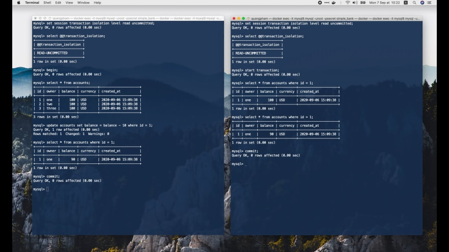

### Уровень изоляции Read committed в MySQL

На этот раз мы установим уровень изоляции `read committed` для обеих транзакций:

```shell
-- Tx1 + Tx2
mysql> set session transaction isolation level read committed;
Query OK, 0 rows affected (0.00 sec)

mysql> select @@transaction_isolation;
+-------------------------+
| @@transaction_isolation |
+-------------------------+
| READ-COMMITTED          |
+-------------------------+
1 row in set (0.00 sec)

mysql> begin;
Query OK, 0 rows affected (0.00 sec)
```

Отлично, теперь давайте выберем все записи, чтобы увидеть текущее состояние 
таблицы `accounts` в `transaction 1`:

```shell
-- Tx1:
mysql> select * from accounts;
+----+-------+---------+----------+---------------------+
| id | owner | balance | currency | created_at          |
+----+-------+---------+----------+---------------------+
|  1 | one   |      90 | USD      | 2020-09-06 15:09:38 |
|  2 | two   |     100 | USD      | 2020-09-06 15:09:38 |
|  3 | three |     100 | USD      | 2020-09-06 15:09:38 |
+----+-------+---------+----------+---------------------+
3 rows in set (0.01 sec)
```

Баланс счёта 1 теперь составляет 90 долларов, а двух других счетов - по 
100 долларов.

Как и ранее, в `transaction 2` выберем учетную запись с идентификатором 1.

```shell
-- Tx2:
mysql> select * from accounts where id = 1;
+----+-------+---------+----------+---------------------+
| id | owner | balance | currency | created_at          |
+----+-------+---------+----------+---------------------+
|  1 | one   |      90 | USD      | 2020-09-06 15:09:38 |
+----+-------+---------+----------+---------------------+
1 row in set (0.00 sec)
```

Затем в `transaction 1` мы обновляем баланс этого счёта, вычитая из него 
10 долларов.

```shell
-- Tx1:
mysql> update accounts set balance = balance - 10 where id = 1;
Query OK, 1 row affected (0.00 sec)
Rows matched: 1  Changed: 1  Warnings: 0

mysql> select * from accounts where id = 1;
+----+-------+---------+----------+---------------------+
| id | owner | balance | currency | created_at          |
+----+-------+---------+----------+---------------------+
|  1 | one   |      80 | USD      | 2020-09-06 15:09:38 |
+----+-------+---------+----------+---------------------+
1 row in set (0.00 sec)
```

Отлично, баланс был успешно изменен и равен 80 долларов в этой транзакции. 
Давайте посмотрим, видно ли это изменение `transaction 2` или нет.

```shell
-- Tx2:
mysql> select * from accounts where id = 1;
+----+-------+---------+----------+---------------------+
| id | owner | balance | currency | created_at          |
+----+-------+---------+----------+---------------------+
|  1 | one   |      90 | USD      | 2020-09-06 15:09:38 |
+----+-------+---------+----------+---------------------+
1 row in set (0.00 sec)
```

Теперь вы видите, что когда мы выбираем счет 1 в `transaction 2`, его баланс 
остается прежним: 90 долларов, каким он был до обновления.

Это связано с тем, что мы используем уровень изоляции `read committed`, а 
поскольку `transaction 1` еще не зафиксирована, ее записанные данные не могут 
быть видны другим транзакциям.

Таким образом, уровень изоляции `read committed` предотвращает проблему 
`«грязного» чтения`. Как насчет `неповторяющегося` и `фантомного чтения`?

В `transaction 2` давайте запустим еще один команду `select` из таблицы
`accounts`, извлекая записи баланс которых больше или равен 90 долларам. Затем 
вернитесь к `transaction 2` и зафиксируйте ее.

```shell
-- Tx2:
mysql> select * from accounts where balance >= 90;
+----+-------+---------+----------+---------------------+
| id | owner | balance | currency | created_at          |
+----+-------+---------+----------+---------------------+
|  1 | one   |      90 | USD      | 2020-09-06 15:09:38 |
|  2 | two   |     100 | USD      | 2020-09-06 15:09:38 |
|  3 | three |     100 | USD      | 2020-09-06 15:09:38 |
+----+-------+---------+----------+---------------------+
3 rows in set (0.00 sec)

-- Tx1:
mysql> commit;
Query OK, 0 rows affected (0.00 sec)
```

Хорошо, теперь, если мы снова извлечём счет 1 в `transaction 2`, то увидим, что 
баланс был изменен и равен 80 долларов.

```shell
-- Tx2:
mysql> select * from accounts where id = 1;
+----+-------+---------+----------+---------------------+
| id | owner | balance | currency | created_at          |
+----+-------+---------+----------+---------------------+
|  1 | one   |      80 | USD      | 2020-09-06 15:09:38 |
+----+-------+---------+----------+---------------------+
1 row in set (0.00 sec)
```

Таким образом, тот же запрос, который извлекает учетную запись 1, возвращает 
другое значение. Это проблема `неповторяющегося чтения`.

Также, если мы повторно запустим запрос, чтобы получить все счета, баланс 
которых не менее 90 долларов:

```shell
-- Tx2:
mysql> select * from accounts where balance >= 90;
+----+-------+---------+----------+---------------------+
| id | owner | balance | currency | created_at          |
+----+-------+---------+----------+---------------------+
|  2 | two   |     100 | USD      | 2020-09-06 15:09:38 |
|  3 | three |     100 | USD      | 2020-09-06 15:09:38 |
+----+-------+---------+----------+---------------------+
2 rows in set (0.00 sec)
```

То в этот раз получим только две записи вместо трёх, потому что баланс 
счёта 1 уменьшился до 80 долларов после совершения `transaction 1`.

Был выполнен тот же запрос, но возвращен другой набор строк. Одна строка 
исчезла из-за другой зафиксированной транзакции. Это называется 
проблемой `фантомного чтения`.

Итак, теперь мы знаем, что уровень изоляции `read committed` может только 
предотвратить «грязное» чтение, но по-прежнему не решает проблемы
`неповторяющегося` и `фантомного чтения`.

Давайте зафиксируем эту транзакцию и перейдем на более сильный уровень, чтобы 
посмотреть, что произойдет.

```shell
mysql> commit;
Query OK, 0 rows affected (0.00 sec)
```
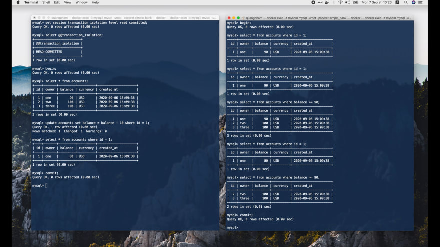

### Уровень изоляции Repeatable read в MySQL

Теперь я собираюсь установить уровень изоляции транзакций для двух сессий равный 
`repeatable read`. И начать 2 новые транзакции.

```shell
-- Tx1 + Tx2
mysql> set session transaction isolation level repeatable read;
Query OK, 0 rows affected (0.00 sec)

mysql> select @@transaction_isolation;
+-------------------------+
| @@transaction_isolation |
+-------------------------+
| REPEATABLE-READ         |
+-------------------------+
1 row in set (0.00 sec)

mysql> begin;
Query OK, 0 rows affected (0.00 sec)
```

Теперь давайте выберем все счета в `transaction 1`. Затем выберите счет с 
ID 1 в `transaction 2`. Также выберите все счета с балансом не менее 80 
долларов. Мы будем использовать их для проверки того, происходит ли фантомное 
чтение или нет.

```shell
-- Tx1:
mysql> select * from accounts;
+----+-------+---------+----------+---------------------+
| id | owner | balance | currency | created_at          |
+----+-------+---------+----------+---------------------+
|  1 | one   |      80 | USD      | 2020-09-06 15:09:38 |
|  2 | two   |     100 | USD      | 2020-09-06 15:09:38 |
|  3 | three |     100 | USD      | 2020-09-06 15:09:38 |
+----+-------+---------+----------+---------------------+
3 rows in set (0.00 sec)

-- Tx2:
mysql> select * from accounts where id = 1;
+----+-------+---------+----------+---------------------+
| id | owner | balance | currency | created_at          |
+----+-------+---------+----------+---------------------+
|  1 | one   |      80 | USD      | 2020-09-06 15:09:38 |
+----+-------+---------+----------+---------------------+
1 row in set (0.00 sec)

mysql> select * from accounts where balance >= 80;
+----+-------+---------+----------+---------------------+
| id | owner | balance | currency | created_at          |
+----+-------+---------+----------+---------------------+
|  1 | one   |      80 | USD      | 2020-09-06 15:09:38 |
|  2 | two   |     100 | USD      | 2020-09-06 15:09:38 |
|  3 | three |     100 | USD      | 2020-09-06 15:09:38 |
+----+-------+---------+----------+---------------------+
3 rows in set (0.00 sec)
```

Хорошо, теперь вернитесь к `transaction 1` и вычтите 10 из баланса счёта с ID 
равным 1. Затем извлеките все записи из таблицы `accounts`, чтобы просмотреть 
их текущее состояние в `transaction 1`.

```shell
-- Tx1:
mysql> update accounts set balance = balance - 10 where id = 1;
Query OK, 1 row affected (0.00 sec)
Rows matched: 1  Changed: 1  Warnings: 0

mysql> select * from accounts;
+----+-------+---------+----------+---------------------+
| id | owner | balance | currency | created_at          |
+----+-------+---------+----------+---------------------+
|  1 | one   |      70 | USD      | 2020-09-06 15:09:38 |
|  2 | two   |     100 | USD      | 2020-09-06 15:09:38 |
|  3 | three |     100 | USD      | 2020-09-06 15:09:38 |
+----+-------+---------+----------+---------------------+
3 rows in set (0.00 sec)
```

Теперь мы видим, что баланс счета с ID 1 уменьшился до 70 долларов.

Мы знаем, что проблема «грязного» чтения уже устранена на более слабом 
уровне изоляции: `read committed`. Поэтому нам не нужно проверять её на 
этом уровне из-за этого правила:

> Любые проблемы, которые были устранены на более слабом уровне изоляции, не
> возникнут на более сильном уровне.

Итак, давайте зафиксируем эту `transaction 1`, затем перейдем к `transaction 2`, 
чтобы посмотреть, сможет ли она считать новые изменения, сделанные
`transaction 1`, или нет.

```shell
-- Tx1:
mysql> commit;
Query OK, 0 rows affected (0.01 sec)

-- Tx2:
mysql> select * from accounts where id = 1;
+----+-------+---------+----------+---------------------+
| id | owner | balance | currency | created_at          |
+----+-------+---------+----------+---------------------+
|  1 | one   |      80 | USD      | 2020-09-06 15:09:38 |
+----+-------+---------+----------+---------------------+
1 row in set (0.01 sec)
```

Сейчас этот запрос на выборку возвращает старую версию записи с ID 1, где 
баланс равен 80 долларов, хотя `transaction 1` изменила его на 70 и была 
успешно зафиксирована.

Это связано с тем, что уровень изоляции `repeatable read` гарантирует, что 
все запросы на чтение являются повторяющимися, то есть они всегда возвращают 
один и тот же результат, даже если существуют изменения, внесенные другими 
зафиксированными транзакциями.

С учётом этого давайте повторно запустим запрос, чтобы выбрать всё счёта, 
на которых минимум 80 долларов:

```shell
-- Tx2:
mysql> select * from accounts where balance >= 80;
+----+-------+---------+----------+---------------------+
| id | owner | balance | currency | created_at          |
+----+-------+---------+----------+---------------------+
|  1 | one   |      80 | USD      | 2020-09-06 15:09:38 |
|  2 | two   |     100 | USD      | 2020-09-06 15:09:38 |
|  3 | three |     100 | USD      | 2020-09-06 15:09:38 |
+----+-------+---------+----------+---------------------+
3 rows in set (0.00 sec)
```

Как видите, он по-прежнему возвращает те же 3 записи, что и раньше. Таким 
образом, проблема `фантомного чтения` также предотвращается на этом уровне 
изоляции `repeatable-read`. Замечательно!

Однако, что произойдет, если мы также запустим запрос на обновление, чтобы 
вычесть 10 из баланса счета 1 в `transaction 2`? Изменится ли баланс до 70, 
60 или выдаст ошибку? Давай попробуем!

```shell
-- Tx2:
mysql> update accounts set balance = balance - 10 where id = 1;
Query OK, 1 row affected (0.00 sec)
Rows matched: 1  Changed: 1  Warnings: 0

mysql> select * from accounts where id = 1;
+----+-------+---------+----------+---------------------+
| id | owner | balance | currency | created_at          |
+----+-------+---------+----------+---------------------+
|  1 | one   |      60 | USD      | 2020-09-06 15:09:38 |
+----+-------+---------+----------+---------------------+
1 row in set (0.00 sec)
```

Ошибки нет, и остаток на счете теперь равен 60 долларам, что логично, поскольку
`transaction 1` уже зафиксировала изменение, изменившее баланс до 70 долларов.

Однако с точки зрения этой `transaction 2` возникает противоречие, поскольку
в последнем запросе на выборку баланс был равен 80 долларов, но после вычитания 
10 долларов со счёта теперь он равен 60 долларов. Математика здесь не работает, 
потому что на эту транзакцию все ещё влияют параллельные обновления от 
других транзакций.

Я не знаю, почему в MySQL решали реализовать уровень изоляции `repeatable read` 
таким образом, но было бы разумнее не выполнять обновление, выдавая в
этом случае ошибку, чтобы обеспечить согласованность данных транзакции. Позже 
мы увидим, что именно так Postgres обрабатывает параллельные обновления такого 
типа на этом уровне изоляции.

А пока давайте просто откатим эту транзакцию и попробуем перейти на самый 
сильный уровень изоляции, чтобы посмотреть, можно ли предотвратить эту 
проблему или нет.

```shell
-- Tx2:
mysql> rollback;
Query OK, 0 rows affected (0.00 sec)
```

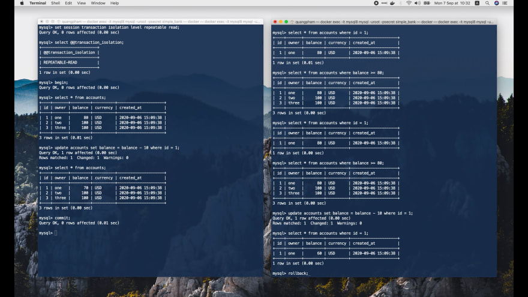

### Уровень изоляции Serializable в MySQL

Хорошо, давайте установим уровень изоляции для двух сессий равный `serializable` 
и начнем транзакции.

```shell
-- Tx1 + Tx2:
mysql> set session transaction isolation level serializable;
Query OK, 0 rows affected (0.00 sec)

mysql> select @@transaction_isolation;
+-------------------------+
| @@transaction_isolation |
+-------------------------+
| SERIALIZABLE            |
+-------------------------+
1 row in set (0.01 sec)

mysql> begin;
Query OK, 0 rows affected (0.00 sec)
```

Отлично, обе транзакции стартовали. Теперь давайте выберем все учетные записи 
в `transaction 1` и выберем только запись с ID 1 в `transaction 2`.

```shell
-- Tx1:
mysql> select * from accounts;
+----+-------+---------+----------+---------------------+
| id | owner | balance | currency | created_at          |
+----+-------+---------+----------+---------------------+
|  1 | one   |      70 | USD      | 2020-09-06 15:09:38 |
|  2 | two   |     100 | USD      | 2020-09-06 15:09:38 |
|  3 | three |     100 | USD      | 2020-09-06 15:09:38 |
+----+-------+---------+----------+---------------------+
3 rows in set (0.00 sec)

-- Tx2:
mysql> select * from accounts where id = 1;
+----+-------+---------+----------+---------------------+
| id | owner | balance | currency | created_at          |
+----+-------+---------+----------+---------------------+
|  1 | one   |      70 | USD      | 2020-09-06 15:09:38 |
+----+-------+---------+----------+---------------------+
1 row in set (0.00 sec)
```

Затем вернёмся к `transaction 1` и вычтем из её баланса еще 10 долларов.

```shell
-- Tx1:
mysql> update accounts set balance = balance - 10 where id = 1;
_
```

На этот раз, что интересно, запрос на обновление заблокирован. Таким образом, 
запрос на выборку в `transaction 2` блокирует этот запрос на обновление в
`transaction 1`.

Причина в том, что на уровне изоляции `serializable` MySQL неявно преобразует 
все обычные запросы `SELECT` в `SELECT FOR SHARE`. И транзакция, удерживающая 
блокировку `SELECT FOR SHARE`, позволяет другим транзакциям только `ЧИТАТЬ` 
строки, но не `ОБНОВЛЯТЬ` или `УДАЛИТЬ` их.

Таким образом, с этим механизмом блокировки ситуация с противоречивыми данными, 
которую мы видели раньше, больше невозможна.

Однако эта блокировка имеет время ожидания. Поэтому, если вторая транзакция не 
зафиксируется или не откатится, чтобы снять блокировку в течение этого 
времени, мы увидим ошибку превышения времени ожидания блокировки, подобную 
этой:

```shell
mysql> update accounts set balance = balance - 10 where id = 1;
ERROR 1205 (HY000): Lock wait timeout exceeded; try restarting transaction
```

Поэтому, когда вы используете уровень изоляции `serializable` в своем приложении, 
убедитесь, что вы повторно запускаете транзакции в случае тайм-аута.

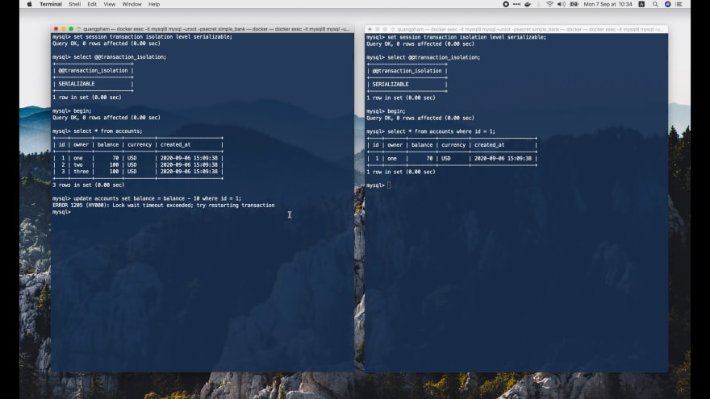

Хорошо, теперь я собираюсь перезапустить эту `transaction 1`, запустить запрос 
на выборку, а затем обновить баланс счёта с ID 1.

```shell
-- Tx1:
mysql> rollback;
Query OK, 0 rows affected (0.00 sec)

mysql> begin;
Query OK, 0 rows affected (0.00 sec)

mysql> select * from accounts;
+----+-------+---------+----------+---------------------+
| id | owner | balance | currency | created_at          |
+----+-------+---------+----------+---------------------+
|  1 | one   |      70 | USD      | 2020-09-06 15:09:38 |
|  2 | two   |     100 | USD      | 2020-09-06 15:09:38 |
|  3 | three |     100 | USD      | 2020-09-06 15:09:38 |
+----+-------+---------+----------+---------------------+
3 rows in set (0.00 sec)

mysql> update accounts set balance = balance - 10 where id = 1;
_
```

Но на этот раз я не буду ждать истечения времени ожидания блокировки. Давайте 
посмотрим, что произойдет, если `transaction 2` также попытается обновить 
баланс того же счета с ID 1.

```shell
-- Tx2:
mysql> update accounts set balance = balance - 10 where id = 1;
ERROR 1213 (40001): Deadlock found when trying to get lock; try restarting transaction

-- Tx1:
mysql> update accounts set balance = balance - 10 where id = 1;
Query OK, 1 row affected (23.59 sec)
Rows matched: 1  Changed: 1  Warnings: 0
```

Итак, произошла взаимная блокировка, потому что теперь `transaction 2` также 
должна ждать снятия блокировки от запроса на выборку `transaction 1`.

Поэтому имейте в виду, что помимо тайм-аута ожидания блокировки вам также 
необходимо учесть возможную ситуацию с взаимной блокировкой.

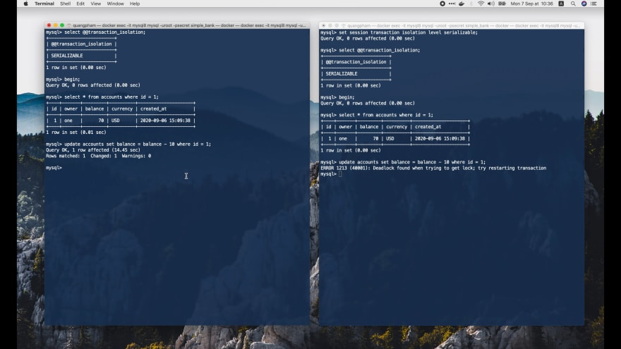

Теперь попробуем перезапустить обе транзакции, затем выберем счёт с ID 1.

```shell
-- Tx1 + Tx2:
mysql> rollback;
Query OK, 0 rows affected (0.00 sec)

mysql> begin;
Query OK, 0 rows affected (0.00 sec)

mysql> select * from accounts where id = 1;
+----+-------+---------+----------+---------------------+
| id | owner | balance | currency | created_at          |
+----+-------+---------+----------+---------------------+
|  1 | one   |      70 | USD      | 2020-09-06 15:09:38 |
+----+-------+---------+----------+---------------------+
1 row in set (0.00 sec)
```

Теперь давайте обновим баланс счёта с ID 1 в `transaction 1`, а затем зафиксируем
`transaction 2`.

```shell
-- Tx1:
mysql> update accounts set balance = balance - 10 where id = 1;
_

-- Tx2:
mysql> commit;
Query OK, 0 rows affected (0.00 sec)
```

Как видите, после того, как мы зафиксировали `transaction 2`, блокировка сразу 
снимается, и баланс счёта с ID 1 успешно обновлен:

```shell
-- Tx1:
mysql> update accounts set balance = balance - 10 where id = 1;
Query OK, 1 row affected (3.34 sec)
Rows matched: 1  Changed: 1  Warnings: 0

mysql> select * from accounts where id = 1;
+----+-------+---------+----------+---------------------+
| id | owner | balance | currency | created_at          |
+----+-------+---------+----------+---------------------+
|  1 | one   |      60 | USD      | 2020-09-06 15:09:38 |
+----+-------+---------+----------+---------------------+
1 row in set (0.00 sec)

mysql> commit;
Query OK, 0 rows affected (0.01 sec)
```

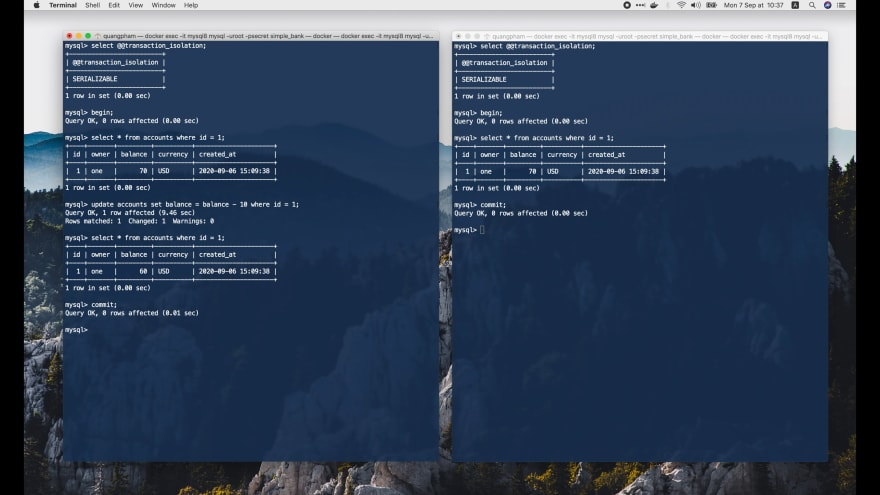

Итак, пока мы поэкспериментировали со всеми четырьмя уровнями изоляции в MySQL 
и то, как они помогают предотвратить некоторые проблемы, возникающие при 
чтении данных.

Теперь посмотрим, как они работают в Postgres! Эффекты будут очень похожи, но 
будут и некоторые отличия.

## Уровни изоляции в Postgres

Во-первых, давайте запустим две консоли PostgreSQL в двух отдельных окнах 
терминала.

```shell
# Tx1 + Tx2
❯ docker exec -it postgres12 psql -U root -d simple_bank
psql (12.3)
Type "help" for help.

simple_bank>
```

### Получаем текущий уровень изоляции в Postgres

В Postgres для получения текущего уровня изоляции нужно запустить такую команду:

```shell
simple_bank> show transaction isolation level;
 transaction_isolation
-----------------------
 read committed
(1 row)
```

По умолчанию он равен `read committed`. Таким образом, он на один уровень слабее,
чем уровень изоляции по умолчанию в MySQL.

### Изменяем уровень изоляции в Postgres

Изменение уровня изоляции также отличается. В MySQL мы устанавливаем уровень 
изоляции всего сеанса перед запуском транзакций.

Но в Postgres мы можем установить уровень изоляции только внутри транзакции, 
и это повлияет только на эту одну конкретную транзакцию.

Итак, давайте начнем `transaction 1` и установим ее уровень изоляции равный
`read uncommitted`.

```shell
-- Tx1:
simple_bank> begin;
BEGIN

simple_bank> set transaction isolation level read uncommitted;
SET
```

Теперь если мы выведем уровень изоляции транзакции, мы увидим, что он был 
изменен на `read uncommitted`.

```shell
-- Tx1:
simple_bank> show transaction isolation level;
 transaction_isolation
-----------------------
 read uncommitted
(1 row)
```

### Уровень изоляции Read uncommitted в Postgres

Сделаем то же самое в другой консоли для `transaction 2`:

```shell
-- Tx2:
simple_bank> begin;
BEGIN

simple_bank> set transaction isolation level read uncommitted;
SET

simple_bank> show transaction isolation level;
 transaction_isolation
----------------------------
 read uncommitted
(1 row)
```

Хорошо, теперь в `transaction 1` давайте выберем все счета.

```shell
-- Tx1:
simple_bank> select * from accounts;
 id | owner | balance | currency |          created_at
---------+-------+---------+----------+-------------------------------
  1 | one   |     100 | USD      | 2020-09-06 15:06:44.666424+00
  2 | two   |     100 | USD      | 2020-09-06 15:06:44.666424+00
  3 | three |     100 | USD      | 2020-09-06 15:06:44.666424+00
(3 rows)
```

На данный момент существует 3 аккаунта с одинаковым балансом в 100 долларов. 
В `transaction 2` выберем только запись с ID 1.

```shell
-- Tx2:
simple_bank> select * from accounts where id = 1;
 id | owner | balance | currency |          created_at
---------+-------+---------+----------+-------------------------------
  1 | one   |     100 | USD      | 2020-09-06 15:06:44.666424+00
(1 row)
```

Затем вернёмся к `transaction 1` и обновим её баланс.

```shell
-- Tx1:
simple_bank> update accounts set balance = balance - 10 where id = 1 returning *;
 id | owner | balance | currency |          created_at
---------+-------+---------+----------+-------------------------------
  1 | one   |      90 | USD      | 2020-09-06 15:06:44.666424+00
(1 row)

UPDATE 1
```

Баланс счёта с ID 1 изменен и равен 90 долларов. Теперь мы снова выбираем эту 
запись в `transaction 2`:

```shell
-- Tx2:
simple_bank> select * from accounts where id = 1;
 id | owner | balance | currency |          created_at
---------+-------+---------+----------+-------------------------------
  1 | one   |     100 | USD      | 2020-09-06 15:06:44.666424+00
(1 row)
```

Странно, но здесь баланс по-прежнему равен 100 долларов! Это неожиданно, потому 
что мы используем уровень `read uncommitted`, поэтому `transaction 2` должна 
иметь возможность видеть незафиксированные данные `transaction 1`, не так ли?

Ну, на самом деле, если мы посмотрим [документацию Postgres](https://www.postgresql.org/docs/current/transaction-iso.html), то увидим, что 
`read uncommitted` в Postgres ведет себя точно так же, как `read committed`.

Таким образом, мы можем сказать, что Postgres имеет только 3 уровня изоляции, 
и самый слабый уровень — `read committed`. Это имеет смысл, потому что обычно 
мы ни при каких обстоятельствах не захотим использовать `read uncommitted`.

Итак, давайте продолжим и зафиксируем `transaction 1`. Затем еще раз выберем 
запись с ID 1 в `transaction 2`.

```shell
-- Tx1:
simple_bank> commit;
COMMIT

-- Tx2:
simple_bank> select * from accounts where id = 1;
 id | owner | balance | currency |          created_at
---------+-------+---------+----------+-------------------------------
  1 | one   |      90 | USD      | 2020-09-06 15:06:44.666424+00
(1 row)
```

Теперь она видит зафиксированный баланс: 90 долларов, как и ожидалось. Хорошо, 
давайте зафиксируем эту транзакцию и перейдем на следующий уровень изоляции.

```shell
-- Tx2:
simple_bank> commit;
COMMIT
```

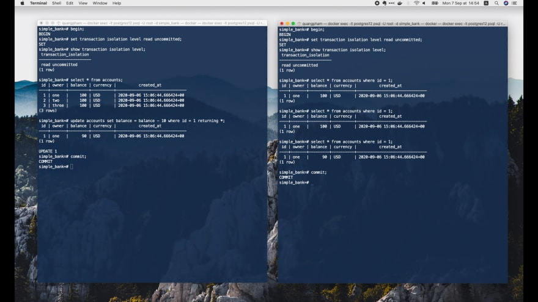

### Уровень изоляции Read committed в Postgres

Я собираюсь начать 2 новые транзакции и установить для них уровень 
изоляции `read committed`:

```shell
-- Tx1 + Tx2:
simple_bank> begin;
BEGIN

simple_bank> set transaction isolation level read committed;
SET

simple_bank> show transaction isolation level;
 transaction_isolation
----------------------------
 read committed
(1 row)
```

Теперь как и раньше, давайте выберем все записи в `transaction 1`, а затем 
выберем только запись с ID 1 в `transaction 2`.

```shell
-- Tx1:
simple_bank> select * from accounts;
 id | owner | balance | currency |          created_at
---------+-------+---------+----------+-------------------------------
  2 | two   |     100 | USD      | 2020-09-06 15:06:44.666424+00
  3 | three |     100 | USD      | 2020-09-06 15:06:44.666424+00
  1 | one   |      90 | USD      | 2020-09-06 15:06:44.666424+00
(3 rows)

-- Tx2:
simple_bank> select * from accounts where id = 1;
 id | owner | balance | currency |          created_at
---------+-------+---------+----------+-------------------------------
  1 | one   |      90 | USD      | 2020-09-06 15:06:44.666424+00
(1 row)

simple_bank> select * from accounts where balance >= 90;
 id | owner | balance | currency |          created_at
---------+-------+---------+----------+-------------------------------
  2 | two   |     100 | USD      | 2020-09-06 15:06:44.666424+00
  3 | three |     100 | USD      | 2020-09-06 15:06:44.666424+00
  1 | one   |      90 | USD      | 2020-09-06 15:06:44.666424+00
(3 rows)
```

Помимо проблемы «грязного» чтения, мы также хотим посмотреть, как он 
справляется с фантомным чтением, поэтому давайте найдем все счета, у которых 
баланс больше или равен 90 долларов. На данный момент все 3 записи 
удовлетворяют этому условию поиска.

Теперь вернемся к `transaction 1` и вычтем 10 долларов из баланса счёта 1.

```shell
-- Tx1:
simple_bank> update accounts set balance = balance - 10 where id = 1 returning *;
 id | owner | balance | currency |          created_at
---------+-------+---------+----------+-------------------------------
  1 | one   |      80 | USD      | 2020-09-06 15:06:44.666424+00
(1 row)

-- Tx2:
simple_bank> select * from accounts where id = 1;
 id | owner | balance | currency |          created_at
---------+-------+---------+----------+-------------------------------
  1 | one   |      90 | USD      | 2020-09-06 15:06:44.666424+00
(1 row)
```

Если мы выберем счет c ID 1 в `transaction 2`, его баланс все равно будет равен
90 долларов, потому что `transaction 1` еще не зафиксирована. Таким образом,
`«грязное» чтение` невозможно на уровне изоляции `read committed`.

Давайте посмотрим, что произойдет, если мы зафиксируем `transaction 1`.

```shell
-- Tx1:
simple_bank> commit;
COMMIT

-- Tx2:
simple_bank> select * from accounts where id = 1;
 id | owner | balance | currency |          created_at
---------+-------+---------+----------+-------------------------------
  1 | one   |      80 | USD      | 2020-09-06 15:06:44.666424+00
(1 row)
```

После этого `transaction 2` увидит обновленный баланс равный 80 долларов. 
Теперь, если мы снова запустим запрос на поиск счетов, у которых на балансе не 
менее чем 90 долларов, мы увидим только 2 записи вместо 3, как раньше.

```shell
-- Tx2:
simple_bank> select * from accounts where balance >= 90;
 id | owner | balance | currency |          created_at
---------+-------+---------+----------+-------------------------------
  2 | two   |     100 | USD      | 2020-09-06 15:06:44.666424+00
  3 | three |     100 | USD      | 2020-09-06 15:06:44.666424+00
(2 rows)
```

Обновленный баланс счета с ID 1 больше не удовлетворяет условию поиска, 
поэтому он исчез из набора результатов. Таким образом, на этом уровне изоляции
`read committed` произошло `фантомное чтение`.

Это то же самое поведение, что и в MySQL. Давайте зафиксируем эту транзакцию и 
перейдём на 1 уровень вверх.

```shell
-- Tx2:
simple_bank> commit;
COMMIT
```

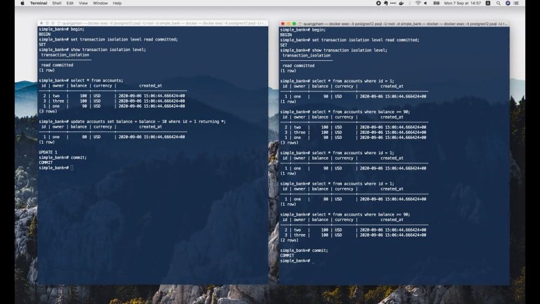

### Уровень изоляции Repeatable read в Postgres

Я собираюсь начать 2 новые транзакции, а затем установить для них уровень 
изоляции транзакций равный `repeatable read`.

```shell
-- Tx1 + Tx2:
simple_bank> begin;
BEGIN

simple_bank> set transaction isolation level repeatable read;
SET

simple_bank> show transaction isolation level;
 transaction_isolation
----------------------------
 repeatable read
(1 row)
```

Хорошо, теперь давайте выберем все счета в `transaction 1`, затем выберем только 
счет с ID 1 в `transaction 2`. Также найдём счета с балансом не 
менее 80 долларов.

```shell
-- Tx1:
simple_bank> select * from accounts;
 id | owner | balance | currency |          created_at
---------+-------+---------+----------+-------------------------------
  2 | two   |     100 | USD      | 2020-09-06 15:06:44.666424+00
  3 | three |     100 | USD      | 2020-09-06 15:06:44.666424+00
  1 | one   |      80 | USD      | 2020-09-06 15:06:44.666424+00
(3 rows)

-- Tx2:
simple_bank> select * from accounts where id = 1;
 id | owner | balance | currency |          created_at
---------+-------+---------+----------+-------------------------------
  1 | one   |      80 | USD      | 2020-09-06 15:06:44.666424+00
(1 row)

simple_bank> select * from accounts where balance >= 80;
 id | owner | balance | currency |          created_at
---------+-------+---------+----------+-------------------------------
  2 | two   |     100 | USD      | 2020-09-06 15:06:44.666424+00
  3 | three |     100 | USD      | 2020-09-06 15:06:44.666424+00
  1 | one   |      80 | USD      | 2020-09-06 15:06:44.666424+00
(3 rows)
```

Теперь вернёмся к `transaction 1` и вычтем из ее баланса еще 10 долларов.

```shell
-- Tx1:
simple_bank> update accounts set balance = balance - 10 where id = 1 returning *;
 id | owner | balance | currency |          created_at
---------+-------+---------+----------+-------------------------------
  1 | one   |      70 | USD      | 2020-09-06 15:06:44.666424+00
(1 row)

UPDATE 1
```

Баланс был обновлен до 70 долларов в этой транзакции. Давайте зафиксируем её 
и посмотрим, что произойдет в `transaction 2`.

```shell
-- Tx1:
simple_bank> commit;
COMMIT

-- Tx2:
simple_bank> select * from accounts where id = 1;
 id | owner | balance | currency |          created_at
---------+-------+---------+----------+-------------------------------
  1 | one   |      80 | USD      | 2020-09-06 15:06:44.666424+00
(1 row)
```

Теперь, если мы выберем запись с ID 1 в `transaction 2`, её баланс все равно 
будет равен 80 долларов, как и раньше, хотя `transaction 1` зафиксировала своё 
изменение.

Это связано с тем, что мы уровень изоляции `repeatable read`, поэтому один и 
тот же запрос на выборку всегда должен возвращать один и тот же результат. 
Проблемы с `неповторяющимся чтением` в этом случае возникает.

Кроме того, если мы повторно запустим запрос для поиска счетов с балансом равным 
не менее чем 80 долларов:

```shell
-- Tx2:
simple_bank> select * from accounts where balance >= 80;
 id | owner | balance | currency |          created_at
---------+-------+---------+----------+-------------------------------
  2 | two   |     100 | USD      | 2020-09-06 15:06:44.666424+00
  3 | three |     100 | USD      | 2020-09-06 15:06:44.666424+00
  1 | one   |      80 | USD      | 2020-09-06 15:06:44.666424+00
(3 rows)
```

Мы по-прежнему получаем те же 3 записи, что и раньше. Таким образом, `фантомное 
чтение` также предотвращается на этом уровне изоляции `repeatable read`.

Теперь я попытаюсь запустить этот запрос на обновление баланса записи, чтобы 
посмотреть, как он себя поведет:

```shell
-- Tx2:
simple_bank> update accounts set balance = balance - 10 where id = 1 returning *;
ERROR:  could not serialize access due to concurrent update
```

Мы видели, что на уровне изоляции `repeatable read` в MySQL баланс можно 
обновить до 60 долларов. Но здесь, в Postgres, мы получаем ошибку:

> ERROR: could not serialize access due to concurrent update

Я думаю, что выдача такой ошибки намного лучше, чем изменение баланса, потому 
что это позволяет избежать сбивающей с толку ситуации, когда вычитание 10 из
80 в транзакции даёт 60. За это стоит поблагодарить Postgres!

```shell
-- Tx2:
simple_bank> rollback;
ROLLBACK
```

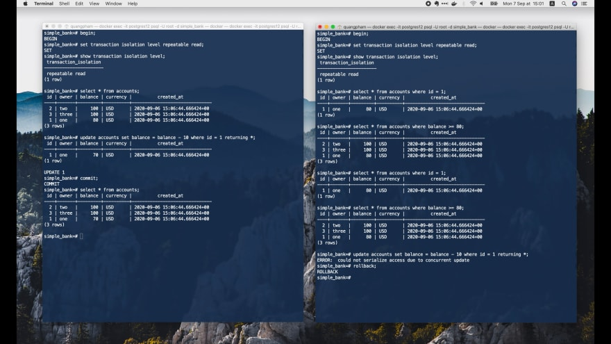

### Аномалия упорядочения в Postgres

До сих пор мы сталкивались с 3 видами проблем при чтении: `«грязное» чтение`, 
`неповторяющееся чтение` и `фантомное чтение`. Но мы еще не столкнулись с 
аномалией упорядочения. Так что давайте посмотрим, когда она возникает.

Давайте запустим две новые транзакции и установим их уровень изоляции 
равный `repeatable read`.

```shell
-- Tx1 + Tx2:
simple_bank> begin;
BEGIN

simple_bank> set transaction isolation level repeatable read;
SET

simple_bank> show transaction isolation level;
 transaction_isolation
----------------------------
 repeatable read
(1 row)
```

Затем в `transaction 1` давайте выберем все записи.

```shell
-- Tx1:
simple_bank=# select * from accounts;
 id | owner | balance | currency |          created_at
---------+-------+---------+----------+-------------------------------
  2 | two   |     100 | USD      | 2020-09-06 15:06:44.666424+00
  3 | three |     100 | USD      | 2020-09-06 15:06:44.666424+00
  1 | one   |      70 | USD      | 2020-09-06 15:06:44.666424+00
(3 rows)
```

Теперь мы рассмотрим случай, когда мы должны вычислить сумму баланса всех 
записей, а затем создать новую учетную запись с этим общим балансом.

Итак, давайте запустим эту команду для `transaction 1`:

```shell
-- Tx1:
simple_bank> select sum(balance) from accounts;
 sum
----------
 270
(1 row)
```

Получилось 270 долларов. Затем мы вставляем в таблицу `accounts` новую запись, 
где `owner` — «sum», `balance` — 270, а `currency` — «USD».

```shell
-- Tx1:
simple_bank=# insert into accounts(owner, balance, currency) values ('sum', 270, 'USD') returning *; 
 id | owner | balance | currency |          created_at
---------+-------+---------+----------+-------------------------------
  5 | sum   |     270 | USD      | 2020-09-15 14:18:31.612735+00
(1 row)

INSERT 0 1

simple_bank=# select * from accounts;
 id | owner | balance | currency |          created_at
---------+-------+---------+----------+-------------------------------
  2 | two   |     100 | USD      | 2020-09-06 15:06:44.666424+00
  3 | three |     100 | USD      | 2020-09-06 15:06:44.666424+00
  1 | one   |      70 | USD      | 2020-09-06 15:06:44.666424+00
  5 | sum   |     270 | USD      | 2020-09-15 14:18:31.612735+00
(4 rows)
```

Отлично, нам видна новую запись в этой `transaction 1`. Однако что, если
`transaction 2` также хочет выполнить эту операцию?

Поскольку мы используем уровень изоляции `repeatable read`, запрос на выборку в
`transaction 2` увидит только исходный список учетных записей без новой 
записи, которую только что вставила `transaction 1`.

```shell
simple_bank> select * from accounts;
 id | owner | balance | currency |          created_at
---------+-------+---------+----------+-------------------------------
  2 | two   |     100 | USD      | 2020-09-06 15:06:44.666424+00
  3 | three |     100 | USD      | 2020-09-06 15:06:44.666424+00
  1 | one   |      70 | USD      | 2020-09-06 15:06:44.666424+00
(3 rows)

simple_bank> select sum(balance) from accounts;
 sum
----------
 270
(1 row)

simple_bank> insert into accounts(owner, balance, currency) values ('sum', 270, 'USD') returning *; 
 id | owner | balance | currency |          created_at
---------+-------+---------+----------+-------------------------------
  6 | sum   |     270 | USD      | 2020-09-15 14:14:15.677416+00
(1 row)

INSERT 0 1
```

Мы получим такое же значение, 270 долларов. И, таким образом, вставим ту же 
запись в таблицу `accounts`.

Хорошо, теперь давайте зафиксируем обе транзакции, чтобы посмотреть, что 
произойдет.

```shell
-- Tx1:
simple_bank> commit;
COMMIT

-- Tx2:
simple_bank> commit;
COMMIT

simple_bank> select * from accounts;
 id | owner | balance | currency |          created_at
---------+-------+---------+----------+-------------------------------
  2 | two   |     100 | USD      | 2020-09-06 15:06:44.666424+00
  3 | three |     100 | USD      | 2020-09-06 15:06:44.666424+00
  1 | one   |      70 | USD      | 2020-09-06 15:06:44.666424+00
  5 | sum   |     270 | USD      | 2020-09-15 14:18:31.612735+00
  6 | sum   |     270 | USD      | 2020-09-15 14:14:15.677416+00
(5 rows)
```

Они были обе успешно зафиксированы. И появилось две повторяющихся записи «sum»
с одинаковым балансом 270 долларов.

Это аномалия упорядочения!

Почему?

Потому что если эти 2 транзакции выполняются последовательно, то у нас не 
возникнет таких вот двух записей с одинаковой суммой 270.

Неважно, `transaction 1` или `transaction 2` выполняется первой, у нас должна 
быть одна запись с балансом в 270 долларов и еще одна запись с балансом в 
540 долларов.

Итак, вот как возникает аномалия упорядочения на уровне изоляции с
`repeatable read`.

Теперь давайте выставим самый сильный уровень изоляции: serializable, чтобы 
увидеть, можно ли предотвратить эту аномалию или нет.

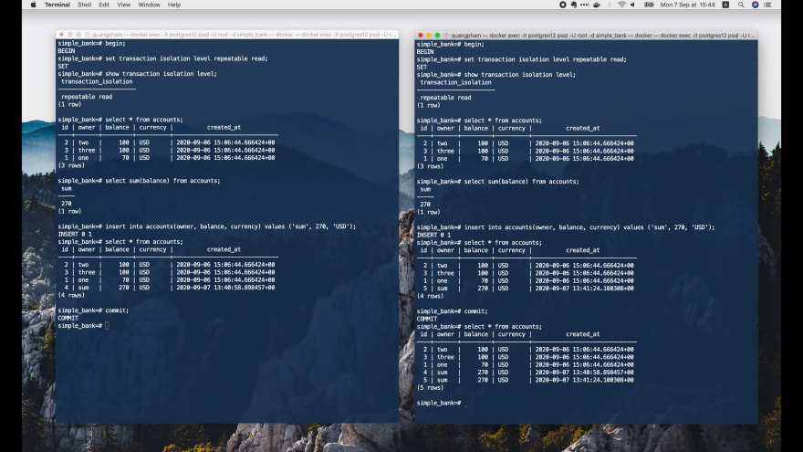

### Уровень изоляции Serializable в Postgres

Я собираюсь запустить 2 новые транзакции, а затем установить их уровень 
изоляции равный `serializable`.

```shell
-- Tx1 + Tx2:
simple_bank> begin;
BEGIN

simple_bank> set transaction isolation level serializable;
SET

simple_bank> show transaction isolation level;
 transaction_isolation
----------------------------
 serializable
(1 row)
```

Теперь давайте выберем все счета в `transaction 1`, рассчитаем сумму всех 
балансов и вставим новый счет с балансом, равным этой сумме.

```shell
-- Tx1:
simple_bank> select * from accounts;
 id | owner | balance | currency |          created_at
---------+-------+---------+----------+-------------------------------
  2 | two   |     100 | USD      | 2020-09-06 15:06:44.666424+00
  3 | three |     100 | USD      | 2020-09-06 15:06:44.666424+00
  1 | one   |      70 | USD      | 2020-09-06 15:06:44.666424+00
  5 | sum   |     270 | USD      | 2020-09-15 14:18:31.612735+00
  6 | sum   |     270 | USD      | 2020-09-15 14:14:15.677416+00
(5 rows)

simple_bank> select sum(balance) from accounts;
 sum
----------
 810
(1 row)

simple_bank> insert into accounts(owner, balance, currency) values ('sum', 810, 'USD') returning *;

 id | owner | balance | currency |          created_at
---------+-------+---------+----------+-------------------------------
  7 | sum   |     810 | USD      | 2020-09-15 14:25:20.091212+00
(1 row)

INSERT 0 1

simple_bank> select * from accounts;
 id | owner | balance | currency |          created_at
---------+-------+---------+----------+-------------------------------
  2 | two   |     100 | USD      | 2020-09-06 15:06:44.666424+00
  3 | three |     100 | USD      | 2020-09-06 15:06:44.666424+00
  1 | one   |      70 | USD      | 2020-09-06 15:06:44.666424+00
  5 | sum   |     270 | USD      | 2020-09-15 14:18:31.612735+00
  6 | sum   |     270 | USD      | 2020-09-15 14:14:15.677416+00
  7 | sum   |     810 | USD      | 2020-09-15 14:25:20.091212+00
(6 rows)
```

Теперь, как видите, в `transaction 1` была вставлена новая запись «sum» с балансом 
810 долларов. Давайте перейдем к `transaction 2` и запустим ту же 
последовательность запросов.

```shell
-- Tx2:
simple_bank> select * from accounts;
 id | owner | balance | currency |          created_at
---------+-------+---------+----------+-------------------------------
  2 | two   |     100 | USD      | 2020-09-06 15:06:44.666424+00
  3 | three |     100 | USD      | 2020-09-06 15:06:44.666424+00
  1 | one   |      70 | USD      | 2020-09-06 15:06:44.666424+00
  5 | sum   |     270 | USD      | 2020-09-15 14:18:31.612735+00
  6 | sum   |     270 | USD      | 2020-09-15 14:14:15.677416+00
(5 rows)

simple_bank> select sum(balance) from accounts;
 sum
----------
 810
(1 row)

simple_bank> insert into accounts(owner, balance, currency) values ('sum', 810, 'USD') returning *;
 id | owner | balance | currency |          created_at
---------+-------+---------+----------+-------------------------------
  8 | sum   |     810 | USD      | 2020-09-15 14:25:33.060027+00
(1 row)

INSERT 0 1
simple_bank> select * from accounts;
 id | owner | balance | currency |          created_at
---------+-------+---------+----------+-------------------------------
  2 | two   |     100 | USD      | 2020-09-06 15:06:44.666424+00
  3 | three |     100 | USD      | 2020-09-06 15:06:44.666424+00
  1 | one   |      70 | USD      | 2020-09-06 15:06:44.666424+00
  5 | sum   |     270 | USD      | 2020-09-15 14:18:31.612735+00
  6 | sum   |     270 | USD      | 2020-09-15 14:14:15.677416+00
  8 | sum   |     810 | USD      | 2020-09-15 14:25:33.060027+00
(6 rows)
```

После этого запроса на выборку мы видим, что список записей в обеих транзакциях 
практически идентичен (за исключением идентификатора).

Давайте попробуем зафиксировать их.

```shell
-- Tx1:
simple_bank=# commit;
COMMIT

-- Tx2:
simple_bank> commit;
ERROR:  could not serialize access due to read/write dependencies among transactions
DETAIL:  Reason code: Canceled on identification as a pivot, during commit attempt.
HINT:  The transaction might succeed if retried.
```

`transaction` 1 успешно зафиксирована. Однако `transaction 2` выдает ошибку:

> ERROR: could not serialize access due to read/write dependencies among transactions

И Postgres дает нам подсказку, что транзакция может завершиться успешно, если 
мы повторим попытку.

Отлично! Аномалия упорядочения полностью предотвращена. Две параллельные 
транзакции больше не создают повторяющиеся записи, как раньше.

Мы можем сделать вывод, что Postgres использует механизм `обнаружения 
зависимостей`, чтобы обнаруживать потенциальные `проблемы при чтении` и 
предупреждать их, выдавая ошибку.


### Как MySQL борется с аномалией упорядочения

MySQL, с другой стороны, предпочитает использовать механизм блокировки для 
достижения аналогичного результата. Давайте посмотрим, как она справляется с 
аномалией упорядочения!

Давайте откроем 2 сеанса MySQL в консоли, с которыми мы работали, и установим 
их уровень изоляции транзакций равный `serializable`.

```shell
-- Tx1 + Tx2:
mysql> set session transaction isolation level serializable;
Query OK, 0 rows affected (0.00 sec)

mysql> select @@transaction_isolation;
+-------------------------+
| @@transaction_isolation |
+-------------------------+
| SERIALIZABLE            |
+-------------------------+
1 row in set (0.01 sec)

mysql> begin;
Query OK, 0 rows affected (0.00 sec)
```

Теперь в `transaction 1` давайте выберем все записи, вычислим сумму баланса 
всех записей и вставим новую запись с этой суммой в таблицу `accounts`.

```shell
-- Tx1:
mysql> select * from accounts;
+----+-------+---------+----------+---------------------+
| id | owner | balance | currency | created_at          |
+----+-------+---------+----------+---------------------+
|  1 | one   |      60 | USD      | 2020-09-06 15:09:38 |
|  2 | two   |     100 | USD      | 2020-09-06 15:09:38 |
|  3 | three |     100 | USD      | 2020-09-06 15:09:38 |
+----+-------+---------+----------+---------------------+
3 rows in set (0.00 sec)

mysql> select sum(balance) from accounts;
+--------------+
| sum(balance) |
+--------------+
|          260 |
+--------------+
1 row in set (0.00 sec)

mysql> insert into accounts (owner, balance, currency) values ('sum', 260, 'USD');
Query OK, 1 row affected (0.00 sec)

mysql> select * from accounts;
+----+-------+---------+----------+---------------------+
| id | owner | balance | currency | created_at          |
+----+-------+---------+----------+---------------------+
|  1 | one   |      60 | USD      | 2020-09-06 15:09:38 |
|  2 | two   |     100 | USD      | 2020-09-06 15:09:38 |
|  3 | three |     100 | USD      | 2020-09-06 15:09:38 |
|  4 | sum   |     260 | USD      | 2020-09-15 14:36:20 |
+----+-------+---------+----------+---------------------+
4 rows in set (0.00 sec)
```

Затем переключитесь на `transaction 2` и запустите запрос, чтобы выбрать все 
записи.

```shell
-- Tx2
mysql> select * from accounts;
_
```

Как видите, этот запрос заблокирован, и ему нужно дождаться, пока `transaction 1` 
снимет блокировку, прежде чем он сможет продолжить выполнение.

Но как только мы фиксируем `transaction 1`,

```shell
-- Tx1:
mysql> commit;
Query OK, 0 rows affected (0.00 sec)

-- Tx2:
mysql> select * from accounts;
+----+-------+---------+----------+---------------------+
| id | owner | balance | currency | created_at          |
+----+-------+---------+----------+---------------------+
|  1 | one   |      60 | USD      | 2020-09-06 15:09:38 |
|  2 | two   |     100 | USD      | 2020-09-06 15:09:38 |
|  3 | three |     100 | USD      | 2020-09-06 15:09:38 |
|  4 | sum   |     260 | USD      | 2020-09-15 14:36:20 |
+----+-------+---------+----------+---------------------+
4 rows in set (46.29 sec)
```

Блокировка снимается, и `transaction 2` немедленно получает результат своего 
запроса.

Теперь мы можем продолжить, запустив запросы на вычисление суммы и вставки новой
строки в этой транзакции, и, наконец, зафиксировать ее.

```shell
-- Tx2:
mysql> select * from accounts;
+----+-------+---------+----------+---------------------+
| id | owner | balance | currency | created_at          |
+----+-------+---------+----------+---------------------+
|  1 | one   |      60 | USD      | 2020-09-06 15:09:38 |
|  2 | two   |     100 | USD      | 2020-09-06 15:09:38 |
|  3 | three |     100 | USD      | 2020-09-06 15:09:38 |
|  4 | sum   |     260 | USD      | 2020-09-15 14:36:20 |
+----+-------+---------+----------+---------------------+
4 rows in set (46.29 sec)

mysql> select sum(balance) from accounts;
+--------------+
| sum(balance) |
+--------------+
|          520 |
+--------------+
1 row in set (0.00 sec)

mysql> insert into accounts (owner, balance, currency) values ('sum', 520, 'USD');
Query OK, 1 row affected (0.00 sec)

mysql> select * from accounts;
+----+-------+---------+----------+---------------------+
| id | owner | balance | currency | created_at          |
+----+-------+---------+----------+---------------------+
|  1 | one   |      60 | USD      | 2020-09-06 15:09:38 |
|  2 | two   |     100 | USD      | 2020-09-06 15:09:38 |
|  3 | three |     100 | USD      | 2020-09-06 15:09:38 |
|  4 | sum   |     260 | USD      | 2020-09-15 14:36:20 |
|  5 | sum   |     520 | USD      | 2020-09-15 14:39:21 |
+----+-------+---------+----------+---------------------+
5 rows in set (0.00 sec)

mysql> commit;
Query OK, 0 rows affected (0.01 sec)
```

Повторяющихся записей, где `owner` равен `sum`, не появилось. Таким образом, 
MySQL также успешно предотвратила `аномалию упорядочения` с помощью своего 
`механизма блокировки`.

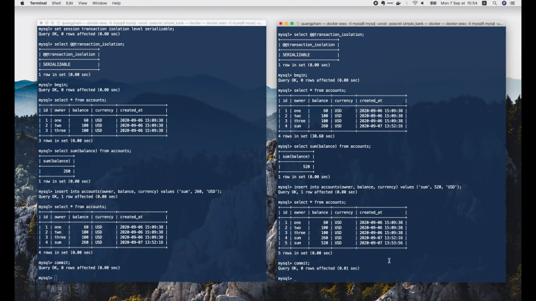

Теперь я хочу попробовать реализовать другой порядок запросов в этих двух 
транзакциях.

Сначала начните `transaction 1`, выберите все записи, вычислите сумму баланса 
на всех счетах.

```shell
-- Tx1:
mysql> begin;
Query OK, 0 rows affected (0.00 sec)

mysql> select * from accounts;
+----+-------+---------+----------+---------------------+
| id | owner | balance | currency | created_at          |
+----+-------+---------+----------+---------------------+
|  1 | one   |      60 | USD      | 2020-09-06 15:09:38 |
|  2 | two   |     100 | USD      | 2020-09-06 15:09:38 |
|  3 | three |     100 | USD      | 2020-09-06 15:09:38 |
|  4 | sum   |     260 | USD      | 2020-09-15 14:36:20 |
|  5 | sum   |     520 | USD      | 2020-09-15 14:39:21 |
+----+-------+---------+----------+---------------------+
5 rows in set (0.00 sec)

mysql> select sum(balance) from accounts;
+--------------+
| sum(balance) |
+--------------+
|         1040 |
+--------------+
1 row in set (0.00 sec)
```

Затем начните `transaction 2`, также выберите все счета и рассчитайте сумму 
баланса всех счетов.

```shell
mysql> begin;
Query OK, 0 rows affected (0.00 sec)

mysql> select * from accounts;
+----+-------+---------+----------+---------------------+
| id | owner | balance | currency | created_at          |
+----+-------+---------+----------+---------------------+
|  1 | one   |      60 | USD      | 2020-09-06 15:09:38 |
|  2 | two   |     100 | USD      | 2020-09-06 15:09:38 |
|  3 | three |     100 | USD      | 2020-09-06 15:09:38 |
|  4 | sum   |     260 | USD      | 2020-09-15 14:36:20 |
|  5 | sum   |     520 | USD      | 2020-09-15 14:39:21 |
+----+-------+---------+----------+---------------------+
5 rows in set (0.00 sec)

mysql> select sum(balance) from accounts;
+--------------+
| sum(balance) |
+--------------+
|         1040 |
+--------------+
1 row in set (0.00 sec)
```

На этот раз для обеих транзакций мы получили одинаковую сумму в 1040 долларов. 
Вставим новую строку с этой суммой в `transaction 1`.

```shell
-- Tx1:
mysql> insert into accounts (owner, balance, currency) values ('sum', 1040, 'USD');
_
```

Операция заблокирована, поскольку `transaction 2` осуществляет блокировку общего 
доступа, препятствующую выполнению запросов на обновление в других транзакциях.

Теперь, если мы попытаемся вставить новую строку в `transaction 2`,

```shell
-- Tx2:
mysql> insert into accounts (owner, balance, currency) values ('sum', 1040, 'USD');
ERROR 1213 (40001): Deadlock found when trying to get lock; try restarting transaction
```

то получим взаимную блокировку, потому что в этом случае обе транзакции должны 
ожидать друг друга.

А поскольку `transaction 2` завершилась неудачно из-за взаимной блокировки, 
блокировка немедленно снимается, что позволяет `transaction 1` завершить свой 
запрос на вставку.

```shell
mysql> commit;
Query OK, 0 rows affected (0.01 sec)

mysql> select * from accounts;
+----+-------+---------+----------+---------------------+
| id | owner | balance | currency | created_at          |
+----+-------+---------+----------+---------------------+
|  1 | one   |      60 | USD      | 2020-09-06 15:09:38 |
|  2 | two   |     100 | USD      | 2020-09-06 15:09:38 |
|  3 | three |     100 | USD      | 2020-09-06 15:09:38 |
|  4 | sum   |     260 | USD      | 2020-09-15 14:36:20 |
|  5 | sum   |     520 | USD      | 2020-09-15 14:39:21 |
|  6 | sum   |    1040 | USD      | 2020-09-15 14:41:26 |
+----+-------+---------+----------+---------------------+
6 rows in set (0.00 sec)
```

Таким образом, после фиксации `transaction 1` мы видим, что новая строка с суммой 
успешно вставлена. База данных остается согласованной без аномалий упорядочения.

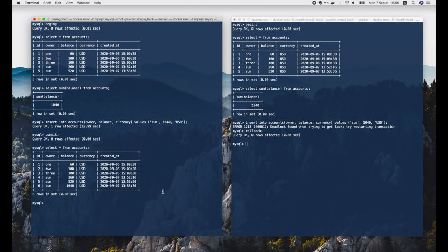

## Резюме о взаимосвязи между уровнями изоляции и проблемами, возникающими при чтении

Теперь, прежде чем мы закончим, давайте проведём краткий обзор взаимосвязи 
между уровнями изоляции и проблемами, возникающими при чтении, в MySQL и Postgres.

### В MySQL

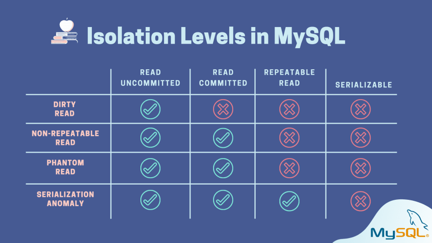

В MySQL самый слабый уровень изоляции, `read uncommitted`, допускает 
возникновение всех четырёх проблем.

В то время как следующий уровень: `read committed` только предотвращает
`«грязное» чтение`. Остальные 3 проблемы все еще проявляются.

Уровень `repeatable read` предотвращает первые три проблемы: `«грязное» чтение`,
`неповторяющееся чтение` и `фантомное чтение`. Но он по-прежнему не избавляет
от `аномалий упорядочения`, а также от некоторых ошибок, возникающих при 
`несогласованных одновременных обновлениях`.

Самый сильный уровень изоляции: `serializable` — самый строгий. Он 
предотвращает все четыре проблемы. Благодаря `механизму блокировки`.

### В Postgres

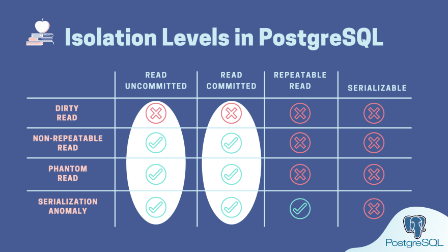

Уровни изоляции в Postgres дают очень похожий результат. Тем не менее, 
существуют и некоторые существенные различия.

Во-первых, уровень изоляции `read uncommitted` ведет себя так же, как и 
`read committed`. Таким образом, Postgres имеет только 3 уровня изоляции 
вместо 4, как в MySQL.

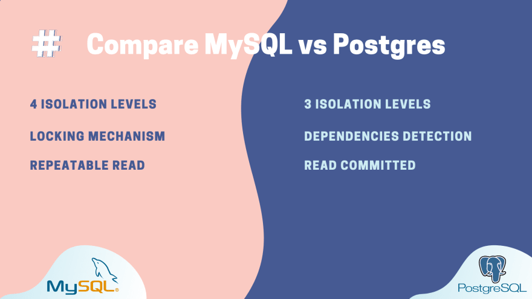

И, во-вторых, Postgres не использует `механизм блокировки`, как MySQL, но 
использует лучшую методику - `обнаружения зависимостей`, чтобы предотвратить 
`неповторяющееся чтение`, `непоследовательные одновременные обновления` и 
`аномалии упорядочения`.

Кроме того, уровень изоляции по умолчанию в Postgres — это только
`read committed`, в то время как в MySQL - `repeatable read`.

### О чём стоит помнить


Самое главное, что вы должны иметь в виду при использовании сильного уровня 
изоляции, это то, что могут возникать некоторые ошибки, тайм-аут или даже 
взаимная блокировка. Таким образом, мы должны тщательно реализовать механизм 
повторных попыток для наших транзакций.

Кроме того, каждое ядро базы данных может по-разному реализовывать уровени 
изоляции. Поэтому убедитесь, что вы внимательно прочитали его документацию и 
сначала поработали с ним, прежде чем переходить к написанию кода.

### Ссылки

Ниже приведены ссылки официальную документацию об уровне изоляции MySQL и 
Postgres, если вы хотите иметь под рукой документацию:

* MySQL: [Документация по уровням изоляции в MySQL](https://dev.mysql.com/doc/refman/8.0/en/innodb-transaction-isolation-levels.html)
* Postgres: [Документация по уровням изоляции в Postgres](https://www.postgresql.org/docs/current/transaction-iso.html)

На этом закончим сегодняшнюю лекцию. Надеюсь, что информация, которую вы
узнали из неё, пригодится вам.

Большое спасибо за время, потраченное на чтение, и до встречи на следующей 
лекции!